# CI持续集成最佳实践指南 - Step by Step实战教程

> 基于航空货运管理系统的完整CI流水线设计与实现

---

## 📋 文档大纲与学习路径

### 🎯 学习目标

- [ ] 掌握现代CI流水线的设计原理和实现方法
- [ ] 学会使用Jenkins构建企业级CI系统
- [ ] 理解并实践质量门禁和代码质量管控
- [ ] 掌握构建优化和缓存策略的应用
- [ ] 熟练运用Git分支策略和自动化流程

### 📚 章节结构

```plantuml
@startuml 学习路径图
!theme aws-orange
skinparam defaultFontName "Microsoft YaHei"

title CI持续集成学习路径

rectangle "📖 第1章：CI基础概念与架构设计" as chapter1 {
  [1.1 什么是持续集成]
  [1.2 CI流水线架构设计]
  [1.3 工具选型与技术栈]
  [1.4 项目案例介绍]
}

rectangle "🌿 第2章：Git分支策略与工作流" as chapter2 {
  [2.1 Git Flow vs GitHub Flow]
  [2.2 分支保护规则设计]
  [2.3 代码审查流程]
  [2.4 自动化触发机制]
}

rectangle "🔧 第3章：Jenkins流水线脚本开发" as chapter3 {
  [3.1 Jenkinsfile基础语法]
  [3.2 Pipeline as Code实践]
  [3.3 多阶段构建设计]
  [3.4 环境变量与参数化]
}

rectangle "🔍 第4章：代码质量检查与门禁" as chapter4 {
  [4.1 静态代码分析配置]
  [4.2 单元测试自动化]
  [4.3 代码覆盖率统计]
  [4.4 质量门禁规则设计]
}

rectangle "⚡ 第5章：构建优化与缓存策略" as chapter5 {
  [5.1 依赖缓存机制]
  [5.2 增量构建实现]
  [5.3 并行构建优化]
  [5.4 Docker镜像缓存]
}

rectangle "📦 第6章：制品管理与版本控制" as chapter6 {
  [6.1 制品仓库配置]
  [6.2 版本号生成策略]
  [6.3 制品安全扫描]
  [6.4 多环境制品管理]
}

rectangle "🎯 第7章：实战案例综合演练" as chapter7 {
  [7.1 完整流水线搭建]
  [7.2 常见问题排查]
  [7.3 性能优化实践]
  [7.4 最佳实践总结]
}

chapter1 --> chapter2
chapter2 --> chapter3
chapter3 --> chapter4
chapter4 --> chapter5
chapter5 --> chapter6
chapter6 --> chapter7

@enduml
```

---

## 🏗️ 案例项目：航空货运管理系统

### 项目架构概览

```plantuml
@startuml 项目架构图
!theme aws-orange
skinparam defaultFontName "Microsoft YaHei"

title 航空货运管理系统架构

package "前端层" {
  [React + TypeScript]
  [Ant Design UI]
  [Redux状态管理]
}

package "后端服务" {
  [Spring Boot API]
  [Spring Security]
  [JPA + Hibernate]
}

package "数据存储" {
  [PostgreSQL数据库]
  [Redis缓存]
}

package "外部服务" {
  [航班信息API]
  [货物跟踪API]
  [支付网关]
}

[React + TypeScript] --> [Spring Boot API] : REST API
[Spring Boot API] --> [PostgreSQL数据库]
[Spring Boot API] --> [Redis缓存]
[Spring Boot API] --> [航班信息API]

@enduml
```

### 技术栈清单

```yaml
前端技术栈:
  - 框架: React 18 + TypeScript 4.8
  - 构建工具: Vite 4.0
  - UI组件: Ant Design 5.0
  - 状态管理: Redux Toolkit
  - 测试框架: Jest + React Testing Library

后端技术栈:
  - 框架: Spring Boot 3.0
  - 语言版本: Java 17
  - 数据访问: Spring Data JPA
  - 安全框架: Spring Security 6.0
  - 测试框架: JUnit 5 + Mockito

构建工具:
  - 前端构建: npm + Vite
  - 后端构建: Maven 3.8
  - 代码质量: SonarQube 9.9
  - 容器化: Docker + Docker Compose
```

---

## 📖 第1章：CI基础概念与架构设计

### 1.1 什么是持续集成？

#### 🔄 持续集成的核心价值

```plantuml
@startuml CI价值链
!theme aws-orange
skinparam defaultFontName "Microsoft YaHei"

title 持续集成价值链

rectangle "开发阶段" as dev {
  [代码编写]
  [本地测试]
  [代码提交]
}

rectangle "集成阶段" as ci {
  [自动构建]
  [质量检查]
  [自动测试]
  [快速反馈]
}

rectangle "交付阶段" as delivery {
  [制品生成]
  [环境部署]
  [验收测试]
}

dev --> ci : 触发构建
ci --> delivery : 构建成功
ci --> dev : 失败反馈

note bottom of ci
**CI核心优势**
✅ 早期发现问题
✅ 降低集成风险  
✅ 提升代码质量
✅ 加快交付速度
end note

@enduml
```

#### 📊 传统开发 vs CI开发模式对比

| 对比维度           | 传统开发模式     | CI开发模式           |
| ------------------ | ---------------- | -------------------- |
| **集成频率** | 数周/数月一次    | 每次代码提交         |
| **问题发现** | 集成阶段后期     | 代码提交后15分钟内   |
| **修复成本** | 高（定位困难）   | 低（问题范围小）     |
| **代码质量** | 依赖人工审查     | 自动化质量检查       |
| **发布风险** | 高（大批量变更） | 低（小批量频繁交付） |

### 1.2 CI流水线架构设计

#### 🏗️ 标准CI流水线架构

```plantuml
@startuml CI流水线架构
!theme aws-orange
skinparam defaultFontName "Microsoft YaHei"

title 航空货运系统CI流水线架构

rectangle "🔧 触发阶段" as trigger #E8F5E8 {
  [Git Push/PR]
  [定时触发]
  [手动触发]
}

rectangle "📥 代码阶段" as code #E3F2FD {
  [代码检出]
  [环境准备]
  [依赖下载]
}

rectangle "🔍 质量阶段" as quality #FFF3E0 {
  [静态代码分析]
  [安全漏洞扫描]
  [代码规范检查]
}

rectangle "🧪 测试阶段" as test #F3E5F5 {
  [单元测试]
  [集成测试]
  [覆盖率统计]
}

rectangle "🚪 门禁阶段" as gate #FFEBEE {
  [质量门禁检查]
  [覆盖率门禁]
  [安全门禁]
}

rectangle "🏗️ 构建阶段" as build #E0F2F1 {
  [代码编译]
  [资源打包]
  [Docker镜像构建]
}

rectangle "📦 制品阶段" as artifact #FFF8E1 {
  [制品上传]
  [版本标记]
  [制品扫描]
}

rectangle "📢 通知阶段" as notify #F1F8E9 {
  [构建结果通知]
  [报告发布]
  [指标统计]
}

trigger --> code
code --> quality
quality --> test
test --> gate
gate --> build : 通过
gate --> notify : 失败
build --> artifact
artifact --> notify

note right of gate
**质量门禁规则**
• 代码覆盖率 ≥ 80%
• 无严重安全漏洞
• 无阻塞性代码问题
• 所有测试用例通过
end note

@enduml
```

#### 🎯 分支策略与流水线触发

### 1.3 工具选型与技术栈

#### 🛠️ CI/CD工具生态全景图

```plantuml
@startuml CI工具生态
!theme aws-orange
skinparam defaultFontName "Microsoft YaHei"

title CI/CD工具生态全景图

package "版本控制" {
  rectangle "Git平台" as git #E8F5E8 {
    [GitHub]
    [GitLab]
    [Bitbucket]
    [Gitee]
  }
}

package "CI/CD引擎" {
  rectangle "Jenkins生态" as jenkins #E3F2FD {
    [Jenkins]
    [Blue Ocean]
    [Pipeline插件]
    [分布式构建]
  }
  
  rectangle "云原生CI" as cloud_ci #FFF3E0 {
    [GitLab CI/CD]
    [GitHub Actions]
    [Azure DevOps]
    [TeamCity]
  }
}

package "质量保障" {
  rectangle "代码质量" as quality #F3E5F5 {
    [SonarQube]
    [Checkstyle]
    [ESLint]
    [PMD]
  }
  
  rectangle "安全扫描" as security #FFEBEE {
    [OWASP ZAP]
    [Snyk]
    [Trivy]
    [Bandit]
  }
}

package "构建与部署" {
  rectangle "构建工具" as build #E0F2F1 {
    [Maven]
    [Gradle]
    [NPM/Yarn]
    [Docker]
  }
  
  rectangle "容器化" as container #FFF8E1 {
    [Docker]
    [Kubernetes]
    [Helm]
    [Harbor]
  }
}

package "监控告警" {
  rectangle "监控平台" as monitor #F1F8E9 {
    [Prometheus]
    [Grafana]
    [ELK Stack]
    [Jaeger]
  }
}

git --> jenkins : 触发构建
jenkins --> quality : 质量检查
quality --> security : 安全扫描
security --> build : 构建打包
build --> container : 容器化部署
container --> monitor : 监控反馈

@enduml
```

#### 📋 技术栈选型对比分析

**CI/CD引擎选型对比**

| 工具 | 优势 | 适用场景 | 学习成本 |
|------|------|----------|----------|
| **Jenkins** | • 插件生态丰富<br>• 高度可定制<br>• 社区活跃 | • 企业级复杂流程<br>• 混合云部署<br>• 传统架构改造 | ⭐⭐⭐ |
| **GitLab CI** | • Git集成度高<br>• 配置简单<br>• 容器原生 | • 全栈DevOps<br>• 中小型团队<br>• 云原生项目 | ⭐⭐ |
| **GitHub Actions** | • GitHub深度集成<br>• 丰富的Action市场<br>• 免费额度充足 | • 开源项目<br>• 小型团队<br>• 快速原型验证 | ⭐ |

**代码质量工具选型**

| 工具类型 | 推荐工具 | 核心特性 | 集成难度 |
|----------|----------|----------|----------|
| **静态分析** | SonarQube | • 多语言支持<br>• 质量门禁<br>• 历史趋势分析 | ⭐⭐⭐ |
| **安全扫描** | OWASP + Trivy | • 依赖漏洞检测<br>• 镜像安全扫描<br>• 合规性检查 | ⭐⭐ |
| **代码规范** | ESLint + Checkstyle | • 编码规范统一<br>• 自动化修复<br>• IDE集成 | ⭐ |

#### 🎯 航空货运系统技术栈设计

```plantuml
@startuml 技术栈架构
!theme aws-orange
skinparam defaultFontName "Microsoft YaHei"

title 航空货运系统技术栈架构

package "前端技术栈" {
  rectangle "React生态" as react #E8F5E8 {
    [React 18]
    [TypeScript]
    [Ant Design]
    [React Query]
  }
  
  rectangle "构建工具" as frontend_build #E3F2FD {
    [Vite]
    [ESLint]
    [Prettier]
    [Jest]
  }
}

package "后端技术栈" {
  rectangle "Spring生态" as spring #FFF3E0 {
    [Spring Boot 3]
    [Spring Security]
    [Spring Data JPA]
    [Spring Cloud]
  }
  
  rectangle "数据层" as data #F3E5F5 {
    [MySQL 8]
    [Redis]
    [MongoDB]
    [Elasticsearch]
  }
}

package "DevOps技术栈" {
  rectangle "CI/CD" as devops #FFEBEE {
    [Jenkins]
    [SonarQube]
    [Nexus Repository]
    [Harbor Registry]
  }
  
  rectangle "容器平台" as k8s #E0F2F1 {
    [Docker]
    [Kubernetes]
    [Istio]
    [Helm]
  }
}

package "监控运维" {
  rectangle "可观测性" as observability #FFF8E1 {
    [Prometheus]
    [Grafana]
    [ELK Stack]
    [Jaeger]
  }
}

react --> spring : API调用
spring --> data : 数据访问
devops --> k8s : 部署交付
k8s --> observability : 运维监控

note bottom of devops
**技术选型原则**
• 成熟稳定：选择经过生产验证的技术
• 生态丰富：拥有活跃的社区和插件
• 团队技能：匹配团队现有技术栈
• 扩展性好：支持未来业务发展需要
end note

@enduml
```

#### 🔧 工具链集成配置示例

**Jenkins + SonarQube集成**
```groovy
// Jenkinsfile - SonarQube集成示例
pipeline {
    agent any
    
    tools {
        maven 'Maven-3.9'
        jdk 'OpenJDK-17'
    }
    
    environment {
        SONAR_TOKEN = credentials('sonar-token')
        SONAR_HOST_URL = 'https://sonarqube.company.com'
    }
    
    stages {
        stage('代码质量分析') {
            steps {
                withSonarQubeEnv('SonarQube-Server') {
                    sh '''
                        mvn clean verify sonar:sonar \\
                            -Dsonar.projectKey=cargo-management \\
                            -Dsonar.projectName="航空货运管理系统" \\
                            -Dsonar.host.url=${SONAR_HOST_URL} \\
                            -Dsonar.token=${SONAR_TOKEN}
                    '''
                }
            }
        }
        
        stage('质量门禁') {
            steps {
                timeout(time: 10, unit: 'MINUTES') {
                    waitForQualityGate abortPipeline: true
                }
            }
        }
    }
}
```

**Docker多阶段构建配置**
```dockerfile
# 后端应用Dockerfile
FROM eclipse-temurin:17-jdk-alpine AS builder
WORKDIR /app
COPY pom.xml ./
COPY src ./src
RUN mvn clean package -DskipTests

FROM eclipse-temurin:17-jre-alpine
RUN addgroup -g 1001 -S appgroup && adduser -S appuser -u 1001 -G appgroup
WORKDIR /app
COPY --from=builder --chown=appuser:appgroup /app/target/*.jar app.jar
USER appuser
EXPOSE 8080
ENTRYPOINT ["java", "-jar", "app.jar"]
```

### 1.4 项目案例介绍

#### ✈️ 航空货运管理系统概述

**项目背景**
航空货运管理系统是一个面向航空货运公司的综合性业务管理平台，涵盖货物登记、运输调度、仓库管理、客户服务等核心业务流程。系统需要支持高并发、高可用的业务场景，对代码质量和交付效率有严格要求。

**业务架构图**
```plantuml
@startuml 业务架构
!theme aws-orange
skinparam defaultFontName "Microsoft YaHei"

title 航空货运管理系统业务架构

package "客户端应用" {
  rectangle "Web管理端" as web #E8F5E8 {
    [货运员工作台]
    [管理员控制台]
    [客户服务界面]
  }
  
  rectangle "移动客户端" as mobile #E3F2FD {
    [货主APP]
    [司机APP]
    [仓管APP]
  }
}

package "核心业务服务" {
  rectangle "货物管理" as cargo #FFF3E0 {
    [货物登记]
    [状态跟踪]
    [运单管理]
  }
  
  rectangle "运输调度" as transport #F3E5F5 {
    [航班调度]
    [路线优化]
    [运力分配]
  }
  
  rectangle "仓库管理" as warehouse #FFEBEE {
    [入库管理]
    [库存管理]
    [出库管理]
  }
  
  rectangle "客户服务" as customer #E0F2F1 {
    [客户管理]
    [订单管理]
    [价格管理]
  }
}

package "基础支撑服务" {
  rectangle "用户中心" as user #FFF8E1 {
    [认证授权]
    [权限管理]
    [组织架构]
  }
  
  rectangle "消息中心" as message #F1F8E9 {
    [站内消息]
    [短信通知]
    [邮件推送]
  }
}

web --> cargo
mobile --> cargo
cargo --> transport
transport --> warehouse
warehouse --> customer
user --> cargo
message --> customer

@enduml
```

#### 🏗️ 技术架构设计

**系统技术架构**
```plantuml
@startuml 技术架构
!theme aws-orange
skinparam defaultFontName "Microsoft YaHei"

title 航空货运系统技术架构

package "前端层" {
  rectangle "用户界面" as ui #E8F5E8 {
    [React 18 + TypeScript]
    [Ant Design UI]
    [React Query状态管理]
    [Vite构建工具]
  }
}

package "网关层" {
  rectangle "API网关" as gateway #E3F2FD {
    [Spring Cloud Gateway]
    [负载均衡]
    [熔断限流]
    [API鉴权]
  }
}

package "服务层" {
  rectangle "业务服务" as services #FFF3E0 {
    [货物服务]
    [运输服务]
    [仓库服务]
    [用户服务]
  }
  
  rectangle "基础服务" as base_services #F3E5F5 {
    [配置中心]
    [服务发现]
    [消息队列]
    [文件服务]
  }
}

package "数据层" {
  rectangle "数据存储" as storage #FFEBEE {
    [MySQL主从]
    [Redis缓存]
    [MongoDB文档]
    [ElasticSearch搜索]
  }
}

package "基础设施" {
  rectangle "容器平台" as infra #E0F2F1 {
    [Docker容器]
    [Kubernetes编排]
    [Istio服务网格]
    [Prometheus监控]
  }
}

ui --> gateway : HTTPS/WebSocket
gateway --> services : 负载均衡
services --> base_services : 服务调用
services --> storage : 数据访问
infra --> services : 容器托管
infra --> storage : 存储支撑

note right of services
**微服务设计原则**
• 单一职责：每个服务专注特定业务域
• 数据独立：服务拥有独立的数据存储
• 接口标准：基于REST API和事件驱动
• 容错设计：熔断、重试、降级机制
end note

@enduml
```

#### 📊 项目规模与团队结构

**项目规模指标**
| 指标类型 | 数量/规模 | 说明 |
|----------|-----------|------|
| **代码规模** | ~15万行 | Java后端8万行 + TypeScript前端7万行 |
| **微服务数量** | 12个 | 核心业务服务8个 + 基础服务4个 |
| **数据库表数** | ~80张 | 业务表60张 + 配置表20张 |
| **API接口数** | ~200个 | RESTful API接口 |
| **日活用户** | ~2000人 | 内部员工 + 外部客户 |

**团队组织结构**
```plantuml
@startuml 团队结构
!theme aws-orange
skinparam defaultFontName "Microsoft YaHei"

title 项目团队组织架构

rectangle "产品团队" as product #E8F5E8 {
  [产品经理 x1]
  [业务分析师 x1]
  [UI/UX设计师 x1]
}

rectangle "开发团队" as dev #E3F2FD {
  [技术负责人 x1]
  [后端开发 x4]
  [前端开发 x2]
  [移动开发 x1]
}

rectangle "质量团队" as qa #FFF3E0 {
  [测试负责人 x1]
  [功能测试 x2]
  [自动化测试 x1]
  [性能测试 x1]
}

rectangle "运维团队" as ops #F3E5F5 {
  [DevOps工程师 x2]
  [系统运维 x1]
  [数据库管理员 x1]
}

product --> dev : 需求传递
dev --> qa : 交付测试
qa --> ops : 发布上线
ops --> product : 运营反馈

note bottom of dev
**CI/CD实施策略**
• 开发阶段：特性分支开发，每日集成
• 测试阶段：自动化测试，质量门禁
• 发布阶段：蓝绿部署，灰度发布
• 监控阶段：全链路监控，问题闭环
end note

@enduml
```

#### 🎯 CI/CD实施目标与挑战

**实施目标**
- **提升交付效率**：从传统的月度发布到每周发布，发布周期缩短75%
- **保障代码质量**：代码覆盖率达到80%以上，严重Bug数量减少50%
- **降低发布风险**：通过自动化测试和质量门禁，减少生产事故
- **提升团队协作**：统一开发规范，提升团队开发效率

**面临挑战**
| 挑战类型 | 具体问题 | 解决策略 |
|----------|----------|----------|
| **技术债务** | 遗留代码质量较低，测试覆盖不足 | 逐步重构 + 增量改进 |
| **团队技能** | 团队对DevOps实践经验不足 | 培训 + 导师制 + 实践 |
| **工具链复杂** | 多工具集成配置复杂 | 标准化配置 + 自动化脚本 |
| **变更管理** | 业务需求变化频繁 | 敏捷开发 + 持续反馈 |

**成功关键因素**
1. **管理层支持**：获得充分的资源投入和决策支持
2. **团队协作**：建立跨职能团队的协作机制
3. **渐进实施**：分阶段推进，快速迭代改进
4. **文化转变**：从传统瀑布模式向敏捷DevOps转变
5. **度量反馈**：建立完善的指标体系和持续改进机制

#### 📈 预期收益与成果

**量化收益指标**
- **构建时间**：从45分钟缩短到15分钟（缩短67%）
- **部署频率**：从每月1次提升到每周2次（提升800%）
- **故障恢复时间**：从4小时缩短到1小时（缩短75%）
- **变更失败率**：从15%降低到5%（降低67%）

**质量改进成果**
- 代码覆盖率从45%提升到85%
- 严重Bug数量减少60%
- 客户满意度从75%提升到90%
- 团队开发效率提升40%

---

## 🎯 第1章实战练习

### 练习1：CI理论基础
1. 绘制你所在公司当前的软件交付流程图
2. 识别现有流程中的痛点和瓶颈
3. 设计CI改进方案和预期收益
4. 制定分阶段实施计划

### 练习2：工具选型评估
1. 根据团队规模和技术栈选择合适的CI工具
2. 对比分析3种不同CI工具的优缺点
3. 设计工具链集成方案
4. 评估实施成本和风险

### 练习3：项目案例分析
1. 分析航空货运系统的技术架构
2. 识别CI/CD实施的关键成功因素
3. 设计针对性的质量保障策略
4. 制定团队技能提升计划

### 练习4：度量体系设计
1. 设计CI/CD效果评估指标体系
2. 制定数据收集和分析方案
3. 建立持续改进机制
4. 设计可视化报告和仪表板

---

**✅ 第1章学习完成！**

**掌握技能清单：**
- [x] 理解CI/CD的核心概念和价值主张
- [x] 掌握CI流水线的架构设计原理
- [x] 能够进行工具选型和技术栈设计
- [x] 了解企业级CI/CD实施策略和挑战

---

## 🌿 第2章：Git分支策略与工作流

> 🎯 **学习目标**：掌握企业级Git分支管理策略，建立规范的代码协作流程

### 2.1 Git Flow vs GitHub Flow策略对比

#### 🔀 两种主流分支策略解析

```plantuml
@startuml Git分支策略对比
!theme aws-orange
skinparam defaultFontName "Microsoft YaHei"

title Git分支策略对比

package "Git Flow模式" {
  rectangle "master" as master1 #FFE0E0 {
    [生产版本]
    [v1.0, v1.1, v2.0]
  }
  
  rectangle "develop" as develop1 #E0E0FF {
    [开发主分支]
    [集成所有功能]
  }
  
  rectangle "feature/*" as feature1 #E0FFE0 {
    [feature/user-login]
    [feature/cargo-tracking]
  }
  
  rectangle "release/*" as release1 #FFFFE0 {
    [release/v1.1]
    [发布准备分支]
  }
  
  rectangle "hotfix/*" as hotfix1 #FFE0FF {
    [hotfix/security-fix]
    [紧急修复分支]
  }
  
  feature1 --> develop1 : 合并
  develop1 --> release1 : 创建发布
  release1 --> master1 : 发布完成
  release1 --> develop1 : 修复合并
  master1 --> hotfix1 : 紧急修复
  hotfix1 --> master1 : 修复完成
  hotfix1 --> develop1 : 同步修复
}

package "GitHub Flow模式" {
  rectangle "main" as main2 #FFE0E0 {
    [主分支]
    [始终可部署]
  }
  
  rectangle "feature/*" as feature2 #E0FFE0 {
    [feature/user-auth]
    [feature/api-optimization]
  }
  
  feature2 --> main2 : PR合并
  main2 --> feature2 : 创建分支
}

note right of master1
**Git Flow优势**
✅ 清晰的版本管理
✅ 支持并行开发
✅ 完整的发布流程
❌ 流程相对复杂
end note

note right of main2
**GitHub Flow优势**
✅ 简单易理解
✅ 持续交付友好
✅ 快速反馈
❌ 对CI/CD要求高
end note

@enduml
```

#### 📊 策略选择决策矩阵

| 项目特征              | Git Flow           | GitHub Flow       |
| --------------------- | ------------------ | ----------------- |
| **团队规模**    | 大型团队(>10人)    | 中小型团队(<10人) |
| **发布周期**    | 定期发版(月/季度)  | 持续发布(日/周)   |
| **产品类型**    | 企业软件、桌面应用 | Web应用、SaaS产品 |
| **质量要求**    | 严格的质量控制     | 快速迭代优先      |
| **CI/CD成熟度** | 传统CI/CD          | 现代CI/CD         |

#### 🎯 航空货运系统分支策略选择

**选择：Git Flow（适配企业级需求）**

**理由分析：**

- ✅ **监管要求**：航空行业需要严格的版本控制和发布管理
- ✅ **质量优先**：系统稳定性比发布速度更重要
- ✅ **并行开发**：多个功能模块可以并行开发
- ✅ **发布计划**：有明确的版本发布计划和里程碑

### 2.2 分支保护规则设计

#### 🛡️ 分支保护策略配置

```plantuml
@startuml 分支保护规则
!theme aws-orange
skinparam defaultFontName "Microsoft YaHei"

title 航空货运系统分支保护规则

rectangle "master分支保护" as master_protect #FFE0E0 {
  [✅ 禁止直接推送]
  [✅ 必须通过PR合并]
  [✅ 需要2人以上审核]
  [✅ 必须通过CI检查]
  [✅ 必须通过质量门禁]
  [✅ 需要管理员最终批准]
}

rectangle "develop分支保护" as develop_protect #E0E0FF {
  [✅ 禁止直接推送]
  [✅ 必须通过PR合并]
  [✅ 需要1人以上审核]
  [✅ 必须通过CI检查]
  [✅ 必须通过基础测试]
}

rectangle "release/*保护" as release_protect #FFFFE0 {
  [✅ 禁止直接推送]
  [✅ 必须通过PR合并]
  [✅ 需要2人以上审核]
  [✅ 必须通过全量测试]
  [✅ 必须通过安全扫描]
}

rectangle "feature/*规则" as feature_rules #E0FFE0 {
  [⚠️ 允许直接推送]
  [✅ 建议定期推送]
  [✅ 分支命名规范]
  [✅ 及时同步develop]
}

note right of master_protect
**严格保护级别**
- 生产环境代码
- 零缺陷要求
- 完整审核流程
end note

note right of develop_protect
**标准保护级别**
- 集成开发代码
- 基础质量保证
- 快速集成反馈
end note

@enduml
```

#### ⚙️ GitHub分支保护配置示例

```yaml
# .github/branch-protection-rules.yml
# 航空货运系统分支保护配置

master_branch_protection:
  branch: "master"
  protection:
    required_status_checks:
      strict: true
      contexts:
        - "ci/jenkins/build"
        - "ci/sonarqube/quality-gate"
        - "ci/security/dependency-check"
        - "ci/performance/load-test"
  
    required_pull_request_reviews:
      required_approving_review_count: 2
      dismiss_stale_reviews: true
      require_code_owner_reviews: true
    
    restrictions:
      users: []
      teams: ["senior-developers", "tech-leads"]
    
    enforce_admins: true
    allow_force_pushes: false
    allow_deletions: false

develop_branch_protection:
  branch: "develop"
  protection:
    required_status_checks:
      strict: true
      contexts:
        - "ci/jenkins/build"
        - "ci/unit-tests"
        - "ci/integration-tests"
  
    required_pull_request_reviews:
      required_approving_review_count: 1
      dismiss_stale_reviews: false
    
    enforce_admins: false
    allow_force_pushes: false
```

#### 🔧 实际配置步骤演示

**第1步：GitHub仓库设置**

```bash
# 1. 进入GitHub仓库设置页面
# Settings -> Branches -> Add rule

# 2. 配置master分支保护
Branch name pattern: master
✅ Restrict pushes that create files larger than 100 MB
✅ Require a pull request before merging
  ✅ Require approvals (2)
  ✅ Dismiss stale PR approvals when new commits are pushed
  ✅ Require review from code owners
✅ Require status checks to pass before merging
  ✅ Require branches to be up to date before merging
  Status checks: ci/jenkins/build, quality-gate/sonarqube
✅ Require conversation resolution before merging
✅ Include administrators
```

**第2步：CODEOWNERS文件配置**

```bash
# .github/CODEOWNERS
# 航空货运系统代码所有者配置

# 全局规则 - 技术负责人必须审核
* @tech-lead @senior-architect

# 前端代码 - 前端团队负责
/frontend/ @frontend-team @ui-lead

# 后端核心API - 后端团队负责  
/backend/src/main/java/com/cargo/api/ @backend-team @api-lead

# 数据库迁移 - 数据库管理员必须审核
/backend/src/main/resources/db/ @dba-team

# CI/CD配置 - DevOps团队负责
/.github/ @devops-team
/Jenkinsfile @devops-team
/docker/ @devops-team

# 安全相关 - 安全团队必须审核
/backend/src/main/java/com/cargo/security/ @security-team
```

### 2.3 代码审查流程设计

#### 👥 代码审查工作流程

```plantuml
@startuml 代码审查流程
!theme aws-orange
skinparam defaultFontName "Microsoft YaHei"

title 航空货运系统代码审查流程

start

:开发者创建PR;

:自动触发CI检查;
note right: 单元测试、代码扫描、构建验证

if (CI检查通过?) then (是)
  :通知审查者;
  :技术负责人审查;
  note right: 架构、设计模式、最佳实践
  
  if (技术审查通过?) then (是)
    :业务负责人审查;
    note right: 业务逻辑、需求符合性
  
    if (业务审查通过?) then (是)
      if (是关键分支?) then (是)
        :管理员最终批准;
      endif
    
      :合并到目标分支;
      :自动删除功能分支;
      :通知相关人员;
    
    else (否)
      :提出业务修改建议;
    endif
  
  else (否)
    :提出技术修改建议;
  endif
  
else (否)
  :CI失败通知开发者;
endif

:开发者修复问题;
:重新提交代码;

stop

@enduml
```

#### 📋 代码审查检查清单

**🔍 技术审查要点**

```yaml
代码质量检查:
  架构设计:
    ✅ 是否符合系统架构原则
    ✅ 模块划分是否合理
    ✅ 接口设计是否清晰
  
  代码规范:
    ✅ 命名规范是否一致
    ✅ 代码注释是否充分
    ✅ 日志记录是否合理
  
  性能考虑:
    ✅ 数据库查询是否优化
    ✅ 缓存策略是否合理
    ✅ 异常处理是否完善
  
  安全检查:
    ✅ 输入验证是否充分
    ✅ 权限控制是否正确
    ✅ 敏感数据是否保护
```

**💼 业务审查要点**

```yaml
业务逻辑检查:
  需求符合性:
    ✅ 功能实现是否完整
    ✅ 业务流程是否正确
    ✅ 边界条件是否处理
  
  用户体验:
    ✅ 界面交互是否友好
    ✅ 错误提示是否明确
    ✅ 响应速度是否满足要求
  
  数据一致性:
    ✅ 数据验证是否充分
    ✅ 事务处理是否正确
    ✅ 数据同步是否及时
```

### 2.4 自动化触发机制设计

#### ⚡ Git Hooks自动化配置

```plantuml
@startuml Git触发机制
!theme aws-orange
skinparam defaultFontName "Microsoft YaHei"

title Git事件自动化触发机制

rectangle "Git事件" as events #E8F5E8 {
  [Push to feature/*]
  [Push to develop]  
  [Create PR]
  [Push to release/*]
  [Push to master]
  [Create Tag]
}

rectangle "触发条件" as conditions #E3F2FD {
  [分支模式匹配]
  [文件路径过滤]
  [提交信息规则]
  [时间窗口限制]
}

rectangle "执行动作" as actions #FFF3E0 {
  [启动CI流水线]
  [发送通知消息]
  [更新状态检查]
  [触发集成测试]
  [部署到环境]
}

events --> conditions : 事件过滤
conditions --> actions : 条件满足

note right of conditions
**智能触发规则**
• feature/* → 运行单元测试
• develop → 运行集成测试
• release/* → 运行全量测试
• master → 运行生产验证
end note

@enduml
```

#### 🔧 Jenkins触发配置实例

**1. GitHub Webhook配置**

```groovy
// Jenkinsfile - 航空货运系统触发配置
pipeline {
    agent any
  
    triggers {
        // GitHub webhook触发
        githubPush()
      
        // 定时触发（夜间构建）
        cron('H 2 * * 1-5') // 工作日凌晨2点
      
        // 上游项目触发
        upstream(upstreamProjects: 'common-library', 
                threshold: hudson.model.Result.SUCCESS)
    }
  
    // 分支条件触发
    when {
        anyOf {
            branch 'master'
            branch 'develop'
            branch 'release/*'
            changeRequest()
        }
    }
  
    stages {
        stage('触发条件检查') {
            steps {
                script {
                    // 检查变更文件
                    def changedFiles = sh(
                        script: "git diff --name-only HEAD~1",
                        returnStdout: true
                    ).trim()
                  
                    // 根据变更文件决定构建范围
                    if (changedFiles.contains('frontend/')) {
                        env.BUILD_FRONTEND = 'true'
                    }
                    if (changedFiles.contains('backend/')) {
                        env.BUILD_BACKEND = 'true'  
                    }
                  
                    echo "变更文件: ${changedFiles}"
                    echo "构建范围: Frontend=${env.BUILD_FRONTEND}, Backend=${env.BUILD_BACKEND}"
                }
            }
        }
    }
}
```

**2. 智能触发规则配置**

```yaml
# .github/workflows/ci-trigger.yml
# GitHub Actions触发配置

name: 航空货运系统CI触发

on:
  push:
    branches: 
      - master
      - develop
      - 'release/**'
    paths-ignore:
      - '*.md'
      - 'docs/**'
    
  pull_request:
    branches:
      - master
      - develop
    types: [opened, synchronize, reopened]
  
  schedule:
    # 每天凌晨2点运行夜间构建
    - cron: '0 2 * * *'
  
  workflow_dispatch:  # 手动触发
    inputs:
      build_type:
        description: '构建类型'
        required: true
        default: 'full'
        type: choice
        options:
          - full
          - frontend-only
          - backend-only
        
      environment:
        description: '目标环境'
        required: true
        default: 'test'
        type: choice
        options:
          - test
          - staging
          - production

jobs:
  check-changes:
    runs-on: ubuntu-latest
    outputs:
      frontend-changed: ${{ steps.changes.outputs.frontend }}
      backend-changed: ${{ steps.changes.outputs.backend }}
    
    steps:
      - uses: actions/checkout@v3
      - uses: dorny/paths-filter@v2
        id: changes
        with:
          filters: |
            frontend:
              - 'frontend/**'
            backend:
              - 'backend/**'
              - 'pom.xml'
```

#### 📱 通知集成配置

```yaml
# 钉钉机器人通知配置
notification_config:
  dingtalk:
    webhook_url: "${DINGTALK_WEBHOOK}"
  
    triggers:
      build_start:
        message: "🚀 CI构建开始\n项目: 航空货运系统\n分支: ${BRANCH_NAME}\n提交: ${GIT_COMMIT_MESSAGE}"
      
      build_success:
        message: "✅ CI构建成功\n项目: 航空货运系统\n分支: ${BRANCH_NAME}\n用时: ${BUILD_DURATION}"
      
      build_failure:
        message: "❌ CI构建失败\n项目: 航空货运系统\n分支: ${BRANCH_NAME}\n错误: ${BUILD_ERROR}"
        at_all: true  # 失败时@所有人
      
  email:
    smtp_server: "smtp.company.com"
    recipients:
      - "dev-team@company.com"
      - "tech-lead@company.com"
    
    templates:
      build_report: "ci-build-report.html"
      test_report: "test-results-report.html"
```

---

## 🎯 第2章实战练习

### 练习1：配置Git Flow分支策略

1. 创建航空货运系统仓库
2. 设置master和develop分支保护规则
3. 配置CODEOWNERS文件
4. 创建feature分支并提交PR

### 练习2：设计代码审查流程

1. 定义审查检查清单
2. 配置PR模板
3. 设置自动化状态检查
4. 模拟完整审查流程

### 练习3：配置自动化触发

1. 设置Jenkins触发规则
2. 配置GitHub Webhooks
3. 测试不同分支的触发行为
4. 集成通知系统

---

**✅ 第2章学习完成！**

**掌握技能清单：**

- [X] 理解Git Flow和GitHub Flow的区别和适用场景
- [X] 能够配置完整的分支保护规则
- [X] 设计规范的代码审查流程
- [X] 实现智能化的CI触发机制

**🚀 下一步：进入第3章"Jenkins流水线脚本开发"，学习Pipeline as Code的实践方法！**

---

## 🔧 第3章：Jenkins流水线脚本开发

> 🎯 **学习目标**：掌握Jenkins Pipeline as Code，编写高质量的Jenkinsfile脚本

### 3.1 Jenkinsfile基础语法详解

#### 📝 Pipeline语法结构

```plantuml
@startuml Jenkinsfile语法结构
!theme aws-orange
skinparam defaultFontName "Microsoft YaHei"

title Jenkinsfile语法结构图

rectangle "pipeline块" as pipeline #FFE0E0 {
  rectangle "agent" as agent #E0E0FF {
    [节点选择]
    [Docker容器]
    [Kubernetes Pod]
  }
  
  rectangle "environment" as env #E0FFE0 {
    [全局环境变量]
    [凭据引用]
    [工具配置]
  }
  
  rectangle "tools" as tools #FFFFE0 {
    [Maven]
    [Node.js]
    [JDK]
  }
  
  rectangle "stages" as stages #FFE0FF {
    rectangle "stage1" as stage1 {
      [步骤执行]
      [条件判断]
      [并行处理]
    }
  
    rectangle "stage2" as stage2 {
      [脚本执行]
      [文件操作]
      [状态检查]
    }
  }
  
  rectangle "post" as post #E0F0FF {
    [always]
    [success]
    [failure]
    [cleanup]
  }
}

pipeline --> agent
pipeline --> env
pipeline --> tools
pipeline --> stages
pipeline --> post

stages --> stage1
stages --> stage2

note right of pipeline
**Pipeline核心组件**
• agent: 执行环境
• environment: 环境配置
• tools: 工具链
• stages: 构建阶段
• post: 后置处理
end note

@enduml
```

#### 🚀 航空货运系统基础Pipeline

```groovy
// Jenkinsfile - 航空货运管理系统基础版
pipeline {
    // 🏗️ 执行代理配置
    agent {
        label 'docker-enabled'  // 选择支持Docker的节点
    }
  
    // ⚙️ 全局配置选项
    options {
        // 构建保留策略
        buildDiscarder(logRotator(
            numToKeepStr: '10',           // 保留最近10次构建
            artifactNumToKeepStr: '5'     // 保留最近5次制品
        ))
      
        // 超时设置
        timeout(time: 45, unit: 'MINUTES')
      
        // 时间戳显示
        timestamps()
      
        // 颜色输出
        ansiColor('xterm')
      
        // 跳过默认检出
        skipDefaultCheckout(true)
    }
  
    // 🌍 环境变量定义
    environment {
        // Maven配置
        MAVEN_OPTS = '-Dmaven.repo.local=.m2/repository -Xmx2g -XX:+UseG1GC'
        MAVEN_CLI_OPTS = '--batch-mode --errors --fail-at-end --show-version'
      
        // Node.js配置
        NODE_ENV = 'production'
        NPM_CONFIG_CACHE = '/tmp/.npm'
      
        // 项目配置
        PROJECT_NAME = 'cargo-management'
        BUILD_VERSION = "${env.BUILD_NUMBER}-${env.GIT_COMMIT.take(8)}"
      
        // Docker配置
        DOCKER_REGISTRY = 'harbor.company.com'
        DOCKER_REPOSITORY = 'cargo-management'
      
        // 凭据配置
        SONAR_TOKEN = credentials('sonar-token')
        DOCKER_CREDENTIALS = credentials('docker-registry-credentials')
        DINGTALK_WEBHOOK = credentials('dingtalk-webhook')
    }
  
    // 🛠️ 工具链配置
    tools {
        maven 'Maven-3.8.6'       // Maven版本
        nodejs 'NodeJS-18.16.0'   // Node.js版本
        jdk 'OpenJDK-17.0.7'      // JDK版本
    }
  
    // 📋 构建阶段定义
    stages {
        stage('🚀 环境准备') {
            steps {
                script {
                    // 显示构建信息
                    echo """
                    🏗️ 构建信息:
                    ├── 项目名称: ${env.PROJECT_NAME}
                    ├── 构建版本: ${env.BUILD_VERSION}
                    ├── Git分支: ${env.BRANCH_NAME}
                    ├── Git提交: ${env.GIT_COMMIT}
                    ├── 构建节点: ${env.NODE_NAME}
                    └── 构建时间: ${new Date()}
                    """
                  
                    // 设置动态环境变量
                    env.BUILD_TIMESTAMP = sh(
                        script: 'date +"%Y%m%d_%H%M%S"',
                        returnStdout: true
                    ).trim()
                  
                    // 检测分支类型
                    env.BRANCH_TYPE = getBranchType(env.BRANCH_NAME)
                    echo "🌿 分支类型: ${env.BRANCH_TYPE}"
                }
            }
        }
      
        stage('📥 代码检出') {
            steps {
                script {
                    // 清理工作空间
                    cleanWs(
                        cleanWhenAborted: true,
                        cleanWhenFailure: true,
                        cleanWhenNotBuilt: true,
                        cleanWhenSuccess: true,
                        cleanWhenUnstable: true,
                        deleteDirs: true
                    )
                  
                    // 检出代码
                    checkout scm
                  
                    // 显示Git信息
                    sh """
                        echo "📋 Git信息:"
                        echo "├── 当前分支: \$(git branch --show-current)"
                        echo "├── 最近提交: \$(git log -1 --oneline)"
                        echo "├── 提交作者: \$(git log -1 --pretty=format:'%an <%ae>')"
                        echo "└── 提交时间: \$(git log -1 --pretty=format:'%ci')"
                    """
                }
            }
        }
    }
  
    // 🏁 后置处理
    post {
        always {
            echo '🧹 执行清理工作...'
          
            // 发布构建报告
            publishHTML([
                allowMissing: false,
                alwaysLinkToLastBuild: true,
                keepAll: true,
                reportDir: 'reports',
                reportFiles: 'build-report.html',
                reportName: '构建报告'
            ])
        }
      
        success {
            echo '✅ 构建成功完成!'
          
            // 成功通知
            script {
                sendNotification('success', "构建成功: ${env.BUILD_VERSION}")
            }
        }
      
        failure {
            echo '❌ 构建失败!'
          
            // 失败通知
            script {
                sendNotification('failure', "构建失败: ${env.JOB_NAME}#${env.BUILD_NUMBER}")
            }
        }
      
        cleanup {
            // 清理Docker资源
            sh '''
                docker system prune -f || true
                docker image prune -f || true
            '''
        }
    }
}

// 🔧 工具函数定义
def getBranchType(branchName) {
    if (branchName.startsWith('feature/')) return 'feature'
    if (branchName.startsWith('bugfix/')) return 'bugfix'
    if (branchName.startsWith('hotfix/')) return 'hotfix'
    if (branchName.startsWith('release/')) return 'release'
    if (branchName == 'develop') return 'develop'
    if (branchName == 'master' || branchName == 'main') return 'master'
    return 'other'
}

def sendNotification(status, message) {
    // 钉钉通知实现
    if (env.DINGTALK_WEBHOOK) {
        def color = status == 'success' ? '#00FF00' : '#FF0000'
        def emoji = status == 'success' ? '✅' : '❌'
      
        sh """
            curl -X POST ${env.DINGTALK_WEBHOOK} \
                -H 'Content-Type: application/json' \
                -d '{
                    "msgtype": "markdown",
                    "markdown": {
                        "title": "CI构建通知",
                        "text": "${emoji} **${message}**\\n\\n**项目**: ${env.PROJECT_NAME}\\n**分支**: ${env.BRANCH_NAME}\\n**时间**: ${new Date()}"
                    }
                }'
        """
    }
}
```

### 3.2 Pipeline as Code实践进阶

#### 🏗️ 多环境Pipeline设计

```plantuml
@startuml 多环境Pipeline设计
!theme aws-orange
skinparam defaultFontName "Microsoft YaHei"

title 航空货运系统多环境Pipeline设计

rectangle "共享Pipeline库" as shared #E8F5E8 {
  [通用构建步骤]
  [质量检查模板]
  [部署脚本模板]
  [通知函数库]
}

rectangle "环境特定配置" as env_config #E3F2FD {
  rectangle "开发环境" as dev {
    [dev-config.yml]
    [快速构建]
    [基础测试]
  }
  
  rectangle "测试环境" as test {
    [test-config.yml]
    [完整测试]
    [集成验证]
  }
  
  rectangle "生产环境" as prod {
    [prod-config.yml]
    [严格验证]
    [分阶段部署]
  }
}

rectangle "分支触发规则" as trigger #FFF3E0 {
  [feature/* → dev]
  [develop → test]
  [release/* → test+prod]
  [master → prod]
}

shared --> env_config : 配置注入
trigger --> shared : 触发执行

note right of shared
**共享Pipeline优势**
• 代码复用，减少重复
• 统一标准，降低维护成本
• 版本控制，便于管理
• 模板化，快速扩展
end note

@enduml
```

#### 📚 共享Pipeline库实现

**1. 创建共享库结构**

```bash
# Jenkins共享库目录结构
cargo-management-pipeline-library/
├── vars/                          # 全局变量和函数
│   ├── buildApplication.groovy    # 应用构建函数
│   ├── deployToEnvironment.groovy # 环境部署函数
│   ├── runQualityGate.groovy     # 质量门禁函数
│   └── sendNotification.groovy   # 通知发送函数
├── src/                          # 工具类
│   └── com/
│       └── cargo/
│           └── pipeline/
│               ├── BuildConfig.groovy
│               └── NotificationHelper.groovy
└── resources/                    # 资源文件
    ├── templates/
    │   ├── dockerfile.template
    │   └── k8s-deployment.template
    └── configs/
        ├── sonar-project.properties
        └── checkstyle.xml
```

**2. 构建函数实现**

```groovy
// vars/buildApplication.groovy
def call(Map config) {
    pipeline {
        agent any
      
        stages {
            stage('构建前端') {
                when {
                    expression { config.buildFrontend }
                }
                steps {
                    dir('frontend') {
                        sh """
                            echo "🔧 构建前端应用..."
                            npm ci --cache ${env.NPM_CONFIG_CACHE}
                            npm run build:${config.environment}
                            npm run test:coverage
                        """
                      
                        // 发布前端测试报告
                        publishHTML([
                            allowMissing: false,
                            alwaysLinkToLastBuild: true,
                            keepAll: true,
                            reportDir: 'coverage',
                            reportFiles: 'index.html',
                            reportName: '前端覆盖率报告'
                        ])
                    }
                }
            }
          
            stage('构建后端') {
                when {
                    expression { config.buildBackend }
                }
                steps {
                    dir('backend') {
                        sh """
                            echo "🔧 构建后端应用..."
                            mvn clean compile ${env.MAVEN_CLI_OPTS}
                            mvn test ${env.MAVEN_CLI_OPTS}
                            mvn package -DskipTests ${env.MAVEN_CLI_OPTS}
                        """
                      
                        // 发布后端测试报告
                        publishTestResults(
                            testResultsPattern: 'target/surefire-reports/TEST-*.xml',
                            mergeResults: true,
                            allowEmptyResults: false
                        )
                    }
                }
            }
          
            stage('构建Docker镜像') {
                steps {
                    script {
                        def imageTag = "${env.DOCKER_REGISTRY}/${config.imageName}:${env.BUILD_VERSION}"
                      
                        sh """
                            echo "🐳 构建Docker镜像: ${imageTag}"
                            docker build \\
                                --build-arg BUILD_VERSION=${env.BUILD_VERSION} \\
                                --build-arg BUILD_DATE=\$(date -u +'%Y-%m-%dT%H:%M:%SZ') \\
                                --tag ${imageTag} \\
                                --tag ${env.DOCKER_REGISTRY}/${config.imageName}:latest \\
                                .
                        """
                      
                        // 保存镜像信息
                        env.DOCKER_IMAGE = imageTag
                    }
                }
            }
        }
    }
}
```

**3. 质量门禁函数**

```groovy
// vars/runQualityGate.groovy
def call(Map config) {
    stage('代码质量检查') {
        parallel {
            stage('SonarQube分析') {
                steps {
                    script {
                        // SonarQube扫描
                        withSonarQubeEnv('SonarQube-Server') {
                            if (config.buildBackend) {
                                dir('backend') {
                                    sh """
                                        mvn sonar:sonar ${env.MAVEN_CLI_OPTS} \\
                                            -Dsonar.projectKey=${env.PROJECT_NAME}-backend \\
                                            -Dsonar.projectName='${env.PROJECT_NAME} Backend' \\
                                            -Dsonar.branch.name=${env.BRANCH_NAME}
                                    """
                                }
                            }
                          
                            if (config.buildFrontend) {
                                dir('frontend') {
                                    sh """
                                        npx sonar-scanner \\
                                            -Dsonar.projectKey=${env.PROJECT_NAME}-frontend \\
                                            -Dsonar.projectName='${env.PROJECT_NAME} Frontend' \\
                                            -Dsonar.branch.name=${env.BRANCH_NAME}
                                    """
                                }
                            }
                        }
                      
                        // 等待质量门禁结果
                        timeout(time: 10, unit: 'MINUTES') {
                            def qualityGate = waitForQualityGate()
                            if (qualityGate.status != 'OK') {
                                error "质量门禁失败: ${qualityGate.status}"
                            }
                        }
                    }
                }
            }
          
            stage('安全扫描') {
                steps {
                    script {
                        // OWASP依赖检查
                        if (config.buildBackend) {
                            dir('backend') {
                                sh """
                                    mvn org.owasp:dependency-check-maven:check \\
                                        ${env.MAVEN_CLI_OPTS} \\
                                        -DfailBuildOnCVSS=7
                                """
                            }
                        }
                      
                        // npm安全审计
                        if (config.buildFrontend) {
                            dir('frontend') {
                                sh """
                                    npm audit --audit-level=moderate
                                    npm audit fix --dry-run
                                """
                            }
                        }
                    }
                }
            }
        }
    }
}
```

### 3.3 多阶段构建设计模式

#### 🔄 阶段化构建策略

```plantuml
@startuml 多阶段构建设计
!theme aws-orange
skinparam defaultFontName "Microsoft YaHei"

title 航空货运系统多阶段构建策略

rectangle "Phase 1: 基础验证" as phase1 #E8F5E8 {
  [代码检出]
  [语法检查]
  [依赖分析]
  [快速测试]
}

rectangle "Phase 2: 质量检查" as phase2 #E3F2FD {
  [静态分析]
  [单元测试]
  [覆盖率检查]
  [安全扫描]
}

rectangle "Phase 3: 构建打包" as phase3 #FFF3E0 {
  [代码编译]
  [资源优化]
  [镜像构建]
  [制品生成]
}

rectangle "Phase 4: 集成验证" as phase4 #F3E5F5 {
  [集成测试]
  [接口测试]
  [性能测试]
  [兼容性测试]
}

rectangle "Phase 5: 交付准备" as phase5 #FFEBEE {
  [制品签名]
  [漏洞扫描]
  [文档生成]
  [版本标记]
}

phase1 --> phase2 : 验证通过
phase2 --> phase3 : 质量合格
phase3 --> phase4 : 构建成功
phase4 --> phase5 : 测试通过

note bottom
**失败快速反馈策略**
• Phase 1失败 → 5分钟内反馈
• Phase 2失败 → 15分钟内反馈  
• Phase 3失败 → 25分钟内反馈
• 总构建时间控制在45分钟内
end note

@enduml
```

#### 🚀 阶段化Pipeline实现

```groovy
// Jenkinsfile - 多阶段构建实现
pipeline {
    agent none  // 不固定节点，各阶段自选
  
    stages {
        // 🏃‍♂️ Phase 1: 快速验证阶段（5分钟内）
        stage('Phase 1: 快速验证') {
            agent { label 'lightweight' }  // 使用轻量级节点
          
            steps {
                script {
                    parallel([
                        '语法检查': {
                            stage('语法检查') {
                                sh '''
                                    echo "🔍 执行语法检查..."
                                  
                                    # Java语法检查
                                    find backend/src -name "*.java" | xargs javac -cp "backend/target/classes/*" -d /tmp/syntax-check || true
                                  
                                    # TypeScript语法检查
                                    cd frontend && npx tsc --noEmit --skipLibCheck
                                '''
                            }
                        },
                      
                        '依赖分析': {
                            stage('依赖分析') {
                                sh '''
                                    echo "📦 分析项目依赖..."
                                  
                                    # Maven依赖树分析
                                    cd backend && mvn dependency:tree -Dverbose=true > ../reports/maven-deps.txt
                                  
                                    # npm依赖分析
                                    cd frontend && npm ls --depth=0 > ../reports/npm-deps.txt || true
                                '''
                            }
                        },
                      
                        '快速测试': {
                            stage('快速测试') {
                                sh '''
                                    echo "⚡ 执行快速测试..."
                                  
                                    # 运行标记为@FastTest的测试用例
                                    cd backend && mvn test -Dtest="**/*FastTest" ${env.MAVEN_CLI_OPTS}
                                  
                                    # 运行前端单元测试（仅核心模块）
                                    cd frontend && npm test -- --testPathPattern=core --passWithNoTests
                                '''
                            }
                        }
                    ])
                }
            }
        }
      
        // 🔍 Phase 2: 质量检查阶段（15分钟内）
        stage('Phase 2: 质量检查') {
            agent { label 'standard' }
          
            when {
                not { changeRequest() }  // PR时跳过部分检查
            }
          
            steps {
                script {
                    parallel([
                        'SonarQube分析': {
                            runQualityGate([
                                buildBackend: true,
                                buildFrontend: true,
                                skipSecurityScan: env.BRANCH_TYPE == 'feature'
                            ])
                        },
                      
                        '完整单元测试': {
                            stage('完整单元测试') {
                                sh '''
                                    echo "🧪 执行完整单元测试..."
                                  
                                    # 后端完整测试
                                    cd backend && mvn test ${env.MAVEN_CLI_OPTS} -Dspring.profiles.active=test
                                  
                                    # 前端完整测试
                                    cd frontend && npm test -- --coverage --watchAll=false
                                '''
                              
                                // 发布测试报告
                                publishTestResults([
                                    testResultsPattern: '**/target/surefire-reports/TEST-*.xml,**/junit.xml',
                                    mergeResults: true
                                ])
                              
                                publishCoverage([
                                    adapters: [
                                        jacocoAdapter('backend/target/site/jacoco/jacoco.xml'),
                                        coberturaAdapter('frontend/coverage/cobertura-coverage.xml')
                                    ],
                                    sourceFileResolver: sourceFiles('STORE_LAST_BUILD')
                                ])
                            }
                        }
                    ])
                }
            }
        }
      
        // 🏗️ Phase 3: 构建打包阶段（20分钟内）
        stage('Phase 3: 构建打包') {
            agent { label 'docker-enabled' }
          
            steps {
                script {
                    buildApplication([
                        buildFrontend: true,
                        buildBackend: true,
                        imageName: env.PROJECT_NAME,
                        environment: getBuildEnvironment(env.BRANCH_TYPE)
                    ])
                }
            }
        }
      
        // 🧪 Phase 4: 集成验证阶段（30分钟内）
        stage('Phase 4: 集成验证') {
            agent { label 'integration-test' }
          
            when {
                anyOf {
                    branch 'develop'
                    branch 'release/*'
                    branch 'master'
                }
            }
          
            steps {
                script {
                    parallel([
                        '接口集成测试': {
                            stage('接口集成测试') {
                                sh '''
                                    echo "🔗 执行接口集成测试..."
                                  
                                    # 启动测试环境
                                    docker-compose -f docker-compose.test.yml up -d
                                  
                                    # 等待服务就绪
                                    sleep 30
                                  
                                    # 执行API测试
                                    cd backend && mvn test -Dtest="**/*IntegrationTest" -Dspring.profiles.active=integration
                                  
                                    # 清理测试环境
                                    docker-compose -f docker-compose.test.yml down -v
                                '''
                            }
                        },
                      
                        '端到端测试': {
                            stage('端到端测试') {
                                when {
                                    branch 'release/*'
                                }
                              
                                sh '''
                                    echo "🎭 执行端到端测试..."
                                  
                                    # 启动完整应用栈
                                    docker-compose -f docker-compose.e2e.yml up -d
                                  
                                    # 等待应用启动
                                    sleep 60
                                  
                                    # 执行E2E测试
                                    cd e2e-tests && npm test
                                  
                                    # 清理环境
                                    docker-compose -f docker-compose.e2e.yml down -v
                                '''
                            }
                        }
                    ])
                }
            }
        }
      
        // 📦 Phase 5: 交付准备阶段（45分钟内）
        stage('Phase 5: 交付准备') {
            agent { label 'deployment' }
          
            when {
                anyOf {
                    branch 'release/*'
                    branch 'master'
                }
            }
          
            steps {
                script {
                    // 制品安全扫描
                    sh '''
                        echo "🔐 执行制品安全扫描..."
                      
                        # Docker镜像安全扫描
                        trivy image --exit-code 0 --severity HIGH,CRITICAL ${env.DOCKER_IMAGE}
                      
                        # 生成安全报告
                        trivy image --format json --output image-scan-report.json ${env.DOCKER_IMAGE}
                    '''
                  
                    // 制品签名
                    if (env.BRANCH_NAME == 'master') {
                        sh '''
                            echo "✍️ 对制品进行数字签名..."
                          
                            # 使用cosign对容器镜像签名
                            cosign sign --key cosign.key ${env.DOCKER_IMAGE}
                        '''
                    }
                  
                    // 推送制品到仓库
                    sh '''
                        echo "📤 推送制品到仓库..."
                      
                        # 登录镜像仓库
                        echo $DOCKER_CREDENTIALS_PSW | docker login $DOCKER_REGISTRY -u $DOCKER_CREDENTIALS_USR --password-stdin
                      
                        # 推送镜像
                        docker push ${env.DOCKER_IMAGE}
                        docker push ${env.DOCKER_REGISTRY}/${env.PROJECT_NAME}:latest
                    '''
                }
            }
        }
    }
}

// 🔧 辅助函数
def getBuildEnvironment(branchType) {
    switch(branchType) {
        case 'feature':
        case 'bugfix':
            return 'development'
        case 'develop':
            return 'testing'
        case 'release':
            return 'staging'
        case 'master':
            return 'production'
        default:
            return 'development'
    }
}
```

### 3.4 环境变量与参数化配置

#### ⚙️ 环境变量管理策略

```plantuml
@startuml 环境变量管理
!theme aws-orange
skinparam defaultFontName "Microsoft YaHei"

title 环境变量管理层次结构

rectangle "全局环境变量" as global #E8F5E8 {
  [JAVA_HOME]
  [MAVEN_HOME]
  [NODE_HOME]
  [DOCKER_HOST]
}

rectangle "Jenkins配置" as jenkins #E3F2FD {
  [JENKINS_URL]
  [BUILD_NUMBER]
  [BUILD_URL]
  [WORKSPACE]
}

rectangle "项目环境变量" as project #FFF3E0 {
  [PROJECT_NAME]
  [BUILD_VERSION]
  [BRANCH_TYPE]
  [DOCKER_REGISTRY]
}

rectangle "运行时变量" as runtime #F3E5F5 {
  [BUILD_TIMESTAMP]
  [GIT_COMMIT_HASH]
  [TEST_RESULTS_PATH]
  [ARTIFACT_PATH]
}

rectangle "敏感信息" as secrets #FFEBEE {
  [SONAR_TOKEN]
  [DOCKER_CREDENTIALS]
  [DATABASE_PASSWORD]
  [API_KEYS]
}

global --> jenkins : 系统继承
jenkins --> project : 项目定义
project --> runtime : 动态生成
secrets --> project : 凭据注入

note right of secrets
**安全最佳实践**
• 使用Jenkins凭据管理
• 敏感信息不出现在日志
• 定期轮换访问密钥
• 最小权限原则
end note

@enduml
```

#### 🔒 凭据管理最佳实践

```groovy
// 凭据管理配置示例
pipeline {
    environment {
        // 🔐 敏感凭据 - 使用credentials()函数
        SONAR_TOKEN = credentials('sonar-analysis-token')
        DOCKER_REGISTRY_CRED = credentials('harbor-registry-credentials')
        DATABASE_CRED = credentials('postgres-database-credentials')
        NOTIFICATION_WEBHOOK = credentials('dingtalk-notification-webhook')
      
        // 🌍 公共配置 - 直接定义
        PROJECT_NAME = 'cargo-management-system'
        DOCKER_REGISTRY = 'harbor.company.com'
        SONAR_HOST_URL = 'https://sonar.company.com'
      
        // 📊 构建信息 - 动态生成
        BUILD_VERSION = "${env.BUILD_NUMBER}-${env.GIT_COMMIT.take(8)}"
        BUILD_TIMESTAMP = "${new Date().format('yyyyMMdd_HHmmss')}"
      
        // 🔧 工具配置
        MAVEN_OPTS = '''
            -Dmaven.repo.local=.m2/repository 
            -Xmx2g 
            -XX:+UseG1GC 
            -XX:+UseStringDeduplication
        '''.stripIndent().trim()
      
        NPM_CONFIG_REGISTRY = 'https://registry.npm.taobao.org'
        NPM_CONFIG_CACHE = '/tmp/.npm-cache'
    }
  
    stages {
        stage('凭据使用示例') {
            steps {
                script {
                    // ✅ 正确使用凭据
                    withCredentials([
                        usernamePassword(
                            credentialsId: 'harbor-registry-credentials',
                            usernameVariable: 'REGISTRY_USER',
                            passwordVariable: 'REGISTRY_PASS'
                        ),
                        string(
                            credentialsId: 'sonar-analysis-token',
                            variable: 'SONAR_TOKEN'
                        )
                    ]) {
                        sh '''
                            # Docker登录（密码不会在日志中显示）
                            echo $REGISTRY_PASS | docker login $DOCKER_REGISTRY -u $REGISTRY_USER --password-stdin
                          
                            # SonarQube分析
                            mvn sonar:sonar -Dsonar.login=$SONAR_TOKEN
                        '''
                    }
                  
                    // ❌ 错误做法 - 不要直接在脚本中暴露敏感信息
                    // sh "docker login -u user -p password registry.com"  // 危险！
                }
            }
        }
    }
}
```

#### 📋 参数化构建配置

```groovy
// 参数化Pipeline配置
pipeline {
    // 🎛️ 构建参数定义
    parameters {
        // 选择参数
        choice(
            name: 'BUILD_TYPE',
            choices: ['full', 'frontend-only', 'backend-only', 'test-only'],
            description: '选择构建类型'
        )
      
        choice(
            name: 'TARGET_ENVIRONMENT',
            choices: ['development', 'testing', 'staging', 'production'],
            description: '选择目标环境'
        )
      
        choice(
            name: 'BRANCH_TO_BUILD',
            choices: ['develop', 'master', 'release/latest'],
            description: '选择构建分支'
        )
      
        // 布尔参数
        booleanParam(
            name: 'SKIP_TESTS',
            defaultValue: false,
            description: '跳过测试阶段'
        )
      
        booleanParam(
            name: 'ENABLE_DEBUG',
            defaultValue: false,
            description: '启用调试模式'
        )
      
        booleanParam(
            name: 'FORCE_DEPLOY',
            defaultValue: false,
            description: '强制部署（跳过验证）'
        )
      
        // 字符串参数
        string(
            name: 'CUSTOM_VERSION',
            defaultValue: '',
            description: '自定义版本号（留空使用默认）'
        )
      
        string(
            name: 'NOTIFICATION_RECIPIENTS',
            defaultValue: 'dev-team@company.com',
            description: '通知邮件接收人'
        )
      
        // 文本参数
        text(
            name: 'DEPLOYMENT_NOTES',
            defaultValue: '',
            description: '部署说明（可选）'
        )
    }
  
    environment {
        // 基于参数设置环境变量
        BUILD_VERSION = params.CUSTOM_VERSION ?: "${env.BUILD_NUMBER}-${env.GIT_COMMIT.take(8)}"
        DEBUG_MODE = params.ENABLE_DEBUG ? 'true' : 'false'
        SKIP_TESTS_FLAG = params.SKIP_TESTS ? '-DskipTests' : ''
    }
  
    stages {
        stage('参数验证') {
            steps {
                script {
                    echo """
                    📋 构建参数:
                    ├── 构建类型: ${params.BUILD_TYPE}
                    ├── 目标环境: ${params.TARGET_ENVIRONMENT}
                    ├── 构建分支: ${params.BRANCH_TO_BUILD}
                    ├── 跳过测试: ${params.SKIP_TESTS}
                    ├── 调试模式: ${params.ENABLE_DEBUG}
                    ├── 强制部署: ${params.FORCE_DEPLOY}
                    ├── 自定义版本: ${params.CUSTOM_VERSION}
                    ├── 通知接收人: ${params.NOTIFICATION_RECIPIENTS}
                    └── 部署说明: ${params.DEPLOYMENT_NOTES}
                    """
                  
                    // 参数验证逻辑
                    if (params.TARGET_ENVIRONMENT == 'production' && !params.FORCE_DEPLOY) {
                        if (env.BRANCH_NAME != 'master') {
                            error "生产环境只能从master分支部署，当前分支: ${env.BRANCH_NAME}"
                        }
                    }
                  
                    if (params.SKIP_TESTS && params.TARGET_ENVIRONMENT == 'production') {
                        error "生产环境部署不能跳过测试"
                    }
                }
            }
        }
      
        stage('条件构建') {
            parallel {
                stage('前端构建') {
                    when {
                        anyOf {
                            expression { params.BUILD_TYPE in ['full', 'frontend-only'] }
                            changeset "frontend/**"
                        }
                    }
                  
                    steps {
                        script {
                            echo "🎨 构建前端应用..."
                          
                            if (params.ENABLE_DEBUG) {
                                echo "🐛 调试模式已启用"
                                env.NODE_ENV = 'development'
                            }
                          
                            sh """
                                cd frontend
                                npm ci
                                npm run build:${params.TARGET_ENVIRONMENT}
                                ${params.SKIP_TESTS ? 'echo "跳过前端测试"' : 'npm test'}
                            """
                        }
                    }
                }
              
                stage('后端构建') {
                    when {
                        anyOf {
                            expression { params.BUILD_TYPE in ['full', 'backend-only'] }
                            changeset "backend/**"
                        }
                    }
                  
                    steps {
                        script {
                            echo "⚙️ 构建后端应用..."
                          
                            def mvnProfile = params.TARGET_ENVIRONMENT
                            def debugFlags = params.ENABLE_DEBUG ? '-X -e' : ''
                          
                            sh """
                                cd backend
                                mvn clean compile ${debugFlags} -P${mvnProfile}
                                ${params.SKIP_TESTS ? 'echo "跳过后端测试"' : "mvn test ${debugFlags}"}
                                mvn package ${env.SKIP_TESTS_FLAG} -P${mvnProfile}
                            """
                        }
                    }
                }
            }
        }
    }
  
    post {
        always {
            script {
                // 发送自定义通知
                if (params.NOTIFICATION_RECIPIENTS) {
                    emailext (
                        subject: "构建通知: ${env.JOB_NAME} - ${currentBuild.result}",
                        body: """
                        构建结果: ${currentBuild.result}
                        构建参数: ${params}
                        部署说明: ${params.DEPLOYMENT_NOTES}
                        """,
                        to: "${params.NOTIFICATION_RECIPIENTS}"
                    )
                }
            }
        }
    }
}
```

---

## 🎯 第3章实战练习

### 练习1：基础Pipeline编写

1. 创建航空货运系统的基础Jenkinsfile
2. 配置环境变量和工具链
3. 实现基本的构建阶段
4. 添加后置处理和通知

### 练习2：共享Pipeline库开发

1. 设计共享库目录结构
2. 编写可复用的构建函数
3. 实现质量门禁检查函数
4. 创建部署和通知函数

### 练习3：多阶段构建实现

1. 设计5阶段构建策略
2. 实现并行构建逻辑
3. 配置条件执行规则
4. 优化构建性能和反馈时间

### 练习4：参数化配置实战

1. 设计完整的参数化配置
2. 实现参数验证和条件执行
3. 配置敏感信息管理
4. 测试不同参数组合的构建行为

---

**✅ 第3章学习完成！**

**掌握技能清单：**

- [X] 掌握Jenkinsfile的完整语法结构
- [X] 能够设计和实现共享Pipeline库
- [X] 理解多阶段构建的设计模式
- [X] 熟练使用环境变量和参数化配置

**🚀 下一步：进入第4章"代码质量检查与门禁"，学习如何构建完善的质量保障体系！**

---

## 🔍 第4章：代码质量检查与门禁

> 🎯 **学习目标**：构建多维度的代码质量保障体系，实现自动化质量门禁

### 4.1 静态代码分析配置详解

#### 🔬 代码质量分析体系架构

```plantuml
@startuml 代码质量分析体系
!theme aws-orange
skinparam defaultFontName "Microsoft YaHei"

title 航空货运系统代码质量分析体系

package "前端质量检查" {
  rectangle "ESLint" as eslint #E8F5E8 {
    [语法检查]
    [代码规范]
    [最佳实践]
  }
  
  rectangle "TypeScript" as ts #E3F2FD {
    [类型检查]
    [编译验证]
    [接口一致性]
  }
  
  rectangle "Prettier" as prettier #FFF3E0 {
    [代码格式化]
    [风格统一]
    [自动修复]
  }
  
  rectangle "Stylelint" as stylelint #F3E5F5 {
    [CSS/SCSS检查]
    [样式规范]
    [最佳实践]
  }
}

package "后端质量检查" {
  rectangle "SonarQube" as sonar #FFEBEE {
    [复杂度分析]
    [重复代码检测]
    [安全漏洞扫描]
    [技术债务评估]
  }
  
  rectangle "SpotBugs" as spotbugs #E0F2F1 {
    [Bug模式检测]
    [潜在问题发现]
    [性能问题识别]
  }
  
  rectangle "PMD" as pmd #FFF8E1 {
    [代码规范检查]
    [命名约定]
    [设计问题]
  }
  
  rectangle "Checkstyle" as checkstyle #F1F8E9 {
    [编码风格]
    [格式规范]
    [文档规范]
  }
}

package "通用检查" {
  rectangle "OWASP" as owasp #FFE0E0 {
    [依赖漏洞扫描]
    [安全风险评估]
    [CVE数据库对比]
  }
  
  rectangle "License Check" as license #E0E0FF {
    [开源许可证检查]
    [合规性验证]
    [风险评估]
  }
}

eslint --> sonar : 结果聚合
ts --> sonar : 类型安全
spotbugs --> sonar : Bug检测
pmd --> sonar : 规范检查
owasp --> sonar : 安全评估

note bottom of sonar
**SonarQube作为质量中枢**
• 统一质量标准和规则
• 历史趋势分析
• 质量门禁控制
• 团队协作和Review
end note

@enduml
```

#### 🎯 SonarQube完整配置实战

**1. SonarQube项目配置**

```properties
# sonar-project.properties - 航空货运系统配置

# 项目基础信息
sonar.projectKey=cargo-management-system
sonar.projectName=航空货运管理系统
sonar.projectVersion=1.0.0

# 源码路径配置
sonar.sources=backend/src/main,frontend/src
sonar.tests=backend/src/test,frontend/src/__tests__

# 排除文件配置
sonar.exclusions=\
  **/*generated*/**,\
  **/node_modules/**,\
  **/target/**,\
  **/*.spec.ts,\
  **/*.test.js,\
  **/coverage/**,\
  **/dist/**

# 测试覆盖率配置
sonar.coverage.exclusions=\
  **/test/**,\
  **/tests/**,\
  **/*test*/**,\
  **/*.spec.ts,\
  **/*.test.js,\
  **/mock/**,\
  **/config/**

# Java特定配置
sonar.java.source=17
sonar.java.target=17
sonar.java.binaries=backend/target/classes
sonar.java.test.binaries=backend/target/test-classes
sonar.java.libraries=backend/target/dependency/*.jar
sonar.jacoco.reportPaths=backend/target/jacoco.exec

# JavaScript/TypeScript配置
sonar.javascript.lcov.reportPaths=frontend/coverage/lcov.info
sonar.typescript.lcov.reportPaths=frontend/coverage/lcov.info

# 质量门禁配置
sonar.qualitygate.wait=true
sonar.qualitygate.timeout=300

# 分支分析配置
sonar.branch.name=${BRANCH_NAME}
sonar.newCode.referenceBranch=master

# 安全扫描配置
sonar.security.hotspots.reportPaths=security-scan-results.json
```

**2. 质量规则配置详解**

```yaml
# quality-profiles.yml - 自定义质量规则配置

java_quality_profile:
  name: "航空货运系统-Java规则"
  parent: "Sonar way"
  
  rules:
    # 代码复杂度规则
    complexity:
      - rule: "squid:MethodCyclomaticComplexity"
        severity: "MAJOR"
        params:
          max: "10"
    
      - rule: "squid:ClassCyclomaticComplexity" 
        severity: "CRITICAL"
        params:
          max: "50"
  
    # 安全规则
    security:
      - rule: "squid:S2077"  # SQL注入
        severity: "BLOCKER"
    
      - rule: "squid:S5122"  # CORS配置
        severity: "CRITICAL"
    
      - rule: "squid:S4426"  # 密码硬编码
        severity: "BLOCKER"
  
    # 可靠性规则
    reliability:
      - rule: "squid:S1181"  # 捕获Throwable
        severity: "CRITICAL"
    
      - rule: "squid:S2259"  # 空指针检查
        severity: "MAJOR"
  
    # 可维护性规则
    maintainability:
      - rule: "squid:S1301"  # switch语句检查
        severity: "MINOR"
    
      - rule: "squid:S1192"  # 重复字符串
        severity: "MINOR"
        params:
          threshold: "3"

typescript_quality_profile:
  name: "航空货运系统-TypeScript规则"
  parent: "Sonar way"
  
  rules:
    # TypeScript特定规则
    typescript:
      - rule: "typescript:S4143"  # 重复条件
        severity: "MAJOR"
    
      - rule: "typescript:S3504"  # 函数参数检查
        severity: "MINOR"
    
      - rule: "typescript:S6265"  # 冗余类型断言
        severity: "INFO"
  
    # React特定规则
    react:
      - rule: "typescript:S6747"  # useEffect依赖
        severity: "MAJOR"
    
      - rule: "typescript:S6481"  # React Hook规则
        severity: "CRITICAL"
```

**3. 前端质量检查配置**

```json
// .eslintrc.json - ESLint配置
{
  "extends": [
    "@typescript-eslint/recommended",
    "plugin:react/recommended",
    "plugin:react-hooks/recommended",
    "plugin:@typescript-eslint/recommended-requiring-type-checking"
  ],
  "parser": "@typescript-eslint/parser",
  "parserOptions": {
    "ecmaVersion": 2022,
    "sourceType": "module",
    "project": "./tsconfig.json",
    "ecmaFeatures": {
      "jsx": true
    }
  },
  "plugins": [
    "@typescript-eslint",
    "react",
    "react-hooks",
    "import",
    "jsx-a11y"
  ],
  "rules": {
    // TypeScript规则
    "@typescript-eslint/no-unused-vars": ["error", { "argsIgnorePattern": "^_" }],
    "@typescript-eslint/explicit-function-return-type": "warn",
    "@typescript-eslint/no-explicit-any": "error",
    "@typescript-eslint/prefer-nullish-coalescing": "error",
  
    // React规则
    "react/prop-types": "off",
    "react/react-in-jsx-scope": "off",
    "react-hooks/rules-of-hooks": "error",
    "react-hooks/exhaustive-deps": "warn",
  
    // 通用规则
    "no-console": ["warn", { "allow": ["warn", "error"] }],
    "complexity": ["error", { "max": 10 }],
    "max-depth": ["error", 4],
    "max-lines-per-function": ["warn", { "max": 50 }]
  },
  "settings": {
    "react": {
      "version": "detect"
    }
  }
}
```

### 4.2 单元测试自动化策略

#### 🧪 测试金字塔实现

```plantuml
@startuml 测试金字塔
!theme aws-orange
skinparam defaultFontName "Microsoft YaHei"

title 航空货运系统测试金字塔

rectangle "UI/E2E测试" as e2e #FFE0E0 {
  [Cypress端到端测试]
  [用户场景验证]
  [跨浏览器测试]
  [数量: ~20个]
  [执行时间: 30-60分钟]
}

rectangle "集成测试" as integration #FFFFE0 {
  [API集成测试]
  [数据库集成测试]
  [第三方服务测试]
  [数量: ~100个]
  [执行时间: 10-20分钟]
}

rectangle "单元测试" as unit #E0FFE0 {
  [函数逻辑测试]
  [组件单元测试]
  [工具类测试]
  [数量: ~500个]
  [执行时间: 2-5分钟]
}

unit --> integration : 测试基础
integration --> e2e : 功能验证

note right of e2e
**测试策略原则**
• 70% 单元测试 - 快速反馈
• 20% 集成测试 - 接口验证  
• 10% E2E测试 - 用户体验
• 总执行时间控制在15分钟内
end note

@enduml
```

#### 🎯 后端单元测试配置

```java
// CargoServiceTest.java - 后端单元测试示例
package com.cargo.service;

import org.junit.jupiter.api.Test;
import org.junit.jupiter.api.BeforeEach;
import org.junit.jupiter.api.DisplayName;
import org.junit.jupiter.api.extension.ExtendWith;
import org.mockito.Mock;
import org.mockito.junit.jupiter.MockitoExtension;
import org.springframework.boot.test.context.SpringBootTest;
import org.springframework.test.context.ActiveProfiles;

import static org.junit.jupiter.api.Assertions.*;
import static org.mockito.Mockito.*;

@ExtendWith(MockitoExtension.class)
@SpringBootTest
@ActiveProfiles("test")
@DisplayName("货物管理服务测试")
class CargoServiceTest {

    @Mock
    private CargoRepository cargoRepository;
  
    @Mock
    private FlightService flightService;
  
    private CargoService cargoService;
  
    @BeforeEach
    void setUp() {
        cargoService = new CargoService(cargoRepository, flightService);
    }
  
    @Test
    @DisplayName("应该成功创建货物记录")
    void shouldCreateCargoSuccessfully() {
        // Given
        CargoCreateRequest request = CargoCreateRequest.builder()
            .trackingNumber("CG2024001")
            .weight(BigDecimal.valueOf(25.5))
            .dimensions("50x40x30")
            .destination("PEK")
            .build();
          
        Cargo expectedCargo = Cargo.builder()
            .id(1L)
            .trackingNumber("CG2024001")
            .status(CargoStatus.REGISTERED)
            .build();
          
        when(cargoRepository.save(any(Cargo.class))).thenReturn(expectedCargo);
      
        // When
        CargoResponse result = cargoService.createCargo(request);
      
        // Then
        assertAll(
            () -> assertNotNull(result),
            () -> assertEquals("CG2024001", result.getTrackingNumber()),
            () -> assertEquals(CargoStatus.REGISTERED, result.getStatus()),
            () -> verify(cargoRepository, times(1)).save(any(Cargo.class))
        );
    }
  
    @Test
    @DisplayName("当货物重量超限时应该抛出异常")
    void shouldThrowExceptionWhenCargoWeightExceedsLimit() {
        // Given
        CargoCreateRequest request = CargoCreateRequest.builder()
            .weight(BigDecimal.valueOf(1000.0)) // 超重
            .build();
          
        // When & Then
        IllegalArgumentException exception = assertThrows(
            IllegalArgumentException.class,
            () -> cargoService.createCargo(request)
        );
      
        assertTrue(exception.getMessage().contains("重量超出限制"));
        verify(cargoRepository, never()).save(any());
    }
  
    @Test
    @DisplayName("应该正确分配货物到航班")
    void shouldAllocateCargoToFlightCorrectly() {
        // Given
        Long cargoId = 1L;
        String flightNumber = "CA1234";
      
        Cargo cargo = createTestCargo();
        Flight flight = createTestFlight(flightNumber);
      
        when(cargoRepository.findById(cargoId)).thenReturn(Optional.of(cargo));
        when(flightService.findByFlightNumber(flightNumber)).thenReturn(flight);
        when(cargoRepository.save(any(Cargo.class))).thenReturn(cargo);
      
        // When
        cargoService.allocateCargoToFlight(cargoId, flightNumber);
      
        // Then
        verify(cargoRepository).save(argThat(savedCargo -> 
            savedCargo.getFlightNumber().equals(flightNumber) &&
            savedCargo.getStatus() == CargoStatus.ALLOCATED
        ));
    }
  
    private Cargo createTestCargo() {
        return Cargo.builder()
            .id(1L)
            .trackingNumber("CG2024001")
            .status(CargoStatus.REGISTERED)
            .weight(BigDecimal.valueOf(25.5))
            .build();
    }
  
    private Flight createTestFlight(String flightNumber) {
        return Flight.builder()
            .flightNumber(flightNumber)
            .departure("SHA")
            .destination("PEK")
            .capacity(BigDecimal.valueOf(500.0))
            .build();
    }
}
```

#### 🎨 前端单元测试配置

```typescript
// CargoList.test.tsx - 前端组件测试示例
import React from 'react';
import { render, screen, fireEvent, waitFor } from '@testing-library/react';
import { QueryClient, QueryClientProvider } from '@tanstack/react-query';
import { Provider } from 'react-redux';
import { configureStore } from '@reduxjs/toolkit';
import CargoList from '../CargoList';
import { cargoApi } from '../../services/cargoApi';

// Mock API调用
jest.mock('../../services/cargoApi');
const mockCargoApi = cargoApi as jest.Mocked<typeof cargoApi>;

describe('CargoList组件', () => {
  let queryClient: QueryClient;
  let store: any;
  
  beforeEach(() => {
    queryClient = new QueryClient({
      defaultOptions: {
        queries: { retry: false },
        mutations: { retry: false },
      },
    });
  
    store = configureStore({
      reducer: {
        cargo: cargoSlice.reducer,
      },
      preloadedState: {
        cargo: {
          filters: {},
          selectedItems: [],
        },
      },
    });
  
    // 清除所有mock
    jest.clearAllMocks();
  });
  
  const renderWithProviders = (component: React.ReactNode) => {
    return render(
      <Provider store={store}>
        <QueryClientProvider client={queryClient}>
          {component}
        </QueryClientProvider>
      </Provider>
    );
  };
  
  test('应该正确渲染货物列表', async () => {
    // Given
    const mockCargoList = [
      {
        id: 1,
        trackingNumber: 'CG2024001',
        status: 'REGISTERED',
        weight: 25.5,
        destination: 'PEK',
      },
      {
        id: 2,
        trackingNumber: 'CG2024002',
        status: 'ALLOCATED', 
        weight: 30.0,
        destination: 'SHA',
      },
    ];
  
    mockCargoApi.getCargoList.mockResolvedValue({
      data: mockCargoList,
      total: 2,
      pageSize: 10,
      current: 1,
    });
  
    // When
    renderWithProviders(<CargoList />);
  
    // Then
    await waitFor(() => {
      expect(screen.getByText('CG2024001')).toBeInTheDocument();
      expect(screen.getByText('CG2024002')).toBeInTheDocument();
      expect(screen.getByText('已登记')).toBeInTheDocument();
      expect(screen.getByText('已分配')).toBeInTheDocument();
    });
  });
  
  test('应该支持货物搜索功能', async () => {
    // Given
    mockCargoApi.getCargoList.mockResolvedValue({
      data: [],
      total: 0,
      pageSize: 10,
      current: 1,
    });
  
    renderWithProviders(<CargoList />);
  
    const searchInput = screen.getByPlaceholderText('请输入货物追踪号');
  
    // When
    fireEvent.change(searchInput, { target: { value: 'CG2024001' } });
    fireEvent.click(screen.getByText('搜索'));
  
    // Then
    await waitFor(() => {
      expect(mockCargoApi.getCargoList).toHaveBeenCalledWith({
        page: 1,
        pageSize: 10,
        trackingNumber: 'CG2024001',
      });
    });
  });
  
  test('应该处理API错误情况', async () => {
    // Given
    mockCargoApi.getCargoList.mockRejectedValue(new Error('网络错误'));
  
    // When
    renderWithProviders(<CargoList />);
  
    // Then
    await waitFor(() => {
      expect(screen.getByText(/加载失败/)).toBeInTheDocument();
    });
  });
  
  test('应该支持批量操作', async () => {
    // Given
    const mockCargoList = [
      { id: 1, trackingNumber: 'CG2024001', status: 'REGISTERED' },
      { id: 2, trackingNumber: 'CG2024002', status: 'REGISTERED' },
    ];
  
    mockCargoApi.getCargoList.mockResolvedValue({
      data: mockCargoList,
      total: 2,
    });
  
    renderWithProviders(<CargoList />);
  
    await waitFor(() => {
      expect(screen.getByText('CG2024001')).toBeInTheDocument();
    });
  
    // When
    const checkboxes = screen.getAllByRole('checkbox');
    fireEvent.click(checkboxes[1]); // 选择第一项
    fireEvent.click(checkboxes[2]); // 选择第二项
  
    fireEvent.click(screen.getByText('批量分配'));
  
    // Then
    expect(screen.getByText('批量分配货物')).toBeInTheDocument();
  });
});

// 测试工具函数
describe('货物工具函数', () => {
  test('formatWeight应该正确格式化重量', () => {
    expect(formatWeight(25.5)).toBe('25.5kg');
    expect(formatWeight(0)).toBe('0kg');
    expect(formatWeight(null)).toBe('-');
  });
  
  test('getStatusColor应该返回正确的状态颜色', () => {
    expect(getStatusColor('REGISTERED')).toBe('blue');
    expect(getStatusColor('ALLOCATED')).toBe('green');
    expect(getStatusColor('IN_TRANSIT')).toBe('orange');
    expect(getStatusColor('DELIVERED')).toBe('success');
  });
});
```

### 4.3 代码覆盖率统计与分析

#### 📊 覆盖率收集配置

```xml
<!-- pom.xml - JaCoCo插件配置 -->
<plugin>
  <groupId>org.jacoco</groupId>
  <artifactId>jacoco-maven-plugin</artifactId>
  <version>0.8.8</version>
  <executions>
    <!-- 准备代理 -->
    <execution>
      <id>prepare-agent</id>
      <goals>
        <goal>prepare-agent</goal>
      </goals>
    </execution>
  
    <!-- 生成报告 -->
    <execution>
      <id>report</id>
      <phase>test</phase>
      <goals>
        <goal>report</goal>
      </goals>
    </execution>
  
    <!-- 覆盖率检查 -->
    <execution>
      <id>check</id>
      <goals>
        <goal>check</goal>
      </goals>
      <configuration>
        <rules>
          <rule>
            <element>BUNDLE</element>
            <limits>
              <limit>
                <counter>LINE</counter>
                <value>COVEREDRATIO</value>
                <minimum>0.80</minimum>
              </limit>
              <limit>
                <counter>BRANCH</counter>
                <value>COVEREDRATIO</value>
                <minimum>0.75</minimum>
              </limit>
            </limits>
          </rule>
        
          <rule>
            <element>CLASS</element>
            <limits>
              <limit>
                <counter>LINE</counter>
                <value>COVEREDRATIO</value>
                <minimum>0.70</minimum>
              </limit>
            </limits>
            <excludes>
              <exclude>**/*Config</exclude>
              <exclude>**/*Application</exclude>
              <exclude>**/*Exception</exclude>
            </excludes>
          </rule>
        </rules>
      </configuration>
    </execution>
  </executions>
  
  <configuration>
    <!-- 排除不需要覆盖的文件 -->
    <excludes>
      <exclude>**/*Application.*</exclude>
      <exclude>**/*Config.*</exclude>
      <exclude>**/*Configuration.*</exclude>
      <exclude>**/dto/**</exclude>
      <exclude>**/entity/**</exclude>
      <exclude>**/exception/**</exclude>
    </excludes>
  </configuration>
</plugin>
```

#### 📈 覆盖率报告集成

```groovy
// Jenkins Pipeline中的覆盖率集成
stage('📊 覆盖率统计') {
    steps {
        script {
            parallel([
                '后端覆盖率': {
                    dir('backend') {
                        sh '''
                            echo "📈 执行后端覆盖率统计..."
                          
                            # 执行测试并生成覆盖率报告
                            mvn test jacoco:report ${env.MAVEN_CLI_OPTS}
                          
                            # 检查覆盖率是否达标
                            mvn jacoco:check ${env.MAVEN_CLI_OPTS}
                          
                            # 生成详细报告
                            mvn jacoco:report-aggregate ${env.MAVEN_CLI_OPTS}
                        '''
                    }
                },
              
                '前端覆盖率': {
                    dir('frontend') {
                        sh '''
                            echo "📈 执行前端覆盖率统计..."
                          
                            # 执行测试并生成覆盖率
                            npm test -- --coverage --watchAll=false --coverageReporters=text,lcov,html
                          
                            # 生成覆盖率徽章
                            npx coverage-badge-creator
                        '''
                    }
                }
            ])
          
            // 发布覆盖率报告
            publishCoverage([
                adapters: [
                    jacocoAdapter([
                        path: 'backend/target/site/jacoco/jacoco.xml',
                        thresholds: [
                            [thresholdTarget: 'Line', unhealthyThreshold: 70.0, failureThreshold: 60.0],
                            [thresholdTarget: 'Branch', unhealthyThreshold: 65.0, failureThreshold: 55.0]
                        ]
                    ]),
                    coberturaAdapter([
                        path: 'frontend/coverage/cobertura-coverage.xml',
                        thresholds: [
                            [thresholdTarget: 'Line', unhealthyThreshold: 75.0, failureThreshold: 65.0],
                            [thresholdTarget: 'Branch', unhealthyThreshold: 70.0, failureThreshold: 60.0]
                        ]
                    ])
                ],
                sourceFileResolver: sourceFiles('STORE_LAST_BUILD')
            ])
          
            // 发布HTML覆盖率报告
            publishHTML([
                allowMissing: false,
                alwaysLinkToLastBuild: true,
                keepAll: true,
                reportDir: 'backend/target/site/jacoco',
                reportFiles: 'index.html',
                reportName: '后端覆盖率报告'
            ])
          
            publishHTML([
                allowMissing: false,
                alwaysLinkToLastBuild: true,
                keepAll: true,
                reportDir: 'frontend/coverage',
                reportFiles: 'index.html',
                reportName: '前端覆盖率报告'
            ])
        }
    }
}
```

### 4.4 质量门禁规则设计

#### 🚪 多维度质量门禁架构

```plantuml
@startuml 质量门禁架构
!theme aws-orange
skinparam defaultFontName "Microsoft YaHei"

title 航空货运系统质量门禁架构

rectangle "代码质量维度" as code_quality #E8F5E8 {
  [复杂度 ≤ 10]
  [重复代码 ≤ 3%]
  [技术债务 ≤ 8小时]
  [可维护性评级 ≥ A]
}

rectangle "测试质量维度" as test_quality #E3F2FD {
  [单元测试覆盖率 ≥ 80%]
  [分支覆盖率 ≥ 75%]
  [测试通过率 = 100%]
  [测试执行时间 ≤ 15分钟]
}

rectangle "安全质量维度" as security_quality #FFF3E0 {
  [安全漏洞 = 0个严重]
  [依赖漏洞扫描通过]
  [代码安全评级 ≥ A]
  [敏感数据检查通过]
}

rectangle "性能质量维度" as performance_quality #F3E5F5 {
  [构建时间 ≤ 20分钟]
  [镜像大小 ≤ 500MB]
  [启动时间 ≤ 30秒]
  [内存占用 ≤ 512MB]
}

rectangle "合规性维度" as compliance #FFEBEE {
  [开源许可证合规]
  [代码规范检查通过]
  [文档完整性检查]
  [变更审批完成]
}

rectangle "质量门禁决策引擎" as decision_engine #E0F2F1 {
  [规则权重计算]
  [分支策略适配]
  [例外情况处理]
  [通过/阻塞决策]
}

code_quality --> decision_engine
test_quality --> decision_engine
security_quality --> decision_engine
performance_quality --> decision_engine
compliance --> decision_engine

decision_engine --> [构建继续] : 通过
decision_engine --> [构建中止] : 阻塞

note bottom of decision_engine
**门禁策略**
• feature/* → 宽松模式（警告）
• develop → 标准模式（阻塞）
• release/* → 严格模式（严格阻塞）
• master → 极严模式（零容忍）
end note

@enduml
```

#### ⚙️ 质量门禁配置实现

```groovy
// vars/qualityGateCheck.groovy - 质量门禁检查函数
def call(Map config) {
    stage('🚪 质量门禁检查') {
        script {
            def branchType = getBranchType(env.BRANCH_NAME)
            def gateConfig = getQualityGateConfig(branchType)
          
            echo """
            🔍 执行质量门禁检查:
            ├── 分支类型: ${branchType}
            ├── 门禁级别: ${gateConfig.level}
            ├── 覆盖率要求: ${gateConfig.coverage}%
            └── 安全要求: ${gateConfig.security}
            """
          
            def qualityResults = [:]
          
            // 并行执行各项质量检查
            parallel([
                '代码质量检查': {
                    qualityResults.codeQuality = checkCodeQuality(gateConfig)
                },
              
                '测试质量检查': {
                    qualityResults.testQuality = checkTestQuality(gateConfig)
                },
              
                '安全质量检查': {
                    qualityResults.securityQuality = checkSecurityQuality(gateConfig)
                },
              
                '性能质量检查': {
                    qualityResults.performanceQuality = checkPerformanceQuality(gateConfig)
                }
            ])
          
            // 综合评估质量门禁结果
            def gateResult = evaluateQualityGate(qualityResults, gateConfig)
          
            // 生成质量报告
            generateQualityReport(qualityResults, gateResult)
          
            // 根据结果决定是否通过
            if (!gateResult.passed) {
                if (gateConfig.level == 'strict' || gateConfig.level == 'critical') {
                    error """
                    ❌ 质量门禁检查失败!
                  
                    失败原因:
                    ${gateResult.failures.join('\n')}
                  
                    请修复以上问题后重新提交。
                    """
                } else {
                    unstable """
                    ⚠️ 质量门禁警告!
                  
                    警告信息:
                    ${gateResult.warnings.join('\n')}
                  
                    建议修复相关问题以提升代码质量。
                    """
                }
            } else {
                echo "✅ 质量门禁检查通过!"
            }
        }
    }
}

def getQualityGateConfig(branchType) {
    def configs = [
        'feature': [
            level: 'lenient',
            coverage: 70,
            security: 'basic',
            failOnError: false
        ],
        'develop': [
            level: 'standard', 
            coverage: 80,
            security: 'standard',
            failOnError: true
        ],
        'release': [
            level: 'strict',
            coverage: 85,
            security: 'enhanced',
            failOnError: true
        ],
        'master': [
            level: 'critical',
            coverage: 90,
            security: 'maximum',
            failOnError: true
        ]
    ]
  
    return configs.get(branchType, configs.develop)
}

def checkCodeQuality(config) {
    echo "🔍 执行代码质量检查..."
  
    def results = [:]
  
    // SonarQube质量门禁等待
    timeout(time: 10, unit: 'MINUTES') {
        def qualityGate = waitForQualityGate()
      
        results.sonarStatus = qualityGate.status
        results.sonarConditions = []
      
        // 解析SonarQube条件
        qualityGate.conditions?.each { condition ->
            results.sonarConditions.add([
                metric: condition.metricKey,
                status: condition.status,
                actualValue: condition.actualValue,
                errorThreshold: condition.errorThreshold
            ])
        }
    }
  
    // 代码复杂度检查
    results.complexity = sh(
        script: '''
            find backend/src -name "*.java" | xargs grep -l "Complexity" | wc -l
        ''',
        returnStdout: true
    ).trim() as Integer
  
    // 重复代码检查
    results.duplication = sh(
        script: '''
            sonar-scanner -Dsonar.analysis.mode=preview \\
                         -Dsonar.issuesReport.console.enable=true | \\
            grep -oP "Duplicated lines: \\K[0-9.]+" || echo "0"
        ''',
        returnStdout: true
    ).trim() as Double
  
    return results
}

def checkTestQuality(config) {
    echo "🧪 执行测试质量检查..."
  
    def results = [:]
  
    // 解析JaCoCo覆盖率报告
    if (fileExists('backend/target/site/jacoco/jacoco.xml')) {
        def jacocoReport = readFile('backend/target/site/jacoco/jacoco.xml')
        def coverage = extractJaCoCoCoverage(jacocoReport)
      
        results.backendLineCoverage = coverage.lineCoverage
        results.backendBranchCoverage = coverage.branchCoverage
    }
  
    // 解析前端覆盖率报告
    if (fileExists('frontend/coverage/coverage-summary.json')) {
        def coverageJson = readJSON file: 'frontend/coverage/coverage-summary.json'
      
        results.frontendLineCoverage = coverageJson.total.lines.pct
        results.frontendBranchCoverage = coverageJson.total.branches.pct
        results.frontendFunctionCoverage = coverageJson.total.functions.pct
    }
  
    // 测试执行统计
    results.testExecutionTime = currentBuild.duration / 1000 // 转换为秒
  
    return results
}

def checkSecurityQuality(config) {
    echo "🔒 执行安全质量检查..."
  
    def results = [:]
  
    // OWASP依赖检查结果
    if (fileExists('backend/target/dependency-check-report.json')) {
        def dependencyReport = readJSON file: 'backend/target/dependency-check-report.json'
      
        results.criticalVulnerabilities = 0
        results.highVulnerabilities = 0
        results.mediumVulnerabilities = 0
      
        dependencyReport.dependencies?.each { dependency ->
            dependency.vulnerabilities?.each { vuln ->
                switch(vuln.severity) {
                    case 'CRITICAL':
                        results.criticalVulnerabilities++
                        break
                    case 'HIGH':
                        results.highVulnerabilities++
                        break
                    case 'MEDIUM':
                        results.mediumVulnerabilities++
                        break
                }
            }
        }
    }
  
    // 代码安全扫描结果
    results.securityHotspots = 0
    if (fileExists('security-scan-results.json')) {
        def securityReport = readJSON file: 'security-scan-results.json'
        results.securityHotspots = securityReport.hotspots?.size() ?: 0
    }
  
    return results
}

def checkPerformanceQuality(config) {
    echo "⚡ 执行性能质量检查..."
  
    def results = [:]
  
    // 构建时间检查
    results.buildDuration = currentBuild.duration / (1000 * 60) // 转换为分钟
  
    // Docker镜像大小检查
    if (env.DOCKER_IMAGE) {
        results.imageSize = sh(
            script: "docker image inspect ${env.DOCKER_IMAGE} --format='{{.Size}}' | awk '{print int(\$1/1024/1024)}'",
            returnStdout: true
        ).trim() as Integer // MB
    }
  
    // 制品大小检查
    results.artifactSize = sh(
        script: "find . -name '*.jar' -o -name '*.war' | xargs du -sm | awk '{sum += \$1} END {print sum}'",
        returnStdout: true
    ).trim() as Integer // MB
  
    return results
}

def evaluateQualityGate(qualityResults, gateConfig) {
    def result = [
        passed: true,
        failures: [],
        warnings: []
    ]
  
    // 代码质量评估
    if (qualityResults.codeQuality.sonarStatus != 'OK') {
        def message = "SonarQube质量门禁失败: ${qualityResults.codeQuality.sonarStatus}"
      
        if (gateConfig.failOnError) {
            result.failures.add(message)
            result.passed = false
        } else {
            result.warnings.add(message)
        }
    }
  
    // 测试覆盖率评估
    def avgCoverage = (qualityResults.testQuality.backendLineCoverage + 
                      qualityResults.testQuality.frontendLineCoverage) / 2
  
    if (avgCoverage < gateConfig.coverage) {
        def message = "代码覆盖率不足: 实际${avgCoverage}% < 要求${gateConfig.coverage}%"
      
        if (gateConfig.level in ['strict', 'critical']) {
            result.failures.add(message)
            result.passed = false
        } else {
            result.warnings.add(message)
        }
    }
  
    // 安全漏洞评估
    if (qualityResults.securityQuality.criticalVulnerabilities > 0) {
        def message = "发现${qualityResults.securityQuality.criticalVulnerabilities}个严重安全漏洞"
        result.failures.add(message)
        result.passed = false
    }
  
    return result
}

def generateQualityReport(qualityResults, gateResult) {
    def reportContent = """
    <!DOCTYPE html>
    <html>
    <head>
        <title>质量门禁报告</title>
        <style>
            body { font-family: Arial, sans-serif; margin: 20px; }
            .header { background-color: #f0f0f0; padding: 10px; margin-bottom: 20px; }
            .section { margin-bottom: 20px; }
            .passed { color: green; }
            .failed { color: red; }
            .warning { color: orange; }
            table { border-collapse: collapse; width: 100%; }
            th, td { border: 1px solid #ddd; padding: 8px; text-align: left; }
            th { background-color: #f2f2f2; }
        </style>
    </head>
    <body>
        <div class="header">
            <h1>质量门禁检查报告</h1>
            <p>构建号: ${env.BUILD_NUMBER} | 分支: ${env.BRANCH_NAME} | 时间: ${new Date()}</p>
        </div>
      
        <div class="section">
            <h2>总体结果</h2>
            <p class="${gateResult.passed ? 'passed' : 'failed'}">
                ${gateResult.passed ? '✅ 通过' : '❌ 失败'}
            </p>
        </div>
      
        <div class="section">
            <h2>代码质量指标</h2>
            <table>
                <tr><th>指标</th><th>实际值</th><th>状态</th></tr>
                <tr><td>SonarQube状态</td><td>${qualityResults.codeQuality.sonarStatus}</td><td>${qualityResults.codeQuality.sonarStatus == 'OK' ? '✅' : '❌'}</td></tr>
                <tr><td>后端覆盖率</td><td>${qualityResults.testQuality.backendLineCoverage}%</td><td>${qualityResults.testQuality.backendLineCoverage >= 80 ? '✅' : '❌'}</td></tr>
                <tr><td>前端覆盖率</td><td>${qualityResults.testQuality.frontendLineCoverage}%</td><td>${qualityResults.testQuality.frontendLineCoverage >= 80 ? '✅' : '❌'}</td></tr>
                <tr><td>严重漏洞</td><td>${qualityResults.securityQuality.criticalVulnerabilities}</td><td>${qualityResults.securityQuality.criticalVulnerabilities == 0 ? '✅' : '❌'}</td></tr>
            </table>
        </div>
      
        ${gateResult.failures ? "<div class='section'><h2>失败项目</h2><ul>" + gateResult.failures.collect{"<li class='failed'>${it}</li>"}.join('') + "</ul></div>" : ""}
        ${gateResult.warnings ? "<div class='section'><h2>警告项目</h2><ul>" + gateResult.warnings.collect{"<li class='warning'>${it}</li>"}.join('') + "</ul></div>" : ""}
    </body>
    </html>
    """
  
    writeFile file: 'quality-gate-report.html', text: reportContent
  
    publishHTML([
        allowMissing: false,
        alwaysLinkToLastBuild: true,
        keepAll: true,
        reportDir: '.',
        reportFiles: 'quality-gate-report.html',
        reportName: '质量门禁报告'
    ])
}
```

---

## 🎯 第4章实战练习

### 练习1：SonarQube配置实战

1. 搭建SonarQube服务器
2. 配置航空货运系统的质量规则
3. 集成Jenkins的SonarQube分析
4. 设置质量门禁阈值

### 练习2：测试自动化实现

1. 编写完整的单元测试用例
2. 配置JaCoCo和Jest覆盖率统计
3. 实现测试报告的自动发布
4. 优化测试执行性能

### 练习3：质量门禁设计

1. 设计多维度的质量检查体系
2. 实现分支策略适配的门禁规则
3. 配置安全扫描和依赖检查
4. 集成质量报告的生成和发布

### 练习4：综合质量保障

1. 建立完整的代码质量流程
2. 实现质量趋势分析
3. 配置质量异常告警
4. 优化质量检查的执行效率

---

**✅ 第4章学习完成！**

**掌握技能清单：**

- [X] 能够配置完整的静态代码分析体系
- [X] 掌握单元测试和覆盖率统计的最佳实践
- [X] 理解多维度质量门禁的设计原理
- [X] 熟练使用各种代码质量工具和平台

**🚀 下一步：进入第5章"构建优化与缓存策略"，学习如何提升CI流水线的执行效率！**

---

## ⚡ 第5章：构建优化与缓存策略

> 🎯 **学习目标**：掌握多层级缓存体系，大幅提升CI构建效率

### 5.1 依赖缓存机制设计

#### 📚 企业级依赖缓存架构

```plantuml
@startuml 依赖缓存架构
!theme aws-orange
skinparam defaultFontName "Microsoft YaHei"

title 航空货运系统依赖缓存架构

package "本地缓存层" {
  rectangle "开发环境缓存" as dev_cache #E8F5E8 {
    [.m2/repository]
    [node_modules]
    [.gradle/caches]
    [pip cache]
  }
  
  rectangle "构建缓存" as build_cache #E3F2FD {
    [Jenkins workspace]
    [Docker层缓存]
    [GitLab Runner缓存]
    [GitHub Actions缓存]
  }
}

package "团队共享缓存" {
  rectangle "私有仓库" as private_repo #FFF3E0 {
    [Nexus Repository]
    [JFrog Artifactory]
    [NPM私有仓库]
    [PyPI私有源]
  }
  
  rectangle "代理缓存" as proxy_cache #F3E5F5 {
    [Maven Central代理]
    [NPM Registry代理]
    [Docker Hub代理]
    [PyPI代理]
  }
}

package "缓存策略管理" {
  rectangle "版本管理" as version_mgmt #FFEBEE {
    [语义化版本]
    [锁文件管理]
    [依赖树分析]
    [冲突解决]
  }
  
  rectangle "缓存清理" as cache_cleanup #E0F2F1 {
    [定期清理策略]
    [空间使用监控]
    [过期依赖清理]
    [缓存压缩存储]
  }
}

dev_cache --> private_repo : 上传制品
build_cache --> private_repo : 获取依赖
private_repo --> proxy_cache : 代理请求
version_mgmt --> cache_cleanup : 清理策略

note bottom of private_repo
**缓存收益指标**
• 依赖下载速度: 提升300%
• 构建时间: 缩短60%
• 网络带宽节省: 80%
• 构建成功率: >99%
end note

@enduml
```

#### 🔧 Maven依赖缓存实战

```xml
<!-- settings.xml - Maven缓存优化配置 -->
<settings xmlns="http://maven.apache.org/SETTINGS/1.2.0">
  <!-- 本地仓库配置 -->
  <localRepository>/var/jenkins_home/.m2/repository</localRepository>
  
  <!-- 镜像配置 - 使用私有仓库加速 -->
  <mirrors>
    <mirror>
      <id>company-nexus</id>
      <name>Company Nexus Repository</name>
      <url>https://nexus.company.com/repository/maven-public/</url>
      <mirrorOf>central</mirrorOf>
    </mirror>
  
    <mirror>
      <id>company-nexus-snapshots</id>
      <name>Company Nexus Snapshots</name>
      <url>https://nexus.company.com/repository/maven-snapshots/</url>
      <mirrorOf>apache.snapshots.https</mirrorOf>
    </mirror>
  </mirrors>
  
  <!-- 服务器认证配置 -->
  <servers>
    <server>
      <id>company-nexus</id>
      <username>${env.NEXUS_USERNAME}</username>
      <password>${env.NEXUS_PASSWORD}</password>
    </server>
  
    <server>
      <id>company-nexus-snapshots</id>
      <username>${env.NEXUS_USERNAME}</username>
      <password>${env.NEXUS_PASSWORD}</password>
    </server>
  </servers>
  
  <!-- Profile配置 -->
  <profiles>
    <profile>
      <id>company-nexus-profile</id>
      <repositories>
        <repository>
          <id>central</id>
          <name>Central Repository</name>
          <url>https://nexus.company.com/repository/maven-public/</url>
          <layout>default</layout>
          <snapshots>
            <enabled>false</enabled>
          </snapshots>
        </repository>
      
        <repository>
          <id>snapshots</id>
          <name>Snapshots Repository</name>
          <url>https://nexus.company.com/repository/maven-snapshots/</url>
          <snapshots>
            <enabled>true</enabled>
            <updatePolicy>daily</updatePolicy>
          </snapshots>
          <releases>
            <enabled>false</enabled>
          </releases>
        </repository>
      </repositories>
    
      <pluginRepositories>
        <pluginRepository>
          <id>central</id>
          <name>Central Repository</name>
          <url>https://nexus.company.com/repository/maven-public/</url>
          <snapshots>
            <enabled>false</enabled>
          </snapshots>
        </pluginRepository>
      </pluginRepositories>
    </profile>
  </profiles>
  
  <!-- 激活Profile -->
  <activeProfiles>
    <activeProfile>company-nexus-profile</activeProfile>
  </activeProfiles>
</settings>
```

#### 📦 NPM依赖缓存配置

```json
// .npmrc - NPM缓存配置
registry=https://nexus.company.com/repository/npm-group/
cache=/var/jenkins_home/.npm-cache
prefer-offline=true
audit=false
fund=false

# 私有仓库认证
//nexus.company.com/repository/npm-group/:_authToken=${NPM_TOKEN}

# 缓存配置
cache-max=86400000
cache-min=3600000

# 网络配置
fetch-retry-mintimeout=10000
fetch-retry-maxtimeout=60000
fetch-retry-factor=2
fetch-retries=3

# 安装配置
progress=false
loglevel=warn
```

```groovy
// Jenkins Pipeline - NPM缓存管理
pipeline {
    agent any
  
    environment {
        NPM_CONFIG_CACHE = '/var/jenkins_home/.npm-cache'
        NPM_CONFIG_PREFIX = '/var/jenkins_home/.npm-global'
    }
  
    stages {
        stage('📦 NPM依赖缓存') {
            steps {
                script {
                    dir('frontend') {
                        // 生成缓存键
                        def packageLockHash = sh(
                            script: "sha256sum package-lock.json | cut -d' ' -f1",
                            returnStdout: true
                        ).trim()
                      
                        def cacheKey = "npm-${packageLockHash}"
                        env.CACHE_KEY = cacheKey
                      
                        echo "📋 NPM缓存键: ${cacheKey}"
                      
                        // 尝试从缓存恢复
                        def cacheRestored = restoreNpmCache(cacheKey)
                      
                        if (!cacheRestored) {
                            echo "🔄 缓存未命中，执行依赖安装..."
                          
                            sh '''
                                # 清理可能存在的node_modules
                                rm -rf node_modules package-lock.json
                              
                                # 配置NPM
                                npm config set registry https://nexus.company.com/repository/npm-group/
                                npm config set //nexus.company.com/repository/npm-group/:_authToken ${NPM_TOKEN}
                              
                                # 安装依赖
                                npm ci --prefer-offline --no-audit --no-fund
                            '''
                          
                            // 保存缓存
                            saveNpmCache(cacheKey)
                        } else {
                            echo "✅ 缓存命中，跳过依赖安装"
                        }
                      
                        // 验证依赖完整性
                        sh '''
                            # 检查关键依赖
                            npm ls --depth=0
                          
                            # 验证TypeScript依赖
                            if [ ! -d "node_modules/typescript" ]; then
                                echo "❌ TypeScript依赖缺失，重新安装"
                                npm install typescript --no-save
                            fi
                        '''
                    }
                }
            }
        }
    }
}

def restoreNpmCache(cacheKey) {
    def cacheFile = "/var/jenkins_home/cache/npm/${cacheKey}.tar.gz"
  
    if (fileExists(cacheFile)) {
        echo "🔄 恢复NPM缓存: ${cacheKey}"
      
        sh """
            # 解压缓存
            tar -xzf ${cacheFile} -C .
          
            # 验证缓存完整性
            if [ -d "node_modules" ] && [ -f "package-lock.json" ]; then
                echo "✅ NPM缓存恢复成功"
                exit 0
            else
                echo "❌ 缓存损坏，删除缓存文件"
                rm -f ${cacheFile}
                rm -rf node_modules package-lock.json
                exit 1
            fi
        """
      
        return true
    }
  
    return false
}

def saveNpmCache(cacheKey) {
    echo "💾 保存NPM缓存: ${cacheKey}"
  
    sh """
        # 创建缓存目录
        mkdir -p /var/jenkins_home/cache/npm
      
        # 打包缓存
        tar -czf /var/jenkins_home/cache/npm/${cacheKey}.tar.gz node_modules package-lock.json
      
        # 记录缓存信息
        echo "{\\"key\\": \\"${cacheKey}\\", \\"size\\": \\"$(du -sh /var/jenkins_home/cache/npm/${cacheKey}.tar.gz | cut -f1)\\", \\"created\\": \\"$(date)\\"}" > /var/jenkins_home/cache/npm/${cacheKey}.json
      
        echo "✅ NPM缓存保存完成"
    """
}
```

### 5.2 增量构建实现策略

#### 🔄 增量构建决策树

```plantuml
@startuml 增量构建决策
!theme aws-orange
skinparam defaultFontName "Microsoft YaHei"

title 航空货运系统增量构建决策树

start

:检查代码变更;

if (Git变更检测) then (有变更)
  if (后端代码变更?) then (是)
    :触发后端构建;
    :Maven增量编译;
    :单元测试执行;
  else (否)
    :跳过后端构建;
  endif
  
  if (前端代码变更?) then (是)
    :触发前端构建;
    :TypeScript增量编译;
    :Webpack增量打包;
  else (否)
    :跳过前端构建;
  endif
  
  if (配置文件变更?) then (是)
    :全量重新构建;
  else (否)
    :继续增量构建;
  endif
  
else (无变更)
  :使用缓存结果;
  :跳过所有构建步骤;
endif

:生成构建报告;
stop

@enduml
```

#### 🏗️ Git变更检测实现

```groovy
// vars/incrementalBuild.groovy - 增量构建实现
def call(Map config) {
    def buildConfig = [
        baseBranch: config.baseBranch ?: 'main',
        paths: config.paths ?: [:],
        force: config.force ?: false
    ]
  
    stage('🔍 变更检测与增量构建') {
        script {
            if (buildConfig.force) {
                echo "🔄 强制执行全量构建"
                env.BUILD_BACKEND = 'true'
                env.BUILD_FRONTEND = 'true'
                env.BUILD_DOCKER = 'true'
                return
            }
          
            // 检测代码变更
            def changes = detectChanges(buildConfig.baseBranch)
          
            // 分析影响范围
            def buildPlan = analyzeBuildImpact(changes, buildConfig.paths)
          
            // 设置构建环境变量
            env.BUILD_BACKEND = buildPlan.backend ? 'true' : 'false'
            env.BUILD_FRONTEND = buildPlan.frontend ? 'true' : 'false'
            env.BUILD_DOCKER = buildPlan.docker ? 'true' : 'false'
            env.RUN_TESTS = buildPlan.tests ? 'true' : 'false'
          
            // 输出构建计划
            echo """
            📋 增量构建计划:
            ├── 变更文件数: ${changes.size()}
            ├── 后端构建: ${buildPlan.backend ? '✅' : '⏭️ 跳过'}
            ├── 前端构建: ${buildPlan.frontend ? '✅' : '⏭️ 跳过'}
            ├── Docker构建: ${buildPlan.docker ? '✅' : '⏭️ 跳过'}
            └── 测试执行: ${buildPlan.tests ? '✅' : '⏭️ 跳过'}
            """
          
            // 保存构建计划
            writeJSON file: 'build-plan.json', json: buildPlan
            archiveArtifacts artifacts: 'build-plan.json', allowEmptyArchive: true
        }
    }
}

def detectChanges(baseBranch) {
    echo "🔍 检测自 ${baseBranch} 以来的代码变更..."
  
    def changedFiles = []
  
    try {
        // 获取变更文件列表
        def gitDiff = sh(
            script: """
                # 确保有基准分支信息
                git fetch origin ${baseBranch}:${baseBranch} || true
              
                # 获取变更文件
                git diff --name-only origin/${baseBranch}...HEAD || git diff --name-only HEAD~1
            """,
            returnStdout: true
        ).trim()
      
        if (gitDiff) {
            changedFiles = gitDiff.split('\n').collect { it.trim() }.findAll { it }
        }
      
        // 输出详细变更信息
        if (changedFiles) {
            echo "📝 变更文件列表:"
            changedFiles.each { file ->
                echo "  - ${file}"
            }
        } else {
            echo "ℹ️ 未检测到代码变更"
        }
      
    } catch (Exception e) {
        echo "⚠️ Git变更检测失败，执行全量构建: ${e.message}"
        // 检测失败时返回触发全量构建的标记文件
        changedFiles = ['pom.xml', 'package.json']
    }
  
    return changedFiles
}

def analyzeBuildImpact(changes, pathConfig) {
    def buildPlan = [
        backend: false,
        frontend: false,
        docker: false,
        tests: false,
        reason: []
    ]
  
    // 默认路径配置
    def paths = [
        backend: pathConfig.backend ?: ['backend/', 'src/main/', 'pom.xml'],
        frontend: pathConfig.frontend ?: ['frontend/', 'src/', 'package.json', 'tsconfig.json'],
        docker: pathConfig.docker ?: ['Dockerfile', 'docker-compose.yml', '.dockerignore'],
        config: pathConfig.config ?: ['Jenkinsfile', '.jenkins/', 'scripts/', 'config/'],
        tests: pathConfig.tests ?: ['src/test/', 'tests/', '**/*.test.*', '**/*.spec.*']
    ]
  
    changes.each { file ->
        // 后端影响分析
        if (paths.backend.any { file.startsWith(it) || file.contains(it) }) {
            buildPlan.backend = true
            buildPlan.reason << "后端代码变更: ${file}"
        }
      
        // 前端影响分析
        if (paths.frontend.any { file.startsWith(it) || file.contains(it) }) {
            buildPlan.frontend = true
            buildPlan.reason << "前端代码变更: ${file}"
        }
      
        // Docker影响分析
        if (paths.docker.any { file.startsWith(it) || file.contains(it) }) {
            buildPlan.docker = true
            buildPlan.reason << "Docker配置变更: ${file}"
        }
      
        // 配置文件变更 - 触发全量构建
        if (paths.config.any { file.startsWith(it) || file.contains(it) }) {
            buildPlan.backend = true
            buildPlan.frontend = true
            buildPlan.docker = true
            buildPlan.reason << "配置文件变更，触发全量构建: ${file}"
        }
      
        // 测试文件变更
        if (paths.tests.any { pattern -> file.matches(pattern) || file.contains('test') || file.contains('spec') }) {
            buildPlan.tests = true
            buildPlan.reason << "测试文件变更: ${file}"
        }
    }
  
    // 依赖关系分析
    if (buildPlan.backend || buildPlan.frontend) {
        buildPlan.docker = true
        buildPlan.tests = true
        buildPlan.reason << "代码变更触发Docker重建和测试执行"
    }
  
    return buildPlan
}

// 增量编译实现
def incrementalCompile(type) {
    switch(type) {
        case 'backend':
            incrementalJavaCompile()
            break
        case 'frontend':
            incrementalTypeScriptCompile()
            break
    }
}

def incrementalJavaCompile() {
    dir('backend') {
        echo "☕ 执行Java增量编译..."
      
        sh '''
            # Maven增量编译配置
            mvn compile \\
                -Dmaven.compiler.useIncrementalCompilation=true \\
                -Dmaven.compiler.incrementalCompilationThreshold=100 \\
                ${MAVEN_CLI_OPTS}
          
            # 输出编译统计
            echo "编译完成时间: $(date)"
          
            # 检查编译产物
            if [ -d "target/classes" ]; then
                CLASSES_COUNT=$(find target/classes -name "*.class" | wc -l)
                echo "编译生成 ${CLASSES_COUNT} 个class文件"
            fi
        '''
    }
}

def incrementalTypeScriptCompile() {
    dir('frontend') {
        echo "🔷 执行TypeScript增量编译..."
      
        sh '''
            # TypeScript增量编译
            npx tsc --incremental --tsBuildInfoFile .tsbuildinfo
          
            # 检查编译结果
            if [ -f ".tsbuildinfo" ]; then
                echo "✅ TypeScript增量编译信息已保存"
              
                # 显示编译统计
                if command -v jq >/dev/null 2>&1; then
                    echo "增量编译统计:"
                    jq -r '.program.fileNames | length' .tsbuildinfo 2>/dev/null || echo "无法解析编译统计"
                fi
            fi
          
            # Webpack增量构建
            if [ "$NODE_ENV" = "production" ]; then
                npm run build -- --mode=production
            else
                npm run build:dev -- --mode=development
            fi
        '''
    }
}
```

### 5.3 并行构建优化实战

#### ⚡ 并行构建架构设计

```plantuml
@startuml 并行构建架构
!theme aws-orange
skinparam defaultFontName "Microsoft YaHei"

title 航空货运系统并行构建架构

package "构建阶段并行化" {
  rectangle "代码检查并行" as code_check #E8F5E8 {
    [ESLint检查] ||--|| [Checkstyle检查]
    [TypeScript检查] ||--|| [SonarQube扫描]
    [依赖安全扫描] ||--|| [License检查]
  }
  
  rectangle "编译构建并行" as compile_parallel #E3F2FD {
    [后端Maven编译] ||--|| [前端NPM构建]
    [单元测试执行] ||--|| [集成测试准备]
    [Docker镜像构建] ||--|| [文档生成]
  }
  
  rectangle "测试阶段并行" as test_parallel #FFF3E0 {
    [后端单元测试] ||--|| [前端单元测试]
    [接口测试] ||--|| [UI测试]
    [性能测试] ||--|| [安全测试]
  }
}

package "资源优化" {
  rectangle "计算资源" as compute #F3E5F5 {
    [CPU核心分配]
    [内存使用优化]
    [磁盘I/O优化]
    [网络带宽管理]
  }
  
  rectangle "任务调度" as scheduling #FFEBEE {
    [依赖关系管理]
    [任务优先级]
    [资源争用避免]
    [失败任务重试]
  }
}

code_check --> compile_parallel : 检查通过
compile_parallel --> test_parallel : 构建完成
compute --> scheduling : 资源分配
scheduling --> code_check : 任务调度

note bottom of scheduling
**并行优化效果**
• 构建时间缩短: 65%
• 资源利用率: 85%
• 并发任务数: 4-8个
• 成功率提升: 20%
end note

@enduml
```

#### 🔧 Jenkins并行构建实现

```groovy
// vars/parallelBuild.groovy - 并行构建实现
def call(Map config) {
    def parallelConfig = [
        maxConcurrency: config.maxConcurrency ?: 4,
        timeoutMinutes: config.timeoutMinutes ?: 30,
        failFast: config.failFast ?: true
    ]
  
    stage('⚡ 并行构建执行') {
        script {
            def parallelTasks = [:]
          
            // 代码质量检查并行
            if (env.BUILD_BACKEND == 'true' || env.BUILD_FRONTEND == 'true') {
                parallelTasks['代码质量检查'] = {
                    parallelCodeQuality()
                }
            }
          
            // 构建任务并行
            if (env.BUILD_BACKEND == 'true') {
                parallelTasks['后端构建'] = {
                    buildBackend()
                }
            }
          
            if (env.BUILD_FRONTEND == 'true') {
                parallelTasks['前端构建'] = {
                    buildFrontend()
                }
            }
          
            // Docker构建
            if (env.BUILD_DOCKER == 'true') {
                parallelTasks['Docker镜像构建'] = {
                    buildDockerImages()
                }
            }
          
            // 文档生成
            parallelTasks['文档生成'] = {
                generateDocumentation()
            }
          
            // 执行并行任务
            try {
                timeout(time: parallelConfig.timeoutMinutes, unit: 'MINUTES') {
                    parallel parallelTasks
                }
              
                echo "✅ 所有并行任务执行完成"
              
            } catch (Exception e) {
                echo "❌ 并行构建失败: ${e.message}"
              
                if (parallelConfig.failFast) {
                    throw e
                } else {
                    unstable("部分并行任务失败，但继续执行")
                }
            }
        }
    }
}

def parallelCodeQuality() {
    script {
        def qualityTasks = [:]
      
        // ESLint检查
        if (env.BUILD_FRONTEND == 'true') {
            qualityTasks['ESLint检查'] = {
                dir('frontend') {
                    sh '''
                        echo "🔍 执行ESLint检查..."
                        npm run lint -- --format=checkstyle --output-file=eslint-results.xml
                      
                        # 输出统计信息
                        ISSUES=$(npm run lint -- --format=json | jq '.[] | length' 2>/dev/null || echo 0)
                        echo "ESLint发现 ${ISSUES} 个问题"
                    '''
                }
            }
        }
      
        // Checkstyle检查
        if (env.BUILD_BACKEND == 'true') {
            qualityTasks['Checkstyle检查'] = {
                dir('backend') {
                    sh '''
                        echo "🔍 执行Checkstyle检查..."
                        mvn checkstyle:check \\
                            -Dcheckstyle.config.location=config/checkstyle.xml \\
                            ${MAVEN_CLI_OPTS}
                    '''
                }
            }
        }
      
        // SonarQube扫描
        qualityTasks['SonarQube扫描'] = {
            sh '''
                echo "🔍 执行SonarQube代码扫描..."
                sonar-scanner \\
                    -Dsonar.projectKey=cargo-management \\
                    -Dsonar.sources=. \\
                    -Dsonar.host.url=${SONAR_HOST_URL} \\
                    -Dsonar.login=${SONAR_AUTH_TOKEN}
            '''
        }
      
        // 依赖安全扫描
        qualityTasks['安全扫描'] = {
            script {
                def securityTasks = [:]
              
                if (env.BUILD_BACKEND == 'true') {
                    securityTasks['OWASP后端扫描'] = {
                        dir('backend') {
                            sh '''
                                mvn org.owasp:dependency-check-maven:check \\
                                    -DfailBuildOnCVSS=8 \\
                                    ${MAVEN_CLI_OPTS}
                            '''
                        }
                    }
                }
              
                if (env.BUILD_FRONTEND == 'true') {
                    securityTasks['NPM安全审计'] = {
                        dir('frontend') {
                            sh '''
                                npm audit --audit-level=high
                                npm audit fix --dry-run > npm-audit-fix.log
                            '''
                        }
                    }
                }
              
                parallel securityTasks
            }
        }
      
        // 执行质量检查任务
        parallel qualityTasks
    }
}

def buildBackend() {
    echo "☕ 执行后端并行构建..."
  
    dir('backend') {
        script {
            def backendTasks = [:]
          
            // Maven编译
            backendTasks['Maven编译'] = {
                sh '''
                    echo "📦 Maven编译开始..."
                    mvn clean compile \\
                        -T ${MAVEN_THREADS:-4} \\
                        -Dmaven.compiler.fork=true \\
                        -Dmaven.compiler.maxmem=1024m \\
                        ${MAVEN_CLI_OPTS}
                '''
            }
          
            // 单元测试
            backendTasks['单元测试'] = {
                sh '''
                    echo "🧪 执行单元测试..."
                    mvn test \\
                        -Dtest.parallel.threads=${TEST_THREADS:-4} \\
                        -Dtest.parallel.mode=all \\
                        ${MAVEN_CLI_OPTS}
                '''
            }
          
            // 代码覆盖率
            backendTasks['覆盖率统计'] = {
                sh '''
                    echo "📊 生成覆盖率报告..."
                    mvn jacoco:report \\
                        ${MAVEN_CLI_OPTS}
                '''
            }
          
            parallel backendTasks
          
            // 打包
            sh '''
                echo "📦 Maven打包..."
                mvn package -DskipTests \\
                    ${MAVEN_CLI_OPTS}
            '''
        }
    }
}

def buildFrontend() {
    echo "🎨 执行前端并行构建..."
  
    dir('frontend') {
        script {
            def frontendTasks = [:]
          
            // TypeScript编译
            frontendTasks['TypeScript编译'] = {
                sh '''
                    echo "🔷 TypeScript编译..."
                    npx tsc --incremental
                '''
            }
          
            // 单元测试
            frontendTasks['前端测试'] = {
                sh '''
                    echo "🧪 执行前端测试..."
                    npm test -- --coverage --watchAll=false --maxWorkers=${TEST_WORKERS:-4}
                '''
            }
          
            // 样式处理
            frontendTasks['样式处理'] = {
                sh '''
                    echo "🎨 处理样式文件..."
                    npm run build:css
                '''
            }
          
            parallel frontendTasks
          
            // 最终构建
            sh '''
                echo "📦 前端最终构建..."
                npm run build
            '''
        }
    }
}

def buildDockerImages() {
    echo "🐳 执行Docker镜像并行构建..."
  
    script {
        def dockerTasks = [:]
      
        if (env.BUILD_BACKEND == 'true') {
            dockerTasks['后端镜像构建'] = {
                script {
                    def backendImage = docker.build(
                        "cargo-backend:${env.BUILD_NUMBER}",
                        "--file backend/Dockerfile --build-arg JAR_FILE=target/*.jar backend/"
                    )
                    backendImage.push()
                }
            }
        }
      
        if (env.BUILD_FRONTEND == 'true') {
            dockerTasks['前端镜像构建'] = {
                script {
                    def frontendImage = docker.build(
                        "cargo-frontend:${env.BUILD_NUMBER}",
                        "--file frontend/Dockerfile frontend/"
                    )
                    frontendImage.push()
                }
            }
        }
      
        parallel dockerTasks
    }
}

def generateDocumentation() {
    echo "📚 并行生成项目文档..."
  
    script {
        def docTasks = [:]
      
        // API文档
        if (env.BUILD_BACKEND == 'true') {
            docTasks['API文档'] = {
                dir('backend') {
                    sh '''
                        mvn javadoc:javadoc \\
                            -Dshow=private \\
                            -Dnohelp \\
                            ${MAVEN_CLI_OPTS}
                    '''
                }
            }
        }
      
        // 前端文档
        if (env.BUILD_FRONTEND == 'true') {
            docTasks['前端文档'] = {
                dir('frontend') {
                    sh '''
                        # TypeDoc生成
                        npx typedoc --out docs src/
                      
                        # Storybook构建
                        npm run build-storybook
                    '''
                }
            }
        }
      
        // README生成
        docTasks['README更新'] = {
            sh '''
                # 自动更新项目README
                python3 scripts/generate-readme.py
              
                # 生成CHANGELOG
                conventional-changelog -p angular -i CHANGELOG.md -s
            '''
        }
      
        parallel docTasks
    }
}

// 资源使用监控
def monitorResourceUsage() {
    script {
        sh '''
            echo "=== 构建资源使用情况 ==="
          
            # CPU使用率
            CPU_USAGE=$(top -bn1 | grep "Cpu(s)" | awk '{print $2}' | cut -d'%' -f1)
            echo "CPU使用率: ${CPU_USAGE}%"
          
            # 内存使用
            MEMORY_USAGE=$(free | grep Mem | awk '{printf "%.2f", $3/$2 * 100.0}')
            echo "内存使用率: ${MEMORY_USAGE}%"
          
            # 磁盘I/O
            DISK_USAGE=$(df -h . | awk 'NR==2{print $5}')
            echo "磁盘使用率: ${DISK_USAGE}"
          
            # 进程数统计
            PROCESS_COUNT=$(ps aux | wc -l)
            echo "当前进程数: ${PROCESS_COUNT}"
        '''
    }
}
```

### 5.4 Docker镜像缓存优化

#### 🐳 Docker多层缓存策略

```dockerfile
# Dockerfile.backend - 多阶段缓存优化
# 构建阶段
FROM eclipse-temurin:17-jdk-alpine AS builder

# 设置工作目录
WORKDIR /app

# 缓存Maven包装器和配置（很少变化）
COPY .mvn/ .mvn/
COPY mvnw pom.xml ./
RUN chmod +x ./mvnw

# 缓存依赖下载（pom.xml变化时才重新执行）
RUN ./mvnw dependency:go-offline -B

# 复制源码并构建（源码变化时才重新执行）
COPY src/ src/
RUN ./mvnw clean package -DskipTests -B

# 运行时阶段
FROM eclipse-temurin:17-jre-alpine AS runtime

# 安装必要工具（基础镜像层，缓存时间最长）
RUN apk add --no-cache curl tzdata && \
    ln -sf /usr/share/zoneinfo/Asia/Shanghai /etc/localtime

# 创建应用用户（安全配置层）
RUN addgroup -g 1001 -S appgroup && \
    adduser -S appuser -u 1001 -G appgroup

# 设置工作目录
WORKDIR /app

# 复制应用文件（应用层，变化最频繁）
COPY --from=builder --chown=appuser:appgroup /app/target/*.jar app.jar

# 健康检查配置
HEALTHCHECK --interval=30s --timeout=3s --start-period=60s --retries=3 \
    CMD curl -f http://localhost:8080/actuator/health || exit 1

USER appuser

# 启动命令
ENTRYPOINT ["java", \
    "-server", \
    "-Xmx512m", \
    "-Xms256m", \
    "-XX:+UseG1GC", \
    "-XX:+UseStringDeduplication", \
    "-Djava.security.egd=file:/dev/./urandom", \
    "-jar", "app.jar"]
```

```yaml
# docker-compose.cache.yml - Docker Compose缓存配置
version: '3.8'

services:
  backend:
    build:
      context: ./backend
      dockerfile: Dockerfile
      # 缓存配置
      cache_from:
        - cargo-backend:cache
        - cargo-backend:builder
      args:
        BUILDKIT_INLINE_CACHE: 1
        DOCKER_BUILDKIT: 1
      target: runtime
    image: cargo-backend:${BUILD_NUMBER:-latest}
  
  frontend:
    build:
      context: ./frontend
      dockerfile: Dockerfile
      cache_from:
        - cargo-frontend:cache
        - cargo-frontend:builder
      args:
        BUILDKIT_INLINE_CACHE: 1
        DOCKER_BUILDKIT: 1
    image: cargo-frontend:${BUILD_NUMBER:-latest}
```

```groovy
// Jenkins Docker缓存管理
stage('🐳 Docker缓存管理') {
    steps {
        script {
            // 拉取缓存镜像
            def cacheImages = [
                "${env.DOCKER_REGISTRY}/cargo-backend:cache",
                "${env.DOCKER_REGISTRY}/cargo-frontend:cache"
            ]
          
            cacheImages.each { image ->
                sh "docker pull ${image} || echo '缓存镜像不存在: ${image}'"
            }
          
            // 构建时使用缓存
            env.DOCKER_BUILD_ARGS = """
                --cache-from ${env.DOCKER_REGISTRY}/cargo-backend:cache
                --cache-from ${env.DOCKER_REGISTRY}/cargo-frontend:cache
                --build-arg BUILDKIT_INLINE_CACHE=1
            """.trim()
          
            // 启用BuildKit
            env.DOCKER_BUILDKIT = '1'
            env.COMPOSE_DOCKER_CLI_BUILD = '1'
        }
    }
}
```

---

## 🎯 第5章实战练习

### 练习1：依赖缓存实现

1. 配置Maven/NPM私有仓库
2. 实现智能依赖缓存策略
3. 设置缓存监控和清理机制
4. 测试缓存命中率和效果

### 练习2：增量构建设计

1. 实现Git变更检测机制
2. 配置增量编译和构建
3. 设计构建影响分析算法
4. 验证增量构建的准确性

### 练习3：并行构建优化

1. 设计并行构建任务划分
2. 实现资源使用监控
3. 配置任务依赖和调度
4. 优化并行度和性能

### 练习4：Docker缓存策略

1. 设计多阶段Docker构建
2. 配置Docker BuildKit缓存
3. 实现镜像层缓存策略
4. 监控镜像构建效率

---

**✅ 第5章学习完成！**

**掌握技能清单：**

- [X] 能够设计和实现企业级依赖缓存体系
- [X] 掌握增量构建的检测和实现机制
- [X] 熟练配置并行构建和资源优化
- [X] 理解Docker多层缓存策略和优化方法

**🚀 下一步：进入第6章"制品管理与版本控制"，学习如何管理构建产物和版本策略！**

---

## 📦 第6章：制品管理与版本控制

**TODO: 6.1 制品仓库配置 - 待填充**

**TODO: 6.2 版本号生成策略 - 待填充**

**TODO: 6.3 制品安全扫描 - 待填充**

**TODO: 6.4 多环境制品管理 - 待填充**

---

## 🎯 第7章：实战案例综合演练

**TODO: 7.1 完整流水线搭建 - 待填充**

**TODO: 7.2 常见问题排查 - 待填充**

**TODO: 7.3 性能优化实践 - 待填充**

**TODO: 7.4 最佳实践总结 - 待填充**

---

## 📚 学习进度跟踪

### 进度检查清单

- [ ] **第1章：CI基础概念** - 理解CI核心价值和架构设计
- [ ] **第2章：Git分支策略** - 掌握分支管理和工作流设计
- [ ] **第3章：Jenkins脚本** - 能够编写标准化的Pipeline脚本
- [ ] **第4章：质量门禁** - 配置完整的质量检查体系
- [ ] **第5章：构建优化** - 实现高效的构建缓存策略
- [ ] **第6章：制品管理** - 建立规范的版本控制流程
- [ ] **第7章：综合实战** - 独立搭建完整CI流水线

### 实战里程碑

- [ ] **里程碑1：** 完成基础CI流水线搭建
- [ ] **里程碑2：** 实现自动化质量检查
- [ ] **里程碑3：** 优化构建性能和缓存
- [ ] **里程碑4：** 建立完整的制品管理体系

---

*📝 说明：本文档采用渐进式填充方式，各章节内容将根据学习进度逐步完善。建议按章节顺序学习，每章结束后完成相应的实践练习。*
