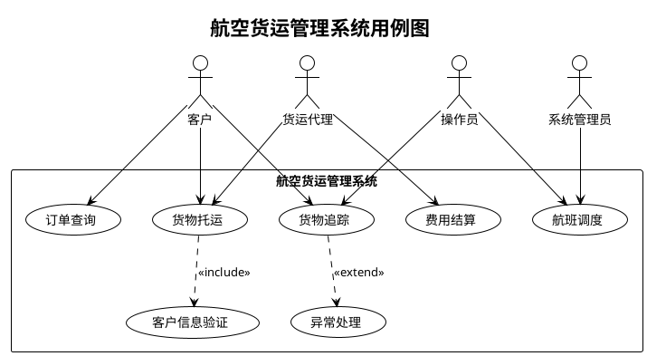
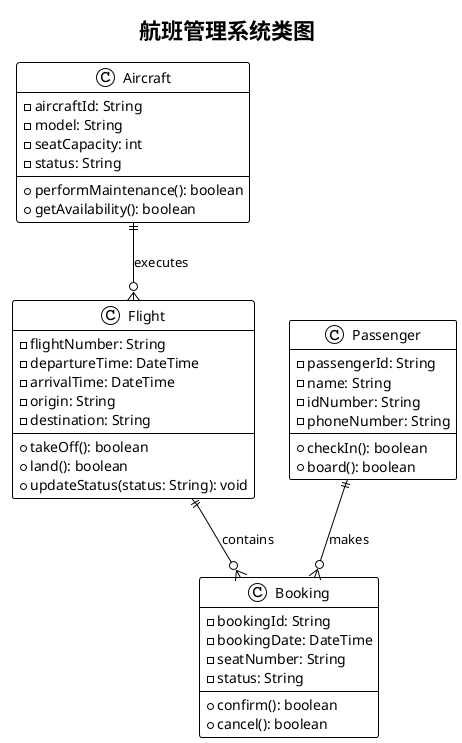
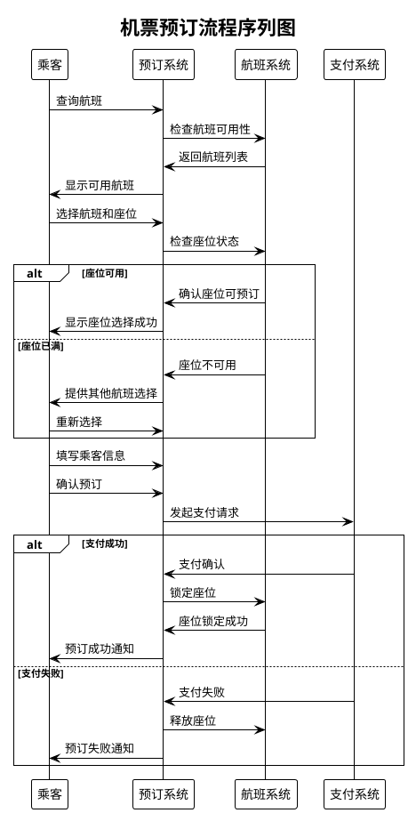
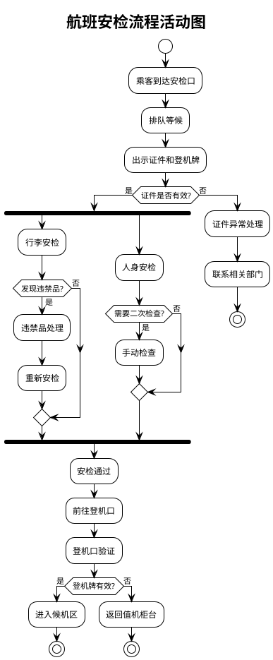
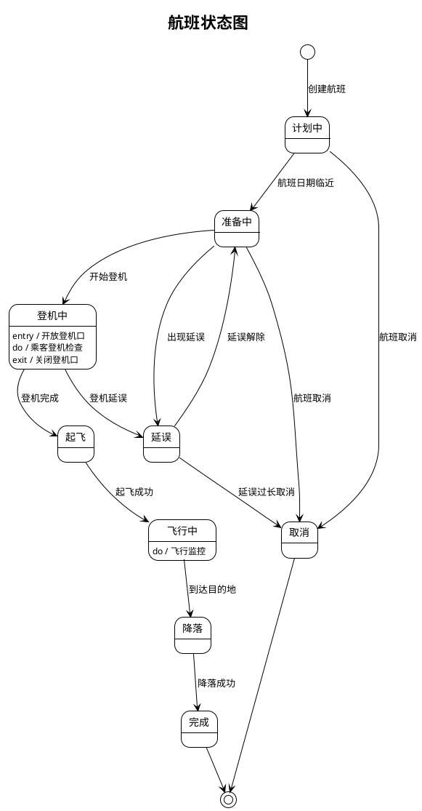
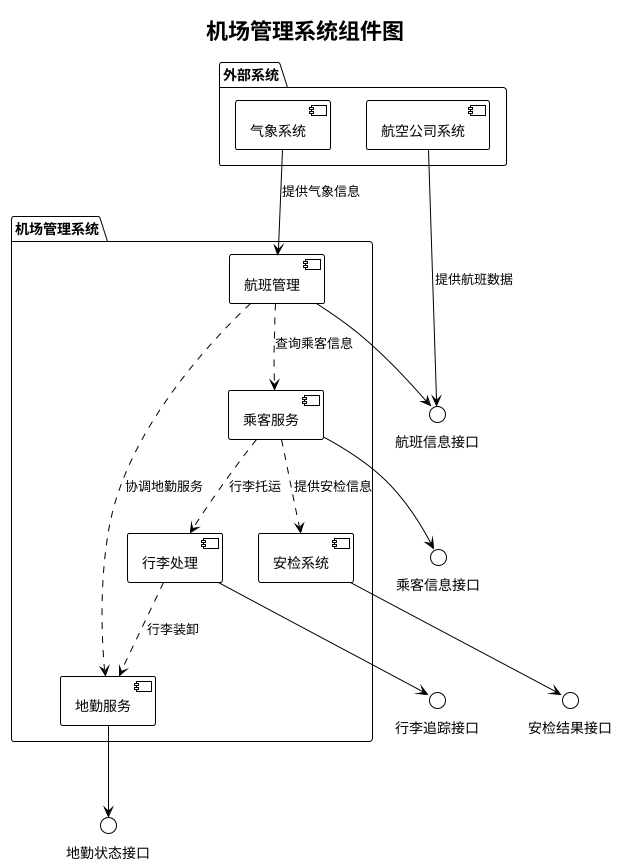
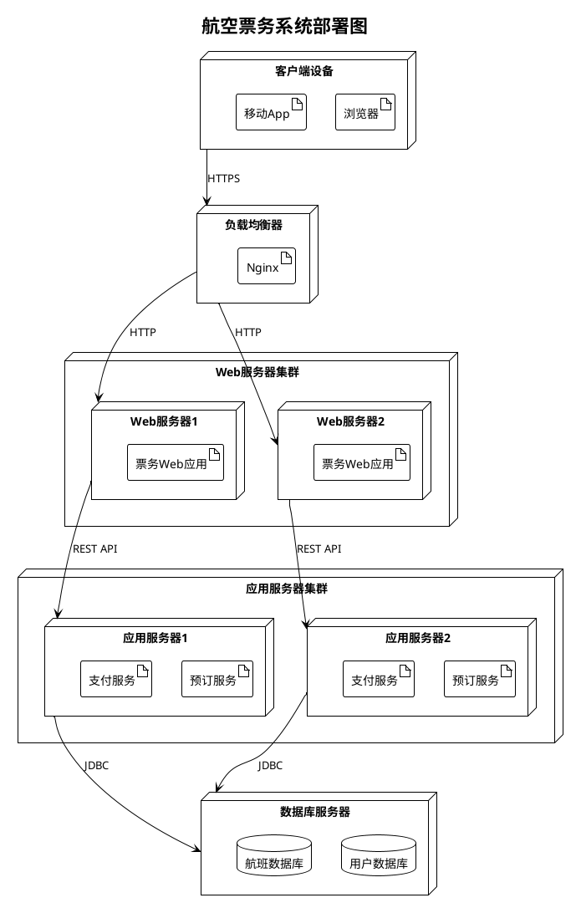
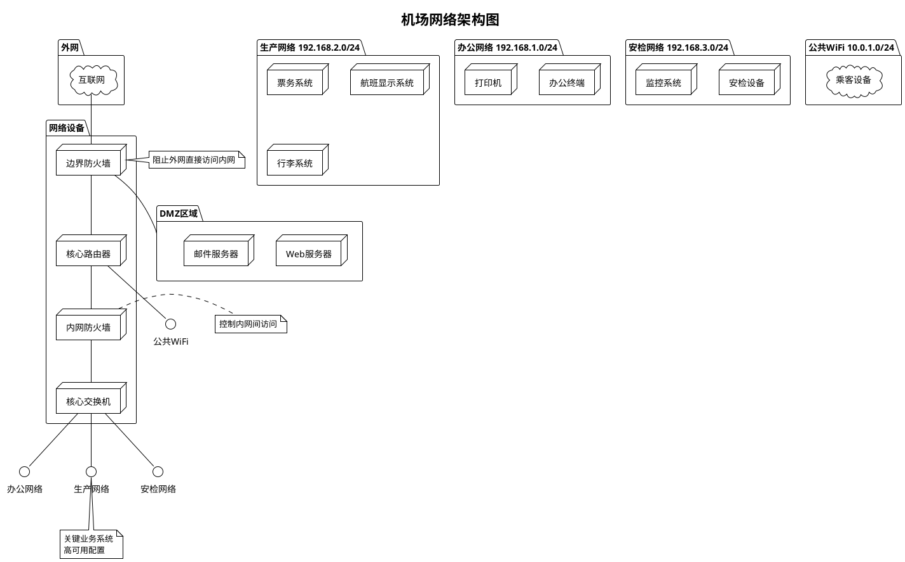
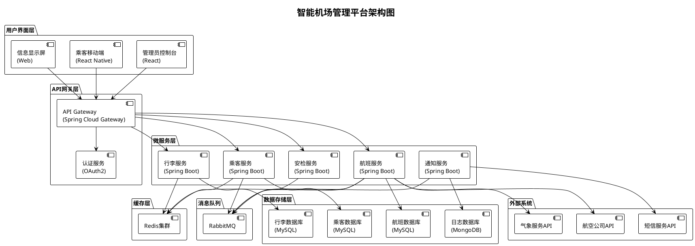

# PlantUML图表绘制提示词大全 - 民航业案例

## 目录
1. [用例图 (Use Case Diagram)](#用例图)
2. [类图 (Class Diagram)](#类图)
3. [序列图 (Sequence Diagram)](#序列图)
4. [活动图 (Activity Diagram)](#活动图)
5. [状态图 (State Diagram)](#状态图)
6. [组件图 (Component Diagram)](#组件图)
7. [部署图 (Deployment Diagram)](#部署图)
8. [时序图 (Timing Diagram)](#时序图)
9. [网络图 (Network Diagram)](#网络图)
10. [架构图 (Architecture Diagram)](#架构图)

---

## 用例图

### 提示词模板
```
请使用PlantUML绘制[系统名称]的用例图，包含以下参与者和用例：
- 参与者：[角色1]、[角色2]、[角色3]
- 主要用例：[用例1]、[用例2]、[用例3]
- 包含关系：[说明包含关系]
- 扩展关系：[说明扩展关系]
```

### 民航业案例
```
请使用PlantUML绘制航空货运管理系统的用例图，包含以下参与者和用例：
- 参与者：客户、货运代理、操作员、系统管理员
- 主要用例：货物托运、订单查询、货物追踪、费用结算、航班调度
- 包含关系：货物托运包含客户信息验证
- 扩展关系：货物追踪可扩展为异常处理
```

### 期望输出


---

## 类图

### 提示词模板
```
请使用PlantUML绘制[系统模块]的类图，包含以下类和关系：
- 核心类：[类1]、[类2]、[类3]
- 属性：为每个类定义主要属性
- 方法：为每个类定义核心方法
- 关系：继承、组合、聚合、依赖关系
```

### 民航业案例
```
请使用PlantUML绘制航班管理系统的类图，包含以下类和关系：
- 核心类：Aircraft（飞机）、Flight（航班）、Passenger（乘客）、Booking（预订）
- 属性：飞机包含机型、座位数；航班包含航班号、起降时间；乘客包含姓名、身份证号
- 方法：飞机的维护检查、航班的起飞降落、乘客的登机、预订的确认取消
- 关系：一架飞机可以执行多个航班，一个航班可以有多个乘客，乘客通过预订关联航班
```

### 期望输出


---

## 序列图

### 提示词模板
```
请使用PlantUML绘制[业务流程]的序列图，包含以下参与者和交互：
- 参与者：[对象1]、[对象2]、[对象3]
- 主要交互流程：[步骤1] -> [步骤2] -> [步骤3]
- 可选流程：[备选流程说明]
- 异常处理：[异常情况处理]
```

### 民航业案例
```
请使用PlantUML绘制机票预订流程的序列图，包含以下参与者和交互：
- 参与者：乘客、预订系统、支付系统、航班系统
- 主要交互流程：查询航班 -> 选择座位 -> 填写信息 -> 支付费用 -> 确认预订
- 可选流程：如果座位已满，提供其他航班选择
- 异常处理：支付失败时回滚预订
```

### 期望输出


---

## 活动图

### 提示词模板
```
请使用PlantUML绘制[业务流程]的活动图，包含以下要素：
- 开始和结束节点
- 主要活动：[活动1]、[活动2]、[活动3]
- 决策点：[判断条件1]、[判断条件2]
- 并行活动：[可并行执行的活动]
- 异常处理路径
```

### 民航业案例
```
请使用PlantUML绘制航班安检流程的活动图，包含以下要素：
- 开始：乘客到达安检口
- 主要活动：证件检查、行李检查、人身检查、登机口验证
- 决策点：证件是否有效、是否有违禁品、是否需要二次检查
- 并行活动：行李检查和人身检查可并行进行
- 异常处理：发现违禁品需要处理流程
```

### 期望输出


---

## 状态图

### 提示词模板
```
请使用PlantUML绘制[对象/实体]的状态图，包含以下要素：
- 初始状态和最终状态
- 主要状态：[状态1]、[状态2]、[状态3]
- 状态转换条件：[触发事件/条件]
- 状态内部活动：[entry/exit/do活动]
```

### 民航业案例
```
请使用PlantUML绘制航班状态的状态图，包含以下要素：
- 初始状态：计划中
- 主要状态：准备中、登机中、起飞、飞行中、降落、完成、取消、延误
- 状态转换条件：时间到达、天气条件、机械故障等
- 状态内部活动：在登机状态时执行乘客登机检查
```

### 期望输出


---

## 组件图

### 提示词模板
```
请使用PlantUML绘制[系统]的组件图，包含以下要素：
- 主要组件：[组件1]、[组件2]、[组件3]
- 接口定义：[接口说明]
- 组件间依赖关系
- 外部系统接口
```

### 民航业案例
```
请使用PlantUML绘制机场管理系统的组件图，包含以下要素：
- 主要组件：航班管理、乘客服务、行李处理、安检系统、地勤服务
- 接口定义：各组件间的数据交换接口
- 组件间依赖关系：航班管理依赖乘客服务和地勤服务
- 外部系统：航空公司系统、气象系统
```

### 期望输出


---

## 部署图

### 提示词模板
```
请使用PlantUML绘制[系统]的部署图，包含以下要素：
- 硬件节点：[服务器1]、[服务器2]、[客户端设备]
- 软件组件：[应用程序]、[数据库]、[中间件]
- 网络连接：[连接方式和协议]
- 部署环境：[开发/测试/生产环境]
```

### 民航业案例
```
请使用PlantUML绘制航空票务系统的部署图，包含以下要素：
- 硬件节点：Web服务器、应用服务器、数据库服务器、负载均衡器
- 软件组件：票务Web应用、预订服务、支付服务、用户数据库、航班数据库
- 网络连接：HTTPS、数据库连接、内部服务调用
- 部署环境：生产环境配置
```

### 期望输出


---

## 时序图

### 提示词模板
```
请使用PlantUML绘制[业务场景]的时序图，包含以下要素：
- 时间轴：从左到右表示时间流逝
- 参与者：[角色/系统1]、[角色/系统2]
- 时间约束：[时间窗口]、[超时设置]
- 状态变化：[状态转换时间点]
```

### 民航业案例
```
请使用PlantUML绘制航班起飞准备时序图，包含以下要素：
- 时间轴：起飞前2小时到起飞
- 参与者：地勤、乘务、机长、塔台
- 时间约束：登机开始时间、登机结束时间、起飞窗口
- 状态变化：飞机准备状态、乘客登机状态、起飞许可状态
```

### 期望输出
```plantuml
@startuml
!theme plain
title 航班起飞准备时序图

robust "地勤服务" as Ground
robust "乘务组" as Crew
robust "机长" as Captain
robust "塔台" as Tower

@0
Ground is 飞机检查
Crew is 准备中
Captain is 飞行前检查
Tower is 待命

@30
Ground is 飞机准备完成
note top : 起飞前90分钟

@45
Crew is 登机准备
Captain is 飞行计划确认

@60
Ground is 开始登机
Crew is 乘客服务
note top : 起飞前60分钟

@90
Ground is 登机完成
Crew is 安全检查
Captain is 最终检查

@105
Ground is 推出准备
Captain is 启动发动机
Tower is 地面管制

@110
Ground is 推出完成
Captain is 滑行请求
Tower is 滑行许可

@120
Captain is 起飞请求
Tower is 起飞许可
note top : 计划起飞时间

@enduml
```

---

## 网络图

### 提示词模板
```
请使用PlantUML绘制[网络架构]的网络图，包含以下要素：
- 网络设备：[路由器]、[交换机]、[防火墙]
- 网络分段：[DMZ区域]、[内网]、[外网]
- IP地址规划：[网络段划分]
- 安全策略：[访问控制规则]
```

### 民航业案例
```
请使用PlantUML绘制机场网络架构图，包含以下要素：
- 网络设备：核心路由器、接入交换机、安全防火墙
- 网络分段：办公网络、生产网络、公共WiFi、安检网络
- IP地址规划：各业务网段规划
- 安全策略：不同网段间的访问控制
```

### 期望输出


---

## 架构图

### 提示词模板
```
请使用PlantUML绘制[系统]的架构图，包含以下要素：
- 架构层次：[表示层]、[业务层]、[数据层]
- 核心组件：[组件说明]
- 技术栈：[具体技术选型]
- 集成方式：[系统间集成方式]
```

### 民航业案例
```
请使用PlantUML绘制智能机场管理平台架构图，包含以下要素：
- 架构层次：用户界面层、API网关层、微服务层、数据存储层
- 核心组件：航班服务、乘客服务、行李服务、安检服务
- 技术栈：React前端、Spring Boot、Redis缓存、MySQL数据库
- 集成方式：RESTful API、消息队列、数据同步
```

### 期望输出


---

## 使用建议

### 1. 选择合适的图表类型
- **用例图**：需求分析阶段，明确系统功能和用户角色
- **类图**：系统设计阶段，定义数据模型和类结构
- **序列图**：详细设计阶段，描述对象间交互流程
- **活动图**：业务流程建模，描述工作流程
- **状态图**：对象状态变化复杂的场景
- **组件图**：系统架构设计，模块划分
- **部署图**：系统部署和运维规划

### 2. 提示词优化技巧
- 明确指定图表类型和业务领域
- 详细描述关键元素和关系
- 提供具体的业务场景和约束条件
- 说明期望的详细程度和重点关注点

### 3. PlantUML语法要点
- 使用`@startuml`和`@enduml`包围图表代码
- 使用`!theme`设置图表主题
- 使用`title`添加图表标题
- 注意不同图表类型的特定语法规则

### 4. 民航业特色元素
- 强调时间敏感性（航班时刻、延误处理）
- 注重安全性（安检流程、应急处理）
- 考虑多方协作（航空公司、机场、乘客、监管部门）
- 突出实时性（航班状态、位置追踪）

通过这些提示词模板和案例，可以快速生成符合民航业务特点的各类PlantUML图表，提升文档质量和沟通效率。
