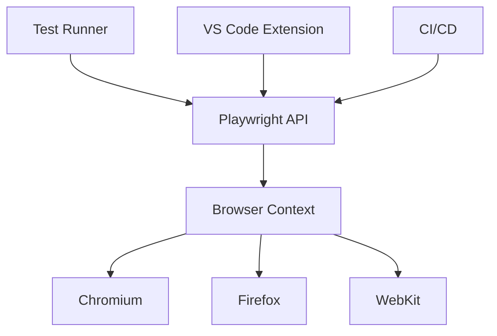

# 🎭 Playwright自动化测试教程

## 现代化Web自动化测试解决方案

### 讲师：AI助教

### 日期：2025年9月6日

---

## 📋 课程大纲

1. **Playwright介绍** - 现代化测试框架
2. **与Selenium对比** - 优势分析
3. **快速上手** - 环境搭建与基础使用
4. **API应用** - 核心功能详解
5. **VS Code集成** - 测试管理器整合

---

# 第一部分：Playwright介绍

---

## 🎭 什么是Playwright？

<div class="highlight">

**Playwright** 是微软开发的现代化端到端测试框架

</div>

### 核心特性

- 🌐 **跨浏览器支持** - Chromium、Firefox、Safari
- 📱 **移动端测试** - 模拟真实设备
- ⚡ **快速可靠** - 自动等待、并行执行
- 🔒 **现代Web支持** - SPA、PWA、WebAssembly
- 🐍 **多语言支持** - JavaScript、Python、Java、C#

---

## 🏗️ Playwright架构



- **Browser Context**: 隔离的浏览器环境
- **Auto-wait**: 智能等待机制
- **Network Interception**: 网络请求拦截

---

## 🎯 Playwright优势

### 1. **现代化设计**

- 原生支持异步操作
- 内置智能等待机制
- 自动处理动态内容

### 2. **企业级稳定性**

- 微软官方维护
- 活跃的社区支持
- 定期更新发布

### 3. **开发者友好**

- 丰富的调试工具
- VS Code深度集成
- 直观的API设计

---

# 第二部分：Playwright vs Selenium

---

## ⚖️ 详细对比分析

<div class="comparison-table">

| 特性                 | Playwright              | Selenium        |
| -------------------- | ----------------------- | --------------- |
| **发布时间**   | 2020年（新）            | 2004年（成熟）  |
| **浏览器支持** | Chromium/Firefox/Safari | 所有主流浏览器  |
| **执行速度**   | ⚡ 快速                 | 🐌 较慢         |
| **API设计**    | 🎯 现代化、直观         | 📚 传统、复杂   |
| **等待机制**   | 🤖 自动智能等待         | ⏰ 手动显式等待 |
| **移动端测试** | ✅ 原生支持             | ⚠️ 需额外工具 |
| **网络控制**   | ✅ 内置拦截             | ❌ 需第三方工具 |
| **并行执行**   | ✅ 原生支持             | ⚠️ 配置复杂   |

</div>

---

## 🚀 性能对比

### 测试执行时间（100个测试用例）

```
Selenium WebDriver:  ████████████████████ 45分钟
Playwright:          ████████ 18分钟
```

### 稳定性比较

```
Selenium 失败率:     ████████ 15%
Playwright 失败率:   ██ 3%
```

**原因分析:**

- Playwright的自动等待减少了flaky测试
- 更好的元素定位策略
- 内置重试机制

---

## 💡 何时选择Playwright？

### ✅ 推荐使用场景

- 新项目或重构现有测试
- 需要高性能和稳定性
- 现代Web应用(SPA、React、Vue)
- 移动端Web测试
- CI/CD集成要求高

### ⚠️ 谨慎考虑场景

- 需要IE浏览器支持
- 团队对Selenium投入较大
- 大量遗留代码需要维护

---

# 第三部分：Playwright快速上手

---

## 🛠️ 环境搭建

### 方式一：Node.js项目

```bash
# 创建新项目
npm init -y
npm create playwright@latest

# 安装浏览器
npx playwright install
```

### 方式二：Python项目

```bash
# 安装Playwright
pip install playwright pytest-playwright

# 安装浏览器
playwright install
```

---

## 🎬 第一个测试

```javascript
import { test, expect } from '@playwright/test';

test('我的第一个Playwright测试', async ({ page }) => {
  // 访问网站
  await page.goto('https://www.baidu.com');
  
  // 输入搜索关键词
  await page.fill('#kw', 'Playwright');
  
  // 点击搜索按钮
  await page.click('#su');
  
  // 验证结果
  await expect(page).toHaveTitle(/Playwright/);
});
```

---

## 🏃‍♂️ 运行测试

```bash
# 运行所有测试
npx playwright test

# 显示浏览器界面
npx playwright test --headed

# 调试模式
npx playwright test --debug

# 生成报告
npx playwright show-report
```

### 测试结果示例

```
Running 3 tests using 3 workers

  ✓ example.spec.js:3:1 › 我的第一个测试 (2s)
  ✓ example.spec.js:12:1 › 表单提交测试 (1s)  
  ✓ example.spec.js:21:1 › 页面导航测试 (1s)

  3 passed (4s)
```

---

# 第四部分：Playwright API应用

---

## 🎯 页面操作API

### 基础交互

```javascript
// 点击操作
await page.click('button');
await page.dblclick('.item');

// 输入操作  
await page.fill('#username', '用户名');
await page.type('#password', '密码', { delay: 100 });

// 选择操作
await page.selectOption('#country', 'china');
await page.check('#agreement');
```

### 高级交互

```javascript
// 拖拽操作
await page.dragAndDrop('#source', '#target');

// 文件上传
await page.setInputFiles('#upload', 'file.pdf');

// 键盘快捷键
await page.keyboard.press('Control+A');
```

---

## 🔍 元素定位策略

### 推荐定位方式

```javascript
// 1. 角色定位（推荐）
await page.getByRole('button', { name: '提交' });
await page.getByRole('textbox', { name: '用户名' });

// 2. 文本定位
await page.getByText('登录');
await page.getByLabel('邮箱地址');

// 3. 测试ID定位（最稳定）
await page.getByTestId('submit-button');

// 4. CSS选择器（最后选择）
await page.locator('.btn-primary');
```

---

## ⏱️ 等待机制

### 自动等待（推荐）

```javascript
// Playwright自动等待元素可见、可操作
await page.click('button'); // 自动等待按钮可点击
await page.fill('input', 'text'); // 自动等待输入框可编辑
```

### 显式等待

```javascript
// 等待元素出现
await page.waitForSelector('.loading', { state: 'hidden' });

// 等待网络请求
await page.waitForResponse(resp => 
  resp.url().includes('/api/data') && resp.status() === 200
);

// 等待页面加载
await page.waitForLoadState('networkidle');
```

---

## 📸 调试与截图

### 调试功能

```javascript
// 在浏览器中暂停
await page.pause();

// 截图调试
await page.screenshot({ path: 'debug.png' });

// 录制视频
const context = await browser.newContext({
  recordVideo: { dir: 'videos/' }
});
```

### Trace查看器

```bash
# 开启trace
npx playwright test --trace on

# 查看trace
npx playwright show-trace trace.zip
```

---

## 🌐 网络拦截

### Mock API响应

```javascript
test('模拟API响应', async ({ page }) => {
  // 拦截API请求
  await page.route('/api/users', async route => {
    await route.fulfill({
      status: 200,
      contentType: 'application/json',
      body: JSON.stringify([
        { id: 1, name: '张三' },
        { id: 2, name: '李四' }
      ])
    });
  });
  
  await page.goto('/users');
  await expect(page.getByText('张三')).toBeVisible();
});
```

---

# 第五部分：VS Code测试管理器整合

---

## 🔧 VS Code配置

### 1. 安装扩展

- **Playwright Test for VS Code** (ms-playwright.playwright)

### 2. 配置文件

```json
// .vscode/settings.json
{
  "playwright.reuseBrowser": true,
  "playwright.showTrace": true
}
```

```javascript
// playwright.config.js
export default defineConfig({
  testDir: './tests',
  reporter: [['html'], ['json']],
  use: {
    trace: 'on-first-retry',
    screenshot: 'only-on-failure'
  }
});
```

---

## 🧪 测试管理器功能

### 可视化测试管理


**功能特性:**

- 📋 **测试列表** - 按文件组织显示
- ▶️ **一键运行** - 单个/批量执行
- 🐛 **断点调试** - 可视化调试
- 📊 **结果显示** - 实时状态更新

---

## 🎬 录制测试功能

### 使用Codegen录制

```bash
# 启动录制器
npx playwright codegen https://example.com
```

### VS Code集成录制

1. 打开命令面板 (`Ctrl+Shift+P`)
2. 输入 "Playwright: Record new test"
3. 选择浏览器和录制选项
4. 开始操作，自动生成代码

---

## 🚀 高效开发流程

### 1. TDD工作流

```javascript
// 1. 先写测试
test('用户登录功能', async ({ page }) => {
  await page.goto('/login');
  await page.fill('#username', 'test@example.com');
  await page.fill('#password', 'password123');
  await page.click('#login-btn');
  
  await expect(page).toHaveURL('/dashboard');
});

// 2. 运行测试（失败）
// 3. 实现功能
// 4. 运行测试（通过）
```

---

## 📈 最佳实践

### 1. 测试组织

```
tests/
├── auth/           # 认证相关测试
├── checkout/       # 购买流程测试  
├── search/         # 搜索功能测试
└── utils/          # 工具函数
```

### 2. 页面对象模式

```javascript
// pages/LoginPage.js
export class LoginPage {
  constructor(page) {
    this.page = page;
    this.usernameInput = page.locator('#username');
    this.passwordInput = page.locator('#password');
    this.loginButton = page.locator('#login-btn');
  }
  
  async login(username, password) {
    await this.usernameInput.fill(username);
    await this.passwordInput.fill(password);
    await this.loginButton.click();
  }
}
```

---

## 🎯 总结与展望

### Playwright的价值

- ⚡ **提升效率** - 更快的测试执行
- 🎯 **提高质量** - 更稳定的测试
- 🛠️ **开发体验** - 更好的工具链
- 📈 **团队协作** - 标准化的测试流程

### 下一步学习

1. **深入API** - 探索高级功能
2. **性能测试** - 结合其他工具
3. **CI/CD集成** - 自动化流水线
4. **团队实践** - 制定测试标准

---

# 🙏 Thank You!

### 课后作业

1. 搭建Playwright测试环境
2. 完成携程机票搜索测试案例
3. 集成VS Code测试管理器

---

<!-- 
这个Marp演示文稿涵盖了Playwright的核心内容：
- 介绍与背景
- 与Selenium的详细对比
- 实用的快速上手指南
- 丰富的API示例
- VS Code集成最佳实践

可以使用以下命令导出为各种格式：
npx marp slides.md --pdf
npx marp slides.md --html
npx marp slides.md --pptx
-->
