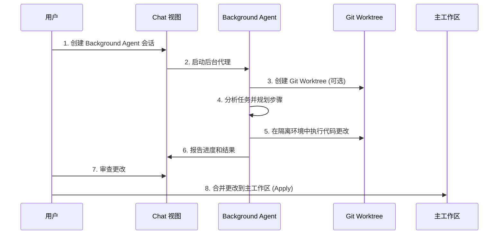

# VS Code Background Agents 完整实战指南

> **📌 文档说明**: 本文档全面介绍 VS Code 的 Background Agents（后台代理）功能，包括概念、工作原理、使用场景和完整实战案例。

---

## 📋 目录

- [一、Background Agents 概述](#一background-agents-概述)
- [二、核心概念与工作原理](#二核心概念与工作原理)
- [三、Background Agents vs Local Agents](#三background-agents-vs-local-agents)
- [四、支持的 Background Agents 类型](#四支持的-background-agents-类型)
- [五、完整使用指南](#五完整使用指南)
- [六、实战案例1：使用 Copilot CLI 实现新功能](#六实战案例1使用-copilot-cli-实现新功能)
- [七、实战案例2：使用 Git Worktree 隔离开发](#七实战案例2使用-git-worktree-隔离开发)
- [八、实战案例3：结合 Plan Agent 和 Background Agent](#八实战案例3结合-plan-agent-和-background-agent)
- [九、实战案例4：自定义 Background Agent](#九实战案例4自定义-background-agent)
- [十、最佳实践与注意事项](#十最佳实践与注意事项)
- [十一、故障排除指南](#十一故障排除指南)

---

## 一、Background Agents 概述

### 1.1 什么是 Background Agents？

**Background Agents（后台代理）** 是 VS Code 中基于 CLI（命令行界面）的智能代理，它们在本地机器的后台独立运行，可以自主执行编码任务，而不影响你在编辑器中的正常工作。

### 1.2 核心特性

- 🔄 **后台运行**: 在后台独立执行任务，不阻塞编辑器
- 🌳 **Git Worktree 隔离**: 可在独立的 Git 工作树中运行，避免与主工作区冲突
- 🤖 **自主决策**: 根据任务描述自主规划和执行代码更改
- 📊 **统一管理**: 通过 VS Code Chat 视图统一查看和管理所有后台会话
- 🔀 **任务移交**: 支持从本地 Chat 会话移交到后台代理

### 1.3 适用场景

✅ **适合使用 Background Agents 的场景**：

- 根据明确的计划实现新功能
- 创建 POC（概念验证）的多个变体
- 实现清晰定义的 Bug 修复
- 执行大规模代码重构
- 批量生成测试用例
- 同时进行多个独立的功能开发

❌ **不适合使用 Background Agents 的场景**：

- 需要频繁交互和澄清需求的任务
- 需要实时查看代码更改的任务
- 需要使用 VS Code 扩展工具的任务
- 需要访问 MCP 服务器的任务

---

## 二、核心概念与工作原理

### 2.1 工作架构

```
┌─────────────────────────────────────────────────────────┐
│                    VS Code 编辑器                        │
│                                                          │
│  ┌──────────────┐      ┌─────────────────────────┐     │
│  │  Chat 视图   │ ───▶ │  Background Agent       │     │
│  │  (任务下发)  │      │  (后台执行)             │     │
│  └──────────────┘      └─────────────────────────┘     │
│         │                        │                       │
│         │                        ▼                       │
│         │               ┌─────────────────┐             │
│         │               │  Git Worktree   │             │
│         │               │  (隔离环境)     │             │
│         │               └─────────────────┘             │
│         │                        │                       │
│         ▼                        ▼                       │
│  ┌──────────────────────────────────────┐               │
│  │     主工作区 (Main Workspace)        │               │
│  └──────────────────────────────────────┘               │
└─────────────────────────────────────────────────────────┘
```

### 2.2 执行流程



### 2.3 关键技术

#### Git Worktree

**Git Worktree** 允许在同一仓库中创建多个独立的工作目录，每个 worktree 可以签出不同的分支。

```bash
# 查看当前 worktrees
git worktree list

# 输出示例
/path/to/main            abc1234 [main]
/path/to/feature-branch  def5678 [feature-worktree]
```

**优势**：
- ✅ 隔离开发环境，不影响主工作区
- ✅ 允许同时进行多个独立任务
- ✅ 方便进行 A/B 测试和实验

---

## 三、Background Agents vs Local Agents

| 对比维度 | Background Agents | Local Agents |
|---------|-------------------|--------------|
| **运行方式** | CLI 后台进程 | VS Code 内嵌进程 |
| **上下文感知** | ❌ 无法访问编辑器上下文 | ✅ 可访问选中文本、失败测试等 |
| **工具访问** | ❌ 无法使用 VS Code 扩展工具 | ✅ 可使用所有扩展工具 |
| **MCP 服务** | ❌ 无法访问 MCP 服务器 | ✅ 可访问 MCP 服务器 |
| **工作隔离** | ✅ 支持 Git Worktree 隔离 | ❌ 在主工作区直接操作 |
| **并行任务** | ✅ 支持多个并行会话 | ⚠️ 可能冲突 |
| **自主性** | ✅ 高度自主，无需交互 | ⚠️ 需要用户交互和确认 |
| **适用场景** | 明确任务，长时间执行 | 探索性任务，需要即时反馈 |

---

## 四、支持的 Background Agents 类型

### 4.1 Copilot CLI

**GitHub Copilot CLI** 是 VS Code 中的主要后台代理。

#### 安装

```bash
# 全局安装 Copilot CLI
npm install -g @github/copilot
```

#### 验证安装

```bash
# 查看 Copilot CLI 版本
gh copilot --version

# 测试 Copilot CLI
gh copilot suggest "create a git commit message"
```

#### 特性

- ✅ 完整的对话历史传递
- ✅ 自动检测终端中的 CLI 会话
- ✅ 支持从 VS Code 直接管理
- ✅ 支持 Git Worktree 隔离

### 4.2 OpenAI Codex

**OpenAI Codex** 后台代理使用 OpenAI 的 Codex 模型执行编码任务。

#### 安装

1. 从 VS Code Marketplace 安装 [OpenAI Codex 扩展](https://marketplace.visualstudio.com/items?itemName=openai.chatgpt)
2. 使用 Copilot Pro+ 订阅进行身份验证

#### 特性

- ✅ 使用 Copilot Pro+ 订阅无需额外设置
- ✅ 支持更高级的编码任务
- ✅ 与 VS Code 深度集成

### 4.3 自定义 Agents（实验性）

支持创建自定义代理，定义特定的角色和行为。

---

## 五、完整使用指南

### 5.1 创建 Background Agent 会话

#### 方法1: 从 Chat 视图创建

1. 打开 Chat 视图（`Ctrl+Alt+I` / `Cmd+Alt+I`）
2. 点击 **New Chat** 下拉菜单
3. 选择 **New Background Agent**


#### 方法2: 从命令面板创建

1. 打开命令面板（`Ctrl+Shift+P` / `Cmd+Shift+P`）
2. 输入并选择：`Chat: New Background Agent`

#### 方法3: 在 Chat 中使用 @cli

```
@cli 根据用户故事 #42 实现用户登录功能
```

#### 方法4: 从终端直接使用 CLI

```bash
# 在终端中启动 Copilot CLI 会话
gh copilot suggest "implement user authentication"
```

> **提示**: VS Code 会自动检测终端中的 Copilot CLI 会话并在 Chat 视图中显示。

### 5.2 查看和管理会话

#### 筛选 Background Agent 会话

1. 打开 Chat 视图
2. 点击筛选器按钮
3. 选择 **Background Agents**


#### 查看会话详情

- **在 Chat 视图中查看**: 点击会话即可在 Chat 视图中查看
- **在编辑器标签中查看**: 右键点击会话 → 选择 **Open as Editor**
- **在终端中恢复**: 右键点击会话 → 选择 **Resume Agent Session in Terminal**

### 5.3 移交任务到 Background Agent

#### 场景：从本地 Chat 移交到后台代理

1. 在 Chat 视图中与本地代理交互，澄清需求
2. 当准备移交时，选择以下任一方式：
   - 点击 **Continue In** → 选择 **Background**
   - 在 Chat 输入框中输入 `@cli`
3. Background Agent 自动启动，携带完整对话历史


#### 场景：从 Plan Agent 移交

1. 使用 `@plan` 生成实施计划
2. 点击 **Start Implementation** 下拉菜单
3. 选择 **Continue in Background**


---

## 六、实战案例1：使用 Copilot CLI 实现新功能

### 6.1 案例背景

**需求**：为 GeekBooks 极客书店系统添加"购物车管理"功能。

**功能点**：
- 添加图书到购物车
- 查看购物车内容
- 更新图书数量
- 从购物车移除图书
- 计算购物车总价

### 6.2 步骤1：创建 Background Agent 会话

1. 打开 Chat 视图（`Ctrl+Alt+I`）
2. 选择 **New Chat** → **New Background Agent**
3. 输入任务描述：

```
基于以下用户故事，实现购物车管理功能：

## User Story

作为一个在线书店用户
我想要管理我的购物车
以便我可以在购买前添加、查看、更新和删除图书

## 验收标准

1. 用户可以添加图书到购物车，指定数量
2. 用户可以查看购物车中的所有图书和总价
3. 用户可以更新购物车中图书的数量
4. 用户可以从购物车中移除图书
5. 购物车信息在用户会话期间持久化

## 技术要求

- 使用 Java + Spring Boot
- 实现 REST API
- 包含单元测试（覆盖率 > 80%）
- 使用 JPA 进行数据持久化
```

### 6.3 步骤2：监控执行进度

Background Agent 会在 Chat 视图中显示执行进度：

```
✅ 任务分析完成
   - 创建 ShoppingCart 实体类
   - 创建 ShoppingCartItem 实体类
   - 创建 ShoppingCartService 服务类
   - 创建 ShoppingCartController 控制器
   - 编写单元测试

🔄 正在创建实体类...
   ✅ ShoppingCart.java 已创建
   ✅ ShoppingCartItem.java 已创建

🔄 正在创建服务类...
   ✅ ShoppingCartService.java 已创建
   ✅ ShoppingCartRepository.java 已创建

🔄 正在创建控制器...
   ✅ ShoppingCartController.java 已创建

🔄 正在编写测试...
   ✅ ShoppingCartServiceTest.java 已创建
   ✅ ShoppingCartControllerTest.java 已创建

🔄 运行测试...
   ✅ 所有测试通过（覆盖率：85%）

✅ 任务完成！
```

### 6.4 步骤3：审查代码更改

在 Chat 视图底部，查看文件更改摘要：

```
📋 文件更改摘要

新增文件：
✅ src/main/java/com/geekbooks/entity/ShoppingCart.java
✅ src/main/java/com/geekbooks/entity/ShoppingCartItem.java
✅ src/main/java/com/geekbooks/service/ShoppingCartService.java
✅ src/main/java/com/geekbooks/repository/ShoppingCartRepository.java
✅ src/main/java/com/geekbooks/controller/ShoppingCartController.java
✅ src/test/java/com/geekbooks/service/ShoppingCartServiceTest.java
✅ src/test/java/com/geekbooks/controller/ShoppingCartControllerTest.java

修改文件：
⚠️ pom.xml (添加依赖)
```

### 6.5 步骤4：查看具体代码

点击文件名查看具体更改，例如 `ShoppingCartService.java`：

```java
@Service
@Transactional
public class ShoppingCartService {
    
    @Autowired
    private ShoppingCartRepository cartRepository;
    
    /**
     * 添加图书到购物车
     */
    public ShoppingCart addItem(Long cartId, Long bookId, Integer quantity) {
        ShoppingCart cart = cartRepository.findById(cartId)
            .orElseThrow(() -> new ResourceNotFoundException("购物车不存在"));
        
        // 检查是否已存在该图书
        Optional<ShoppingCartItem> existingItem = cart.getItems().stream()
            .filter(item -> item.getBookId().equals(bookId))
            .findFirst();
        
        if (existingItem.isPresent()) {
            // 更新数量
            ShoppingCartItem item = existingItem.get();
            item.setQuantity(item.getQuantity() + quantity);
        } else {
            // 添加新项
            ShoppingCartItem item = new ShoppingCartItem();
            item.setBookId(bookId);
            item.setQuantity(quantity);
            item.setCart(cart);
            cart.getItems().add(item);
        }
        
        return cartRepository.save(cart);
    }
    
    /**
     * 查看购物车
     */
    public ShoppingCart getCart(Long cartId) {
        return cartRepository.findById(cartId)
            .orElseThrow(() -> new ResourceNotFoundException("购物车不存在"));
    }
    
    /**
     * 更新图书数量
     */
    public ShoppingCart updateItemQuantity(Long cartId, Long bookId, Integer quantity) {
        ShoppingCart cart = getCart(cartId);
        
        ShoppingCartItem item = cart.getItems().stream()
            .filter(i -> i.getBookId().equals(bookId))
            .findFirst()
            .orElseThrow(() -> new ResourceNotFoundException("购物车中不存在该图书"));
        
        item.setQuantity(quantity);
        return cartRepository.save(cart);
    }
    
    /**
     * 从购物车移除图书
     */
    public ShoppingCart removeItem(Long cartId, Long bookId) {
        ShoppingCart cart = getCart(cartId);
        cart.getItems().removeIf(item -> item.getBookId().equals(bookId));
        return cartRepository.save(cart);
    }
    
    /**
     * 计算购物车总价
     */
    public BigDecimal calculateTotal(Long cartId) {
        ShoppingCart cart = getCart(cartId);
        return cart.getItems().stream()
            .map(item -> item.getPrice().multiply(BigDecimal.valueOf(item.getQuantity())))
            .reduce(BigDecimal.ZERO, BigDecimal::add);
    }
}
```

### 6.6 步骤5：应用更改

1. 审查所有更改无误后
2. 点击 **Keep** 保留更改
3. 点击 **Apply** 应用到主工作区


### 6.7 步骤6：验证功能

```bash
# 运行测试
mvn test

# 启动应用
mvn spring-boot:run

# 测试 API
curl -X POST http://localhost:8080/api/cart/1/items \
  -H "Content-Type: application/json" \
  -d '{"bookId": 101, "quantity": 2}'
```

### 6.8 预期结果

```json
{
  "id": 1,
  "userId": 123,
  "items": [
    {
      "id": 1,
      "bookId": 101,
      "bookTitle": "Clean Code",
      "quantity": 2,
      "price": 49.99
    }
  ],
  "totalPrice": 99.98,
  "createdAt": "2026-01-16T10:30:00Z",
  "updatedAt": "2026-01-16T10:30:00Z"
}
```

---

## 七、实战案例2：使用 Git Worktree 隔离开发

### 7.1 案例背景

**场景**：同时开发两个独立功能，避免相互干扰。

**功能A**：订单支付功能  
**功能B**：用户评论功能

### 7.2 步骤1：创建隔离的 Background Agent 会话

1. 打开 Chat 视图
2. 创建新的 Background Agent 会话
3. **关键步骤**：在聊天输入框中，选择 **Worktree** 隔离模式


4. 输入任务描述：

```
实现订单支付功能

## 功能需求

1. 支持支付宝和微信支付
2. 生成支付二维码
3. 处理支付回调
4. 更新订单状态
5. 发送支付成功通知

## 技术要求

- 集成支付宝 SDK
- 集成微信支付 SDK
- 实现异步回调处理
- 包含集成测试
```

### 7.3 步骤2：VS Code 自动创建 Git Worktree

VS Code 自动执行：

```bash
# VS Code 自动执行的命令
git worktree add ../geekbooks-payment-feature payment-feature
```

**结果**：

```
主工作区：     /path/to/geekbooks (main 分支)
Worktree 1:   /path/to/geekbooks-payment-feature (payment-feature 分支)
```

### 7.4 步骤3：在隔离环境中执行

Background Agent 在 worktree 中独立工作：

```
✅ Git Worktree 已创建: /path/to/geekbooks-payment-feature
✅ 切换到分支: payment-feature

🔄 正在实现支付功能...
   ✅ PaymentService.java 已创建
   ✅ AlipayClient.java 已创建
   ✅ WechatPayClient.java 已创建
   ✅ PaymentController.java 已创建
   ✅ 集成测试已完成

✅ 任务完成！所有更改在 worktree 中
```

### 7.5 步骤4：查看 Worktree 状态

在 Source Control 视图中：


```
📂 Repositories
   📂 geekbooks (main)  ← 主工作区
   📂 geekbooks-payment-feature (payment-feature)  ← Worktree
```

### 7.6 步骤5：同时创建第二个功能的 Worktree

重复相同步骤，为"用户评论功能"创建另一个 worktree：

```
主工作区：     /path/to/geekbooks (main 分支)
Worktree 1:   /path/to/geekbooks-payment-feature (payment-feature 分支)
Worktree 2:   /path/to/geekbooks-review-feature (review-feature 分支)
```

### 7.7 步骤6：审查和合并

#### 审查 Worktree 更改

```bash
# 查看 worktree 状态
git worktree list

# 输出
/path/to/geekbooks                       abc1234 [main]
/path/to/geekbooks-payment-feature       def5678 [payment-feature]
/path/to/geekbooks-review-feature        ghi9012 [review-feature]

# 查看 payment-feature 更改
cd /path/to/geekbooks-payment-feature
git status
```

#### 合并到主分支

**方式1：在 VS Code 中应用**

1. 在 Background Agent 会话中点击 **Keep** 保留更改
2. 点击 **Apply** 应用到主工作区
3. VS Code 自动执行合并

**方式2：手动合并**

```bash
# 切换到主工作区
cd /path/to/geekbooks

# 合并 payment-feature
git checkout main
git merge payment-feature

# 合并 review-feature
git merge review-feature

# 删除 worktree（可选）
git worktree remove ../geekbooks-payment-feature
git worktree remove ../geekbooks-review-feature
```

### 7.8 Worktree 最佳实践

✅ **推荐做法**：

- 每个功能使用独立的 worktree
- 定期同步主分支更改到 worktree
- 及时清理不再使用的 worktree
- 在 worktree 中完成测试后再合并

❌ **避免做法**：

- 不要在 worktree 之间共享未提交的更改
- 不要在 worktree 中执行破坏性操作（如 force push）
- 不要忘记删除废弃的 worktree

---

## 八、实战案例3：结合 Plan Agent 和 Background Agent

### 8.1 案例背景

**复杂需求**：为 GeekBooks 系统添加"图书推荐引擎"。

**挑战**：
- 需求复杂，涉及多个模块
- 需要数据分析和算法设计
- 需要明确的实施计划

### 8.2 步骤1：使用 Plan Agent 生成实施计划

1. 在 Chat 视图中输入：

```
@plan 设计并实现一个图书推荐引擎

## 需求描述

为 GeekBooks 系统设计一个智能图书推荐引擎，基于以下维度：

1. **用户行为**: 浏览历史、购买记录、收藏夹
2. **图书属性**: 分类、作者、标签、评分
3. **协同过滤**: 基于相似用户的偏好
4. **内容过滤**: 基于图书内容相似度

## 技术约束

- 使用 Java + Spring Boot
- 推荐算法使用协同过滤 + 内容过滤混合模式
- 支持实时推荐和批量预计算
- 响应时间 < 200ms

## 质量要求

- 推荐准确率 > 70%
- 单元测试覆盖率 > 85%
- 包含性能测试
```

2. Plan Agent 生成详细计划：

```markdown
# 图书推荐引擎实施计划

## 📊 项目概览

**预估工作量**: 5-7 天  
**复杂度**: 中高  
**风险等级**: 中等

## 🎯 实施步骤

### 第1步：数据模型设计 (1天)

**任务**：
- 设计用户行为数据模型（UserBehavior）
- 设计图书特征数据模型（BookFeature）
- 设计推荐结果数据模型（Recommendation）

**产出**：
- 实体类和数据库表设计
- ER 图

### 第2步：数据采集模块 (1天)

**任务**：
- 实现用户行为追踪（浏览、购买、收藏）
- 实现图书特征提取
- 设计数据存储策略

**产出**：
- UserBehaviorService
- BookFeatureService
- 数据采集 API

### 第3步：推荐算法实现 (2天)

**任务**：
- 实现协同过滤算法（基于用户）
- 实现内容过滤算法（基于图书）
- 实现混合推荐策略

**产出**：
- CollaborativeFilteringEngine
- ContentBasedFilteringEngine
- HybridRecommendationEngine

### 第4步：推荐服务实现 (1天)

**任务**：
- 实现实时推荐 API
- 实现批量预计算任务
- 实现推荐结果缓存

**产出**：
- RecommendationService
- RecommendationController
- 定时任务配置

### 第5步：测试与优化 (1-2天)

**任务**：
- 编写单元测试
- 编写集成测试
- 性能测试和优化
- 准确率评估

**产出**：
- 测试套件（覆盖率 > 85%）
- 性能测试报告
- 优化建议

## 📋 技术选型

| 组件 | 技术选择 | 理由 |
|-----|---------|-----|
| 推荐算法库 | Apache Mahout | 成熟的推荐算法实现 |
| 缓存 | Redis | 高性能推荐结果缓存 |
| 定时任务 | Spring Scheduler | 批量预计算 |
| 数据库 | MySQL + MongoDB | 关系数据 + 行为日志 |

## ⚠️ 风险与应对

| 风险 | 影响 | 应对措施 |
|-----|------|---------|
| 冷启动问题 | 新用户无推荐 | 使用热门图书作为默认推荐 |
| 性能瓶颈 | 响应时间超标 | 使用缓存 + 预计算 |
| 数据稀疏性 | 推荐准确率低 | 混合多种推荐策略 |

## ✅ 验收标准

- [ ] 推荐准确率 > 70%
- [ ] 响应时间 P95 < 200ms
- [ ] 单元测试覆盖率 > 85%
- [ ] 支持至少 10000 并发用户
```

### 8.3 步骤2：移交到 Background Agent

1. 审查计划无误后
2. 点击 **Start Implementation** 下拉菜单
3. 选择 **Continue in Background**


4. Background Agent 接管并携带完整计划和上下文

### 8.4 步骤3：Background Agent 执行

```
✅ 接收到实施计划
✅ 任务分解完成，共5个主要步骤

🔄 步骤1/5: 数据模型设计
   ✅ UserBehavior.java 已创建
   ✅ BookFeature.java 已创建
   ✅ Recommendation.java 已创建
   ✅ 数据库迁移脚本已生成

🔄 步骤2/5: 数据采集模块
   ✅ UserBehaviorService.java 已创建
   ✅ BookFeatureService.java 已创建
   ✅ BehaviorTrackingAspect.java 已创建（AOP 自动追踪）

🔄 步骤3/5: 推荐算法实现
   ✅ CollaborativeFilteringEngine.java 已创建
   ✅ ContentBasedFilteringEngine.java 已创建
   ✅ HybridRecommendationEngine.java 已创建
   ✅ 集成 Apache Mahout

🔄 步骤4/5: 推荐服务实现
   ✅ RecommendationService.java 已创建
   ✅ RecommendationController.java 已创建
   ✅ RecommendationCacheManager.java 已创建
   ✅ 定时预计算任务已配置

🔄 步骤5/5: 测试与优化
   ✅ 单元测试已完成（覆盖率：87%）
   ✅ 集成测试已完成
   ✅ 性能测试已完成（P95: 185ms）
   ✅ 准确率评估完成（准确率：74%）

✅ 所有步骤完成！推荐引擎已实现。
```

### 8.5 步骤4：审查关键代码

**HybridRecommendationEngine.java**（核心推荐引擎）：

```java
@Service
public class HybridRecommendationEngine {
    
    @Autowired
    private CollaborativeFilteringEngine collaborativeEngine;
    
    @Autowired
    private ContentBasedFilteringEngine contentEngine;
    
    @Autowired
    private RecommendationCacheManager cacheManager;
    
    /**
     * 混合推荐策略
     * 权重：协同过滤 60% + 内容过滤 40%
     */
    public List<BookRecommendation> recommend(Long userId, int limit) {
        // 检查缓存
        List<BookRecommendation> cached = cacheManager.get(userId);
        if (cached != null && !cached.isEmpty()) {
            return cached.stream().limit(limit).collect(Collectors.toList());
        }
        
        // 协同过滤推荐
        List<BookRecommendation> cfRecommendations = 
            collaborativeEngine.recommend(userId, limit * 2);
        
        // 内容过滤推荐
        List<BookRecommendation> cbfRecommendations = 
            contentEngine.recommend(userId, limit * 2);
        
        // 混合策略：加权合并
        Map<Long, Double> scoreMap = new HashMap<>();
        
        // 协同过滤权重 0.6
        cfRecommendations.forEach(rec -> 
            scoreMap.put(rec.getBookId(), rec.getScore() * 0.6)
        );
        
        // 内容过滤权重 0.4
        cbfRecommendations.forEach(rec -> 
            scoreMap.merge(rec.getBookId(), rec.getScore() * 0.4, Double::sum)
        );
        
        // 排序并限制结果数量
        List<BookRecommendation> result = scoreMap.entrySet().stream()
            .sorted(Map.Entry.<Long, Double>comparingByValue().reversed())
            .limit(limit)
            .map(entry -> new BookRecommendation(entry.getKey(), entry.getValue()))
            .collect(Collectors.toList());
        
        // 缓存结果
        cacheManager.put(userId, result);
        
        return result;
    }
    
    /**
     * 处理冷启动问题：新用户推荐热门图书
     */
    public List<BookRecommendation> recommendForNewUser(int limit) {
        // 查询热门图书（基于销量和评分）
        return bookRepository.findTopRatedBooks(limit).stream()
            .map(book -> new BookRecommendation(book.getId(), 1.0))
            .collect(Collectors.toList());
    }
}
```

### 8.6 步骤5：验证和部署

```bash
# 运行测试
mvn test

# 运行性能测试
mvn test -Dtest=RecommendationPerformanceTest

# 启动应用
mvn spring-boot:run

# 测试推荐 API
curl http://localhost:8080/api/recommendations/user/123?limit=10
```

**响应示例**：

```json
{
  "userId": 123,
  "recommendations": [
    {
      "bookId": 201,
      "title": "Designing Data-Intensive Applications",
      "score": 0.92,
      "reason": "基于你购买的《Clean Code》"
    },
    {
      "bookId": 305,
      "title": "The Pragmatic Programmer",
      "score": 0.88,
      "reason": "相似用户也喜欢"
    },
    {
      "bookId": 412,
      "title": "Domain-Driven Design",
      "score": 0.85,
      "reason": "基于你浏览的架构类图书"
    }
  ],
  "generatedAt": "2026-01-16T11:00:00Z"
}
```

---

## 九、实战案例4：自定义 Background Agent

### 9.1 案例背景

**需求**：创建一个专门的"代码审查 Agent"，自动审查代码并提供改进建议。

### 9.2 步骤1：启用自定义 Agent 功能

1. 打开 VS Code 设置（`Ctrl+,` / `Cmd+,`）
2. 搜索 `github.copilot.chat.cli.customAgents.enabled`
3. 勾选启用

### 9.3 步骤2：创建自定义 Agent

1. 打开命令面板（`Ctrl+Shift+P` / `Cmd+Shift+P`）
2. 输入并选择：`Chat: New Custom Agent`
3. 选择工作区作为存储位置

### 9.4 步骤3：定义 Agent 配置

在工作区根目录创建 `.github/copilot/agents/code-reviewer.json`：

```json
{
  "name": "code-reviewer",
  "displayName": "Code Reviewer Agent",
  "description": "专业的代码审查 Agent，提供详细的代码质量分析和改进建议",
  "version": "1.0.0",
  "avatar": "🔍",
  "instructions": [
    "你是一位资深软件工程师，拥有15年代码审查经验。",
    "审查代码时，关注以下方面：",
    "1. 代码质量：可读性、可维护性、复杂度",
    "2. 设计原则：SOLID、DRY、KISS",
    "3. 性能：算法复杂度、资源使用",
    "4. 安全：常见漏洞、输入验证",
    "5. 测试：测试覆盖率、边界条件",
    "6. 最佳实践：命名规范、注释质量",
    "",
    "输出格式：",
    "- 总体评分（1-10分）",
    "- 严重问题列表（P0）",
    "- 改进建议列表（P1/P2）",
    "- 优秀实践列表",
    "- 重构建议（如适用）"
  ],
  "settings": {
    "temperature": 0.3,
    "maxTokens": 4000
  },
  "capabilities": {
    "codeAnalysis": true,
    "fileOperations": true,
    "terminalCommands": true
  },
  "prompts": {
    "systemPrompt": "作为专业代码审查 Agent，我将仔细分析代码并提供建设性的反馈。",
    "exampleTasks": [
      "审查 UserService.java 的代码质量",
      "检查 PaymentController.java 的安全问题",
      "分析 RecommendationEngine.java 的性能"
    ]
  }
}
```

### 9.5 步骤4：使用自定义 Agent

1. 创建新的 Background Agent 会话
2. 在 **Agents** 下拉菜单中选择 **Code Reviewer Agent**


3. 输入审查任务：

```
审查以下代码文件，提供详细的改进建议：

src/main/java/com/geekbooks/service/UserService.java
src/main/java/com/geekbooks/controller/OrderController.java
src/main/java/com/geekbooks/security/JwtTokenProvider.java
```

### 9.6 步骤5：查看审查报告

Code Reviewer Agent 生成详细报告：

```markdown
# 代码审查报告

**审查时间**: 2026-01-16 11:30:00  
**审查文件数**: 3  
**总体评分**: 7.2/10

---

## 📊 总体评估

✅ **优点**:
- 代码结构清晰，职责分离良好
- 异常处理较为完善
- 日志记录充分

⚠️ **需要改进**:
- 部分方法过于复杂，需要拆分
- 缺少输入验证
- 部分安全问题需要修复

---

## 🚨 严重问题 (P0) - 必须修复

### 1. [安全] JwtTokenProvider.java - 硬编码密钥

**位置**: JwtTokenProvider.java:15

**问题代码**:
```java
private static final String SECRET_KEY = "mySecretKey123";
```

**问题说明**:
- JWT 密钥硬编码在代码中，存在严重安全风险
- 密钥强度不足

**修复建议**:
```java
@Value("${jwt.secret}")
private String secretKey;
```

**配置文件**:
```yaml
jwt:
  secret: ${JWT_SECRET:default-fallback-key-change-in-production}
```

---

### 2. [安全] OrderController.java - SQL注入风险

**位置**: OrderController.java:45

**问题代码**:
```java
String query = "SELECT * FROM orders WHERE user_id = " + userId;
```

**问题说明**:
- 直接拼接 SQL，存在注入风险

**修复建议**:
```java
@Query("SELECT o FROM Order o WHERE o.userId = :userId")
List<Order> findByUserId(@Param("userId") Long userId);
```

---

## ⚠️ 改进建议 (P1)

### 1. [可维护性] UserService.java - 方法过于复杂

**位置**: UserService.java:88-145

**问题说明**:
- `registerUser()` 方法有58行代码，包含多个职责
- 圈复杂度：12（建议 < 10）

**重构建议**:

```java
// 原方法拆分为多个子方法
public User registerUser(UserRegistrationDto dto) {
    // 验证
    validateUserInput(dto);
    
    // 创建用户
    User user = createUser(dto);
    
    // 发送通知
    sendWelcomeNotification(user);
    
    // 记录审计
    logRegistrationEvent(user);
    
    return user;
}

private void validateUserInput(UserRegistrationDto dto) {
    // 验证逻辑
}

private User createUser(UserRegistrationDto dto) {
    // 创建逻辑
}

private void sendWelcomeNotification(User user) {
    // 通知逻辑
}

private void logRegistrationEvent(User user) {
    // 审计逻辑
}
```

---

### 2. [性能] OrderController.java - N+1 查询问题

**位置**: OrderController.java:78

**问题代码**:
```java
List<Order> orders = orderRepository.findAll();
for (Order order : orders) {
    order.getItems(); // 触发N+1查询
}
```

**优化建议**:
```java
@Query("SELECT o FROM Order o LEFT JOIN FETCH o.items")
List<Order> findAllWithItems();
```

---

## 📋 改进建议 (P2)

### 1. [代码质量] 缺少输入验证

**建议**: 在 Controller 层添加 `@Valid` 注解和 `@NotNull` 等验证约束

```java
@PostMapping("/users")
public ResponseEntity<User> createUser(@Valid @RequestBody UserDto dto) {
    // ...
}
```

### 2. [测试] 测试覆盖率不足

**当前覆盖率**: 67%  
**建议覆盖率**: > 80%

**缺少测试的类**:
- `JwtTokenProvider.java`: 0% 覆盖
- `OrderService.java`: 45% 覆盖

---

## ✅ 优秀实践

1. ✅ 使用 Spring Boot 标准注解
2. ✅ 异常处理统一（GlobalExceptionHandler）
3. ✅ 使用 SLF4J 日志框架
4. ✅ DTO 与实体分离

---

## 🔧 重构优先级

**立即修复** (本次发布前):
- [ ] 修复 JWT 密钥硬编码问题
- [ ] 修复 SQL 注入风险

**下个迭代**:
- [ ] 重构 UserService.registerUser() 方法
- [ ] 优化 OrderController N+1 查询
- [ ] 增加测试覆盖率至 80%

**长期改进**:
- [ ] 引入静态代码分析工具（SonarQube）
- [ ] 建立代码审查流程
- [ ] 编写编码规范文档

---

## 📈 改进后预期提升

- **安全性**: 8/10 → 9.5/10
- **可维护性**: 7/10 → 8.5/10
- **性能**: 6/10 → 8/10
- **测试覆盖率**: 67% → 85%

---

**审查人**: Code Reviewer Agent  
**下次审查建议**: 修复 P0 问题后
```

### 9.7 步骤6：应用修复建议

Background Agent 可以选择：
- **仅审查**: 生成报告，不修改代码
- **审查并修复**: 自动修复明确的问题（如 P0 安全问题）

如果选择"审查并修复"，Agent 会自动应用修复：

```
🔄 正在应用修复...
   ✅ JwtTokenProvider.java - 已修复密钥硬编码
   ✅ OrderController.java - 已修复 SQL 注入
   ✅ application.yml - 已添加配置项
   
✅ 修复完成！请审查更改。
```

---

## 十、最佳实践与注意事项

### 10.1 任务描述最佳实践

#### ✅ 好的任务描述

```
实现用户注册功能

## 功能需求
1. 用户通过邮箱和密码注册
2. 验证邮箱格式和密码强度
3. 发送验证邮件
4. 密码使用 bcrypt 加密存储

## 技术要求
- 使用 Spring Security
- 使用 JavaMailSender 发送邮件
- 包含单元测试（覆盖率 > 80%）

## 验收标准
- [ ] 邮箱格式验证正确
- [ ] 密码强度符合要求（至少8位，包含大小写字母和数字）
- [ ] 验证邮件发送成功
- [ ] 所有测试通过
```

#### ❌ 不好的任务描述

```
做一个注册功能
```

**问题**：
- 缺少具体需求
- 没有技术约束
- 没有验收标准
- Agent 需要大量假设

### 10.2 选择隔离模式的建议

| 场景 | 推荐模式 | 理由 |
|-----|---------|-----|
| 探索性开发 | Worktree | 可随时撤销，不影响主分支 |
| 实验性功能 | Worktree | 方便进行 A/B 测试 |
| 多个并行任务 | Worktree | 避免相互干扰 |
| 小规模修复 | Workspace | 更快，无需额外分支 |
| 紧急 Hotfix | Workspace | 快速应用到生产 |

### 10.3 监控和管理会话

#### 定期检查会话状态

```bash
# 查看活动的 Background Agent 会话数量
# 在 Chat 视图中筛选 Background Agents
```

#### 及时清理完成的会话

- 应用或撤销更改后，删除不再需要的 worktree
- 关闭已完成的会话，避免混淆

#### 设置会话超时

```json
// .vscode/settings.json
{
  "github.copilot.chat.cli.sessionTimeout": 3600000  // 1小时（毫秒）
}
```

### 10.4 性能优化建议

#### 合理设置 worktree 数量

```bash
# 查看当前 worktrees
git worktree list

# 推荐：同时不超过 3-5 个 worktrees
```

#### 优化 Git 仓库性能

```bash
# 定期清理未使用的 worktrees
git worktree prune

# 优化 Git 仓库
git gc --aggressive
```

### 10.5 安全注意事项

#### 敏感信息处理

❌ **不要在任务描述中包含敏感信息**：

```
# 错误示例
实现支付功能，使用 API Key: sk-live-xxxxxxxxxxxx
```

✅ **正确做法**：

```
实现支付功能

## 技术要求
- API Key 从环境变量读取：${PAYMENT_API_KEY}
- 配置文件中不包含实际密钥
```

#### 代码审查

- 始终审查 Background Agent 生成的代码
- 特别关注安全相关的更改
- 使用 Pull Request 流程进行 Code Review

---

## 十一、故障排除指南

### 11.1 常见问题

#### 问题1: Copilot CLI 未安装

**症状**：
```
Error: Copilot CLI not found
```

**解决方案**：

```bash
# 安装 Copilot CLI
npm install -g @github/copilot

# 验证安装
gh copilot --version
```

#### 问题2: Background Agent 卡在某个步骤

**症状**：
```
🔄 正在执行任务...
（长时间无响应）
```

**解决方案**：

1. 在 Chat 视图中右键点击会话
2. 选择 **Resume Agent Session in Terminal**
3. 查看详细错误信息
4. 根据错误信息调整任务描述

#### 问题3: Worktree 创建失败

**症状**：
```
Error: Cannot create worktree, directory already exists
```

**解决方案**：

```bash
# 列出现有 worktrees
git worktree list

# 删除冲突的 worktree
git worktree remove /path/to/conflicting-worktree

# 或者清理所有未使用的 worktrees
git worktree prune
```

#### 问题4: 更改应用失败

**症状**：
```
Error: Failed to apply changes due to conflicts
```

**解决方案**：

1. **查看冲突文件**：
   ```bash
   git status
   ```

2. **手动解决冲突**：
   - 打开冲突文件
   - 解决冲突标记（`<<<<<<<`, `=======`, `>>>>>>>`）
   - 保存文件

3. **完成合并**：
   ```bash
   git add .
   git commit -m "Resolve conflicts"
   ```

#### 问题5: Background Agent 生成的代码质量不佳

**解决方案**：

1. **提供更详细的任务描述**，包括：
   - 明确的技术约束
   - 代码风格要求
   - 设计模式偏好

2. **使用自定义 Agent**，预定义代码质量标准

3. **分步执行**，每个步骤明确验收标准

### 11.2 性能问题

#### 问题: Background Agent 执行缓慢

**可能原因**：
- 仓库过大
- 任务过于复杂
- 网络问题

**优化方案**：

1. **缩小任务范围**：
   ```
   # 不好
   重构整个项目的代码结构
   
   # 好
   重构 UserService 类，拆分为多个小类
   ```

2. **使用本地模型**（如果可用）

3. **优化 Git 仓库**：
   ```bash
   git gc --aggressive
   git prune
   ```

### 11.3 调试技巧

#### 启用详细日志

```json
// .vscode/settings.json
{
  "github.copilot.chat.cli.logLevel": "debug"
}
```

#### 查看日志文件

1. 打开命令面板
2. 输入 `Developer: Open Extension Logs Folder`
3. 查找 `GitHub Copilot` 相关日志

---

## 📚 相关资源

### 官方文档

- [VS Code Background Agents](https://code.visualstudio.com/docs/copilot/agents/background-agents)
- [GitHub Copilot CLI](https://docs.github.com/en/copilot/concepts/agents/about-copilot-cli)
- [Git Worktrees](https://code.visualstudio.com/docs/sourcecontrol/branches-worktrees)
- [Custom Agents](https://code.visualstudio.com/docs/copilot/customization/custom-agents)

### 社区资源

- [VS Code GitHub](https://github.com/microsoft/vscode)
- [Stack Overflow - VS Code Tag](https://stackoverflow.com/questions/tagged/vscode)
- [VS Code Community on Reddit](https://www.reddit.com/r/vscode/)

### 相关主题

- [Agents 概述](https://code.visualstudio.com/docs/copilot/agents/overview)
- [Cloud Agents](https://code.visualstudio.com/docs/copilot/agents/cloud-agents)
- [Plan Agent](https://code.visualstudio.com/docs/copilot/chat/chat-planning)

---

## 🎯 总结

### Background Agents 的核心价值

1. ✅ **提高开发效率**：后台自主执行任务，开发者可专注其他工作
2. ✅ **降低风险**：Git Worktree 隔离，避免破坏主工作区
3. ✅ **支持并行开发**：同时进行多个独立任务
4. ✅ **智能决策**：基于上下文自主规划和执行

### 使用建议

- 📋 **明确任务描述**：提供详细需求和验收标准
- 🌳 **合理使用隔离**：复杂任务使用 Worktree，简单任务用 Workspace
- 🔄 **结合 Plan Agent**：复杂任务先规划再执行
- 🔍 **代码审查**：始终审查 Agent 生成的代码
- 🎨 **自定义 Agent**：针对重复任务创建专用 Agent

### 下一步行动

1. 安装并配置 Copilot CLI
2. 尝试简单的 Background Agent 任务
3. 实践 Git Worktree 隔离开发
4. 创建自定义 Agent 以满足团队需求

---

**📌 最后更新**: 2026-01-16  
**✍️ 作者**: AI 培训团队  
**📧 反馈**: 如有问题或建议，请通过 GitHub Issue 提交

---

**Happy Coding with Background Agents! 🚀**
