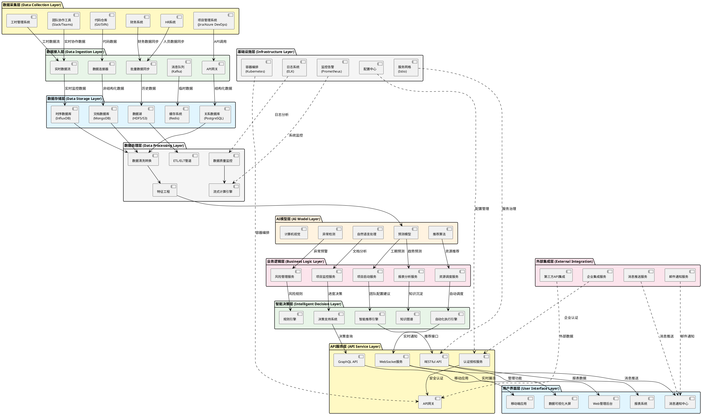
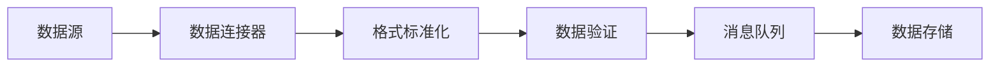

# AI智能项目管理总体技术架构文档

## 文档信息
- **架构名称**: AI智能项目管理平台
- **版本**: v1.0
- **创建日期**: 2025年9月4日
- **架构师**: 技术团队
- **状态**: 架构设计阶段

---

## 1. 架构概述

基于传统vs AI项目管理对比案例的深入分析，本架构设计了一个从数据采集到智能决策的完整技术栈，支持项目启动、执行监控、资源调配、风险管控等核心场景的AI赋能。

### 1.1 设计原则
- **数据驱动**: 从多源数据中提取价值，支持智能决策
- **实时响应**: 支持实时监控和预警，提前发现问题
- **智能协同**: 通过AI算法实现全局优化和智能推荐
- **可扩展性**: 模块化设计，支持功能扩展和技术演进
- **安全可靠**: 完善的安全机制和容错设计

---

## 2. 总体架构图



---

## 3. 分层架构详解

### 3.1 数据采集层 (Data Collection Layer)

**功能职责**: 从各种业务系统中采集原始数据，为上层分析提供数据源。

**核心组件**:
- **项目管理系统**: Jira、Azure DevOps、Confluence等，提供项目任务、进度、需求数据
- **代码仓库**: Git、SVN等，提供代码提交、分支、评审数据
- **团队协作工具**: Slack、Teams、钉钉等，提供沟通协作数据
- **HR系统**: 人员信息、技能档案、组织架构数据
- **财务系统**: 项目预算、成本、资源价格数据
- **工时管理系统**: 工作时长、项目分配、效率数据

**技术实现**:
```yaml
数据采集方式:
  - REST API调用: 标准化API接口获取数据
  - Webhook推送: 实时事件驱动数据更新
  - 数据库直连: 直接读取业务数据库
  - 文件同步: 定期同步文件和日志
  - 消息订阅: 订阅业务系统消息队列
```

### 3.2 数据接入层 (Data Ingestion Layer)

**功能职责**: 统一数据接入标准，处理不同数据源的格式差异，提供数据质量保障。

**核心组件**:
- **API网关**: 统一数据接入入口，提供认证、限流、监控
- **数据连接器**: 适配不同数据源的连接器组件
- **实时数据流**: Kafka Stream处理实时数据流
- **批量数据同步**: 定时批量数据同步任务
- **消息队列**: Kafka集群处理高并发数据流

**数据处理流程**:


### 3.3 数据存储层 (Data Storage Layer)

**功能职责**: 提供多类型数据的持久化存储，支持不同数据特征的存储需求。

**存储设计**:
- **关系数据库 (PostgreSQL)**: 存储结构化业务数据
  - 项目信息、人员档案、组织架构
  - 支持ACID事务，保证数据一致性
  
- **时序数据库 (InfluxDB)**: 存储时间序列监控数据
  - 代码提交频率、任务完成趋势、资源使用率
  - 高效的时间查询和聚合分析
  
- **文档数据库 (MongoDB)**: 存储非结构化文档数据
  - 项目文档、会议记录、需求文档
  - 灵活的schema设计
  
- **缓存系统 (Redis)**: 存储热点数据和会话信息
  - 用户会话、实时计算结果、频繁查询数据
  - 毫秒级响应时间
  
- **数据湖 (HDFS/S3)**: 存储大规模历史数据
  - 历史项目数据、训练数据集、备份数据
  - 支持大数据分析和机器学习

### 3.4 数据处理层 (Data Processing Layer)

**功能职责**: 对原始数据进行清洗、转换、特征提取，为AI模型提供高质量的训练和推理数据。

**核心功能**:
- **数据清洗转换**: 去重、补全、格式标准化、异常值处理
- **特征工程**: 特征提取、特征选择、特征组合、特征缩放
- **数据质量监控**: 数据完整性、准确性、及时性监控
- **ETL/ELT管道**: 批量数据处理管道
- **流式计算引擎**: 实时数据处理引擎(Apache Flink/Spark Streaming)

**处理流程示例**:
```python
# 项目进度特征工程示例
def extract_progress_features(project_data):
    features = {
        'completion_rate': calculate_completion_rate(project_data),
        'velocity_trend': calculate_velocity_trend(project_data),
        'risk_score': calculate_risk_score(project_data),
        'team_efficiency': calculate_team_efficiency(project_data),
        'code_quality_trend': analyze_code_quality(project_data)
    }
    return features
```

### 3.5 AI模型层 (AI Model Layer)

**功能职责**: 提供各种AI算法和模型，支持预测、推荐、分类、聚类等智能能力。

**核心模型**:

#### 3.5.1 预测模型
- **工期预测**: 基于历史项目数据预测项目完成时间
- **预算预测**: 预测项目成本和资源需求
- **风险预测**: 预测项目风险和问题发生概率
- **质量预测**: 预测代码质量和缺陷率

```python
# 工期预测模型示例
class ProjectDurationPredictor:
    def __init__(self):
        self.model = RandomForestRegressor()
        
    def predict_duration(self, project_features):
        # 特征包括：项目复杂度、团队经验、技术栈等
        predicted_duration = self.model.predict(project_features)
        confidence_interval = self.calculate_confidence(project_features)
        return predicted_duration, confidence_interval
```

#### 3.5.2 推荐算法
- **人员推荐**: 基于技能匹配的人员推荐
- **任务分配**: 智能任务分配和负载均衡
- **技术方案**: 基于项目特征的技术方案推荐
- **最佳实践**: 基于历史经验的实践推荐

#### 3.5.3 异常检测
- **行为异常**: 检测团队成员行为模式异常
- **进度异常**: 检测项目进度异常偏差
- **质量异常**: 检测代码质量异常下降
- **协作异常**: 检测团队协作效率异常

#### 3.5.4 自然语言处理
- **需求分析**: 自动分析项目需求文档
- **情感分析**: 分析团队沟通中的情感倾向
- **知识抽取**: 从文档中抽取知识和最佳实践
- **智能问答**: 基于知识库的智能问答

### 3.6 业务逻辑层 (Business Logic Layer)

**功能职责**: 实现具体的业务场景和流程，调用AI模型能力，提供完整的业务服务。

**核心服务**:

#### 3.6.1 项目启动服务
对应**场景一：项目启动阶段**
- 自动分析项目需求，识别关键技术栈
- 基于历史数据预测工期和预算
- 智能团队配置和角色推荐
- 风险识别和预防措施建议

```java
@Service
public class ProjectStartupService {
    
    public ProjectPlan generateProjectPlan(ProjectRequirement requirement) {
        // 1. 需求分析
        TechStack techStack = nlpService.analyzeTechStack(requirement);
        
        // 2. 工期预测
        Duration estimatedDuration = predictionModel.predictDuration(requirement);
        
        // 3. 团队配置
        TeamConfiguration team = recommendEngine.recommendTeam(requirement, techStack);
        
        // 4. 风险评估
        List<Risk> risks = riskModel.identifyRisks(requirement, team);
        
        return new ProjectPlan(estimatedDuration, team, risks);
    }
}
```

#### 3.6.2 项目监控服务
对应**场景二：项目执行阶段**
- 实时监控项目进度和质量指标
- 自动分析Git提交和代码质量
- 团队协作效率分析
- 提前预警潜在问题

#### 3.6.3 资源调度服务
对应**场景三：资源调配阶段**
- 实时分析全公司资源使用情况
- 智能人员调配和负载均衡
- 技能匹配和替代方案推荐
- 跨项目资源优化

#### 3.6.4 风险管理服务
对应**场景四：风险管控阶段**
- 行为模式异常检测
- 离职风险预警
- 自动生成应急预案
- 知识传递计划制定

### 3.7 API服务层 (API Service Layer)

**功能职责**: 提供标准化的API接口，支持不同类型的客户端访问。

**API设计**:
- **RESTful API**: 标准的CRUD操作和业务接口
- **GraphQL API**: 灵活的数据查询接口
- **WebSocket服务**: 实时消息推送和通知
- **认证授权服务**: 统一的身份认证和权限控制
- **API网关**: 统一的API入口，提供限流、监控、版本管理

### 3.8 智能决策层 (Intelligent Decision Layer)

**功能职责**: 基于AI分析结果，提供智能决策支持和自动化执行能力。

**核心组件**:
- **智能推荐引擎**: 综合多种算法的推荐结果
- **决策支持系统**: 提供决策树和决策依据
- **自动化执行引擎**: 自动执行预定义的操作
- **知识图谱**: 构建项目管理知识网络
- **规则引擎**: 基于规则的决策执行

### 3.9 用户界面层 (User Interface Layer)

**功能职责**: 为不同用户角色提供直观的操作界面和数据展示。

**界面设计**:
- **Web管理后台**: 项目经理和管理员使用的全功能界面
- **移动端应用**: 团队成员日常使用的轻量级应用
- **数据可视化大屏**: 高层决策者使用的宏观数据展示
- **报表系统**: 各种维度的分析报表
- **消息通知中心**: 统一的消息和预警通知

### 3.10 外部集成层 (External Integration Layer)

**功能职责**: 与外部系统和服务的集成，扩展系统能力。

**集成服务**:
- **第三方API集成**: 集成外部数据源和服务
- **消息推送服务**: 移动端消息推送
- **邮件通知服务**: 邮件提醒和报告发送
- **企业集成服务**: 与企业现有系统的集成

---

## 4. 核心场景技术实现

### 4.1 场景一：项目启动阶段

**技术流程**:
```
需求文档 → NLP分析 → 特征提取 → 历史项目匹配 → 预测模型 → 智能推荐 → 决策支持
```

**关键技术**:
- 文档相似度计算算法
- 多元回归预测模型
- 协同过滤推荐算法
- 蒙特卡洛风险模拟

### 4.2 场景二：项目执行阶段

**技术流程**:
```
实时数据采集 → 流式处理 → 异常检测 → 趋势分析 → 预警规则 → 自动通知
```

**关键技术**:
- 时间序列异常检测
- 实时流处理(Apache Flink)
- 机器学习预警模型
- 复杂事件处理(CEP)

### 4.3 场景三：资源调配阶段

**技术流程**:
```
资源状态采集 → 技能图谱匹配 → 约束优化求解 → 方案评估 → 智能推荐
```

**关键技术**:
- 图算法和网络分析
- 线性规划和约束满足
- 遗传算法优化
- 多目标决策分析

### 4.4 场景四：风险管控阶段

**技术流程**:
```
行为数据采集 → 模式识别 → 异常评分 → 风险建模 → 预案生成 → 自动执行
```

**关键技术**:
- 行为序列模式挖掘
- 孤立森林异常检测
- 贝叶斯网络风险建模
- 强化学习决策优化

---

## 5. 技术选型说明

### 5.1 后端技术栈
- **开发框架**: Spring Boot + Spring Cloud微服务架构
- **数据库**: PostgreSQL + MongoDB + InfluxDB + Redis
- **消息队列**: Apache Kafka
- **搜索引擎**: Elasticsearch
- **大数据处理**: Apache Spark + Apache Flink
- **机器学习**: Python + TensorFlow/PyTorch + Scikit-learn

### 5.2 前端技术栈
- **Web框架**: React.js + TypeScript
- **状态管理**: Redux Toolkit
- **UI组件**: Ant Design
- **数据可视化**: D3.js + ECharts
- **移动端**: React Native

### 5.3 基础设施
- **容器化**: Docker + Kubernetes
- **服务网格**: Istio
- **API网关**: Kong/Envoy
- **监控系统**: Prometheus + Grafana
- **日志系统**: ELK Stack (Elasticsearch + Logstash + Kibana)
- **配置中心**: Apollo/Nacos

---

## 6. 部署架构

### 6.1 云原生部署
```yaml
环境规划:
  开发环境: 
    - 单节点Kubernetes集群
    - 基础功能验证
  测试环境:
    - 3节点Kubernetes集群  
    - 性能和集成测试
  生产环境:
    - 多节点高可用集群
    - 自动扩缩容配置
```

### 6.2 安全架构
- **网络安全**: VPC隔离、防火墙、WAF
- **应用安全**: OAuth2.0、JWT、RBAC权限控制
- **数据安全**: 数据加密、脱敏、审计
- **运维安全**: 堡垒机、操作审计、安全扫描

---

## 7. 性能指标

### 7.1 系统性能
- **响应时间**: API响应 < 500ms，页面加载 < 2s
- **并发能力**: 支持1000+并发用户
- **数据处理**: 实时处理10万TPS，批量处理100GB/小时
- **可用性**: 99.9%服务可用性

### 7.2 AI模型性能
- **预测准确率**: 工期预测误差 < 15%
- **推荐准确率**: 人员推荐准确率 > 85%
- **异常检测**: 准确率 > 90%，误报率 < 5%
- **响应时间**: 模型推理 < 100ms

---

## 8. 扩展性设计

### 8.1 水平扩展
- 微服务架构支持独立扩展
- 数据库分库分表设计
- 缓存集群和读写分离
- 负载均衡和自动扩缩容

### 8.2 功能扩展
- 插件化AI模型接入
- 可配置的业务规则引擎
- 开放API支持第三方集成
- 多租户架构支持

---

## 9. 总结

本架构设计基于传统vs AI项目管理对比案例的深入分析，构建了一个完整的AI智能项目管理技术架构。通过分层设计、微服务架构、AI能力集成等技术手段，实现了从数据采集到智能决策的完整链路，有效支撑了项目启动、执行监控、资源调配、风险管控等核心场景的AI赋能。

**核心价值**:
- 🚀 **效率提升**: 决策时间从小时级缩短到分钟级
- 🎯 **精度提升**: 从经验判断升级到数据驱动决策  
- 🔮 **预见能力**: 从被动应对升级到主动预防
- 🌐 **协同优化**: 从局部优化升级到全局最优

这个架构为企业数字化转型和智能化升级提供了完整的技术解决方案。
