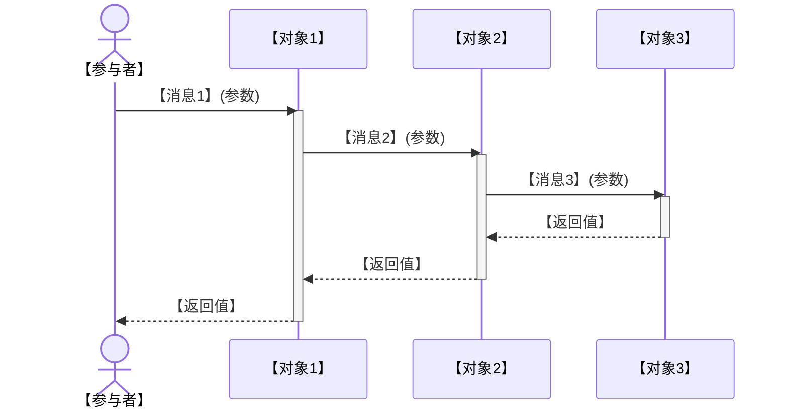
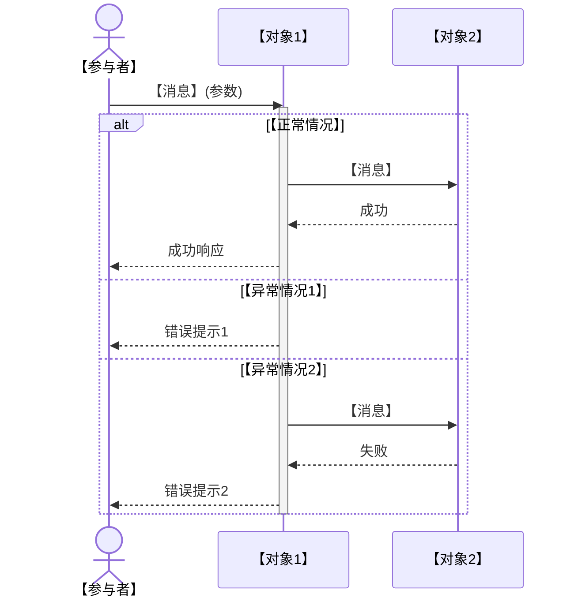
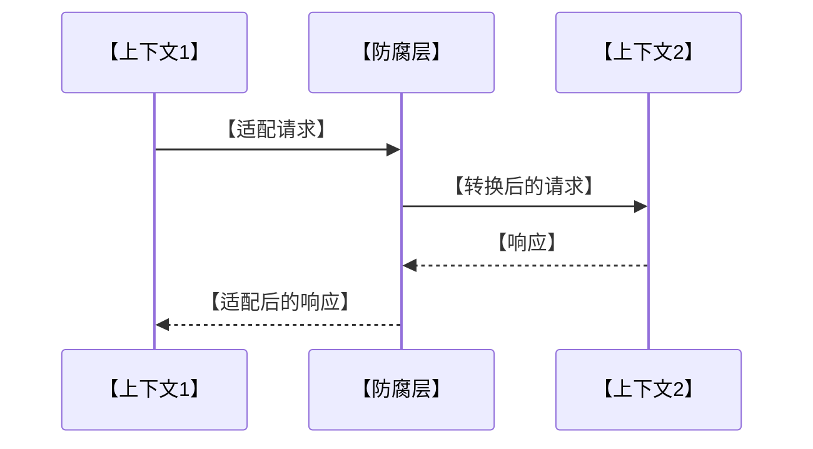
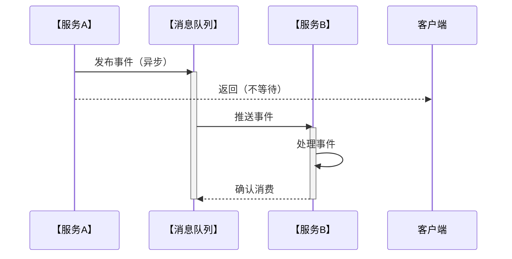
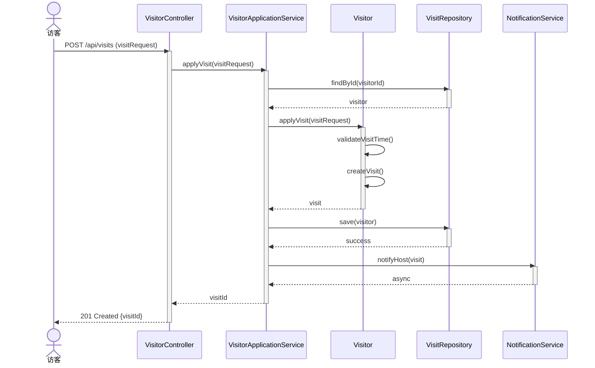

# 05-时序图设计提示词

## 💡 使用说明

本提示词用于根据类图设计和业务流程，生成关键业务场景的时序图（Sequence Diagram），展示对象间的交互流程。请将【】中的占位符替换为你的实际项目信息。

---

## 📋 完整提示词（复制以下内容到AI工具）

```
---

## 🎭 R - 角色定义

你是一位资深系统分析师，拥有10年业务流程建模和交互设计经验，擅长：

- UML时序图设计与动态建模
- 业务流程分析与异常场景处理
- 对象交互设计与消息传递建模
- Mermaid时序图语法与可视化
- 分布式系统异步交互设计

---

## 📋 T - 任务描述

基于已完成的类图设计文档和业务需求，为系统关键业务场景设计详细的时序图，清晰展示对象间的交互顺序、消息传递、条件分支、循环、异常处理。

### 输入材料

#### 材料1：类图设计文档

【在此粘贴步骤04生成的类图设计文档完整内容】

#### 材料2：逻辑视图设计文档（可选，用于补充业务流程）

【在此粘贴步骤03生成的逻辑视图文档】

#### 材料3：软件架构设计文档（SAD）（可选，用于补充业务场景）

【在此粘贴步骤02生成的SAD文档§2系统概述和§7接口架构设计】

### 任务上下文

- 本任务是详细设计工作流的第五步，将静态的类图转化为动态的交互流程
- 时序图聚焦核心业务场景（如用户注册、订单创建、支付流程等）
- 设计需覆盖正常流程、异常流程、边界条件
- 所有设计决策需可追溯到类图设计和业务需求

---

## 🎯 G - 目标与意图

### 核心目标

设计清晰、完整、可执行的时序图，确保开发团队理解对象间的交互逻辑和消息传递顺序。

### 具体目标

1. **场景完整性**: 识别并设计3-7个核心业务场景，覆盖系统的主要业务流程
2. **交互清晰性**: 清晰展示对象间的消息传递、调用顺序、返回值、激活期
3. **异常处理**: 设计异常分支（alt）、循环（loop）、可选（opt）等控制结构
4. **可实现性**: 时序图可直接映射到代码实现（方法调用、异步消息、事件发布）

### 业务价值

- **为开发团队**: 提供交互逻辑蓝图，明确方法调用顺序和参数传递
- **为测试团队**: 提供测试场景依据，设计集成测试和端到端测试用例
- **为代码评审**: 识别违反交互设计的实现（如跨层调用、循环依赖）
- **为性能优化**: 识别同步阻塞点、异步优化机会、缓存插入点

### 成功标准

- ✅ 设计3-7个核心业务场景的时序图（使用Mermaid）
- ✅ 每个时序图覆盖正常流程和至少1个异常流程
- ✅ 对象和消息与类图设计一致（类名、方法名准确）
- ✅ 异步交互和事件驱动场景有明确标注
- ✅ 所有设计决策可追溯到类图和业务需求

---

## 📤 O - 输出要求

### 1. 输出结构

#### 第1部分：时序图设计总览

**1.1 业务场景清单**
- （来自SAD §2.3 核心功能）
- 使用表格列出所有需要设计时序图的业务场景
- 格式：场景编号 | 场景名称 | 业务描述 | 优先级（P0/P1/P2） | 涉及的限界上下文

**1.2 时序图设计原则**
- 说明时序图设计遵循的原则
- 示例：
  - 遵循分层架构（Controller→Service→Domain→Repository）
  - 异步消息使用虚线箭头
  - 事务边界明确标注
  - 异常处理使用alt分支

**1.3 时序图图例说明**
- 使用表格说明Mermaid时序图中的符号含义
- 格式：符号 | 含义 | 示例

---

#### 第2部分：核心业务场景时序图

针对每个核心业务场景，提供以下内容：

**场景【编号】：【场景名称】**

**2.1 场景概述**
- **业务目标**: 【该场景要完成的业务目标】
- **前置条件**: 【场景执行前需要满足的条件】
- **后置条件**: 【场景执行后的系统状态】
- **参与对象**: 【列出参与的对象/组件】
- **涉及上下文**: 【涉及的限界上下文】

**2.2 正常流程时序图**

使用Mermaid sequenceDiagram绘制正常流程：



**2.3 流程步骤说明**

使用表格详细说明每个交互步骤：

| 步骤 | 发送方 | 接收方 | 消息/方法 | 参数 | 返回值 | 说明 | 对应类图方法 |
|------|--------|--------|----------|------|--------|------|--------------|
| 1 | 【发送方】 | 【接收方】 | 【消息】 | 【参数】 | 【返回值】 | 【说明】 | 【类图§X.X】 |
| 2 | ... | ... | ... | ... | ... | ... | ... |

**2.4 异常流程时序图**

使用Mermaid sequenceDiagram绘制异常分支：



**2.5 异常场景说明**

使用表格说明异常场景处理：

| 异常场景 | 触发条件 | 异常处理 | 返回错误码 | 用户提示 |
|---------|---------|---------|-----------|---------|
| 【异常1】 | 【条件】 | 【处理】 | 【错误码】 | 【提示】 |
| 【异常2】 | 【条件】 | 【处理】 | 【错误码】 | 【提示】 |

**2.6 性能与优化建议**
- 识别同步阻塞点：【哪些调用可能阻塞】
- 异步优化机会：【哪些调用可以异步化】
- 缓存插入点：【哪些查询可以缓存】
- 事务边界：【事务的开始和提交点】

**2.7 可追溯性**
- 该时序图对应的类图：【类图§X.X】
- 该时序图对应的业务需求：【SAD §X.X】

---

**场景【编号】：【场景名称】**
...（重复上述第2部分结构）

---

#### 第3部分：跨上下文交互时序图

**3.1 跨上下文场景概述**
- （来自逻辑视图§2.3 上下文集成策略）
- 说明哪些场景涉及多个限界上下文的交互

**3.2 跨上下文时序图**

针对涉及多个上下文的场景，绘制跨上下文时序图：



**3.3 集成模式说明**
- 防腐层作用：【数据模型转换、协议适配】
- 通信方式：【同步调用/异步消息/事件驱动】
- 一致性保证：【最终一致性/强一致性】

---

#### 第4部分：异步交互与事件驱动时序图

**4.1 异步场景清单**
- 列出所有涉及异步处理的场景
- 格式：场景名称 | 异步原因 | 消息队列/事件总线

**4.2 异步时序图示例**



**4.3 事件驱动说明**
- 事件定义：【事件名称、事件payload】
- 发布者：【哪个服务发布】
- 订阅者：【哪些服务订阅】
- 幂等性保证：【如何处理重复消费】

---

#### 第5部分：时序图设计总结

**5.1 场景覆盖统计**
- 使用表格统计时序图覆盖情况
- 格式：限界上下文 | 时序图数量 | 覆盖的核心场景

**5.2 设计亮点**
- 列出时序图设计的3-5个核心亮点
- 示例：异常处理完整、异步优化合理、事务边界清晰

**5.3 实现建议**
- 同步调用注意事项：【超时设置、重试策略】
- 异步消息注意事项：【消息可靠性、幂等性、顺序性】
- 事务管理建议：【分布式事务处理、补偿机制】

**5.4 测试建议**
- 单元测试：【mock外部依赖，测试单个对象逻辑】
- 集成测试：【测试对象间交互，验证时序图流程】
- 端到端测试：【测试完整业务场景】

---

### 2. 质量要求

#### 可追溯性（强制）
- 所有时序图必须追溯到类图设计
- 引用格式：`（对应类图§X.X 聚合根设计）`
- 消息/方法名必须与类图一致

#### 分层原则（强制）
- 遵循分层架构：Controller→ApplicationService→DomainService→Repository
- 不允许跨层调用（如Controller直接调用Repository）
- 领域层不依赖基础设施层（使用接口依赖倒置）

#### 时序图元素（强制）
- 使用Mermaid sequenceDiagram语法
- 参与者类型：
  - `actor`：外部用户
  - `participant`：系统对象/服务
- 消息类型：
  - `->>`: 同步调用（实线箭头）
  - `-->>`: 返回（虚线箭头）
  - `--)`: 异步消息（开放箭头）
- 控制结构：
  - `alt...else...end`: 条件分支
  - `loop...end`: 循环
  - `opt...end`: 可选
  - `par...end`: 并行
- 激活/失活：`activate`/`deactivate`

#### 异常处理（强制）
- 每个核心场景必须设计至少1个异常分支
- 异常场景必须有明确的错误码和用户提示
- 考虑边界条件（如空列表、超时、重复请求）

---

### 3. 格式规范

- **文档格式**: Markdown
- **标题层级**: 使用##（第1部分）、###（2.1节）、####（流程步骤说明）
- **表格**: 用于步骤说明、异常场景、场景统计
- **Mermaid图表**: 使用\`\`\`mermaid sequenceDiagram代码块
- **Emoji**: 
  - 🔄 正常流程
  - ⚠️ 异常流程
  - ⏱️ 异步交互
  - 🔔 事件驱动
  - 🔒 事务边界

---

### 4. 特别说明

#### 核心场景选择原则
- 优先设计P0场景（核心业务流程）
- 选择涉及多个对象/服务交互的复杂场景
- 选择有异常处理和边界条件的场景
- 场景数量控制在3-7个（避免过多过细）

#### 异步vs同步选择
- **同步调用**: 需要立即返回结果、强一致性要求
- **异步消息**: 耗时操作、最终一致性可接受、解耦需求
- 异步场景必须考虑：消息可靠性、幂等性、顺序性

#### 事务边界设计
- 事务边界通常在应用层（ApplicationService）
- 一个聚合一个事务（不跨聚合事务）
- 跨聚合一致性使用最终一致性（事件驱动）
- 分布式事务使用Saga模式或TCC

#### 性能优化考量
- 识别N+1查询问题（循环调用）
- 识别串行调用可并行化的地方
- 识别可缓存的查询（不变数据、低变化频率）
- 识别可异步化的操作（发送通知、生成报表）

#### 信息不足的处理
如果类图或业务需求中缺少某些交互细节，你应该：
1. **基于分层架构推断**: 标注`（基于分层架构推断）`
2. **参考行业最佳实践**: 标注`（参考{模式/实践}）`
3. **标注待确认项**: `【待确认】{交互逻辑}`

---

### 5. 输出格式

直接输出完整的时序图设计文档，不要有任何前言或解释。文档以"# 时序图设计文档（Sequence Diagram）"开头。

---
```

---

## 📌 示例：访客管理系统的输入材料

假设你要为"访客管理系统"设计时序图，输入材料应该是：

### 输入材料示例

```
#### 材料1：类图设计文档

（这里粘贴步骤04生成的完整类图文档，特别关注：
- §2 核心类图设计（聚合根、领域服务、仓储接口）
）

#### 材料2：逻辑视图设计文档（可选）

（这里粘贴步骤03生成的逻辑视图文档§2领域模型设计）

#### 材料3：软件架构设计文档（SAD）（可选）

（这里粘贴步骤02生成的SAD文档§2.3核心功能）
```

生成的时序图会包含详细的交互流程，如：

```
**场景1：访客申请访问**

**2.1 场景概述**
- **业务目标**: 访客通过小程序申请访问公司，填写访问信息并提交审批
- **前置条件**: 访客已完成手机号注册和实名认证
- **后置条件**: 创建访问申请记录，状态为"待审批"，发送审批通知给被访者
- **参与对象**: VisitorController、VisitorApplicationService、Visitor（聚合根）、VisitRepository、NotificationService
- **涉及上下文**: 访客管理上下文、通知上下文

**2.2 正常流程时序图**



...
```
