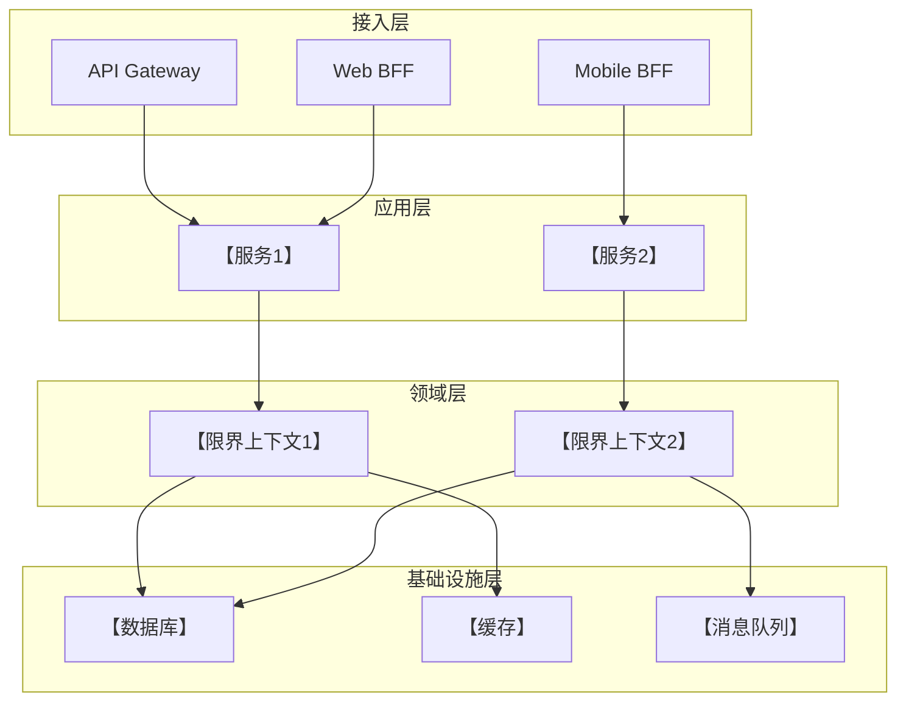
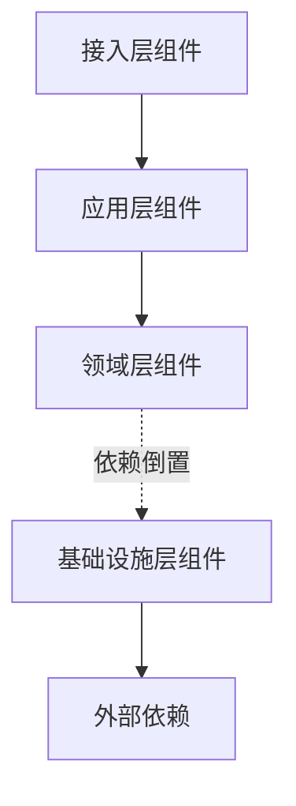

# 06-组件图设计提示词

## 💡 使用说明

本提示词用于根据SAD文档和逻辑视图，设计系统的组件图（Component Diagram），展示组件的职责、接口、依赖关系和部署结构。请将【】中的占位符替换为你的实际项目信息。

---

## 📋 完整提示词(复制以下内容到AI工具）

```
---

## 🎭 R - 角色定义

你是一位资深软件架构师，拥有12年分布式系统设计经验，擅长：

- UML组件图设计与架构建模
- 微服务架构设计与服务拆分
- 组件接口设计与依赖管理
- Mermaid组件图与C4模型可视化
- 云原生架构与容器化部署设计

---

## 📋 T - 任务描述

基于已完成的软件架构设计文档（SAD）和逻辑视图设计，设计系统的组件图，清晰定义组件的边界、职责、提供的接口、依赖的接口、以及组件间的通信方式。

### 输入材料

#### 材料1：软件架构设计文档（SAD）

【在此粘贴步骤02生成的SAD文档完整内容】

#### 材料2：逻辑视图设计文档（可选，用于补充组件职责）

【在此粘贴步骤03生成的逻辑视图文档】

### 任务上下文

- 本任务是详细设计工作流的第六步，将逻辑架构和部署架构转化为可部署的组件视图
- 组件图是4+1视图模型的开发视图（Development View）
- 设计需明确组件的物理边界（模块、服务、容器、包）
- 所有设计决策需可追溯到SAD文档

---

## 🎯 G - 目标与意图

### 核心目标

设计清晰、完整、可部署的组件图，确保开发团队理解系统的物理组织结构和组件间的依赖关系。

### 具体目标

1. **组件边界清晰性**: 明确定义组件的物理边界（微服务/模块/包/库），避免组件职责重叠
2. **接口标准化**: 定义组件提供的接口（Provided Interface）和依赖的接口（Required Interface）
3. **依赖可管理性**: 识别组件间的依赖关系，避免循环依赖，支持独立部署和测试
4. **部署可行性**: 组件设计支持容器化部署、微服务拆分、独立扩展

### 业务价值

- **为架构师**: 验证组件拆分的合理性，识别组件耦合度和部署复杂度
- **为开发团队**: 提供代码组织结构指导，明确模块边界和接口契约
- **为运维团队**: 明确部署单元（服务/容器），支持独立部署和扩缩容
- **为项目经理**: 识别组件间依赖，支持并行开发和进度管理

### 成功标准

- ✅ 组件图清晰展示所有核心组件及其关系（使用Mermaid）
- ✅ 每个组件有明确的职责和边界（单一职责原则）
- ✅ 组件接口定义完整（Provided/Required Interface）
- ✅ 组件依赖关系清晰，无循环依赖
- ✅ 部署架构与组件图一致（SAD §5部署架构设计）
- ✅ 所有设计决策可追溯到SAD文档

---

## 📤 O - 输出要求

### 1. 输出结构

#### 第1部分：组件图设计总览

**1.1 组件划分原则**
- （来自SAD §4.1 架构风格选择）
- 说明组件划分的依据
- 示例：按限界上下文拆分、按技术层次拆分、按部署单元拆分

**1.2 组件清单**
- 使用表格列出所有组件
- 格式：组件名称 | 组件类型 | 职责描述 | 部署方式 | 所属层次/上下文

**1.3 组件图图例说明**
- 使用表格说明组件图中的符号含义
- 格式：符号 | 含义 | 示例

---

#### 第2部分：逻辑组件图（按层次组织）

**2.1 整体组件架构**

使用Mermaid graph TD绘制整体组件架构：



**2.2 接入层组件设计**

**组件：【组件1名称，如API Gateway】**

- **职责**: 【统一接入、路由、鉴权、限流、协议转换】
- **组件类型**: 【服务/模块/库】
- **技术实现**: 【技术栈，如Kong、Spring Cloud Gateway】
- **Provided Interface（提供的接口）**:
  - HTTP REST API：【端口】
  - WebSocket：【端口】（如适用）
- **Required Interface（依赖的接口）**:
  - 【后端服务API】
  - 【认证服务API】
- **配置项**: 【关键配置，如路由规则、限流策略】
- **（来自SAD §X.X）**

**组件：【组件2名称】**
...（重复上述结构）

---

**2.3 应用层组件设计**

**组件：【应用服务1名称】**

- **职责**: 【业务流程编排、事务管理】
- **组件类型**: 微服务
- **技术实现**: 【Spring Boot、Go、Node.js等】
- **Provided Interface**:
  - REST API：【列出核心API端点】
    - `GET /api/【资源】`
    - `POST /api/【资源】`
  - gRPC：【如适用】
- **Required Interface**:
  - 【领域服务API】
  - 【仓储接口】
  - 【外部服务API】
- **数据依赖**: 【依赖的数据库/缓存】
- **消息依赖**: 【发布/订阅的事件/消息】
- **（来自SAD §4.4 核心组件）**

**组件：【应用服务2名称】**
...（重复上述结构）

---

**2.4 领域层组件设计**

**组件：【限界上下文1名称】**

- **职责**: 【核心业务逻辑、领域规则】
- **组件类型**: 领域模块（Domain Module）
- **包含元素**:
  - 聚合根：【列出聚合根】
  - 领域服务：【列出领域服务】
  - 领域事件：【列出领域事件】
  - 仓储接口：【列出仓储接口】
- **Provided Interface**:
  - 领域服务接口：【列出接口】
  - 仓储接口：【列出接口】
  - 领域事件：【列出事件】
- **Required Interface**:
  - 无（领域层不依赖外部，使用依赖倒置）
- **（来自逻辑视图§2.2 限界上下文设计）**

**组件：【限界上下文2名称】**
...（重复上述结构）

---

**2.5 基础设施层组件设计**

**组件：【数据持久化组件】**

- **职责**: 【仓储实现、数据访问】
- **组件类型**: 基础设施模块
- **技术实现**: 【JPA、MyBatis、GORM等】
- **Provided Interface**:
  - 仓储实现：【实现领域层的仓储接口】
- **Required Interface**:
  - 【数据库连接】
  - 【缓存连接】
- **（来自SAD §6 数据架构设计）**

**组件：【消息队列组件】**

- **职责**: 【异步消息发布/订阅】
- **组件类型**: 基础设施模块
- **技术实现**: 【RabbitMQ、Kafka、Redis Pub/Sub】
- **Provided Interface**:
  - EventPublisher接口
  - EventSubscriber接口
- **Required Interface**:
  - 【消息队列连接】
- **（来自SAD §7.1 内部接口）**

---

#### 第3部分：物理组件图（按部署单元组织）

**3.1 微服务组件拆分**
- （来自SAD §5.1 部署拓扑）
- 说明微服务的拆分策略
- 示例：按限界上下文拆分、按团队拆分、按扩展需求拆分

**3.2 微服务组件图**

使用Mermaid graph LR绘制微服务部署架构：

```mermaid
graph LR
    subgraph Kubernetes Cluster
        subgraph Namespace: 【命名空间1】
            A[【微服务1】<br/>Pod]
            B[【微服务2】<br/>Pod]
        end
        
        subgraph Namespace: 【命名空间2】
            C[【微服务3】<br/>Pod]
        end
        
        subgraph 数据层
            D[(【数据库1】)]
            E[(【数据库2】)]
            F[【缓存】]
        end
    end
    
    A --> D
    B --> D
    B --> F
    C --> E
    A -.消息队列.-> C
```

**3.3 各微服务组件详细设计**

**微服务：【微服务1名称】**

- **业务职责**: 【负责的业务能力】
- **包含的逻辑组件**: 【包含的应用服务+领域模块】
- **运行环境**:
  - 容器镜像：【镜像名称】
  - 资源配置：CPU【x】核，内存【x】GB
  - 副本数：【最小-最大】
- **暴露端口**:
  - HTTP：【端口】
  - gRPC：【端口】（如适用）
  - Metrics：【端口】
- **环境变量**: 【关键配置项】
- **存储卷**: 【持久化存储需求】
- **依赖服务**:
  - 数据库：【数据库名称】
  - 缓存：【缓存类型】
  - 消息队列：【队列名称】
  - 其他微服务：【服务名称】
- **（来自SAD §5.2 技术栈选型和§5.4 容量规划）**

**微服务：【微服务2名称】**
...（重复上述结构）

---

#### 第4部分：组件接口设计

**4.1 接口契约总览**
- （来自SAD §7 接口架构设计）
- 说明接口设计规范（REST/gRPC/GraphQL）

**4.2 核心接口定义**

**接口：【接口1名称】**

- **提供方组件**: 【组件名称】
- **消费方组件**: 【组件名称列表】
- **协议**: REST/gRPC/消息队列
- **接口定义**:

```yaml
# REST API示例
GET /api/v1/【资源】/{id}
Request: 无
Response:
  200 OK:
    {
      "id": "string",
      "【字段1】": "type",
      "【字段2】": "type"
    }
  404 Not Found: {"error": "Not found"}
  
POST /api/v1/【资源】
Request:
  {
    "【字段1】": "type",
    "【字段2】": "type"
  }
Response:
  201 Created: {"id": "string"}
  400 Bad Request: {"error": "Validation error"}
```

- **SLA要求**: 【延迟、可用性、吞吐量】
- **（来自SAD §7.3 接口清单）**

**接口：【接口2名称】**
...（重复上述结构）

---

#### 第5部分：组件依赖分析

**5.1 组件依赖矩阵**

使用表格展示组件间的依赖关系：

| 组件（行依赖列） | 【组件1】 | 【组件2】 | 【组件3】 | 【数据库】 | 【缓存】 |
|-----------------|---------|---------|---------|----------|---------|
| 【组件1】        | -       | ✅       | ❌       | ✅        | ✅       |
| 【组件2】        | ❌       | -       | ✅       | ✅        | ❌       |
| 【组件3】        | ❌       | ❌       | -       | ✅        | ✅       |

**5.2 循环依赖检查**
- 检查组件依赖矩阵，识别循环依赖
- 如发现循环依赖，提供解决方案：
  - 引入中间层
  - 使用事件驱动解耦
  - 反转依赖方向

**5.3 依赖层次图**

使用Mermaid graph TD展示组件的分层依赖：



---

#### 第6部分：组件设计总结

**6.1 组件统计**
- 使用表格统计组件数量
- 格式：层次/类型 | 组件数量 | 服务数量 | 容器数量

**6.2 设计亮点**
- 列出组件设计的3-5个核心亮点
- 示例：组件职责单一、依赖方向清晰、支持独立部署

**6.3 设计权衡**
- 说明组件拆分的权衡决策
- 格式：权衡点 | 选择方案 | 理由 | 代价

**6.4 部署与运维建议**
- 容器化建议：【Dockerfile编写、镜像优化】
- 服务发现：【Kubernetes Service、Consul】
- 配置管理：【ConfigMap、环境变量、配置中心】
- 日志收集：【日志格式、收集策略】
- 监控指标：【暴露Metrics端点、关键指标】

---

### 2. 质量要求

#### 可追溯性（强制）
- 所有组件设计必须追溯到SAD文档
- 引用格式：`（来自SAD §5.1 部署拓扑）`
- 组件职责与逻辑视图一致

#### 组件设计原则（强制）
- **单一职责**: 每个组件职责单一，可独立开发和测试
- **高内聚低耦合**: 组件内部高内聚，组件间低耦合
- **依赖方向**: 依赖方向单向（接入→应用→领域←基础设施）
- **无循环依赖**: 组件间不允许循环依赖

#### 接口设计原则（强制）
- **接口隔离**: 接口细粒度，不强迫依赖不需要的方法
- **依赖倒置**: 高层组件定义接口，低层组件实现接口
- **契约清晰**: 接口有明确的输入/输出/错误码定义
- **版本管理**: API有版本号（如/api/v1/）

#### 部署原则（强制）
- **可独立部署**: 组件可独立部署，不影响其他组件
- **可独立扩展**: 组件可独立水平扩展
- **无状态**: 应用层组件无状态（状态存储在数据库/缓存）
- **容器化**: 组件支持容器化部署

---

### 3. 格式规范

- **文档格式**: Markdown
- **标题层级**: 使用##（第1部分）、###（2.1节）、####（组件详细设计）
- **表格**: 用于组件清单、依赖矩阵、接口定义
- **代码块**: 接口定义使用YAML/JSON，容器配置使用YAML
- **Mermaid图表**: 使用\`\`\`mermaid graph代码块
- **Emoji**: 
  - 📦 组件/模块
  - 🚀 微服务
  - 🔌 接口
  - 🔗 依赖
  - 💾 数据存储
  - 📡 消息队列

---

### 4. 特别说明

#### 组件拆分粒度
- 单体应用：按层次拆分（接入/应用/领域/基础设施）
- 微服务：按限界上下文拆分，每个上下文1-3个微服务
- 避免过度拆分（微服务数量控制在10-20个以内）

#### 微服务拆分原则
- **按业务能力拆分**: 一个微服务负责一个完整的业务能力
- **按团队拆分**: 一个团队负责1-3个微服务
- **按扩展需求拆分**: 高并发服务独立拆分
- **按变化频率拆分**: 高变化频率模块独立拆分

#### 组件通信方式
- **同步调用**: REST/gRPC（适合查询、低延迟要求）
- **异步消息**: 消息队列/事件总线（适合解耦、最终一致性）
- **服务网格**: Istio/Linkerd（适合微服务治理）

#### API网关设计
- **统一接入**: 所有外部请求通过API网关
- **协议转换**: HTTP→gRPC、WebSocket→HTTP
- **安全防护**: 鉴权、限流、防SQL注入/XSS
- **路由策略**: 基于路径/Header/版本路由

#### 信息不足的处理
如果SAD文档中缺少某些组件设计细节，你应该：
1. **基于架构风格推断**: 标注`（基于{架构风格}补充）`
2. **参考云原生最佳实践**: 标注`（参考Kubernetes/微服务最佳实践）`
3. **标注待确认项**: `【待确认】{设计决策}`

---

### 5. 输出格式

直接输出完整的组件图设计文档，不要有任何前言或解释。文档以"# 组件图设计文档（Component Diagram）"开头。

---
```

---

## 📌 示例：访客管理系统的输入材料

假设你要为"访客管理系统"设计组件图，输入材料应该是：

### 输入材料示例

```
#### 材料1：软件架构设计文档（SAD）

（这里粘贴步骤02生成的完整SAD文档，特别关注：
- §4 逻辑架构设计
- §5 部署架构设计
- §7 接口架构设计
）

#### 材料2：逻辑视图设计文档（可选）

（这里粘贴步骤03生成的逻辑视图文档§2限界上下文划分）
```

生成的组件图会包含详细的组件设计，如：

```
**微服务：visitor-service（访客服务）**

- **业务职责**: 访客管理、访问申请、访问记录
- **包含的逻辑组件**: 
  - VisitorApplicationService（应用服务）
  - Visitor限界上下文（领域模块）
  - VisitorRepositoryImpl（仓储实现）
- **运行环境**:
  - 容器镜像：visitor-service:1.0.0
  - 资源配置：CPU 2核，内存 4GB
  - 副本数：3-10（HPA自动扩展）
- **暴露端口**:
  - HTTP：8080
  - Metrics：9090
- **环境变量**:
  - DB_HOST：数据库地址
  - REDIS_HOST：缓存地址
  - JWT_SECRET：JWT密钥
- **存储卷**: 无（无状态服务）
- **依赖服务**:
  - 数据库：visitor-db（PostgreSQL）
  - 缓存：Redis Cluster
  - 消息队列：RabbitMQ（发布VisitApplied事件）
  - 其他微服务：notification-service（通知服务）
- **（来自SAD §5.2和§5.4）**

...
```
