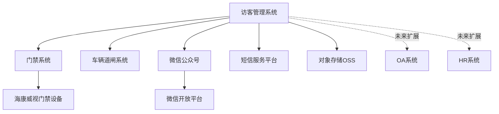
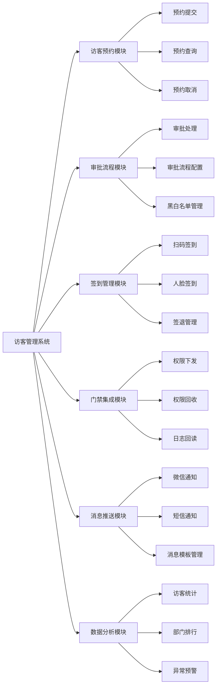

# 数据标注园区访客管理系统需求规格说明书（SRS）

## 文档信息

| 项目 | 内容 |
|------|------|
| 文档名称 | 数据标注园区访客管理系统需求规格说明书 |
| 文档版本 | V1.0 |
| 创建日期 | 2025-11-27 |
| 文档状态 | 待评审 |
| 编写人 | AI辅助生成 |
| 审核人 | 待定 |
| 批准人 | 待定 |

---

## 1. 引言

### 1.1 编写目的

本文档是《数据标注园区访客管理系统》的软件需求规格说明书（Software Requirements Specification, SRS），旨在：

1. **明确系统需求**：详细描述系统的功能需求、非功能需求、接口需求和数据需求
2. **指导开发实施**：为开发团队提供清晰的开发依据，减少理解偏差和返工
3. **支持测试验证**：为测试团队提供测试用例设计依据，确保需求可验证
4. **规范变更管理**：建立需求基线，作为需求变更评审和影响分析的依据
5. **促进沟通协作**：为项目相关方（产品、开发、测试、运维）提供统一的沟通语言

**预期读者**：

- **开发团队**：后端工程师、前端工程师、测试工程师
- **产品团队**：产品经理、需求分析师
- **项目管理**：项目经理、技术负责人
- **运维团队**：系统运维工程师、安全工程师

---

### 1.2 项目背景

**项目名称**：数据标注园区访客管理系统

**项目定位**：数据标注园区智能化管理系统的核心子系统之一

**项目目标**：

1. **数字化转型**：将传统纸质登记转变为全流程线上化管理，提升访客管理效率90%以上
2. **安全管控**：通过自动化门禁权限下发和实时监控，降低安全风险，减少人为错误率至5%以下
3. **数据驱动**：通过访客数据分析，为园区运营决策提供数据支持
4. **用户体验**：为访客提供便捷的预约、签到体验，为员工提供高效的审批和管理工具

**业务价值**：

| 价值维度 | 具体价值 | 量化指标 |
|----------|----------|----------|
| 效率提升 | 访客预约线上化，减少前台登记时间 | 访客办理时间从5分钟降至30秒 |
| 安全加强 | 自动化门禁管理，杜绝手动录入错误 | 门禁权限错误率从20%降至<5% |
| 成本降低 | 减少前台人工，释放人力资源 | 减少1名专职前台，年节省成本8-10万 |
| 数据资产 | 访客数据电子化，支持查询分析 | 访客数据可追溯率100%，查询效率提升100倍 |
| 合规保障 | 满足等保要求，保护访客隐私数据 | 满足《个人信息保护法》合规要求 |

**项目范围**：

本系统专注于**访客管理**功能模块，不包含园区的其他智能化管理功能（如智能监控、招商运营、人才管理等）。

---

### 1.3 术语定义

| 术语 | 英文缩写 | 定义 |
|------|----------|------|
| 软件需求规格说明书 | SRS | Software Requirements Specification，描述软件系统功能和性能的文档 |
| 功能需求 | FR | Functional Requirement，描述系统"做什么"的需求 |
| 非功能需求 | NFR | Non-Functional Requirement，描述系统质量属性的需求（性能、安全、可用性等） |
| 访客 | Visitor | 来园区访问的外部人员 |
| 被访人 | Host | 接待访客的园区内部员工 |
| 预约单 | Appointment | 访客提交的来访申请记录 |
| 审批人 | Approver | 对访客预约进行审批的人员（被访人、主管、安保等） |
| 门禁系统 | Access Control | 控制门禁开关、管理访客权限的硬件系统 |
| 道闸系统 | Barrier Gate | 控制车辆进出的硬件系统 |
| 黑名单 | Blacklist | 禁止来访的人员名单 |
| 白名单 | Whitelist | 免审批或简化流程的VIP访客名单 |
| MVP | Minimum Viable Product | 最小可行产品，第一期交付的核心功能版本 |
| 微信公众号 | WeChat Official Account | 访客端的主要交互渠道 |
| OAuth2.0 | - | 开放授权标准，用于微信登录认证 |
| JWT | JSON Web Token | 基于JSON的用户身份令牌 |
| RBAC | Role-Based Access Control | 基于角色的访问控制 |
| SLA | Service Level Agreement | 服务等级协议，定义系统性能指标 |
| P95延迟 | P95 Latency | 95%的请求响应时间不超过该值 |
| RTO | Recovery Time Objective | 恢复时间目标，系统故障后的最大停机时间 |
| RPO | Recovery Point Objective | 恢复点目标，数据丢失的最大时间范围 |

---

### 1.4 参考资料

1. **原始需求文档**：
   - 《数据标注园区智能化管理系统-访客管理模块原始需求》
   - 《访客管理系统需求澄清问题清单》V1.0

2. **相关标准和规范**：
   - IEEE Std 830-1998: IEEE Recommended Practice for Software Requirements Specifications
   - ISO/IEC 25010:2011: Systems and software engineering - Quality model
   - 《个人信息保护法》（中华人民共和国）
   - 《网络安全法》（中华人民共和国）
   - 等保2.0标准（信息安全技术 网络安全等级保护基本要求）

3. **技术参考**：
   - 微信公众平台开发文档
   - 海康威视门禁系统API文档
   - Spring Boot官方文档
   - RESTful API设计规范

4. **参考的类似系统**：
   - 企业微信访客系统
   - 钉钉智能前台
   - 阿里云访客管理系统

---

### 1.5 文档概述

本文档按照IEEE 830标准组织，共分为8个主要章节和2个附录：

- **第1章 引言**：说明文档目的、项目背景、术语定义
- **第2章 项目概述**：描述产品功能、用户角色、运行环境、约束条件
- **第3章 功能需求**：详细描述系统的功能需求，按模块组织
- **第4章 非功能需求**：描述性能、安全、可用性等质量属性需求
- **第5章 接口需求**：描述用户界面、硬件接口、软件接口
- **第6章 数据需求**：描述数据模型、数据字典、数据安全
- **第7章 质量属性**：补充说明可靠性、可扩展性等质量属性
- **第8章 其他需求**：描述运维、文档、培训等需求
- **附录A 需求追溯矩阵**：建立需求与来源的追溯关系
- **附录B 术语表**：完整的术语定义

**阅读建议**：

- 产品经理/需求分析师：重点阅读第2、3章
- 开发工程师：重点阅读第3、4、5、6章
- 测试工程师：重点阅读第3、4章及附录A
- 项目经理：重点阅读第2、7、8章

---

## 2. 项目概述

### 2.1 产品描述

**系统定位**：

数据标注园区访客管理系统是一个B2B2C的SaaS系统，面向数据标注园区提供访客全流程线上化管理服务。

**核心能力**：

1. **访客自助预约**：访客通过微信公众号自助提交来访申请，填写个人信息和来访目的
2. **多级审批流程**：支持被访人→主管/安保的多级审批，自动化流转
3. **智能门禁联动**：审批通过后自动下发门禁权限，访客刷卡/人脸识别进入
4. **电子签到管理**：访客通过二维码/人脸识别签到签退，全程无纸化
5. **消息实时推送**：通过微信模板消息推送审批通知、签到提醒
6. **数据可视化分析**：提供访客量统计、部门排行、异常预警等数据报表

**与其他系统的关系**：

**系统边界**：

- ✅ **包含**：访客预约、审批、签到、门禁集成、消息推送、数据统计
- ❌ **不包含**：访客问卷调查、会议室预定、访客Wi-Fi管理、访客打印服务

---

### 2.2 产品功能

**功能模块概览**：

系统共划分为6大功能模块，功能架构如下：

**功能优先级说明**：

| 模块 | 优先级 | MVP范围 | 说明 |
|------|--------|---------|------|
| 访客预约模块 | P0 | ✅ | 核心功能，第一期必须实现 |
| 审批流程模块 | P0 | ✅ | 核心功能，第一期必须实现 |
| 签到管理模块 | P0 | ✅ | 核心功能，第一期必须实现 |
| 门禁集成模块 | P0 | ✅ | 核心功能，第一期必须实现 |
| 消息推送模块 | P0 | ✅ | 核心功能，第一期必须实现 |
| 数据分析模块 | P1 | ⚠️ | 基础统计在MVP范围，高级分析延后 |

---

### 2.3 用户特征

**用户角色清单**：

| 角色 | 英文名称 | 用户数量 | 核心职责 | 主要场景 | 权限级别 |
|------|----------|----------|----------|----------|----------|
| **访客** | Visitor | 200-300人/日 | 提交预约、签到签退 | 预约提交、扫码签到 | 🟢 只能操作自己的预约 |
| **被访人(员工)** | Host/Employee | 约100人 | 审批访客预约、接待访客 | 预约审批(一级)、接收签到通知 | 🟡 只能审批自己的访客 |
| **安保人员** | Security | 5-10人 | 终审预约、现场核验、异常处理 | 预约审批(二级)、黑名单管理、现场核验 | 🟠 可查询所有访客记录 |
| **管理员** | Admin | 2-3人 | 系统配置、数据统计、权限管理 | 系统配置、报表查询、用户管理 | 🔴 全部权限 |
| **门禁系统** | Access Control System | - | 权限管理、开门控制、日志记录 | 接收权限下发、验证访客身份 | ⚙️ 外部系统集成 |

**用户画像**：

1. **访客（Visitor）**
   - 年龄：20-50岁
   - 技能：熟悉微信操作，但可能不熟悉系统流程
   - 设备：智能手机（iOS/Android）
   - 网络：4G/5G移动网络
   - 特点：一次性用户，希望操作简单、快速

2. **被访人（Employee）**
   - 年龄：25-45岁
   - 技能：熟练使用办公软件和移动应用
   - 设备：智能手机 + PC
   - 网络：企业Wi-Fi + 移动网络
   - 特点：工作繁忙，希望审批高效、通知及时

3. **安保人员（Security）**
   - 年龄：30-55岁
   - 技能：熟悉安保流程，但IT技能一般
   - 设备：PC + 平板 + 智能手机
   - 网络：企业内网
   - 特点：24小时值班，需要快速核验、异常告警

4. **管理员（Admin）**
   - 年龄：28-40岁
   - 技能：IT技能较强，熟悉系统运维
   - 设备：PC为主
   - 网络：企业内网
   - 特点：需要数据分析能力、系统配置灵活性

---

### 2.4 运行环境

#### 2.4.1 硬件环境

**服务器端**：

| 组件 | 配置要求 | 数量 | 说明 |
|------|----------|------|------|
| 应用服务器 | 4核8G内存，100G SSD | 2台 | 主备部署，支持负载均衡 |
| 数据库服务器 | 4核16G内存，200G SSD | 1台 | MySQL 8.0，支持主从复制 |
| 缓存服务器 | 2核4G内存，50G SSD | 1台 | Redis 7.x |
| 对象存储 | - | - | 阿里云OSS，100G起步 |

**客户端**：

| 终端类型 | 最低配置 | 说明 |
|----------|----------|------|
| 访客手机 | iOS 12+/Android 8+ | 微信公众号H5页面 |
| 员工手机 | iOS 12+/Android 8+ | 审批和通知接收 |
| 管理后台PC | Chrome 90+/Edge 90+ | 1920×1080分辨率 |
| 安保平板 | iPad Air 2+/Android平板 | 前台核验使用 |

**外部设备**：

| 设备 | 品牌型号 | 数量 | 接口协议 |
|------|----------|------|----------|
| 门禁控制器 | 海康威视 DS-K2600系列 | 10台 | HTTP REST API |
| 人脸识别终端 | 海康威视 DS-K1T671系列 | 5台 | 集成到门禁系统 |
| 车辆道闸 | 大华DHI-ASG2000系列 | 2套 | HTTP REST API（可选） |

---

#### 2.4.2 软件环境

**后端技术栈**：

| 组件 | 技术选型 | 版本要求 | 说明 |
|------|----------|----------|------|
| 编程语言 | Java | JDK 17+ | 官方LTS版本 |
| 应用框架 | Spring Boot | 3.1+ | 企业级框架 |
| 数据库 | MySQL | 8.0+ | 关系型数据库 |
| 缓存 | Redis | 7.0+ | 内存数据库 |
| 消息队列 | RabbitMQ | 3.11+ | 异步消息处理 |
| ORM框架 | MyBatis Plus | 3.5+ | 数据访问层 |
| 安全框架 | Spring Security | 6.0+ | 认证授权 |

**前端技术栈**：

| 组件 | 技术选型 | 版本要求 | 说明 |
|------|----------|----------|------|
| 访客端 | Vue 3 + Vant UI | 3.3+ / 4.0+ | 微信H5页面 |
| 管理后台 | React + Ant Design | 18+ / 5.0+ | Web管理界面 |
| 移动端框架 | 微信公众号H5 | - | 访客主要入口 |

**第三方服务**：

| 服务 | 提供商 | 用途 | 费用模式 |
|------|--------|------|----------|
| 微信公众号 | 腾讯 | 访客端入口、消息推送 | 认证费300元/年 |
| 短信服务 | 阿里云 | 审批通知、告警短信 | 按量计费，0.045元/条 |
| 对象存储 | 阿里云OSS | 访客照片存储 | 按量计费，0.12元/GB/月 |
| CDN加速 | 阿里云CDN | 静态资源加速 | 按量计费（可选） |

---

#### 2.4.3 网络环境

| 网络要求 | 具体描述 |
|----------|----------|
| 访客端网络 | 4G/5G移动网络，或园区访客Wi-Fi |
| 员工端网络 | 企业内网 + 移动网络（支持移动办公） |
| 服务器网络 | 部署在阿里云VPC，公网IP+内网IP |
| 门禁系统网络 | 企业内网，与应用服务器网络互通 |
| 带宽要求 | 上行10Mbps，下行100Mbps（高峰期） |
| 域名要求 | 需备案域名，支持HTTPS（Let's Encrypt免费证书） |

---

### 2.5 约束条件

#### 2.5.1 技术约束

| 约束类型 | 具体约束 | 影响 |
|----------|----------|------|
| 技术栈限制 | 后端使用Java Spring Boot，前端使用Vue/React | 团队技术栈统一要求 |
| 门禁系统 | 必须兼容海康威视门禁系统HTTP API | 现有硬件设备限制 |
| 部署环境 | 部署在阿里云，使用Docker容器化 | 基础设施标准化要求 |
| 浏览器兼容 | 管理后台支持Chrome 90+、Edge 90+，不支持IE | 现代浏览器策略 |
| 微信生态 | 访客端必须通过微信公众号访问 | 用户使用习惯和推广成本考虑 |
| 数据库 | 使用MySQL 8.0，不使用NoSQL | 团队技术栈限制 |

---

#### 2.5.2 合规约束

| 法律法规 | 合规要求 | 实施措施 |
|----------|----------|----------|
| 《个人信息保护法》 | 访客个人信息（身份证、照片、手机号）必须保护 | ✅ 身份证号AES-256加密存储 ✅ 提供隐私政策，获取用户授权 ✅ 数据导出脱敏处理 |
| 《网络安全法》 | 数据备份、访问控制、审计日志 | ✅ 每日自动备份，保留7天 ✅ 基于角色的权限控制 ✅ 操作日志记录 |
| 等保2.0（目标） | 建议达到等保二级，为三级预留扩展 | ⚠️ MVP阶段部分满足 ⚠️ V2.0考虑等保三级认证 |

---

#### 2.5.3 预算和时间约束

| 约束类型 | 具体限制 | 说明 |
|----------|----------|------|
| 项目预算 | 总预算30万元（人力+硬件+服务） | 人力成本约25万，基础设施约5万 |
| 开发周期 | MVP版本4个月交付 | 需求→设计→开发→测试→上线 |
| 团队规模 | 2后端+1前端+1测试+0.5产品 | 小团队敏捷开发 |
| 硬性时间节点 | 无强制deadline | 建议分期交付，快速迭代 |

---

#### 2.5.4 运维约束

| 约束类型 | 具体要求 | 说明 |
|----------|----------|------|
| 系统可用性 | 目标99.5%（允许每月停机3.6小时） | 非7×24高可用系统 |
| 备份策略 | 每日凌晨2:00自动备份，保留7天 | 数据安全保障 |
| 监控要求 | 核心业务指标监控，P0故障15分钟内响应 | 运维保障要求 |
| 升级窗口 | 每周日凌晨2:00-4:00可进行系统升级 | 业务影响最小化 |

---

## 3. 功能需求

### 需求编号规则说明

- **功能需求编号**：`FR-{模块简称}-{序号}`
- **模块简称对照表**：
  - 预约 = Appointment
  - 审批 = Approval
  - 签到 = CheckIn
  - 门禁 = Access
  - 消息 = Message
  - 分析 = Analytics

---

### 3.1 访客预约模块

#### FR-预约-001 访客预约信息提交

- **需求描述**：
  - 系统应当允许访客通过微信公众号H5页面提交来访预约申请
  - 访客应当填写以下信息：
    - **必填字段**：
      - 访客姓名（2-20个字符，中文或英文）
      - 手机号码（11位数字，需格式验证）
      - 身份证号（18位，需格式验证和实名核验）
      - 访客照片（头像照片，JPG/PNG格式，≤2MB）
      - 来访目的（选择预设选项：商务洽谈/面试/参观/送货/其他，其他需填写说明）
      - 访问日期（可选择今日起7天内的日期）
      - 访问时段（开始时间-结束时间，工作日8:00-18:00）
      - 被访人（搜索员工姓名或手机号）
    - **选填字段**：
      - 车牌号（粤B12345格式，用于车辆道闸）
      - 随行人员（最多3人，填写姓名和手机号）
      - 访问备注（最多200字）
  - 系统应当在用户首次使用时引导完成微信OAuth2.0授权，获取用户OpenID
  - 系统应当在提交前进行数据验证，验证失败时给出明确的错误提示

- **前置条件**：
  - 访客已关注微信公众号
  - 访客已完成微信授权登录
  - 被访人已在系统中注册

- **后置条件**：
  - 系统生成预约单，状态为"待审批"
  - 系统自动分配预约单号（格式：YY202511270001）
  - 系统发送审批通知给被访人
  - 访客收到预约提交成功的确认消息

- **业务规则**：
  - 同一访客同一天只能提交1次预约（避免重复提交）
  - 访问时长不得超过8小时
  - 访问时段必须在工作日8:00-18:00范围内
  - 被访人如果当天已有5个访客预约，需提示"被访人预约已满"

- **优先级**：P0

- **验收标准**：
  - ✅ 访客可成功提交预约申请，所有必填字段验证通过
  - ✅ 身份证号格式验证准确率100%，实名核验成功率≥95%
  - ✅ 照片上传成功率≥98%，上传时间≤3秒
  - ✅ 被访人搜索支持模糊匹配，响应时间≤1秒
  - ✅ 提交成功后，访客和被访人均收到通知（微信模板消息）

- **来源**：原始需求 > 核心功能 > 1.全流程管理 > 来访申请线上提交

---

#### FR-预约-002 访客预约记录查询

- **需求描述**：
  - 系统应当允许访客通过微信公众号查询自己的预约记录
  - 查询功能应当支持：
    - 按状态筛选：全部/待审批/已通过/已拒绝/已完成/已取消
    - 按时间筛选：最近7天/最近30天/自定义日期范围
    - 展示信息：预约单号、被访人、访问时间、审批状态、拒绝原因（如有）
  - 系统应当支持点击预约记录查看详情，包括：
    - 预约基本信息（访客姓名、手机、来访目的等）
    - 审批进度（被访人审批状态、安保审批状态）
    - 审批意见（如有）
    - 门禁权限状态（已下发/未下发/下发失败）
    - 签到状态（未签到/已签到/已签退）
  - 系统应当在预约详情页提供操作按钮：
    - "取消预约"（仅待审批状态可用）
    - "查看二维码"（仅已通过且未过期的预约可用）
    - "联系被访人"（跳转微信聊天或拨打电话）

- **前置条件**：
  - 访客已登录系统

- **后置条件**：
  - 访客查看到预约记录列表和详情

- **优先级**：P0

- **验收标准**：
  - ✅ 查询列表支持分页，每页显示10条，加载时间≤2秒
  - ✅ 状态和时间筛选功能正常，筛选结果准确率100%
  - ✅ 预约详情页展示所有必要信息，数据准确率100%
  - ✅ 取消预约功能正常，取消后状态实时更新

- **来源**：原始需求 > 核心功能 > 3.人员管理 > 来访记录追溯查询

---

#### FR-预约-003 访客预约取消

- **需求描述**：
  - 系统应当允许访客取消"待审批"状态的预约
  - 取消操作应当执行以下逻辑：
    - 弹出确认对话框："确定要取消预约吗？取消后需重新提交。"
    - 访客点击"确定"后，预约状态变更为"已取消"
    - 系统发送取消通知给被访人（微信模板消息）
    - 系统记录取消时间和取消原因（可选填）
  - 系统应当限制取消次数：同一访客同一天取消次数不得超过3次，超过后当天禁止提交新预约

- **前置条件**：
  - 预约状态为"待审批"
  - 访客已登录系统

- **后置条件**：
  - 预约状态变更为"已取消"
  - 被访人收到取消通知
  - 取消记录写入操作日志

- **业务规则**：
  - 只有"待审批"状态的预约可以取消
  - "已通过"状态的预约不允许访客自行取消，需联系被访人或安保
  - 取消次数限制：同一访客同一天最多取消3次

- **优先级**：P1

- **验收标准**：
  - ✅ 取消操作成功率≥99%，响应时间≤1秒
  - ✅ 取消通知推送成功率≥95%
  - ✅ 取消次数限制正确生效，超过限制后给出明确提示
  - ✅ 操作日志记录完整，包含取消时间、取消人、取消原因

- **来源**：需求澄清 > Q2访客预约的时间规则和约束

---

#### FR-预约-004 团队访客批量预约

- **需求描述**：
  - 系统应当支持被访人为团队访客批量创建预约（适用于多人同时来访的场景）
  - 批量预约功能应当提供以下方式：
    - **方式1：表单批量填写**
      - 被访人在管理后台点击"创建团队预约"
      - 填写团队基本信息：团队名称、来访目的、访问时间
      - 批量添加访客信息（最多支持20人）：姓名、手机号、身份证号
      - 一次性提交，系统自动生成20条预约记录，统一预约单号前缀（如YY20251127T001-01~20）
    - **方式2：Excel导入**（V2.0扩展功能）
      - 下载Excel模板
      - 填写访客信息
      - 上传Excel，系统自动解析并批量创建预约
  - 系统应当对团队预约执行特殊处理：
    - 审批流程：团队整体审批，一人拒绝不影响其他成员
    - 门禁权限：统一下发，权限有效期一致
    - 通知推送：合并通知，避免多次推送骚扰

- **前置条件**：
  - 用户为被访人或安保角色
  - 已登录管理后台

- **后置条件**：
  - 系统批量生成N条预约记录（N≤20）
  - 每条预约记录关联到同一团队预约ID
  - 被访人收到团队预约待审批通知

- **业务规则**：
  - 单次团队预约最多20人
  - 团队预约的审批流程简化：被访人审批通过后直接进入安保审批，不逐人审批
  - 团队成员中某人审批不通过，仅该成员预约失败，不影响其他成员

- **优先级**：P1

- **验收标准**：
  - ✅ 批量创建预约成功率≥98%，单次操作时间≤10秒
  - ✅ Excel导入解析准确率≥95%，错误行给出明确提示
  - ✅ 团队预约关联关系正确，可通过团队ID查询所有成员
  - ✅ 通知推送合并发送，一次团队预约最多发送1条通知

- **来源**：需求澄清 > Q4团队访客和批量预约的处理

---

### 3.2 审批流程模块

#### FR-审批-001 多级审批流程配置

- **需求描述**：
  - 系统应当支持配置访客预约的审批流程，默认为二级审批：
    - **一级审批**：被访人审批
    - **二级审批**：安保审批
  - 系统应当允许管理员在管理后台配置审批流程（V2.0扩展）：
    - 审批层级数量（1-3级）
    - 每级审批人角色（被访人/部门主管/安保/管理员）
    - 审批超时时间（默认24小时）
    - 超时处理策略（自动通过/自动拒绝/升级到上级）
  - 系统应当在审批流程配置页面提供预览功能，展示审批流程图

- **前置条件**：
  - 用户为管理员角色
  - 已登录管理后台

- **后置条件**：
  - 审批流程配置保存到数据库
  - 新提交的预约按照新配置执行审批流程

- **业务规则**：
  - MVP版本固定为二级审批（被访人→安保），配置功能在V2.0实现
  - 审批流程变更不影响已提交的预约，仅对新预约生效
  - 被访人审批为必经环节，不可跳过

- **优先级**：P1（MVP版本为P2）

- **验收标准**：
  - ✅ 审批流程配置界面清晰易用，配置保存成功率100%
  - ✅ 审批流程预览图准确展示流程节点和流转关系
  - ✅ 配置变更后，新预约按新流程执行，准确率100%

- **来源**：需求澄清 > Q1来访申请的审批层级和审批规则

---

#### FR-审批-002 被访人审批处理

- **需求描述**：
  - 系统应当允许被访人通过微信公众号或管理后台处理访客预约审批
  - 审批功能应当提供以下信息展示：
    - 访客基本信息：姓名、手机号、身份证号（脱敏显示：110101********1234）、照片
    - 来访信息：来访目的、访问时间、车牌号（如有）、随行人员（如有）
    - 黑名单提示：如访客在黑名单中，显示红色警告标识
    - 历史来访记录：展示该访客过去3个月的来访次数
  - 审批操作应当提供两个选项：
    - **通过**：点击"通过"按钮，可选填审批意见（如"欢迎来访"）
    - **拒绝**：点击"拒绝"按钮，必填拒绝原因（至少10个字）
  - 系统应当在审批操作完成后执行以下逻辑：
    - **审批通过**：
      - 预约流转到下一审批环节（安保审批）
      - 系统发送通知给安保人员
      - 访客收到"被访人已通过审批"的通知
    - **审批拒绝**：
      - 预约状态变更为"已拒绝"
      - 访客收到拒绝通知，包含拒绝原因
      - 审批流程终止，不再流转

- **前置条件**：
  - 用户为预约的被访人
  - 预约状态为"待审批"且当前审批环节为"被访人审批"

- **后置条件**：
  - 预约状态更新（流转到下一环节或变更为已拒绝）
  - 相关人员收到审批通知
  - 审批记录写入数据库

- **业务规则**：
  - 被访人只能审批自己的访客预约，不能审批他人的
  - 审批超时时间为24小时，超时后自动通过（避免访客长时间等待）
  - 黑名单访客的预约，被访人仍可审批通过，但安保必审

- **优先级**：P0

- **验收标准**：
  - ✅ 审批页面信息展示完整准确，黑名单警告正确显示
  - ✅ 审批操作成功率≥99%，响应时间≤2秒
  - ✅ 审批通知推送成功率≥95%，推送延迟≤30秒
  - ✅ 审批记录完整，包含审批人、审批时间、审批结果、审批意见
  - ✅ 审批超时自动通过机制正常，准确率100%

- **来源**：原始需求 > 核心功能 > 1.全流程管理 > 审批流程自动化

---

#### FR-审批-003 安保审批处理

- **需求描述**：
  - 系统应当允许安保人员通过管理后台处理访客预约的二级审批
  - 安保审批功能应当提供以下信息展示：
    - 访客基本信息（同被访人审批）
    - 被访人审批意见
    - 黑名单校验结果：
      - 如访客在黑名单中，显示红色警告："该访客在黑名单中，原因：{黑名单原因}"
      - 提示安保谨慎审批
    - 门禁系统状态：显示门禁系统是否在线
  - 审批操作应当提供三个选项（MVP版本仅提供通过/拒绝）：
    - **通过**：点击"通过"按钮，预约状态变更为"已通过"
    - **拒绝**：点击"拒绝"按钮，必填拒绝原因
    - **转人工核验**（V2.0扩展）：标记为需要现场核验
  - 系统应当在审批通过后自动触发门禁权限下发：
    - 调用门禁集成模块，异步下发访客权限
    - 访客收到"审批通过"通知，包含访问二维码
    - 被访人收到"访客预约已通过"通知

- **前置条件**：
  - 用户为安保角色
  - 预约已通过被访人审批，当前审批环节为"安保审批"

- **后置条件**：
  - 预约状态变更为"已通过"或"已拒绝"
  - 审批通过时触发门禁权限下发
  - 访客和被访人收到审批结果通知

- **业务规则**：
  - 安保为最终审批环节，审批通过后预约状态变为"已通过"
  - 安保审批权限高于被访人，可以拒绝被访人已通过的预约
  - 黑名单访客的预约，安保可以酌情通过（如VIP访客、特殊情况）

- **优先级**：P0

- **验收标准**：
  - ✅ 审批页面黑名单警告正确显示，警告级别明确
  - ✅ 审批通过后，门禁权限下发任务正确提交到队列
  - ✅ 审批通知推送成功率≥95%，访客二维码正确生成
  - ✅ 审批记录完整，包含安保审批人、审批时间、审批结果

- **来源**：原始需求 > 核心功能 > 1.全流程管理 > 审批流程自动化

---

#### FR-审批-004 黑名单管理

- **需求描述**：
  - 系统应当允许安保人员和管理员管理访客黑名单
  - 黑名单管理功能应当提供以下操作：
    - **添加黑名单**：
      - 输入访客姓名、手机号或身份证号
      - 选择黑名单类型：临时拉黑/永久拉黑
      - 填写拉黑原因（必填，至少20个字）
      - 设置有效期（临时拉黑需设置，如拉黑7天/30天/90天）
    - **移除黑名单**：
      - 选择黑名单记录，点击"移除"
      - 填写移除原因（必填）
      - 确认后从黑名单中移除
    - **查询黑名单**：
      - 支持按姓名/手机号/身份证号搜索
      - 展示黑名单列表：姓名、手机号、拉黑原因、拉黑时间、有效期、操作人
  - 系统应当在访客提交预约时自动校验黑名单：
    - 如访客在黑名单中（临时且未过期，或永久），预约直接拒绝
    - 访客收到拒绝通知："您在访客黑名单中，无法提交预约，如有疑问请联系安保部门"
    - 拒绝记录写入审计日志

- **前置条件**：
  - 用户为安保或管理员角色

- **后置条件**：
  - 黑名单记录保存到数据库
  - 黑名单校验规则实时生效

- **业务规则**：
  - 黑名单匹配规则：手机号精确匹配 或 身份证号精确匹配
  - 临时黑名单到期后自动失效，不需要手动移除
  - 永久黑名单需手动移除才能解除
  - 黑名单访客的预约在审批环节会显示警告，但安保可酌情通过

- **优先级**：P1

- **验收标准**：
  - ✅ 黑名单添加/移除操作成功率100%，响应时间≤1秒
  - ✅ 黑名单校验准确率100%，黑名单访客预约自动拒绝
  - ✅ 临时黑名单到期自动失效，准确率100%
  - ✅ 黑名单操作记录完整，包含操作人、操作时间、操作原因
  - ✅ 黑名单导出功能正常（Excel格式，包含所有字段）

- **来源**：需求澄清 > Q5访客黑名单和白名单机制

---

#### FR-审批-005 审批超时处理

- **需求描述**：
  - 系统应当监控审批超时，并自动处理超时预约
  - 超时监控规则：
    - 被访人审批：提交预约后24小时内未审批，视为超时
    - 安保审批：被访人审批通过后24小时内未审批，视为超时
  - 超时处理策略（MVP版本采用"自动通过"）：
    - 系统每小时执行一次超时检查任务
    - 发现超时预约后，自动将审批状态变更为"已通过"
    - 发送超时通知给审批人："您的审批已超时，系统已自动通过"
    - 发送通知给访客："您的预约审批已自动通过"
    - 记录超时处理日志
  - 系统应当在管理后台提供审批超时报表：
    - 统计各审批人的超时次数
    - 展示超时趋势图（按天统计）
    - 支持导出Excel

- **前置条件**：
  - 预约状态为"待审批"
  - 审批提交时间超过24小时

- **后置条件**：
  - 超时预约自动通过
  - 相关人员收到超时通知
  - 超时记录写入日志

- **业务规则**：
  - 超时时间阈值：24小时（可在管理后台配置，V2.0扩展）
  - 超时处理策略：自动通过（MVP版本固定，V2.0可配置为自动拒绝或升级）
  - 周末和节假日不计入超时时间（V2.0扩展）

- **优先级**：P1

- **验收标准**：
  - ✅ 超时检查任务每小时准时执行，检查准确率100%
  - ✅ 超时预约自动通过成功率≥99%
  - ✅ 超时通知推送成功率≥95%
  - ✅ 超时报表数据准确，统计维度完整

- **来源**：需求澄清 > Q1来访申请的审批层级和审批规则

---

### 3.3 签到管理模块

#### FR-签到-001 访客二维码签到

- **需求描述**：
  - 系统应当在访客预约审批通过后，自动生成访客专属二维码
  - 二维码应当包含以下信息（加密后编码）：
    - 预约单号
    - 访客姓名
    - 访问日期
    - 有效期（访问日期当天有效，过期自动失效）
  - 系统应当允许访客通过以下方式查看二维码：
    - 微信公众号 > 我的预约 > 预约详情 > 查看二维码
    - 微信模板消息中的链接直接跳转
  - 系统应当在前台/门禁点提供扫码设备（安保人员操作或访客自助扫描）：
    - 扫描二维码后，系统验证二维码有效性
    - 验证通过后，记录签到时间和签到地点
    - 访客签到成功，系统推送签到通知给被访人
    - 前台显示访客照片和基本信息，供安保核验
  - 系统应当在签到时执行以下验证：
    - 二维码是否有效（未过期、未使用）
    - 预约状态是否为"已通过"
    - 当前时间是否在访问时段内（提前30分钟或延后30分钟允许签到）
    - 访客是否已签到（避免重复签到）

- **前置条件**：
  - 预约状态为"已通过"
  - 当前日期为访问日期
  - 当前时间在访问时段±30分钟范围内

- **后置条件**：
  - 签到记录保存到数据库
  - 预约状态变更为"已签到"
  - 被访人收到签到通知
  - 二维码标记为已使用

- **业务规则**：
  - 二维码有效期为访问日期当天0:00-23:59
  - 每个二维码只能使用一次（签到后失效）
  - 签到时间窗口：访问开始时间前30分钟至访问结束时间后30分钟
  - 访客如遗失二维码，可在微信公众号重新查看

- **优先级**：P0

- **验收标准**：
  - ✅ 二维码生成成功率100%，生成时间≤1秒
  - ✅ 二维码扫描识别率≥95%，扫描响应时间≤2秒
  - ✅ 签到验证准确率100%，过期/无效二维码正确拦截
  - ✅ 签到通知推送成功率≥95%，推送延迟≤30秒
  - ✅ 签到记录完整，包含签到时间、签到地点、签到方式

- **来源**：原始需求 > 核心功能 > 1.全流程管理 > 现场确认与签到

---

#### FR-签到-002 访客人脸识别签到

- **需求描述**：
  - 系统应当支持访客通过人脸识别终端进行签到（需硬件支持）
  - 人脸识别签到流程：
    - 访客站在人脸识别终端前
    - 终端自动抓取人脸照片
    - 系统调用人脸比对接口，与预约时上传的照片进行1:1比对
    - 比对通过（相似度≥85%）且预约有效，签到成功
    - 终端显示"签到成功，欢迎{访客姓名}"
    - 门禁自动开门（如集成门禁系统）
  - 系统应当在人脸识别失败时提供降级方案：
    - 比对失败次数≤3次：提示"人脸识别失败，请重试"
    - 比对失败次数>3次：提示"人脸识别失败，请联系安保人工核验"
    - 安保人员可通过管理后台手动签到
  - 系统应当记录人脸识别日志：
    - 识别时间、识别结果、相似度得分、失败原因

- **前置条件**：
  - 预约状态为"已通过"
  - 访客已上传照片
  - 人脸识别终端在线

- **后置条件**：
  - 签到记录保存到数据库
  - 预约状态变更为"已签到"
  - 被访人收到签到通知

- **业务规则**：
  - 人脸相似度阈值：≥85%视为匹配成功
  - 人脸识别超时时间：5秒，超时则识别失败
  - 连续识别失败3次后，锁定10分钟，需安保介入

- **优先级**：P1（MVP版本为P2，V2.0实现）

- **验收标准**：
  - ✅ 人脸识别准确率≥90%（光线良好、正脸条件下）
  - ✅ 人脸识别响应时间≤3秒（P95）
  - ✅ 识别失败降级方案正常，手动签到功能可用
  - ✅ 识别日志记录完整，包含相似度得分和失败原因

- **来源**：需求澄清 > Q3访客签到签退的具体方式和验证规则

---

#### FR-签到-003 访客签退管理

- **需求描述**：
  - 系统应当允许访客通过以下方式签退：
    - **方式1：主动签退**
      - 访客离场前，通过微信公众号点击"签退"按钮
      - 系统记录签退时间
      - 计算实际访问时长（签退时间 - 签到时间）
    - **方式2：自动签退**（兜底机制）
      - 访客如未主动签退，系统在访问结束时间后1小时自动签退
      - 系统发送提醒通知给访客："您已自动签退"
  - 系统应当在签退后执行以下操作：
    - 预约状态变更为"已完成"
    - 发送签退通知给被访人
    - 触发门禁权限回收（异步执行）
    - 记录访问时长到访客记录

- **前置条件**：
  - 预约状态为"已签到"

- **后置条件**：
  - 签退记录保存到数据库
  - 预约状态变更为"已完成"
  - 门禁权限回收任务提交到队列

- **业务规则**：
  - 签退时间必须晚于签到时间
  - 访客可在访问结束时间后24小时内主动签退
  - 超过24小时未签退，系统强制自动签退
  - 签退后门禁权限在30分钟后自动回收（给访客离场缓冲时间）

- **优先级**：P0

- **验收标准**：
  - ✅ 主动签退成功率≥99%，响应时间≤1秒
  - ✅ 自动签退准时执行，准确率100%
  - ✅ 签退通知推送成功率≥95%
  - ✅ 门禁权限回收成功率≥95%，回收延迟≤5分钟
  - ✅ 访问时长计算准确，误差≤1分钟

- **来源**：需求澄清 > Q3访客签到签退的具体方式和验证规则

---

#### FR-签到-004 访客逾期告警

- **需求描述**：
  - 系统应当监控已签到但未签退的访客，识别逾期访客
  - 逾期判定规则：
    - 当前时间 > 访问结束时间 + 30分钟，视为逾期
  - 系统应当执行以下告警操作：
    - 每15分钟检查一次逾期访客（定时任务）
    - 发现逾期访客后，发送告警短信给安保人员
    - 告警内容："访客{姓名}（手机号：{手机号}）已逾期{X}分钟未签退，请核实"
    - 发送提醒通知给访客："您的访问已超时，请尽快签退"
    - 发送提醒通知给被访人："您的访客{姓名}已超时，请提醒签退"
  - 系统应当在管理后台提供逾期访客列表：
    - 展示逾期访客信息：姓名、手机号、被访人、逾期时长
    - 支持安保人员手动签退
    - 支持一键批量告警

- **前置条件**：
  - 预约状态为"已签到"
  - 当前时间超过访问结束时间30分钟

- **后置条件**：
  - 告警短信发送给安保
  - 提醒通知发送给访客和被访人
  - 告警记录写入日志

- **业务规则**：
  - 逾期阈值：访问结束时间 + 30分钟
  - 告警频率：首次告警后，每1小时再次告警，最多告警3次
  - 逾期超过4小时，系统强制签退并记录异常

- **优先级**：P1

- **验收标准**：
  - ✅ 逾期检查任务每15分钟准时执行
  - ✅ 逾期判定准确率100%
  - ✅ 告警短信发送成功率≥98%
  - ✅ 逾期访客列表数据准确，实时更新
  - ✅ 手动签退功能正常，操作成功率100%

- **来源**：需求澄清 > Q2访客预约的时间规则和约束

---

### 3.4 门禁集成模块

#### FR-门禁-001 访客门禁权限下发

- **需求描述**：
  - 系统应当在访客预约审批通过后，自动触发门禁权限下发
  - 门禁权限下发流程：
    - 审批通过后，系统将权限下发任务提交到消息队列（RabbitMQ）
    - 后台异步消费任务，调用海康威视门禁API下发权限
    - 下发参数：
      - 访客标识（employeeNo）：使用预约单号
      - 访客姓名
      - 卡号（cardNo）：使用访客手机号后10位
      - 权限有效期：访问日期 8:00 至 20:00
      - 授权门点：主入口门禁 + 电梯门禁（配置化）
    - 下发成功后，更新权限记录表状态为"已下发"
    - 下发失败后，重试3次（间隔5秒），仍失败则标记为"下发失败"
  - 系统应当记录权限下发日志：
    - 下发时间、下发结果、门禁系统返回值、重试次数

- **前置条件**：
  - 预约状态为"已通过"
  - 门禁系统在线

- **后置条件**：
  - 权限下发任务提交到队列
  - 权限记录表状态更新
  - 下发日志记录完整

- **业务规则**：
  - 权限下发采用异步模式，不阻塞审批流程
  - 权限有效期默认为访问日期当天8:00-20:00，可在管理后台配置
  - 授权门点默认为主入口+电梯，可根据被访人部门动态配置
  - 下发失败后，系统发送告警给安保，提供手动同步按钮

- **优先级**：P0

- **验收标准**：
  - ✅ 权限下发成功率≥95%（门禁系统在线情况下）
  - ✅ 下发时效：审批通过后5分钟内完成下发（P95）
  - ✅ 下发失败重试机制正常，重试间隔准确
  - ✅ 下发日志记录完整，包含所有关键参数
  - ✅ 手动同步功能可用，操作成功率100%

- **来源**：原始需求 > 核心功能 > 2.系统集成 > 访客权限自动同步 + 门禁系统联动

---

#### FR-门禁-002 访客门禁权限回收

- **需求描述**：
  - 系统应当在以下场景下自动回收访客门禁权限：
    - **场景1：访客签退后**
      - 访客点击签退后30分钟，系统回收权限
    - **场景2：访问时间到期**
      - 访问结束时间后1小时，系统自动回收权限
    - **场景3：预约取消或拒绝**
      - 预约被拒绝或取消后，立即回收权限（如已下发）
  - 权限回收流程：
    - 系统将回收任务提交到消息队列
    - 后台异步消费任务，调用门禁API删除访客权限
    - 删除参数：访客标识（employeeNo）
    - 回收成功后，更新权限记录表状态为"已回收"
    - 回收失败后，重试3次，仍失败则标记为"回收失败"并告警
  - 系统应当提供手动回收功能：
    - 安保人员可在管理后台手动回收指定访客的权限
    - 支持批量回收（选择多个访客一键回收）

- **前置条件**：
  - 权限已下发到门禁系统
  - 触发回收条件（签退/到期/取消）

- **后置条件**：
  - 权限回收任务提交到队列
  - 权限记录表状态更新
  - 回收日志记录完整

- **业务规则**：
  - 签退后30分钟回收（给访客离场缓冲时间）
  - 回收失败后发送告警给安保，需人工介入
  - 权限回收具有幂等性（重复调用不会报错）

- **优先级**：P0

- **验收标准**：
  - ✅ 权限回收成功率≥95%
  - ✅ 回收时效：触发条件后30分钟内完成回收
  - ✅ 回收失败告警及时，告警内容明确
  - ✅ 手动回收功能可用，操作成功率100%
  - ✅ 批量回收功能正常，支持最多50个访客同时回收

- **来源**：需求澄清 > Q12访客权限自动同步的时效性和异常处理

---

#### FR-门禁-003 门禁刷卡日志回读

- **需求描述**：
  - 系统应当定期从门禁系统回读访客刷卡日志
  - 日志回读流程：
    - 系统每10分钟执行一次日志回读任务
    - 调用门禁API查询最近10分钟的刷卡记录
    - 过滤出访客相关的刷卡记录（根据employeeNo匹配）
    - 解析刷卡记录：刷卡时间、门点编号、刷卡结果（成功/失败）
    - 保存到access_log表
  - 系统应当关联刷卡记录与预约记录：
    - 根据employeeNo关联到预约单
    - 在预约详情页展示访客的刷卡轨迹
    - 在数据分析模块统计访客活动热力图（V2.0扩展）
  - 系统应当识别异常刷卡行为：
    - 未授权门点刷卡（访客刷非授权门点）
    - 异常时段刷卡（深夜刷卡）
    - 高频刷卡（1分钟内刷卡超过5次）
    - 异常行为发送告警短信给安保

- **前置条件**：
  - 门禁系统在线
  - 门禁API支持日志查询

- **后置条件**：
  - 刷卡日志保存到数据库
  - 异常行为告警发送给安保

- **业务规则**：
  - 日志回读频率：每10分钟（可配置）
  - 日志保留周期：180天
  - 异常行为判定规则可在管理后台配置

- **优先级**：P1

- **验收标准**：
  - ✅ 日志回读任务准时执行，间隔误差≤10秒
  - ✅ 日志解析准确率100%
  - ✅ 日志与预约关联准确率≥95%
  - ✅ 异常行为识别准确率≥90%
  - ✅ 异常告警发送成功率≥98%

- **来源**：需求澄清 > Q10门禁系统的品牌型号和接口协议

---

#### FR-门禁-004 门禁系统健康检查

- **需求描述**：
  - 系统应当定期检查门禁系统的连通性和健康状态
  - 健康检查机制：
    - 系统每5分钟执行一次健康检查
    - 调用门禁API的健康检查接口（如/ISAPI/System/deviceInfo）
    - 记录检查结果：在线/离线、响应时间
    - 如连续3次检查失败，判定为门禁系统离线
  - 系统应当在门禁离线时执行以下操作：
    - 发送告警短信给安保和管理员
    - 在管理后台显示红色告警标识："门禁系统离线"
    - 暂停权限下发任务（任务保留在队列中）
    - 提供降级方案提示："门禁系统离线，请安保手动录入权限"
  - 系统应当在门禁恢复在线后：
    - 发送恢复通知给安保
    - 自动恢复权限下发任务
    - 补发离线期间积压的权限下发请求

- **前置条件**：
  - 门禁系统已配置API地址

- **后置条件**：
  - 健康检查记录保存到数据库
  - 离线告警发送给安保
  - 降级方案激活

- **业务规则**：
  - 健康检查频率：每5分钟
  - 离线判定：连续3次失败（15分钟）
  - 恢复判定：1次检查成功

- **优先级**：P1

- **验收标准**：
  - ✅ 健康检查任务准时执行，间隔误差≤10秒
  - ✅ 离线判定准确率100%
  - ✅ 离线告警发送成功率≥98%，告警延迟≤1分钟
  - ✅ 降级方案正常激活，队列任务暂停不丢失
  - ✅ 恢复后补发任务成功率≥95%

- **来源**：需求澄清 > Q10门禁系统的品牌型号和接口协议

---

### 3.5 消息推送模块

#### FR-消息-001 微信模板消息推送

- **需求描述**：
  - 系统应当通过微信公众号模板消息推送关键通知
  - 消息推送场景清单：
    - **场景1：预约提交成功**
      - 接收人：访客
      - 模板内容：预约单号、被访人、访问时间、审批状态
    - **场景2：待审批通知**
      - 接收人：被访人/安保
      - 模板内容：访客姓名、来访目的、访问时间、点击审批
    - **场景3：审批结果通知**
      - 接收人：访客
      - 模板内容：审批结果、访问时间、查看二维码（通过时）/拒绝原因（拒绝时）
    - **场景4：签到成功通知**
      - 接收人：被访人
      - 模板内容：访客姓名、签到时间、签到地点
    - **场景5：逾期提醒**
      - 接收人：访客、被访人
      - 模板内容：逾期时长、请尽快签退
  - 系统应当实现消息推送流程：
    - 业务事件触发（如审批通过）
    - 系统调用MessageService.sendAsync()异步发送
    - 查询消息模板配置，获取模板ID和参数映射
    - 根据用户手机号查询OpenID
    - 调用微信API发送模板消息
    - 记录发送日志（成功/失败）
  - 系统应当处理推送失败情况：
    - 用户未关注公众号：记录失败原因，不重试
    - 网络超时：重试1次，仍失败则记录日志
    - 微信限流：延迟5分钟后重试

- **前置条件**：
  - 微信公众号已认证
  - 模板消息权限已开通
  - 用户已关注公众号（OpenID存在）

- **后置条件**：
  - 消息发送到微信服务器
  - 发送日志记录完整

- **业务规则**：
  - 消息推送采用异步模式，不阻塞主业务流程
  - 单用户每天最多接收10条模板消息（避免骚扰）
  - 模板消息跳转URL必须是https协议

- **优先级**：P0

- **验收标准**：
  - ✅ 消息推送成功率≥95%（用户已关注情况下）
  - ✅ 推送延迟≤30秒（P95）
  - ✅ 消息内容准确，参数替换正确率100%
  - ✅ 推送失败原因记录清晰，便于排查
  - ✅ 限流保护正常，单用户每天最多10条

- **来源**：原始需求 > 核心功能 > 4.消息推送 > 公众号消息通知

---

#### FR-消息-002 短信通知推送

- **需求描述**：
  - 系统应当通过阿里云短信服务发送关键告警和兜底通知
  - 短信推送场景清单：
    - **场景1：审批通过通知**（微信失败时兜底）
      - 接收人：访客
      - 短信内容："您的访客预约已通过审批，访问时间：{时间}，请准时到访。【园区访客】"
    - **场景2：逾期告警**
      - 接收人：安保
      - 短信内容："访客{姓名}（{手机号}）已逾期{X}分钟未签退，请核实。【园区访客】"
    - **场景3：门禁权限下发失败告警**
      - 接收人：安保
      - 短信内容："访客{姓名}的门禁权限下发失败，请手动处理。【园区访客】"
  - 系统应当实现短信发送流程：
    - 调用AliyunSmsChannel.send()
    - 根据场景获取短信模板CODE
    - 调用阿里云短信API发送
    - 记录发送日志和费用统计
  - 系统应当实现短信限流保护：
    - 单手机号每天最多接收5条短信
    - 全局短信发送频率限制：100条/分钟
    - 超过限制后，告警日志记录，不发送

- **前置条件**：
  - 阿里云短信服务已开通
  - 短信模板已审核通过
  - 短信签名已配置

- **后置条件**：
  - 短信发送到运营商
  - 发送日志和费用统计记录完整

- **业务规则**：
  - 短信仅用于高优先级通知和告警
  - 短信费用：0.045元/条
  - 短信签名：【园区访客】

- **优先级**：P1

- **验收标准**：
  - ✅ 短信发送成功率≥98%
  - ✅ 短信到达延迟≤10秒
  - ✅ 短信内容准确，参数替换正确率100%
  - ✅ 限流保护正常，超限情况正确拦截
  - ✅ 费用统计准确，误差≤1%

- **来源**：原始需求 > 核心功能 > 4.消息推送 > 短信提醒

---

#### FR-消息-003 消息模板管理

- **需求描述**：
  - 系统应当允许管理员在管理后台配置消息模板
  - 消息模板管理功能：
    - **新增模板**：
      - 填写模板编码（如APPROVAL_NOTIFY）
      - 填写模板名称
      - 选择推送渠道（微信/短信）
      - 填写微信模板ID或短信模板CODE
      - 配置参数映射（JSON格式）
      - 设置优先级（HIGH/MEDIUM/LOW）
      - 设置是否启用
    - **编辑模板**：修改模板配置
    - **删除模板**：删除不再使用的模板
    - **测试推送**：输入测试参数，发送测试消息
  - 系统应当提供模板预览功能：
    - 展示模板内容
    - 展示参数占位符
    - 展示推送效果示例

- **前置条件**：
  - 用户为管理员角色

- **后置条件**：
  - 模板配置保存到数据库
  - 新模板立即生效

- **业务规则**：
  - 模板编码唯一，不可重复
  - 模板删除前需确认无业务使用
  - 模板修改需谨慎，避免影响现有业务

- **优先级**：P2

- **验收标准**：
  - ✅ 模板CRUD操作成功率100%
  - ✅ 模板预览准确展示效果
  - ✅ 测试推送功能正常，可验证模板配置正确性
  - ✅ 模板删除前有二次确认提示

- **来源**：需求分析补充

---

### 3.6 数据分析模块

#### FR-分析-001 访客量统计报表

- **需求描述**：
  - 系统应当在管理后台提供访客量统计报表
  - 统计维度：
    - **时间维度**：日报、周报、月报、自定义日期范围
    - **状态维度**：全部预约、已通过、已拒绝、已完成
    - **部门维度**：按被访人所属部门统计
  - 统计指标：
    - 预约总量
    - 预约通过率（已通过/预约总量）
    - 访客到访率（已签到/已通过）
    - 平均访问时长
  - 展示方式：
    - 折线图：访客量趋势（按天/周/月）
    - 柱状图：部门访客量排行（TOP10）
    - 饼图：来访目的分布
    - 数据表格：详细数据列表，支持导出Excel
  - 系统应当提供报表订阅功能（V2.0扩展）：
    - 管理员可订阅周报/月报
    - 系统定时生成报表并发送邮件

- **前置条件**：
  - 用户为管理员或安保角色

- **后置条件**：
  - 报表数据展示在管理后台
  - Excel导出文件生成

- **业务规则**：
  - 报表数据每小时更新一次（缓存）
  - 报表数据保留最近1年
  - Excel导出最多支持10000条数据

- **优先级**：P1

- **验收标准**：
  - ✅ 报表数据准确率100%
  - ✅ 报表加载时间≤3秒
  - ✅ 图表展示清晰，支持交互（点击查看详情）
  - ✅ Excel导出功能正常，文件格式规范
  - ✅ 统计维度切换流畅，响应时间≤1秒

- **来源**：原始需求 > 核心功能 > 5.数据分析 > 自动生成访客数据报表

---

#### FR-分析-002 部门访客排行

- **需求描述**：
  - 系统应当统计各部门的访客接待量，生成排行榜
  - 统计规则：
    - 按被访人所属部门统计
    - 统计时间范围：最近7天/30天/自定义
    - 统计指标：预约总量、通过量、到访量
  - 展示方式：
    - 排行榜列表：部门名称、访客总量、排名变化（↑↓）
    - 柱状图：TOP10部门对比
    - 详细数据：点击部门查看该部门的访客明细
  - 系统应当支持排行榜导出：
    - 导出Excel格式
    - 包含部门名称、访客量、占比、排名

- **前置条件**：
  - 用户为管理员或安保角色

- **后置条件**：
  - 排行榜数据展示在管理后台

- **业务规则**：
  - 排行榜每小时更新一次
  - 部门访客量=该部门所有员工作为被访人的预约总和
  - 排名相同时，按部门名称字母顺序排列

- **优先级**：P1

- **验收标准**：
  - ✅ 排行榜数据准确率100%
  - ✅ 排名变化趋势正确展示
  - ✅ 点击部门可查看明细，数据准确
  - ✅ Excel导出功能正常

- **来源**：原始需求 > 核心功能 > 5.数据分析 > 支持多维度查询分析

---

#### FR-分析-003 异常访客预警

- **需求描述**：
  - 系统应当识别异常访客行为并生成预警报告
  - 异常行为类型：
    - **高频访客**：同一访客7天内来访≥5次
    - **逾期访客**：访客逾期未签退次数≥2次
    - **黑名单访客**：黑名单访客尝试预约
    - **未授权刷卡**：访客刷非授权门点
  - 预警处理：
    - 系统每天凌晨1:00生成异常预警报告
    - 发送邮件给管理员和安保
    - 在管理后台显示预警列表，标注预警级别（高/中/低）
  - 系统应当支持预警规则配置：
    - 管理员可在管理后台配置预警阈值
    - 如高频访客阈值从5次调整为10次

- **前置条件**：
  - 系统有访客历史数据

- **后置条件**：
  - 预警报告生成
  - 预警邮件发送

- **业务规则**：
  - 预警报告每天生成一次
  - 预警有效期：7天（7天内未处理自动归档）
  - 预警处理后标记为"已处理"

- **优先级**：P2

- **验收标准**：
  - ✅ 异常行为识别准确率≥90%
  - ✅ 预警报告准时生成，延迟≤10分钟
  - ✅ 预警邮件发送成功率≥95%
  - ✅ 预警规则配置功能正常，配置后立即生效

- **来源**：原始需求 > 核心功能 > 5.数据分析 > 访客行为统计

---

## 第4章 非功能需求 (Non-Functional Requirements)

### 4.1 性能需求

#### NFR-性能-001 接口响应时间

- **需求描述**：
  - 系统应当满足以下接口响应时间要求：
    - **P95响应时间**（95%的请求）：
      - 查询类接口（列表查询、详情查询）：≤1秒
      - 创建类接口（提交预约、审批操作）：≤2秒
      - 二维码生成接口：≤1秒
      - 门禁权限下发接口：≤3秒
    - **P99响应时间**（99%的请求）：
      - 查询类接口：≤3秒
      - 创建类接口：≤5秒
  - 系统应当在以下场景下保持性能稳定：
    - 日常访客量：每天100-200人
    - 高峰期访客量：每小时50人（如大型会议、展会）
    - 并发用户数：50个用户同时操作

- **验证方法**：
  - 使用JMeter进行压力测试
  - 模拟50并发用户，持续1小时
  - 记录P95/P99响应时间，确保符合要求

- **优先级**：P0

- **验收标准**：
  - ✅ P95响应时间符合要求（95%以上请求满足）
  - ✅ P99响应时间符合要求（99%以上请求满足）
  - ✅ 高峰期性能不降级，响应时间增幅≤20%
  - ✅ 压力测试报告完整，包含响应时间分布图

- **来源**：ISO 25010 > Performance Efficiency > Time Behaviour

---

#### NFR-性能-002 系统吞吐量

- **需求描述**：
  - 系统应当支持以下吞吐量：
    - **访客预约提交**：≥20 TPS（Transactions Per Second）
    - **访客签到**：≥30 TPS
    - **门禁权限下发**：≥10 TPS
    - **微信模板消息推送**：≥100条/分钟
  - 系统应当在高峰期（如大型活动）保持吞吐量稳定：
    - 单日访客预约峰值：500人
    - 单小时签到峰值：100人

- **验证方法**：
  - 使用JMeter模拟高并发场景
  - 测试单日500人预约、单小时100人签到场景
  - 记录TPS、错误率、响应时间

- **优先级**：P0

- **验收标准**：
  - ✅ TPS符合要求，无降级
  - ✅ 高峰期错误率≤1%
  - ✅ 高峰期后系统恢复正常，无性能残留

- **来源**：ISO 25010 > Performance Efficiency > Capacity

---

#### NFR-性能-003 数据库查询性能

- **需求描述**：
  - 系统应当优化核心SQL查询性能：
    - 访客预约列表查询（分页20条）：≤500ms
    - 访客详情查询（单条）：≤100ms
    - 部门访客排行统计：≤2秒
    - 访客签到记录查询（最近30天）：≤1秒
  - 系统应当建立合理索引：
    - 预约表（t_appointment）：
      - 主键索引：id
      - 唯一索引：appointment_no（预约单号）
      - 复合索引：visitor_mobile + visit_date（访客手机号 + 访问日期）
      - 复合索引：host_user_id + status（被访人ID + 预约状态）
    - 权限表（t_access_permission）：
      - 主键索引：id
      - 唯一索引：appointment_id（预约ID）
      - 普通索引：employee_no（访客标识）
  - 系统应当定期优化数据库性能：
    - 每月执行一次索引重建（OPTIMIZE TABLE）
    - 每周执行一次慢查询日志分析

- **验证方法**：
  - 使用EXPLAIN分析SQL执行计划
  - 查询扫描行数应≤1000行（分页查询）
  - 慢查询日志中无超过5秒的查询

- **优先级**：P0

- **验收标准**：
  - ✅ 核心查询响应时间符合要求
  - ✅ 索引覆盖率≥90%（核心查询使用索引）
  - ✅ 慢查询数量≤5条/天

- **来源**：技术实现补充

---

#### NFR-性能-004 缓存策略

- **需求描述**：
  - 系统应当使用Redis缓存热点数据，减少数据库压力：
    - **缓存数据类型**：
      - 微信OpenID映射（手机号 → OpenID）：TTL 24小时
      - 消息模板配置：TTL 1小时，更新时失效
      - 部门访客排行榜：TTL 1小时，定时刷新
      - 访客二维码Token：TTL 当天23:59
    - **缓存命中率要求**：
      - OpenID查询缓存命中率≥95%
      - 模板配置缓存命中率≥99%
      - 排行榜缓存命中率≥90%
  - 系统应当实现缓存失效策略：
    - 配置更新时主动失效相关缓存
    - 使用版本号机制避免缓存穿透
    - 热Key使用双层缓存（本地缓存 + Redis）

- **验证方法**：
  - 监控Redis缓存命中率
  - 压测时监控缓存性能提升效果

- **优先级**：P1

- **验收标准**：
  - ✅ 缓存命中率符合要求
  - ✅ 缓存失效策略正常，无脏数据
  - ✅ 使用缓存后查询性能提升≥50%

- **来源**：技术实现补充

---

### 4.2 安全需求

#### NFR-安全-001 数据传输加密

- **需求描述**：
  - 系统应当对所有敏感数据传输进行加密：
    - **HTTPS协议**：
      - 所有Web端接口强制使用HTTPS
      - TLS版本≥1.2
      - 使用CA签发的正式SSL证书（非自签名）
    - **微信接口通信**：
      - 使用微信官方SDK，确保通信安全
      - 模板消息推送使用HTTPS
    - **门禁API通信**：
      - 使用海康威视官方SDK
      - 敏感参数（密码、Token）不在URL中明文传输
  - 系统应当对敏感参数加密：
    - 访客手机号：使用AES-256加密存储
    - 访客身份证号：使用AES-256加密存储
    - 门禁系统密码：使用BCrypt单向加密

- **验证方法**：
  - 使用Wireshark抓包验证HTTPS加密
  - 检查数据库字段是否加密存储
  - 安全扫描工具检查是否有明文传输

- **优先级**：P0

- **验收标准**：
  - ✅ 所有Web接口使用HTTPS，证书有效
  - ✅ 敏感字段加密存储，解密接口有权限控制
  - ✅ 抓包无法获取明文敏感信息

- **来源**：原始需求 > 安全标准 > 数据传输加密（等保三级第7.1.3.2条）

---

#### NFR-安全-002 身份认证与授权

- **需求描述**：
  - 系统应当实现多层次身份认证：
    - **访客端（微信公众号）**：
      - 使用微信OAuth2.0授权登录
      - 获取访客OpenID和手机号
      - 访客首次使用需授权手机号
    - **管理后台**：
      - 用户名+密码登录
      - 密码强度要求：≥8位，包含大小写字母+数字+特殊字符
      - 登录失败5次后锁定账号10分钟
      - 登录成功后颁发JWT Token（有效期2小时）
    - **安保端**：
      - 支持手机号+短信验证码登录
      - 支持扫描二维码快速登录
  - 系统应当实现基于角色的访问控制（RBAC）：
    - **角色定义**：
      - 访客（Visitor）：仅可查看自己的预约记录
      - 被访人（Host）：可审批访客、查看本人相关的预约
      - 安保（Security）：可查看所有预约、审批预约、查看门禁日志
      - 管理员（Admin）：拥有所有权限，可配置系统参数
    - **权限粒度**：
      - 功能级权限：访问某个功能模块
      - 数据级权限：访问某个范围的数据（如被访人只能访问本人相关数据）

- **验证方法**：
  - 使用不同角色账号测试权限隔离
  - 尝试越权访问其他人的数据，应返回403错误
  - 渗透测试验证JWT Token安全性

- **优先级**：P0

- **验收标准**：
  - ✅ 认证机制正常，登录成功率≥99%
  - ✅ 权限隔离有效，越权访问成功率=0%
  - ✅ 密码强度策略生效，弱密码无法注册
  - ✅ JWT Token有效期正确，过期自动失效

- **来源**：原始需求 > 安全标准 > 身份鉴别（等保三级第7.1.3.1条）

---

#### NFR-安全-003 数据访问控制

- **需求描述**：
  - 系统应当实现敏感数据访问控制：
    - **访客手机号**：
      - 访客本人：可查看完整手机号
      - 被访人/安保：仅显示脱敏手机号（如138****5678）
      - 管理员：可查看完整手机号（需记录操作日志）
    - **访客身份证号**：
      - 访客本人：可查看完整身份证号
      - 被访人/安保：仅显示脱敏身份证号（如330***********1234）
      - 管理员：可查看完整身份证号（需记录操作日志）
    - **门禁刷卡日志**：
      - 访客：仅可查看自己的刷卡记录
      - 安保/管理员：可查看所有刷卡记录
  - 系统应当记录敏感操作审计日志：
    - 查看完整手机号/身份证号
    - 修改访客黑名单
    - 修改系统配置
    - 手动下发/回收门禁权限
  - 审计日志应当包含：
    - 操作人、操作时间、操作类型、操作对象、操作结果

- **验证方法**：
  - 使用不同角色登录，验证数据脱敏展示
  - 执行敏感操作，检查审计日志是否记录

- **优先级**：P0

- **验收标准**：
  - ✅ 数据脱敏展示正确，非授权人员无法查看明文
  - ✅ 审计日志记录完整，覆盖所有敏感操作
  - ✅ 审计日志不可篡改，采用只写模式

- **来源**：原始需求 > 安全标准 > 访问控制（等保三级第7.1.3.3条）

---

#### NFR-安全-004 SQL注入防护

- **需求描述**：
  - 系统应当防止SQL注入攻击：
    - **参数化查询**：
      - 所有SQL查询使用参数化方式（PreparedStatement）
      - 禁止使用字符串拼接SQL
    - **输入验证**：
      - 对用户输入进行白名单验证
      - 手机号：正则验证11位数字
      - 身份证号：正则验证15位或18位
      - 日期时间：格式验证（yyyy-MM-dd HH:mm:ss）
    - **ORM框架防护**：
      - 使用MyBatis Plus的安全查询方式
      - 禁止使用${}占位符，使用#{}占位符
  - 系统应当定期进行安全扫描：
    - 使用OWASP ZAP进行SQL注入扫描
    - 每次代码提交前进行静态代码扫描（SonarQube）

- **验证方法**：
  - 使用SQLMap工具进行SQL注入测试
  - 提交恶意参数（如' OR '1'='1），验证是否被拦截

- **优先级**：P0

- **验收标准**：
  - ✅ SQL注入测试通过率100%（无注入点）
  - ✅ 静态代码扫描无SQL注入漏洞
  - ✅ 输入验证拦截恶意输入，拒绝率100%

- **来源**：原始需求 > 安全标准 > 安全审计（等保三级第7.1.3.4条）

---

#### NFR-安全-005 XSS与CSRF防护

- **需求描述**：
  - 系统应当防止跨站脚本攻击（XSS）：
    - **输出转义**：
      - 所有用户输入在页面展示前进行HTML转义
      - 使用Vue.js的{{}}语法（自动转义）
      - 禁止使用v-html（除非内容可信）
    - **CSP策略**：
      - 设置Content-Security-Policy响应头
      - 禁止内联脚本执行（unsafe-inline）
  - 系统应当防止跨站请求伪造（CSRF）：
    - **CSRF Token**：
      - 所有POST/PUT/DELETE请求携带CSRF Token
      - Token有效期30分钟，过期自动刷新
    - **同源检查**：
      - 验证请求Origin/Referer头
      - 拒绝跨域非法请求
  - 系统应当设置安全响应头：
    - X-Content-Type-Options: nosniff
    - X-Frame-Options: SAMEORIGIN
    - X-XSS-Protection: 1; mode=block

- **验证方法**：
  - 使用XSS漏洞扫描工具测试
  - 提交恶意脚本（如），验证是否被转义
  - 使用CSRF测试工具模拟跨站请求

- **优先级**：P0

- **验收标准**：
  - ✅ XSS测试通过率100%（无XSS漏洞）
  - ✅ CSRF Token验证生效，非法请求拒绝率100%
  - ✅ 安全响应头配置正确

- **来源**：OWASP Top 10 > A7:2021-跨站脚本攻击

---

### 4.3 可用性需求

#### NFR-可用-001 系统可用率

- **需求描述**：
  - 系统应当保证以下可用率：
    - **核心服务可用率**：≥99.5%（每月宕机时间≤3.6小时）
    - **门禁集成服务可用率**：≥95%（允许降级）
    - **消息推送服务可用率**：≥98%
  - 系统应当实现服务降级策略：
    - **门禁系统离线时**：
      - 暂停权限下发，任务保留在队列
      - 提示安保手动录入权限
      - 访客仍可正常预约、签到
    - **微信接口异常时**：
      - 降级为短信通知
      - 记录失败日志，恢复后补发
  - 系统应当定期备份关键数据：
    - **数据库备份**：
      - 每天凌晨2:00全量备份
      - 每6小时增量备份
      - 备份保留30天
    - **日志备份**：
      - 每天备份应用日志和审计日志
      - 备份保留180天

- **验证方法**：
  - 监控系统可用率（使用Prometheus + Grafana）
  - 模拟门禁离线，验证降级策略
  - 模拟数据库故障，验证备份恢复

- **优先级**：P0

- **验收标准**：
  - ✅ 系统可用率符合要求（月度统计）
  - ✅ 降级策略正常生效，核心功能不受影响
  - ✅ 数据库备份恢复成功率100%，恢复时间≤30分钟

- **来源**：ISO 25010 > Reliability > Availability

---

#### NFR-可用-002 故障恢复时间

- **需求描述**：
  - 系统应当满足以下故障恢复时间要求（RTO, Recovery Time Objective）：
    - **应用服务故障**：RTO ≤ 10分钟
      - 自动重启失败的服务（Spring Boot Actuator健康检查）
      - 使用Docker容器化部署，故障自动重启
    - **数据库故障**：RTO ≤ 30分钟
      - 主从切换或备份恢复
    - **门禁系统故障**：RTO ≤ 2小时
      - 人工介入修复或降级运行
  - 系统应当实现健康检查机制：
    - 应用健康检查端点：/actuator/health
    - 每30秒检查一次
    - 连续3次失败触发告警和自动重启

- **验证方法**：
  - 模拟应用崩溃，验证自动重启
  - 模拟数据库故障，验证恢复时间

- **优先级**：P0

- **验收标准**：
  - ✅ RTO符合要求（故障演练验证）
  - ✅ 健康检查正常，故障自动恢复成功率≥95%

- **来源**：ISO 25010 > Reliability > Recoverability

---

### 4.4 可维护性需求

#### NFR-维护-001 日志记录

- **需求描述**：
  - 系统应当记录完整的应用日志：
    - **日志级别**：
      - ERROR：错误日志（接口异常、业务异常）
      - WARN：警告日志（门禁离线、消息推送失败）
      - INFO：信息日志（关键业务操作：预约提交、审批通过）
      - DEBUG：调试日志（开发环境启用）
    - **日志内容**：
      - 时间戳（精确到毫秒）
      - 日志级别
      - 线程名
      - 类名+方法名
      - 日志内容（包含关键参数）
      - TraceId（请求链路追踪）
  - 系统应当使用ELK Stack进行日志管理：
    - Logback输出JSON格式日志
    - Filebeat采集日志到Elasticsearch
    - Kibana可视化查询和分析
  - 系统应当实现日志脱敏：
    - 手机号：138****5678
    - 身份证号：330***********1234
    - 密码：******

- **验证方法**：
  - 在Kibana中搜索关键日志
  - 验证TraceId可追踪完整请求链路
  - 验证敏感信息是否脱敏

- **优先级**：P1

- **验收标准**：
  - ✅ 日志记录完整，关键操作100%覆盖
  - ✅ 日志脱敏正确，无明文敏感信息
  - ✅ TraceId追踪成功率100%

- **来源**：技术实现补充

---

#### NFR-维护-002 代码质量

- **需求描述**：
  - 系统应当满足以下代码质量标准：
    - **单元测试覆盖率**：≥70%
      - 核心业务逻辑覆盖率≥90%
    - **代码重复率**：≤5%
    - **代码复杂度**：
      - 单个方法圈复杂度≤10
      - 单个类方法数≤20
    - **代码规范**：
      - 遵循阿里巴巴Java开发手册
      - 使用CheckStyle检查代码规范
  - 系统应当使用SonarQube进行代码质量扫描：
    - 每次代码提交前扫描
    - Blocker/Critical级别问题必须修复

- **验证方法**：
  - SonarQube扫描报告
  - JaCoCo单元测试覆盖率报告

- **优先级**：P1

- **验收标准**：
  - ✅ 单元测试覆盖率符合要求
  - ✅ SonarQube扫描无Blocker/Critical问题
  - ✅ 代码规范检查通过率≥95%

- **来源**：技术实现补充

---

### 4.5 兼容性需求

#### NFR-兼容-001 浏览器兼容性

- **需求描述**：
  - 管理后台应当支持以下浏览器：
    - Chrome（最新版本）
    - Edge（最新版本）
    - Firefox（最新版本）
    - Safari（macOS最新版本）
  - 微信公众号H5页面应当支持：
    - 微信内置浏览器（iOS/Android）
    - 兼容iOS 12+、Android 7.0+

- **验证方法**：
  - 在各浏览器中测试核心功能
  - 使用BrowserStack进行兼容性测试

- **优先级**：P1

- **验收标准**：
  - ✅ 核心功能在所有支持的浏览器中正常运行
  - ✅ UI展示无明显错位或样式异常

- **来源**：ISO 25010 > Compatibility > Co-existence

---

#### NFR-兼容-002 第三方集成兼容性

- **需求描述**：
  - 系统应当兼容以下第三方系统：
    - **门禁系统**：
      - 海康威视门禁（ISAPI协议）
      - 支持固件版本≥V4.3.0
    - **微信公众号**：
      - 支持微信公众平台API最新版本
      - 兼容模板消息/OAuth2.0授权登录
    - **短信服务**：
      - 阿里云短信服务（最新SDK）

- **验证方法**：
  - 测试与第三方系统的接口调用
  - 验证协议兼容性和数据格式

- **优先级**：P0

- **验收标准**：
  - ✅ 第三方接口调用成功率≥98%
  - ✅ 协议版本兼容，无格式错误

- **来源**：原始需求 > 系统集成

---

## 第5章 接口需求 (Interface Requirements)

### 5.1 用户界面

#### 5.1.1 访客端微信公众号H5界面

- **页面清单**：
  - **首页**：
    - 展示"我要预约"入口按钮
    - 展示"我的预约"列表（最近5条）
    - 展示访客须知
  - **预约提交页**：
    - 表单字段：姓名、手机号、身份证号、来访目的、被访人、访问时间、上传照片
    - 实时校验输入格式
    - 提交按钮防重复点击
  - **我的预约列表页**：
    - 展示预约列表（分页）
    - 支持状态筛选（全部/待审批/已通过/已拒绝/已完成）
    - 点击查看详情
  - **预约详情页**：
    - 展示预约信息
    - 展示审批状态和审批历史
    - 已通过预约显示二维码
    - 提供签退按钮（已签到状态）
    - 提供取消预约按钮（待审批状态）

- **UI设计规范**：
  - 使用Vant UI组件库
  - 主色调：#1989FA（蓝色）
  - 字体大小：标题16px、正文14px、说明12px
  - 按钮高度：44px
  - 适配移动端屏幕（375px - 414px宽度）

---

#### 5.1.2 管理后台Web界面

- **页面清单**：
  - **登录页**：用户名+密码登录
  - **首页仪表盘**：
    - 数据概览卡片（今日预约、今日签到、待审批、逾期访客）
    - 访客量趋势图（最近7天）
    - 部门访客排行（TOP5）
  - **访客预约管理**：
    - 预约列表（支持搜索、筛选、导出）
    - 预约详情查看
    - 审批操作（通过/拒绝）
  - **签到管理**：
    - 签到记录列表
    - 逾期访客列表
    - 手动签到/签退操作
  - **门禁管理**：
    - 权限下发记录
    - 权限回收记录
    - 刷卡日志查询
    - 手动同步权限
  - **数据分析**：
    - 访客量统计报表
    - 部门访客排行
    - 异常访客预警
  - **系统设置**：
    - 用户管理
    - 角色权限管理
    - 消息模板配置
    - 系统参数配置

- **UI设计规范**：
  - 使用Element Plus组件库
  - 主色调：#409EFF（蓝色）
  - 侧边栏宽度：200px
  - 内容区最大宽度：1400px
  - 表格行高：48px

---

### 5.2 硬件接口

#### 5.2.1 门禁系统接口

- **接口协议**：海康威视ISAPI（HTTP/HTTPS）
- **主要接口**：
  - **人员信息下发**：POST /ISAPI/AccessControl/UserInfo/Record
  - **卡号权限配置**：POST /ISAPI/AccessControl/CardInfo/SetUp
  - **权限删除**：DELETE /ISAPI/AccessControl/UserInfo/Delete
  - **刷卡记录查询**：POST /ISAPI/AccessControl/AcsEvent
  - **设备健康检查**：GET /ISAPI/System/deviceInfo

- **数据格式**：XML
- **认证方式**：HTTP Digest Authentication

---

#### 5.2.2 二维码扫描设备接口

- **设备类型**：扫码枪/扫码平板
- **接口方式**：
  - USB HID模式（扫码枪）：模拟键盘输入
  - HTTP API模式（扫码平板）：调用系统签到接口
- **数据格式**：预约单号（字符串）

---

### 5.3 软件接口

#### 5.3.1 微信公众平台接口

- **接口文档**：https://developers.weixin.qq.com/doc/offiaccount/Getting_Started/Overview.html
- **主要接口**：
  - **OAuth2.0授权登录**：获取用户OpenID
  - **模板消息推送**：POST https://api.weixin.qq.com/cgi-bin/message/template/send
  - **获取用户手机号**：POST https://api.weixin.qq.com/cgi-bin/user/info
  - **生成带参数二维码**：POST https://api.weixin.qq.com/cgi-bin/qrcode/create

- **数据格式**：JSON
- **认证方式**：Access Token

---

#### 5.3.2 阿里云短信服务接口

- **接口文档**：https://help.aliyun.com/product/44282.html
- **主要接口**：
  - **发送短信**：SendSms
  - **查询发送记录**：QuerySendDetails

- **SDK**：aliyun-java-sdk-dysmsapi
- **认证方式**：AccessKey ID + AccessKey Secret

---

### 5.4 通信接口

#### 5.4.1 内部服务间通信

- **协议**：HTTP/HTTPS + RESTful API
- **数据格式**：JSON
- **认证方式**：JWT Token（Header: Authorization: Bearer {token}）

---

#### 5.4.2 消息队列

- **中间件**：RabbitMQ 3.x
- **队列定义**：
  - **权限下发队列**：access.permission.grant
  - **权限回收队列**：access.permission.revoke
  - **消息推送队列**：message.push

- **消息格式**：JSON
- **持久化**：是

---

## 第6章 数据需求 (Data Requirements)

### 6.1 数据模型

#### 6.1.1 核心实体

- **访客预约（t_appointment）**：
  - 主键：id（BIGINT, 自增）
  - 预约单号：appointment_no（VARCHAR(32), 唯一索引）
  - 访客姓名：visitor_name（VARCHAR(50)）
  - 访客手机号：visitor_mobile（VARCHAR(255), 加密）
  - 访客身份证号：visitor_id_card（VARCHAR(255), 加密）
  - 访客照片URL：visitor_photo_url（VARCHAR(255)）
  - 来访目的：visit_purpose（VARCHAR(200)）
  - 被访人ID：host_user_id（BIGINT）
  - 访问日期：visit_date（DATE）
  - 访问开始时间：visit_start_time（TIME）
  - 访问结束时间：visit_end_time（TIME）
  - 预约状态：status（VARCHAR(20), 枚举：PENDING/APPROVED/REJECTED/CHECKED_IN/COMPLETED/CANCELLED）
  - 创建时间：create_time（DATETIME）
  - 更新时间：update_time（DATETIME）

- **审批记录（t_approval_record）**：
  - 主键：id（BIGINT, 自增）
  - 预约ID：appointment_id（BIGINT, 外键）
  - 审批级别：approval_level（INT, 1=被访人 2=安保）
  - 审批人ID：approver_user_id（BIGINT）
  - 审批结果：approval_result（VARCHAR(20), APPROVED/REJECTED）
  - 拒绝原因：reject_reason（VARCHAR(255), 可空）
  - 审批时间：approval_time（DATETIME）

- **签到记录（t_checkin_record）**：
  - 主键：id（BIGINT, 自增）
  - 预约ID：appointment_id（BIGINT, 外键）
  - 签到时间：checkin_time（DATETIME）
  - 签到地点：checkin_location（VARCHAR(100)）
  - 签到方式：checkin_type（VARCHAR(20), QR_CODE/FACE_RECOGNITION/MANUAL）
  - 签退时间：checkout_time（DATETIME, 可空）
  - 访问时长（分钟）：visit_duration（INT, 可空）

- **门禁权限记录（t_access_permission）**：
  - 主键：id（BIGINT, 自增）
  - 预约ID：appointment_id（BIGINT, 外键）
  - 访客标识：employee_no（VARCHAR(32), 索引）
  - 卡号：card_no（VARCHAR(20)）
  - 权限有效期开始：valid_start_time（DATETIME）
  - 权限有效期结束：valid_end_time（DATETIME）
  - 授权门点：access_points（VARCHAR(500), JSON数组）
  - 权限状态：status（VARCHAR(20), PENDING/GRANTED/REVOKED/FAILED）
  - 下发时间：grant_time（DATETIME, 可空）
  - 回收时间：revoke_time（DATETIME, 可空）
  - 重试次数：retry_count（INT, 默认0）

- **门禁刷卡日志（t_access_log）**：
  - 主键：id（BIGINT, 自增）
  - 预约ID：appointment_id（BIGINT, 外键, 可空）
  - 访客标识：employee_no（VARCHAR(32), 索引）
  - 刷卡时间：swipe_time（DATETIME）
  - 门点编号：door_point（VARCHAR(50)）
  - 刷卡结果：swipe_result（VARCHAR(20), SUCCESS/FAILED）
  - 失败原因：fail_reason（VARCHAR(255), 可空）

- **消息推送记录（t_message_log）**：
  - 主键：id（BIGINT, 自增）
  - 消息类型：message_type（VARCHAR(50)）
  - 推送渠道：channel（VARCHAR(20), WECHAT/SMS）
  - 接收人手机号：receiver_mobile（VARCHAR(20)）
  - 消息内容：content（TEXT）
  - 推送时间：send_time（DATETIME）
  - 推送结果：send_result（VARCHAR(20), SUCCESS/FAILED）
  - 失败原因：fail_reason（VARCHAR(255), 可空）

---

### 6.2 数据字典

#### 6.2.1 预约状态枚举

| 状态值 | 说明 | 可转换状态 |
|-------|------|-----------|
| PENDING | 待审批 | APPROVED, REJECTED, CANCELLED |
| APPROVED | 已通过 | CHECKED_IN, CANCELLED |
| REJECTED | 已拒绝 | - |
| CHECKED_IN | 已签到 | COMPLETED |
| COMPLETED | 已完成 | - |
| CANCELLED | 已取消 | - |

---

#### 6.2.2 权限状态枚举

| 状态值 | 说明 | 可转换状态 |
|-------|------|-----------|
| PENDING | 待下发 | GRANTED, FAILED |
| GRANTED | 已下发 | REVOKED, FAILED |
| REVOKED | 已回收 | - |
| FAILED | 失败 | PENDING（重试） |

---

### 6.3 数据完整性

#### 6.3.1 主键约束

- 所有表必须有主键（id, BIGINT自增）
- 预约单号（appointment_no）必须唯一

---

#### 6.3.2 外键约束

- 审批记录.预约ID → 访客预约.id
- 签到记录.预约ID → 访客预约.id
- 门禁权限记录.预约ID → 访客预约.id

---

#### 6.3.3 数据验证规则

- 手机号：11位数字
- 身份证号：15位或18位
- 访问日期：≥当前日期
- 访问开始时间 < 访问结束时间

---

### 6.4 数据安全

#### 6.4.1 敏感数据加密

- **加密字段**：
  - visitor_mobile（AES-256）
  - visitor_id_card（AES-256）

- **加密密钥管理**：
  - 密钥存储在配置中心（如Nacos）
  - 密钥定期轮换（每季度）

---

#### 6.4.2 数据备份策略

- **全量备份**：每天凌晨2:00
- **增量备份**：每6小时
- **备份保留**：30天
- **备份验证**：每周一次恢复演练

---

## 第7章 质量属性 (Quality Attributes)

### 7.1 可靠性

- **MTBF（平均故障间隔时间）**：≥720小时（30天）
- **MTTR（平均修复时间）**：≤30分钟
- **故障率**：≤0.5%

---

### 7.2 可扩展性

- **水平扩展**：支持应用服务器横向扩展至5个节点
- **数据库扩展**：支持主从复制，读写分离
- **功能扩展**：预留人脸识别、车辆管理等扩展接口

---

### 7.3 可移植性

- **操作系统**：支持Linux（CentOS 7+, Ubuntu 18.04+）
- **数据库**：支持MySQL 8.0+
- **Java版本**：JDK 17+
- **容器化**：支持Docker部署

---

### 7.4 易用性

- **学习成本**：新用户5分钟内完成预约流程
- **操作复杂度**：核心操作步骤≤3步
- **帮助文档**：提供在线帮助和操作视频

---

## 第8章 其他需求 (Other Requirements)

### 8.1 运维需求

#### 8.1.1 监控告警

- **监控指标**：
  - 应用健康状态
  - 接口响应时间
  - 错误率
  - CPU/内存使用率
  - 数据库连接池状态
  - 门禁系统连通性

- **告警方式**：
  - 邮件告警（P2级别）
  - 短信告警（P0/P1级别）
  - 钉钉机器人告警

- **告警规则**：
  - 接口错误率>5%：P1告警
  - 应用宕机：P0告警
  - 门禁系统离线：P1告警

---

#### 8.1.2 日志管理

- **日志存储**：ELK Stack（Elasticsearch + Logstash + Kibana）
- **日志保留期限**：
  - 应用日志：30天
  - 审计日志：180天
  - 门禁刷卡日志：180天

---

### 8.2 文档需求

#### 8.2.1 用户文档

- **访客使用手册**：微信预约流程、签到签退操作
- **管理员操作手册**：后台管理功能、审批流程、权限配置
- **常见问题FAQ**：预约失败、二维码无效、门禁无法刷卡等

---

#### 8.2.2 技术文档

- **部署手册**：环境准备、应用部署、配置说明
- **API接口文档**：Swagger/OpenAPI规范
- **数据库设计文档**：ER图、表结构说明
- **运维手册**：监控配置、备份恢复、故障排查

---

### 8.3 培训需求

#### 8.3.1 培训对象

- **安保人员**：审批流程、签到管理、门禁同步操作
- **被访人**：预约审批操作
- **管理员**：系统配置、数据分析、故障处理

---

#### 8.3.2 培训方式

- **线下培训**：2小时集中培训
- **在线培训**：录制操作视频，上传到知识库
- **现场辅导**：系统上线后1周驻场支持

---

### 8.4 法律法规遵从

#### 8.4.1 个人信息保护

- 遵守《个人信息保护法》
- 访客首次使用需同意隐私政策
- 访客可申请删除个人信息

---

#### 8.4.2 网络安全等级保护

- 遵守等保三级标准（GB/T 22239-2019）
- 完成等保测评备案

---

## 附录A 需求追溯矩阵 (Requirements Traceability Matrix)

| 需求编号 | 需求名称 | 来源 | 优先级 | 实现状态 | 测试用例 |
|---------|---------|------|--------|----------|----------|
| FR-预约-001 | 访客预约提交 | 原始需求 > 核心功能 > 1.全流程管理 | P0 | 待实现 | TC-预约-001 |
| FR-预约-002 | 访客预约查询 | 原始需求 > 核心功能 > 1.全流程管理 | P0 | 待实现 | TC-预约-002 |
| FR-预约-003 | 访客预约取消 | 原始需求 > 核心功能 > 1.全流程管理 | P1 | 待实现 | TC-预约-003 |
| FR-预约-004 | 团队访客批量预约 | 需求澄清 > Q4团队访客和批量预约的处理 | P1 | 待实现 | TC-预约-004 |
| FR-审批-001 | 多级审批流程配置 | 需求澄清 > Q1来访申请的审批层级和审批规则 | P0 | 待实现 | TC-审批-001 |
| FR-审批-002 | 被访人审批 | 原始需求 > 核心功能 > 1.全流程管理 > 被访人确认与审批 | P0 | 待实现 | TC-审批-002 |
| FR-审批-003 | 安保审批 | 原始需求 > 核心功能 > 1.全流程管理 > 安保审核 | P0 | 待实现 | TC-审批-003 |
| FR-审批-004 | 黑名单管理 | 原始需求 > 核心功能 > 3.黑名单管理 | P0 | 待实现 | TC-审批-004 |
| FR-审批-005 | 审批超时处理 | 需求澄清 > Q1来访申请的审批层级和审批规则 | P1 | 待实现 | TC-审批-005 |
| FR-签到-001 | 访客二维码签到 | 原始需求 > 核心功能 > 1.全流程管理 > 现场确认与签到 | P0 | 待实现 | TC-签到-001 |
| FR-签到-002 | 访客人脸识别签到 | 需求澄清 > Q3访客签到签退的具体方式和验证规则 | P1 | 待实现 | TC-签到-002 |
| FR-签到-003 | 访客签退管理 | 需求澄清 > Q3访客签到签退的具体方式和验证规则 | P0 | 待实现 | TC-签到-003 |
| FR-签到-004 | 访客逾期告警 | 需求澄清 > Q2访客预约的时间规则和约束 | P1 | 待实现 | TC-签到-004 |
| FR-门禁-001 | 访客门禁权限下发 | 原始需求 > 核心功能 > 2.系统集成 > 访客权限自动同步 | P0 | 待实现 | TC-门禁-001 |
| FR-门禁-002 | 访客门禁权限回收 | 需求澄清 > Q12访客权限自动同步的时效性和异常处理 | P0 | 待实现 | TC-门禁-002 |
| FR-门禁-003 | 门禁刷卡日志回读 | 需求澄清 > Q10门禁系统的品牌型号和接口协议 | P1 | 待实现 | TC-门禁-003 |
| FR-门禁-004 | 门禁系统健康检查 | 需求澄清 > Q10门禁系统的品牌型号和接口协议 | P1 | 待实现 | TC-门禁-004 |
| FR-消息-001 | 微信模板消息推送 | 原始需求 > 核心功能 > 4.消息推送 > 公众号消息通知 | P0 | 待实现 | TC-消息-001 |
| FR-消息-002 | 短信通知推送 | 原始需求 > 核心功能 > 4.消息推送 > 短信提醒 | P1 | 待实现 | TC-消息-002 |
| FR-消息-003 | 消息模板管理 | 需求分析补充 | P2 | 待实现 | TC-消息-003 |
| FR-分析-001 | 访客量统计报表 | 原始需求 > 核心功能 > 5.数据分析 > 自动生成访客数据报表 | P1 | 待实现 | TC-分析-001 |
| FR-分析-002 | 部门访客排行 | 原始需求 > 核心功能 > 5.数据分析 > 支持多维度查询分析 | P1 | 待实现 | TC-分析-002 |
| FR-分析-003 | 异常访客预警 | 原始需求 > 核心功能 > 5.数据分析 > 访客行为统计 | P2 | 待实现 | TC-分析-003 |
| NFR-性能-001 | 接口响应时间 | ISO 25010 > Performance Efficiency | P0 | 待实现 | TC-性能-001 |
| NFR-性能-002 | 系统吞吐量 | ISO 25010 > Performance Efficiency | P0 | 待实现 | TC-性能-002 |
| NFR-性能-003 | 数据库查询性能 | 技术实现补充 | P0 | 待实现 | TC-性能-003 |
| NFR-性能-004 | 缓存策略 | 技术实现补充 | P1 | 待实现 | TC-性能-004 |
| NFR-安全-001 | 数据传输加密 | 等保三级第7.1.3.2条 | P0 | 待实现 | TC-安全-001 |
| NFR-安全-002 | 身份认证与授权 | 等保三级第7.1.3.1条 | P0 | 待实现 | TC-安全-002 |
| NFR-安全-003 | 数据访问控制 | 等保三级第7.1.3.3条 | P0 | 待实现 | TC-安全-003 |
| NFR-安全-004 | SQL注入防护 | 等保三级第7.1.3.4条 | P0 | 待实现 | TC-安全-004 |
| NFR-安全-005 | XSS与CSRF防护 | OWASP Top 10 | P0 | 待实现 | TC-安全-005 |
| NFR-可用-001 | 系统可用率 | ISO 25010 > Reliability > Availability | P0 | 待实现 | TC-可用-001 |
| NFR-可用-002 | 故障恢复时间 | ISO 25010 > Reliability > Recoverability | P0 | 待实现 | TC-可用-002 |
| NFR-维护-001 | 日志记录 | 技术实现补充 | P1 | 待实现 | TC-维护-001 |
| NFR-维护-002 | 代码质量 | 技术实现补充 | P1 | 待实现 | TC-维护-002 |
| NFR-兼容-001 | 浏览器兼容性 | ISO 25010 > Compatibility | P1 | 待实现 | TC-兼容-001 |
| NFR-兼容-002 | 第三方集成兼容性 | 原始需求 > 系统集成 | P0 | 待实现 | TC-兼容-002 |

---

## 附录B 术语表 (Glossary)

| 术语 | 英文 | 解释 |
|-----|------|------|
| 访客 | Visitor | 外部来访人员，需提前预约并获得审批后方可入园 |
| 被访人 | Host | 园区内部员工，负责接待访客并进行预约审批 |
| 安保 | Security | 安保人员，负责访客预约二级审批、现场核验、门禁管理 |
| 预约单号 | Appointment Number | 访客预约的唯一标识，格式：VIS{yyyyMMdd}{6位序号} |
| 二维码 | QR Code | 访客预约通过后生成的专属二维码，用于签到验证 |
| 门禁权限 | Access Permission | 访客在门禁系统中的通行权限，包含有效期和授权门点 |
| 访客标识 | Employee No | 在门禁系统中标识访客的唯一编号，使用预约单号 |
| 卡号 | Card No | 访客在门禁系统中的虚拟卡号，使用手机号后10位 |
| 刷卡日志 | Access Log | 访客在门禁点刷卡的记录，包含时间、门点、结果 |
| 模板消息 | Template Message | 微信公众号推送的标准化消息通知 |
| OpenID | OpenID | 微信用户在公众号下的唯一标识 |
| 审批级别 | Approval Level | 预约审批的层级，1=被访人审批，2=安保审批 |
| 逾期访客 | Overdue Visitor | 已签到但超过访问结束时间30分钟仍未签退的访客 |
| 黑名单 | Blacklist | 禁止入园的访客名单，由安保维护 |
| P95响应时间 | P95 Response Time | 95%的请求响应时间不超过的阈值 |
| TPS | Transactions Per Second | 每秒事务处理数 |
| RTO | Recovery Time Objective | 恢复时间目标，系统从故障到恢复的时间 |
| MTBF | Mean Time Between Failures | 平均故障间隔时间 |
| MTTR | Mean Time To Repair | 平均修复时间 |
| RBAC | Role-Based Access Control | 基于角色的访问控制 |
| JWT | JSON Web Token | 基于JSON的Token认证方式 |
| CSRF | Cross-Site Request Forgery | 跨站请求伪造攻击 |
| XSS | Cross-Site Scripting | 跨站脚本攻击 |
| ELK | Elasticsearch+Logstash+Kibana | 日志管理技术栈 |
| ISAPI | Internet Server Application Programming Interface | 海康威视门禁系统接口协议 |

---

**文档结束**

---

## 文档版本历史

| 版本 | 日期 | 作者 | 修改说明 |
|-----|------|------|---------|
| V1.0 | 2025-01-24 | AI助手 | 初始版本，基于Sequential Thinking分析和需求澄清问题清单生成 |

---

**审批记录**

| 角色 | 姓名 | 签字 | 日期 |
|-----|------|------|------|
| 需求分析师 |  |  |  |
| 架构师 |  |  |  |
| 项目经理 |  |  |  |
| 产品负责人 |  |  |  |

---
