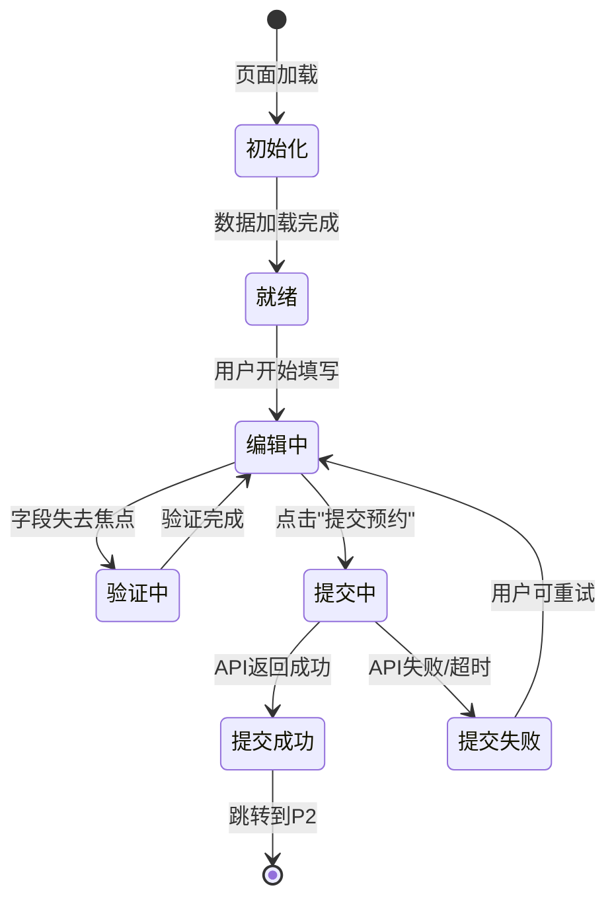
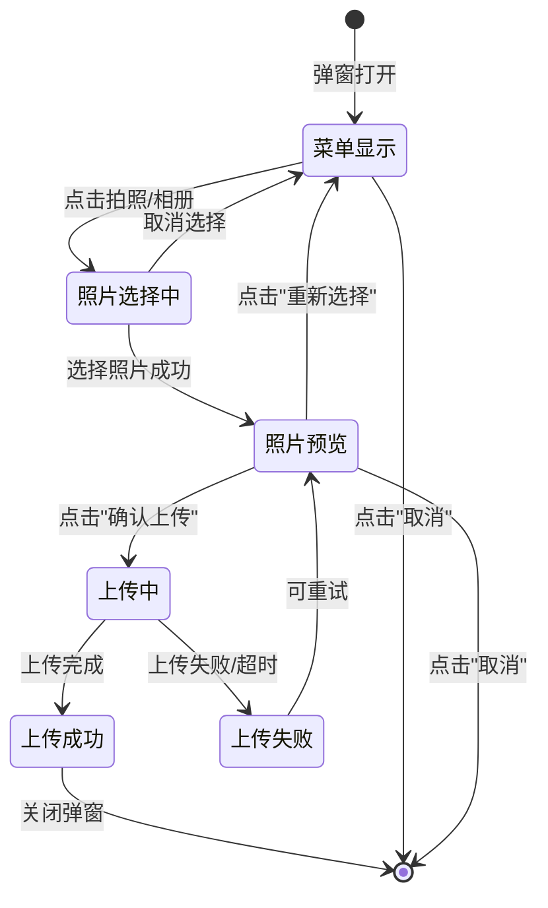

# 访客在线提交预约申请 - 交互逻辑设计

## Story概述

- **Story ID**: US-001
- **Story名称**: 访客在线提交预约申请
- **相关页面**: P1-访客预约申请表单、P2-预约提交成功页、P3-照片上传预览弹窗

---

## 第1部分：页面流转图

### 1.1 主流程（正常流程）

```mermaid
graph TD
    Start[微信公众号首页] -->|点击"访客预约"菜单| P1[P1-访客预约申请表单]
    P1 -->|点击"上传照片"| P3[P3-照片上传预览弹窗]
    P3 -->|选择照片并确认| P1
    P1 -->|填写完成,点击"提交预约"| Validate{表单验证}
    Validate -->|验证通过| API[调用提交API]
    API -->|提交成功| P2[P2-预约提交成功页]
    P2 -->|点击"查看我的预约"| US002[US-002预约记录列表]
    P2 -->|点击"返回首页"| Start
```

**文字描述**：

```
1. 微信公众号首页 → 点击"访客预约"菜单 → P1-访客预约申请表单
2. P1 → 点击"上传照片" → P3-照片上传预览弹窗
3. P3 → 选择照片并确认上传 → 返回P1（显示照片预览）
4. P1 → 填写完所有必填字段 → 点击"提交预约" → 表单验证
5. 验证通过 → 调用提交API → 提交成功 → P2-预约提交成功页
6. P2 → 点击"查看我的预约" → 跳转US-002预约记录列表页
7. P2 → 点击"返回首页" → 微信公众号首页
```

---

### 1.2 异常流程

```mermaid
graph TD
    P1[P1-访客预约申请表单] -->|点击"提交预约"| Validate{表单验证}
    Validate -->|必填字段为空| E1[显示错误提示M2-M7]
    E1 --> P1_Stay[停留在P1页面]
    
    Validate -->|字段格式错误| E2[显示格式错误提示]
    E2 --> P1_Stay
    
    Validate -->|当天已提交预约| E3[显示重复提交提示M8]
    E3 --> P1_Stay
    
    Validate -->|验证通过| API[调用提交API]
    API -->|网络超时| E4[显示网络超时提示]
    E4 --> P1_Stay
    
    API -->|服务器错误5xx| E5[显示服务器错误提示]
    E5 --> P1_Stay
    
    API -->|业务错误4xx| E6[显示业务错误提示]
    E6 --> P1_Stay
    
    P3[P3-照片上传弹窗] -->|照片格式不支持| E7[显示格式错误M5]
    E7 --> P3_Stay[停留在P3]
    
    P3 -->|照片大小超限| E8[显示大小超限提示M5]
    E8 --> P3_Stay
    
    P3 -->|上传失败| E9[显示上传失败提示]
    E9 --> P3_Stay
    
    P3 -->|点击"取消"| P1[返回P1]
```

**文字描述**：

```
1. P1 → 点击"提交预约" → 验证失败（必填字段为空） → 显示错误提示（停留在P1）
2. P1 → 点击"提交预约" → 验证失败（格式错误） → 显示格式错误提示（停留在P1）
3. P1 → 点击"提交预约" → 检测到当天已提交预约 → 显示重复提交警告M8（停留在P1）
4. P1 → 表单验证通过 → 调用API失败（网络超时） → 显示超时提示（停留在P1，可重试）
5. P1 → 表单验证通过 → 调用API失败（服务器错误） → 显示服务器错误提示（停留在P1，可重试）
6. P3 → 选择照片 → 照片格式不支持 → 显示格式错误M5（停留在P3，可重新选择）
7. P3 → 选择照片 → 照片大小超限 → 显示大小超限提示M5（停留在P3，可重新选择）
8. P3 → 上传照片 → 上传失败 → 显示上传失败提示（停留在P3，可重试）
9. P3 → 点击"取消" → 关闭弹窗，返回P1
```

---

### 1.3 流程说明

| 流程步骤 | 页面                 | 用户操作                         | 系统响应                                                 | 下一步              |
| -------- | -------------------- | -------------------------------- | -------------------------------------------------------- | ------------------- |
| 1        | 微信公众号首页       | 点击"访客预约"菜单               | 加载P1页面                                               | 跳转到P1            |
| 2        | P1-访客预约申请表单  | 填写姓名、手机号等表单字段       | 实时验证字段格式（失去焦点时）                           | 停留在P1            |
| 3        | P1                   | 点击"上传照片"按钮               | 弹出P3照片上传弹窗                                       | 打开P3弹窗          |
| 4        | P3-照片上传预览弹窗  | 选择"拍照"或"从相册选择"         | 调用微信JSSDK，打开相机/相册                             | 显示照片预览        |
| 5        | P3                   | 点击"确认上传"                   | 上传照片到服务器，显示上传进度                           | 上传成功后关闭P3    |
| 6        | P1                   | 照片上传成功后                   | 显示照片预览，显示成功提示M1（2秒后消失）                | 停留在P1            |
| 7        | P1                   | 点击"提交预约"按钮               | 前端验证所有必填字段和格式                               | 验证通过则执行步骤8 |
| 8        | P1                   | 表单验证通过                     | 按钮变为加载状态，调用POST /api/visitor/appointments     | 等待API响应         |
| 9        | P1                   | API返回成功（200）               | 显示成功提示，等待1秒                                    | 跳转到P2            |
| 10       | P2-预约提交成功页    | 页面自动加载                     | 显示预约单号、状态说明、后续指引                         | 停留在P2            |
| 11       | P2                   | 点击"查看我的预约"按钮           | 跳转到US-002预约记录列表页                               | 离开US-001流程      |
| 12       | P2                   | 点击"返回首页"链接               | 跳转到微信公众号首页                                     | 离开US-001流程      |
| 异常1    | P1                   | 点击"提交预约"，姓名为空         | 显示错误提示M2"请填写访客姓名"，姓名输入框红色边框       | 停留在P1            |
| 异常2    | P1                   | 点击"提交预约"，手机号格式错误   | 显示错误提示M3"手机号格式不正确..."，手机号输入框红色边框 | 停留在P1            |
| 异常3    | P1                   | 点击"提交预交"，当天已提交过预约 | 显示警告提示M8"您今天已提交过预约..."，页面顶部橙色警告条 | 停留在P1，禁止提交  |
| 异常4    | P1                   | API调用超时（15秒无响应）        | 显示超时提示"网络请求失败，请检查网络后重试"             | 停留在P1，可重试    |
| 异常5    | P3                   | 选择的照片格式为BMP              | 显示错误提示M5"照片格式不支持，请上传JPG或PNG格式"       | 停留在P3，可重新选择 |
| 异常6    | P3                   | 选择的照片大小为8MB              | 显示错误提示M5"照片大小不能超过5MB"                      | 停留在P3，可重新选择 |

---

## 第2部分：交互元素行为定义

### P1: 访客预约申请表单

### P1: 访客预约申请表单

#### 2.1 表单交互

##### 字段F1：访客姓名（元素ID: F1）

**交互行为**：

| 事件     | 触发条件                 | 执行动作                       | 反馈效果                            |
| -------- | ------------------------ | ------------------------------ | ----------------------------------- |
| 获得焦点 | 用户点击输入框           | 显示输入提示文本"请输入真实姓名" | 边框高亮（蓝色，2px）                |
| 失去焦点 | 用户点击其他位置         | 执行字段验证                   | 显示验证结果（成功/失败）           |
| 输入中   | 用户输入字符             | 实时字符计数（最多20字符）      | 显示剩余字符数"X/20"                 |
| 验证失败 | 失去焦点且数据不符合规则 | 显示错误提示M2                 | 红色边框 + 字段下方显示红色错误文本 |
| 验证成功 | 失去焦点且数据符合规则   | 清除错误提示                   | 边框恢复正常，显示绿色对勾（可选）  |

**验证规则**：

- 不能为空
- 长度为2-20个字符
- 支持中英文和中间点（·）
- 正则表达式：`/^[\u4e00-\u9fa5a-zA-Z·]{2,20}$/`

**错误提示文本**：

- 为空："请填写访客姓名"（M2）
- 长度不符："姓名长度为2-20个字符"（M2）
- 格式不符："姓名长度为2-20个字符，支持中英文"（M2）

---

##### 字段F2：手机号码（元素ID: F2）

**交互行为**：

| 事件     | 触发条件                 | 执行动作                         | 反馈效果                            |
| -------- | ------------------------ | -------------------------------- | ----------------------------------- |
| 获得焦点 | 用户点击输入框           | 显示输入提示文本"请输入11位手机号" | 边框高亮（蓝色，2px）                |
| 失去焦点 | 用户点击其他位置         | 执行字段验证                     | 显示验证结果（成功/失败）           |
| 输入中   | 用户输入字符             | 限制只能输入数字，最多11位       | 自动格式化（344格式，可选）         |
| 验证失败 | 失去焦点且数据不符合规则 | 显示错误提示M3                   | 红色边框 + 字段下方显示红色错误文本 |
| 验证成功 | 失去焦点且数据符合规则   | 清除错误提示                     | 边框恢复正常，显示绿色对勾（可选）  |

**验证规则**：

- 不能为空
- 11位数字
- 1开头，第二位为3-9
- 正则表达式：`/^1[3-9]\d{9}$/`

**错误提示文本**：

- 为空："请填写手机号码"（M3）
- 格式错误："手机号格式不正确，请填写11位手机号"（M3）

---

##### 字段F3：身份证号（元素ID: F3）

**交互行为**：

| 事件     | 触发条件                 | 执行动作                   | 反馈效果                            |
| -------- | ------------------------ | -------------------------- | ----------------------------------- |
| 获得焦点 | 用户点击输入框           | 显示输入提示文本           | 边框高亮（蓝色，2px）                |
| 失去焦点 | 用户点击其他位置         | 执行字段验证               | 显示验证结果（成功/失败）           |
| 输入中   | 用户输入字符             | 限制只能输入数字和X，最多18位 | 自动转换小写x为大写X                 |
| 验证失败 | 失去焦点且数据不符合规则 | 显示错误提示M4             | 红色边框 + 字段下方显示红色错误文本 |
| 验证成功 | 失去焦点且数据符合规则   | 清除错误提示               | 边框恢复正常，显示绿色对勾（可选）  |

**验证规则**：

- 不能为空
- 18位身份证号
- 正则表达式：`/^[1-9]\d{5}(18|19|20)\d{2}(0[1-9]|1[0-2])(0[1-9]|[12]\d|3[01])\d{3}[\dXx]$/`
- 校验码验证（可选，使用身份证号校验算法）

**错误提示文本**：

- 为空："请填写身份证号"（M4）
- 格式错误："身份证号格式不正确，请填写18位身份证号"（M4）

---

##### 字段F4：访客照片（元素ID: F4）

**交互行为**：

| 事件           | 触发条件                       | 执行动作                           | 反馈效果                                 |
| -------------- | ------------------------------ | ---------------------------------- | ---------------------------------------- |
| 点击上传按钮   | 用户点击F4-BTN"上传照片"按钮   | 打开P3照片上传预览弹窗             | 弹出P3弹窗，显示操作菜单                 |
| 照片上传成功   | P3弹窗中完成照片上传           | 关闭P3弹窗，显示照片预览（F4-PREVIEW） | 显示120px×160px照片预览，右上角显示删除按钮 |
| 照片上传成功   | 同上                           | 显示成功提示M1"照片上传成功"       | 页面顶部绿色Toast，2秒后自动消失         |
| 点击删除照片   | 用户点击照片预览区右上角删除按钮 | 删除照片，恢复到初始上传状态       | 照片预览消失，显示上传按钮               |
| 提交表单时验证 | 用户点击"提交预约"，照片未上传 | 显示错误提示                       | 红色边框 + 字段下方显示"请上传本人近期照片" |

**验证规则**：

- 必须上传照片
- 照片格式：JPG或PNG
- 照片大小：≤5MB
- 照片尺寸：建议宽度≥400px（前端提示，不强制）

**错误提示文本**：

- 未上传："请上传本人近期照片"
- 格式错误："照片格式不支持，请上传JPG或PNG格式"（M5）
- 大小超限："照片大小不能超过5MB"（M5）

**子元素交互**：

- **F4-BTN（上传照片按钮）**：点击触发P3弹窗
- **F4-PREVIEW（照片预览区）**：显示已上传照片，支持点击放大查看
- **F4-TIP（上传说明）**：静态提示文本"支持JPG/PNG格式，文件不超过5MB"

---

##### 字段F5：来访目的（元素ID: F5）

**交互行为**：

| 事件           | 触发条件                   | 执行动作                             | 反馈效果                            |
| -------------- | -------------------------- | ------------------------------------ | ----------------------------------- |
| 点击下拉框     | 用户点击下拉框             | 展开下拉选项列表                     | 显示4个选项：业务洽谈/参观考察/面试招聘/其他 |
| 选择选项       | 用户点击某个选项           | 关闭下拉列表，显示已选择的值         | 下拉框显示选择值                    |
| 选择"其他"     | 用户选择"其他"             | 显示F6"其他说明"字段                 | F6字段从隐藏变为显示                |
| 选择非"其他"   | 用户选择"业务洽谈"等       | 隐藏F6"其他说明"字段                 | F6字段隐藏                          |
| 提交表单时验证 | 用户点击"提交预约"，未选择 | 显示错误提示                         | 红色边框 + 字段下方显示"请选择来访目的" |

**验证规则**：

- 必须选择一个选项
- 可选值：业务洽谈、参观考察、面试招聘、其他

**错误提示文本**：

- 未选择："请选择来访目的"

---

##### 字段F6：其他说明（元素ID: F6）

**交互行为**：

| 事件     | 触发条件                        | 执行动作                       | 反馈效果                            |
| -------- | ------------------------------- | ------------------------------ | ----------------------------------- |
| 显示     | F5选择"其他"                    | 显示F6文本域                   | 字段从隐藏变为显示                  |
| 隐藏     | F5选择非"其他"选项              | 隐藏F6文本域，清空已填写内容   | 字段隐藏                            |
| 获得焦点 | 用户点击文本域                  | 显示输入提示文本               | 边框高亮（蓝色，2px）                |
| 输入中   | 用户输入字符                    | 实时字符计数（最多200字符）     | 显示剩余字符数"X/200"                |
| 超出长度 | 用户输入第201个字符             | 阻止输入                       | 提示"最多输入200字符"               |
| 验证失败 | F5选择"其他"但F6为空            | 显示错误提示                   | 红色边框 + 字段下方显示"请说明具体事由" |

**验证规则**：

- 当F5选择"其他"时，F6必填
- 长度≤200字符
- 支持中英文和标点符号

**错误提示文本**：

- 未填写："请说明具体事由"
- 超出长度："最多输入200字符"

---

##### 字段F7：访问日期（元素ID: F7）

**交互行为**：

| 事件           | 触发条件                       | 执行动作                                       | 反馈效果                            |
| -------------- | ------------------------------ | ---------------------------------------------- | ----------------------------------- |
| 点击日期选择器 | 用户点击日期选择器             | 打开日期选择面板                               | 显示日历，禁用过去日期和30天后日期  |
| 选择日期       | 用户点击某个日期               | 关闭日期选择面板，显示选择的日期               | 日期选择器显示格式"2025-11-27"      |
| 验证失败       | 选择的日期早于今天             | 显示错误提示M6                                 | 红色边框 + "访问日期不能早于今天"   |
| 验证失败       | 选择的日期超过今天+30天        | 显示错误提示M6                                 | 红色边框 + "访问日期不能超过30天后" |
| 提交表单时验证 | 用户点击"提交预约"，日期未选择 | 显示错误提示                                   | 红色边框 + "请选择访问日期"         |

**验证规则**：

- 必须选择日期
- 日期范围：今天 ≤ 选择日期 ≤ 今天+30天
- 日期格式：YYYY-MM-DD

**错误提示文本**：

- 未选择："请选择访问日期"（M6）
- 日期过早："访问日期不能早于今天"（M6）
- 日期过晚："访问日期不能超过30天后"（M6）

---

##### 字段F8：访问时段（元素ID: F8）

**交互行为**：

| 事件           | 触发条件                       | 执行动作                   | 反馈效果                        |
| -------------- | ------------------------------ | -------------------------- | ------------------------------- |
| 点击单选框     | 用户点击"上午"或"下午"单选框   | 选中该选项，取消另一个选项 | 选中的单选框显示蓝色圆点        |
| 提交表单时验证 | 用户点击"提交预约"，时段未选择 | 显示错误提示               | 红色边框 + "请选择访问时段"     |

**验证规则**：

- 必须选择一个时段
- 可选值：上午(8:00-12:00)、下午(13:00-18:00)

**错误提示文本**：

- 未选择："请选择访问时段"

---

##### 字段F9：被访人（元素ID: F9）

**交互行为**：

| 事件           | 触发条件                         | 执行动作                                   | 反馈效果                                 |
| -------------- | -------------------------------- | ------------------------------------------ | ---------------------------------------- |
| 点击搜索框     | 用户点击F9-INPUT搜索输入框       | 获得焦点，显示输入提示                     | 边框高亮，显示"请输入被访人姓名或工号"   |
| 输入中         | 用户输入字符                     | 实时搜索，调用API过滤员工列表              | 显示F9-LIST搜索结果列表（最多10条）       |
| 搜索防抖       | 用户连续输入                     | 防抖300ms后才发起搜索请求                  | 减少API调用次数                          |
| 选择员工       | 用户点击F9-LIST中的某个员工      | 关闭搜索结果列表，显示F9-SELECTED已选择标签 | 显示"姓名（部门）"标签，右侧有删除按钮   |
| 删除已选择     | 用户点击F9-SELECTED标签的删除按钮 | 清空已选择的被访人，恢复搜索框             | 标签消失，搜索框恢复初始状态             |
| 无搜索结果     | 输入的关键词无匹配员工           | 显示"未找到匹配员工"提示                   | F9-LIST显示空状态提示                    |
| 提交表单时验证 | 用户点击"提交预约"，被访人未选择 | 显示错误提示M7                             | 红色边框 + "请选择被访人"                |

**验证规则**：

- 必须选择一个被访人
- 被访人必须是系统中的有效员工

**错误提示文本**：

- 未选择："请选择被访人"（M7）

**子元素交互**：

- **F9-INPUT（搜索输入框）**：
  - 支持输入姓名拼音首字母搜索（如"张三" → 输入"zs"可搜索到）
  - 支持输入工号搜索
  - 支持输入姓名全称搜索
  
- **F9-LIST（搜索结果列表）**：
  - 每条记录显示：姓名、部门、工号
  - 最多显示10条结果
  - 超过10条时提示"结果过多，请输入更多关键词"
  - 支持键盘上下方向键选择（可选）
  
- **F9-SELECTED（已选择标签）**：
  - 显示格式："张三（技术部）"
  - 右侧显示删除图标（×）
  - 点击删除图标可清空选择

---

#### 2.2 按钮交互

##### 按钮BTN1：提交预约（元素ID: BTN1）

**交互行为**：

| 事件 | 触发条件             | 执行动作                                            | 反馈效果                                                                 |
| ---- | -------------------- | --------------------------------------------------- | ------------------------------------------------------------------------ |
| 点击 | 用户点击"提交预约"按钮 | 1. 表单验证<br>2. 提交数据<br>3. 页面跳转 | 1. 按钮变为加载状态<br>2. 显示加载动画<br>3. 成功后跳转P2 |
| 悬停 | 鼠标悬停（仅PC端）   | 无                                                  | 背景色变深（#0f7ae5）                                                     |
| 禁用 | 表单验证失败         | 无法点击                                            | 灰色显示（#d9d9d9） + 禁用光标                                            |

**点击后详细逻辑**：

```
1. 前端验证阶段：
   ├─ 验证所有必填字段（F1-F9，除F6外）
   │  ├─ F1姓名：不为空，2-20字符，符合正则
   │  ├─ F2手机号：不为空，符合11位手机号正则
   │  ├─ F3身份证号：不为空，符合18位身份证号正则
   │  ├─ F4照片：已上传
   │  ├─ F5来访目的：已选择
   │  ├─ F6其他说明：如果F5选择"其他"，则F6必填
   │  ├─ F7访问日期：已选择，且在允许范围内
   │  ├─ F8访问时段：已选择
   │  └─ F9被访人：已选择
   │
   ├─ 如果验证失败：
   │  ├─ 显示对应的错误提示（M2-M7）
   │  ├─ 错误字段标红
   │  ├─ 滚动到第一个错误字段
   │  └─ 停止提交，返回
   │
   └─ 如果验证通过：
      └─ 继续执行步骤2

2. 提交数据阶段：
   ├─ 按钮状态变更：
   │  ├─ 按钮文本变为"提交中..."
   │  ├─ 显示加载图标（旋转的圆圈）
   │  ├─ 禁用按钮（防止重复提交）
   │  └─ 禁用所有表单字段
   │
   ├─ 调用API：
   │  ├─ 请求方式：POST
   │  ├─ 请求URL：/api/visitor/appointments
   │  ├─ 请求头：
   │  │  ├─ Content-Type: application/json
   │  │  └─ Authorization: Bearer {微信登录token}
   │  │
   │  └─ 请求体：
   │     {
   │       "visitorName": "张三",           // F1
   │       "visitorPhone": "13800138000",   // F2
   │       "visitorIdCard": "440301...",    // F3
   │       "visitorPhoto": "https://...",   // F4上传后的URL
   │       "visitPurpose": "业务洽谈",      // F5
   │       "visitPurposeDesc": "...",       // F6（如果F5为"其他"）
   │       "visitDate": "2025-11-27",       // F7
   │       "visitTimeSlot": "上午",         // F8
   │       "visiteeId": 123                 // F9选择的员工ID
   │     }
   │
   └─ 超时设置：15秒

3. 处理响应阶段：
   ├─ 成功响应（HTTP 200）：
   │  ├─ 响应体示例：
   │  │  {
   │  │    "code": 0,
   │  │    "message": "提交成功",
   │  │    "data": {
   │  │      "appointmentId": 1001,
   │  │      "appointmentNumber": "YY202511270001",
   │  │      "status": "待审批",
   │  │      "createTime": "2025-11-27 10:30:00"
   │  │    }
   │  │  }
   │  │
   │  ├─ 显示成功提示：Toast"提交成功"（绿色，2秒）
   │  ├─ 等待1秒
   │  ├─ 跳转到P2成功页，传递参数：
   │  │  └─ URL: /visitor/appointment/success?id=YY202511270001
   │  └─ 发送微信模板消息给被访人（后端处理）
   │
   ├─ 业务错误（HTTP 200，但code != 0）：
   │  ├─ 错误示例：
   │  │  {
   │  │    "code": 1001,
   │  │    "message": "您今天已提交过预约，同一天只能提交1次",
   │  │    "data": null
   │  │  }
   │  │
   │  ├─ 显示错误提示M8：
   │  │  └─ 页面顶部橙色警告条，显示message内容
   │  ├─ 按钮恢复正常状态（文本恢复"提交预约"，取消禁用）
   │  ├─ 恢复表单字段可编辑
   │  └─ 停留在P1页面
   │
   ├─ 客户端错误（HTTP 4xx）：
   │  ├─ 400 Bad Request：参数验证失败
   │  │  └─ 显示"提交失败，请检查输入信息"
   │  ├─ 401 Unauthorized：未登录
   │  │  └─ 显示"登录已过期，请重新登录"，跳转登录页
   │  ├─ 403 Forbidden：权限不足
   │  │  └─ 显示"您没有权限执行此操作"
   │  └─ 其他4xx：
   │     └─ 显示"提交失败，请重试"
   │
   ├─ 服务器错误（HTTP 5xx）：
   │  ├─ 500 Internal Server Error
   │  ├─ 502 Bad Gateway
   │  ├─ 503 Service Unavailable
   │  └─ 显示错误提示："服务器繁忙，请稍后再试"
   │     ├─ 按钮恢复正常状态
   │     ├─ 恢复表单字段可编辑
   │     └─ 停留在P1页面，可重试
   │
   └─ 网络超时（15秒无响应）：
      ├─ 显示超时提示："网络请求失败，请检查网络后重试"
      ├─ 按钮恢复正常状态
      ├─ 恢复表单字段可编辑
      └─ 停留在P1页面，可重试
```

**按钮状态管理**：

| 状态   | 触发条件                     | 外观                                   | 是否可点击 |
| ------ | ---------------------------- | -------------------------------------- | ---------- |
| 默认   | 页面加载完成，表单验证通过   | 蓝色背景（#1890ff），文本"提交预约"    | 是         |
| 悬停   | 鼠标悬停（仅PC端）           | 深蓝色背景（#0f7ae5）                  | 是         |
| 禁用   | 必填字段未填写或验证失败     | 灰色背景（#d9d9d9），禁用光标           | 否         |
| 加载中 | 数据提交中                   | 蓝色背景，加载图标 + "提交中..."       | 否         |

**重复提交防护**：

- 点击后立即禁用按钮
- 15秒超时后自动恢复
- 响应返回后恢复
- 离开页面时清除请求

**错误重试策略**：

- 网络错误：用户手动重试（不自动重试，避免重复提交）
- 服务器错误：用户手动重试
- 业务错误：根据错误类型决定是否允许重试

---

#### 2.3 其他交互元素

本页面其他交互元素包含在F4照片上传组件和F9被访人搜索组件中，详见各字段的子元素交互说明。

---

### P2: 预约提交成功页

**页面用途**：告知访客预约提交成功，展示预约单号和后续操作指引

#### 2.4 数据展示元素

| 元素ID | 元素名称     | 交互行为                                                                  |
| ------ | ------------ | ------------------------------------------------------------------------- |
| D1     | 成功图标     | 静态图标，无交互                                                          |
| D2     | 成功提示标题 | 静态文本，无交互                                                          |
| D3     | 预约单号标签 | 静态文本，无交互                                                          |
| D4     | 预约单号     | **长按复制**：用户长按预约单号，触发系统复制功能，复制成功后显示Toast提示"已复制" |
| D5     | 状态说明     | 静态文本，无交互                                                          |
| D6     | 后续指引     | 静态文本段落，无交互                                                      |

**D4预约单号长按复制交互详细**：

| 事件     | 触发条件             | 执行动作                       | 反馈效果                             |
| -------- | -------------------- | ------------------------------ | ------------------------------------ |
| 长按     | 用户长按预约单号文本 | 调用系统复制API，复制预约单号  | 显示Toast"已复制"，绿色，1秒后消失   |
| 点击     | 用户单击预约单号     | 无操作（可选：显示提示"长按复制"） | 可选：显示淡灰色提示文本，2秒后消失 |

---

#### 2.5 交互按钮

##### 按钮I1：查看我的预约（元素ID: I1）

**交互行为**：

| 事件 | 触发条件         | 执行动作                      | 反馈效果                   |
| ---- | ---------------- | ----------------------------- | -------------------------- |
| 点击 | 用户点击按钮     | 跳转到US-002预约记录列表页    | 页面跳转，显示预约记录列表 |
| 悬停 | 鼠标悬停（PC端） | 无                            | 背景色变深                 |

**跳转逻辑**：

```
1. 跳转URL：/visitor/appointments
2. 跳转方式：微信内页面跳转（history.push）
3. 传递参数：无（US-002会根据当前登录用户查询）
4. 跳转后：进入US-002用户故事流程
```

---

##### 按钮I2：返回首页（元素ID: I2）

**交互行为**：

| 事件 | 触发条件         | 执行动作               | 反馈效果       |
| ---- | ---------------- | ---------------------- | -------------- |
| 点击 | 用户点击链接     | 跳转到微信公众号首页   | 页面跳转到首页 |
| 悬停 | 鼠标悬停（PC端） | 无                     | 文字颜色变深   |

**跳转逻辑**：

```
1. 跳转URL：/
2. 跳转方式：微信内页面跳转（history.push）
3. 跳转后：返回微信公众号首页，可再次发起预约
```

---

### P3: 照片上传预览弹窗

**页面用途**：调用微信JSSDK，选择照片/拍照，预览上传结果

#### 2.6 操作菜单区域

##### 元素I3：拍照（元素ID: I3）

**交互行为**：

| 事件 | 触发条件         | 执行动作                                     | 反馈效果                         |
| ---- | ---------------- | -------------------------------------------- | -------------------------------- |
| 点击 | 用户点击"拍照"   | 调用微信JSSDK chooseImage API，sourceType=camera | 打开微信相机，拍照后进入预览界面 |

**调用逻辑**：

```javascript
wx.chooseImage({
  count: 1,                    // 只能选择1张照片
  sizeType: ['compressed'],    // 压缩图（节省流量）
  sourceType: ['camera'],      // 只允许拍照
  success: function (res) {
    // res.localIds：本地图片ID列表
    // 进入照片预览界面（显示D7、BTN2、BTN3）
    showPhotoPreview(res.localIds[0]);
  },
  fail: function (err) {
    // 用户取消或授权失败
    showError('拍照失败，请检查相机权限');
  }
});
```

---

##### 元素I4：从相册选择（元素ID: I4）

**交互行为**：

| 事件 | 触发条件             | 执行动作                                     | 反馈效果                         |
| ---- | -------------------- | -------------------------------------------- | -------------------------------- |
| 点击 | 用户点击"从相册选择" | 调用微信JSSDK chooseImage API，sourceType=album | 打开微信相册，选择照片后进入预览界面 |

**调用逻辑**：

```javascript
wx.chooseImage({
  count: 1,                    // 只能选择1张照片
  sizeType: ['compressed'],    // 压缩图
  sourceType: ['album'],       // 只允许从相册选择
  success: function (res) {
    showPhotoPreview(res.localIds[0]);
  },
  fail: function (err) {
    showError('选择照片失败，请检查相册权限');
  }
});
```

---

##### 元素I5：取消（元素ID: I5）

**交互行为**：

| 事件 | 触发条件       | 执行动作       | 反馈效果                 |
| ---- | -------------- | -------------- | ------------------------ |
| 点击 | 用户点击"取消" | 关闭P3弹窗     | 弹窗关闭，返回P1页面     |

---

#### 2.7 照片预览区域

**显示条件**：用户通过I3或I4选择照片后显示

##### 元素D7：照片预览图（元素ID: D7）

**交互行为**：

| 事件     | 触发条件             | 执行动作                       | 反馈效果                 |
| -------- | -------------------- | ------------------------------ | ------------------------ |
| 显示     | 选择照片成功         | 显示照片预览图                 | 在弹窗中居中显示         |
| 点击     | 用户点击照片         | 放大查看（可选功能）           | 全屏显示照片，可缩放     |
| 捏合缩放 | 用户双指捏合（移动端） | 缩放照片                       | 照片缩放，显示缩放比例   |

---

##### 按钮BTN2：确认上传（元素ID: BTN2）

**交互行为**：

| 事件 | 触发条件         | 执行动作                                   | 反馈效果                                 |
| ---- | ---------------- | ------------------------------------------ | ---------------------------------------- |
| 点击 | 用户点击按钮     | 1. 上传照片到服务器<br>2. 显示上传进度 | 显示上传进度条D8、上传提示D9             |

**上传逻辑**：

```javascript
// 步骤1：先将微信本地图片上传到微信服务器
wx.uploadImage({
  localId: localImageId,          // 微信本地图片ID
  isShowProgressTips: 0,          // 不显示微信自带进度提示
  success: function (res) {
    var serverId = res.serverId;  // 微信服务器图片ID
    
    // 步骤2：调用后端API，下载并保存到自己的服务器
    uploadToOwnServer(serverId);
  }
});

function uploadToOwnServer(serverId) {
  // 显示上传进度条D8和D9
  showUploadProgress(0);
  
  // 调用后端API
  fetch('/api/visitor/upload-photo', {
    method: 'POST',
    headers: {
      'Content-Type': 'application/json',
      'Authorization': 'Bearer ' + token
    },
    body: JSON.stringify({
      mediaId: serverId  // 微信服务器图片ID
    })
  })
  .then(response => {
    if (response.ok) {
      return response.json();
    }
    throw new Error('上传失败');
  })
  .then(data => {
    // 上传成功
    // data.photoUrl: 照片在自己服务器的URL
    hideUploadProgress();
    closePopup();  // 关闭P3弹窗
    showPhotoPreviewInForm(data.photoUrl);  // 在P1显示照片预览F4-PREVIEW
    showSuccessToast('照片上传成功');  // 显示M1
  })
  .catch(error => {
    // 上传失败
    hideUploadProgress();
    showErrorToast('照片上传失败，请重试');
    // 停留在P3，用户可重试
  });
}
```

**上传进度显示**：

- 0-30%：微信本地图片上传到微信服务器（wx.uploadImage）
- 30-100%：后端从微信服务器下载并保存（模拟进度或真实进度）

**上传超时**：

- 超时时间：15秒
- 超时处理：显示"上传超时，请检查网络后重试"

**上传失败重试**：

- 自动重试：失败后自动重试2次
- 手动重试：用户可点击BTN2重新上传

---

##### 按钮BTN3：重新选择（元素ID: BTN3）

**交互行为**：

| 事件 | 触发条件         | 执行动作                           | 反馈效果                     |
| ---- | ---------------- | ---------------------------------- | ---------------------------- |
| 点击 | 用户点击按钮     | 返回操作菜单（I3、I4、I5）         | 隐藏照片预览，显示操作菜单   |

---

#### 2.8 上传进度显示

##### 元素D8：上传进度条（元素ID: D8）

**交互行为**：

| 事件     | 触发条件                     | 执行动作                 | 反馈效果                     |
| -------- | ---------------------------- | ------------------------ | ---------------------------- |
| 显示     | 用户点击BTN2"确认上传"       | 显示进度条，进度从0%开始 | 蓝色进度条，动态增长         |
| 进度更新 | 上传过程中                   | 更新进度百分比           | 进度条宽度变化，0-100%       |
| 完成     | 上传成功                     | 进度条达到100%           | 进度条变绿色，1秒后消失      |
| 失败     | 上传失败                     | 进度条变红色             | 显示错误提示，进度条消失     |

---

##### 元素D9：上传提示（元素ID: D9）

**交互行为**：

| 事件     | 触发条件   | 显示内容                 |
| -------- | ---------- | ------------------------ |
| 上传中   | 上传进行中 | "正在上传...X%"          |
| 上传成功 | 上传完成   | "上传成功"（绿色）       |
| 上传失败 | 上传失败   | "上传失败，请重试"（红色） |

---

## 第3部分：状态管理

### 3.1 页面状态

#### P1页面状态

| 状态     | 触发条件                     | 显示内容                                       | 可执行操作                     |
| -------- | ---------------------------- | ---------------------------------------------- | ------------------------------ |
| 初始化   | 页面首次加载                 | 显示骨架屏（表单占位符）                       | 无（等待数据加载）             |
| 就绪     | 页面数据加载完成             | 显示完整表单，所有字段为空                     | 填写表单、上传照片、提交预约   |
| 编辑中   | 用户开始填写表单             | 显示表单，部分字段已填写                       | 继续填写、修改已填写内容、提交 |
| 验证中   | 用户触发字段验证（失去焦点） | 显示验证结果（成功/失败）                      | 修正错误、继续填写             |
| 提交中   | 用户点击"提交预约"，API调用中 | 按钮显示"提交中..."，表单禁用，显示加载遮罩 | 无（等待API响应）              |
| 提交成功 | API返回成功                  | 显示成功提示Toast，1秒后自动跳转               | 等待跳转                       |
| 提交失败 | API返回失败或超时            | 显示错误提示，表单恢复可编辑                   | 修改表单、重新提交             |

**状态转换流程图**：



---

#### P2页面状态

| 状态   | 触发条件         | 显示内容                   | 可执行操作               |
| ------ | ---------------- | -------------------------- | ------------------------ |
| 初始化 | 页面首次加载     | 显示骨架屏                 | 无（等待数据加载）       |
| 就绪   | 数据加载完成     | 显示预约单号、状态、按钮   | 点击按钮跳转             |

**页面数据来源**：

- 从P1提交成功后传递的URL参数获取预约单号
- 示例：`/visitor/appointment/success?id=YY202511270001`

---

#### P3页面状态

| 状态       | 触发条件                 | 显示内容                                   | 可执行操作                 |
| ---------- | ------------------------ | ------------------------------------------ | -------------------------- |
| 菜单显示   | 弹窗首次打开             | 显示操作菜单（拍照/从相册选择/取消）       | 选择操作                   |
| 照片选择中 | 用户点击拍照或从相册选择 | 调用微信JSSDK，显示相机或相册              | 选择照片、取消             |
| 照片预览   | 用户选择照片成功         | 显示照片预览、确认上传、重新选择按钮       | 确认上传、重新选择、取消   |
| 上传中     | 用户点击"确认上传"       | 显示上传进度条、上传提示                   | 无（等待上传完成）         |
| 上传成功   | 照片上传完成             | 进度条变绿色，1秒后关闭弹窗                | 等待弹窗关闭               |
| 上传失败   | 上传失败或超时           | 显示错误提示，停留在照片预览状态           | 重新上传、重新选择、取消   |

**状态转换流程图**：



---

### 3.2 元素状态

#### BTN1提交预约按钮状态

| 状态   | 触发条件                                 | 外观                                           | 交互能力       |
| ------ | ---------------------------------------- | ---------------------------------------------- | -------------- |
| 默认   | 页面加载完成，所有必填字段已填写且验证通过 | 蓝色背景（#1890ff），白色文字"提交预约"        | 可点击         |
| 悬停   | 鼠标悬停（仅PC端）                       | 深蓝色背景（#0f7ae5）                          | 可点击         |
| 禁用   | 必填字段未填写 或 字段验证失败           | 灰色背景（#d9d9d9），灰色文字，禁用光标        | 不可点击       |
| 加载中 | 用户点击按钮后，API调用进行中            | 蓝色背景，加载图标（旋转圆圈）+ "提交中..."    | 不可点击       |

**状态切换逻辑**：

```javascript
// 按钮状态管理
function updateSubmitButtonState() {
  const allFieldsValid = validateAllFields();  // 检查所有字段
  
  if (!allFieldsValid) {
    button.state = 'disabled';
    button.disabled = true;
    button.style.backgroundColor = '#d9d9d9';
  } else {
    button.state = 'default';
    button.disabled = false;
    button.style.backgroundColor = '#1890ff';
  }
}

// 字段变化时实时更新按钮状态
formFields.forEach(field => {
  field.addEventListener('change', updateSubmitButtonState);
  field.addEventListener('blur', updateSubmitButtonState);
});
```

---

#### 表单字段状态（以F1姓名为例）

| 状态     | 触发条件                     | 外观                                 | 交互能力   |
| -------- | ---------------------------- | ------------------------------------ | ---------- |
| 默认     | 页面加载完成，字段为空       | 灰色边框（#d9d9d9），占位符文本灰色 | 可编辑     |
| 聚焦     | 用户点击输入框               | 蓝色边框（#1890ff，2px），占位符隐藏 | 可编辑     |
| 填写中   | 用户正在输入                 | 蓝色边框，显示已输入内容             | 可编辑     |
| 验证成功 | 失去焦点，验证通过           | 绿色边框（可选），显示绿色对勾       | 可编辑     |
| 验证失败 | 失去焦点，验证失败           | 红色边框（#ff4d4f），下方显示错误文本 | 可编辑     |
| 禁用     | 表单提交中                   | 灰色背景，文本不可修改               | 不可编辑   |

---

#### 照片上传组件状态（F4）

| 状态     | 触发条件         | 显示内容                                           | 交互能力           |
| -------- | ---------------- | -------------------------------------------------- | ------------------ |
| 初始状态 | 页面加载，未上传 | 显示上传按钮F4-BTN（蓝色虚线边框，相机图标）       | 可点击上传         |
| 上传成功 | 照片上传完成     | 显示照片预览F4-PREVIEW（120px×160px，右上角删除按钮） | 可点击删除、可点击放大 |
| 上传失败 | 上传失败         | 显示上传按钮，下方显示红色错误提示                 | 可重新上传         |

---

#### 被访人搜索组件状态（F9）

| 状态     | 触发条件                 | 显示内容                                   | 交互能力       |
| -------- | ------------------------ | ------------------------------------------ | -------------- |
| 初始状态 | 页面加载，未选择被访人   | 显示搜索输入框F9-INPUT，占位符文本灰色    | 可输入搜索     |
| 搜索中   | 用户输入搜索关键词       | 显示搜索结果列表F9-LIST（最多10条）        | 可选择员工     |
| 已选择   | 用户选择某个员工         | 显示已选择标签F9-SELECTED，隐藏搜索输入框  | 可点击删除标签 |
| 无结果   | 搜索无匹配结果           | 显示"未找到匹配员工"提示                   | 可修改搜索词   |

---

#### P3弹窗显示状态

| 状态 | 触发条件           | 显示内容                 | 交互能力       |
| ---- | ------------------ | ------------------------ | -------------- |
| 显示 | 用户点击上传照片按钮 | 弹窗从底部滑入，显示遮罩 | 可操作菜单项   |
| 隐藏 | 用户取消或上传成功 | 弹窗滑出，遮罩消失       | 无             |

---

## 第4部分：反馈机制

### 4.1 成功反馈

| 场景             | 反馈方式                     | 反馈内容                       | 持续时间      | 后续动作                             |
| ---------------- | ---------------------------- | ------------------------------ | ------------- | ------------------------------------ |
| 照片上传成功     | Toast提示（页面顶部）        | "照片上传成功"（M1）           | 2秒自动消失   | 无，停留在P1，显示照片预览           |
| 表单提交成功     | Toast提示（页面顶部）        | "提交成功"                     | 1秒自动消失   | 自动跳转到P2成功页                   |
| 预约单号复制成功 | Toast提示（页面中央）        | "已复制"                       | 1秒自动消失   | 无，停留在P2                         |
| 字段验证成功     | 行内提示（可选）             | 绿色对勾图标                   | 持续显示      | 无，用户可继续填写                   |

**成功反馈设计规范**：

- **Toast样式**：
  - 背景色：绿色半透明（rgba(82, 196, 26, 0.9)）
  - 文字颜色：白色
  - 图标：绿色对勾 ✓
  - 位置：页面顶部居中，距离顶部20px
  - 动画：从上往下滑入（200ms），停留指定时间，向上滑出（200ms）
  
- **行内提示样式**：
  - 绿色对勾图标（16px×16px）
  - 显示在输入框右侧或下方
  - 不影响布局（absolute定位）

---

### 4.2 错误反馈

| 场景                     | 反馈方式                     | 反馈内容                                           | 持续时间       | 后续动作                 |
| ------------------------ | ---------------------------- | -------------------------------------------------- | -------------- | ------------------------ |
| 姓名验证失败             | 字段下方红色文本             | "请填写访客姓名" 或 "姓名长度为2-20个字符"（M2）   | 直到用户修正   | 用户修改后重新验证       |
| 手机号验证失败           | 字段下方红色文本             | "手机号格式不正确，请填写11位手机号"（M3）         | 直到用户修正   | 用户修改后重新验证       |
| 身份证号验证失败         | 字段下方红色文本             | "身份证号格式不正确，请填写18位身份证号"（M4）     | 直到用户修正   | 用户修改后重新验证       |
| 照片上传失败             | 字段下方红色文本 + Toast提示 | "照片格式不支持" 或 "照片大小不能超过5MB"（M5）    | 直到用户修正   | 用户重新上传             |
| 访问日期验证失败         | 字段下方红色文本             | "访问日期不能早于今天" 或 "访问日期不能超过30天后"（M6） | 直到用户修正   | 用户重新选择日期         |
| 被访人验证失败           | 字段下方红色文本             | "请选择被访人"（M7）                               | 直到用户修正   | 用户选择被访人           |
| 重复提交预约             | 页面顶部橙色警告条           | "您今天已提交过预约，同一天只能提交1次"（M8）      | 持续显示       | 用户无法提交，需等到第二天 |
| 网络请求失败             | Toast提示（页面顶部）        | "网络请求失败，请检查网络后重试"                   | 5秒自动消失    | 用户手动重试提交         |
| 服务器错误               | Toast提示（页面顶部）        | "服务器繁忙，请稍后再试"                           | 5秒自动消失    | 用户手动重试提交         |
| 未登录或登录过期         | Modal弹窗                    | "登录已过期，请重新登录"                           | 用户手动关闭   | 跳转到登录页             |
| 权限不足                 | Modal弹窗                    | "您没有权限执行此操作"                             | 用户手动关闭   | 返回首页或停留当前页     |
| 照片上传失败（网络）     | Toast提示                    | "照片上传失败，请检查网络后重试"                   | 5秒自动消失    | 用户重新上传             |
| 照片上传超时             | Toast提示                    | "上传超时，请检查网络后重试"                       | 5秒自动消失    | 用户重新上传             |
| 被访人搜索无结果         | 搜索列表内提示               | "未找到匹配员工，请输入更多关键词"                 | 持续显示       | 用户修改搜索关键词       |

**错误反馈设计规范**：

- **字段下方红色文本**：
  - 文字颜色：红色（#ff4d4f）
  - 字体大小：12px
  - 位置：输入框下方，左对齐，距离输入框4px
  - 图标：红色感叹号图标（可选）
  - 输入框边框：红色（#ff4d4f，2px）
  
- **Toast错误提示**：
  - 背景色：红色半透明（rgba(255, 77, 79, 0.9)）
  - 文字颜色：白色
  - 图标：红色叉号 ✗
  - 位置：页面顶部居中
  - 动画：从上往下滑入（200ms），停留5秒，向上滑出（200ms）
  
- **橙色警告条（M8重复提交）**：
  - 背景色：橙色（#fa8c16）
  - 文字颜色：白色
  - 图标：警告图标 ⚠️
  - 位置：页面顶部，固定定位（sticky）
  - 关闭按钮：右侧显示关闭按钮（用户可手动关闭）
  
- **Modal弹窗**：
  - 背景遮罩：黑色半透明（rgba(0, 0, 0, 0.5)）
  - 弹窗背景：白色
  - 标题：字体16px，加粗
  - 内容：字体14px
  - 按钮：主按钮（蓝色）+ 取消按钮（灰色）
  - 位置：屏幕居中

**错误提示文案完整列表**：

| 错误编号 | 触发场景                 | 提示文案                                           |
| -------- | ------------------------ | -------------------------------------------------- |
| M2       | 姓名为空                 | 请填写访客姓名                                     |
| M2       | 姓名格式错误             | 姓名长度为2-20个字符，支持中英文                   |
| M3       | 手机号为空               | 请填写手机号码                                     |
| M3       | 手机号格式错误           | 手机号格式不正确，请填写11位手机号                 |
| M4       | 身份证号为空             | 请填写身份证号                                     |
| M4       | 身份证号格式错误         | 身份证号格式不正确，请填写18位身份证号             |
| M5       | 照片未上传               | 请上传本人近期照片                                 |
| M5       | 照片格式不支持           | 照片格式不支持，请上传JPG或PNG格式                 |
| M5       | 照片过大                 | 照片大小不能超过5MB                                |
| -        | 来访目的未选择           | 请选择来访目的                                     |
| -        | 其他说明未填写           | 请说明具体事由                                     |
| -        | 其他说明超出长度         | 最多输入200字符                                    |
| M6       | 访问日期未选择           | 请选择访问日期                                     |
| M6       | 访问日期过早             | 访问日期不能早于今天                               |
| M6       | 访问日期过晚             | 访问日期不能超过30天后                             |
| -        | 访问时段未选择           | 请选择访问时段                                     |
| M7       | 被访人未选择             | 请选择被访人                                       |
| M8       | 当天重复提交             | 您今天已提交过预约，同一天只能提交1次              |
| -        | 网络错误                 | 网络请求失败，请检查网络后重试                     |
| -        | 服务器错误               | 服务器繁忙，请稍后再试                             |
| -        | 未登录                   | 登录已过期，请重新登录                             |
| -        | 权限不足                 | 您没有权限执行此操作                               |
| -        | 照片上传失败             | 照片上传失败，请检查网络后重试                     |
| -        | 照片上传超时             | 上传超时，请检查网络后重试                         |
| -        | 被访人搜索无结果         | 未找到匹配员工，请输入更多关键词                   |

---

### 4.3 加载反馈

| 场景             | 反馈方式                 | 显示内容                           | 显示位置         |
| ---------------- | ------------------------ | ---------------------------------- | ---------------- |
| 页面首次加载     | 骨架屏                   | 表单占位符（灰色矩形块）           | 页面主内容区     |
| 表单提交中       | 按钮加载状态 + 遮罩层    | 按钮显示旋转加载图标 + "提交中..." | 按钮内 + 全屏遮罩 |
| 照片上传中       | 进度条 + 文字提示        | 蓝色进度条（0-100%） + "正在上传...X%" | P3弹窗内         |
| 被访人搜索中     | 输入框内加载图标         | 小型旋转图标                       | 搜索输入框右侧   |
| 数据查询中（P2） | 骨架屏                   | 预约单号占位符                     | P2页面内容区     |

**加载反馈设计规范**：

- **骨架屏（Skeleton）**：
  - 背景色：浅灰色（#f5f5f5）
  - 动画：呼吸动画（1.5秒循环，透明度0.5-1）
  - 形状：模拟实际内容的形状和尺寸
  - 示例：表单输入框骨架为圆角矩形，标题骨架为细长矩形
  
- **加载图标**：
  - 类型：旋转的圆圈（360度循环旋转）
  - 颜色：蓝色（#1890ff）
  - 大小：
    - 按钮内：16px×16px
    - 页面中央：40px×40px
    - 输入框内：14px×14px
  - 动画：顺时针旋转，1秒一圈
  
- **进度条**：
  - 高度：6px
  - 背景色：浅灰色（#f0f0f0）
  - 进度色：蓝色（#1890ff）
  - 圆角：3px
  - 动画：宽度从0%平滑增长到当前进度
  
- **遮罩层（Loading Mask）**：
  - 背景色：白色半透明（rgba(255, 255, 255, 0.8)）
  - 层级：z-index: 1000
  - 内容：居中显示加载图标 + 提示文字
  - 禁止用户操作：pointer-events: none（遮罩层下的元素不可点击）

**加载时长标准**：

| 操作         | 预期时长        | 超时时间 | 超时处理                   |
| ------------ | --------------- | -------- | -------------------------- |
| 页面首次加载 | ≤2秒（P95）    | 10秒     | 显示"加载失败，请刷新页面" |
| 表单提交     | ≤3秒（P95）    | 15秒     | 显示超时提示，允许重试     |
| 照片上传     | ≤3秒（P95）    | 15秒     | 显示超时提示，允许重试     |
| 被访人搜索   | ≤500ms（P95）  | 5秒      | 显示"搜索超时"，允许重新搜索 |

**加载优化策略**：

1. **防抖（Debounce）**：
   - 被访人搜索：输入停止300ms后才发起请求
   - 减少API调用次数，提升性能
   
2. **节流（Throttle）**：
   - 上传进度更新：最多每100ms更新一次进度条
   - 避免频繁重绘导致卡顿
   
3. **预加载**：
   - 员工列表数据：页面加载时预先获取常用员工列表
   - 减少搜索等待时间
   
4. **骨架屏优先**：
   - 页面加载时立即显示骨架屏
   - 避免白屏时间过长，提升用户感知速度

---

## 第5部分：动效设计

### 5.1 页面级动效

| 元素         | 动效类型     | 触发时机             | 动效参数                                                   |
| ------------ | ------------ | -------------------- | ---------------------------------------------------------- |
| P1页面       | 淡入         | 页面首次加载         | 持续时间300ms，从透明度0到1                                |
| P2成功页     | 淡入         | 从P1跳转到P2         | 持续时间300ms，从透明度0到1                                |
| P3弹窗       | 从下滑入     | 弹窗打开             | 持续时间250ms，从底部y=100%滑入到y=0，配合遮罩淡入         |
| P3弹窗       | 向下滑出     | 弹窗关闭             | 持续时间200ms，从y=0滑出到y=100%，配合遮罩淡出             |
| 页面跳转     | 左滑切换     | P1 → P2 或 P2 → US-002 | 持续时间350ms，当前页面左滑退出，新页面从右侧滑入         |

**页面跳转动效示例（CSS）**：

```css
/* 页面进入动画 */
.page-enter {
  animation: slideInRight 350ms ease-out;
}

@keyframes slideInRight {
  from {
    transform: translateX(100%);
    opacity: 0;
  }
  to {
    transform: translateX(0);
    opacity: 1;
  }
}

/* 页面离开动画 */
.page-leave {
  animation: slideOutLeft 350ms ease-in;
}

@keyframes slideOutLeft {
  from {
    transform: translateX(0);
    opacity: 1;
  }
  to {
    transform: translateX(-30%);
    opacity: 0;
  }
}
```

---

### 5.2 元素级动效

| 元素             | 动效类型       | 触发时机                 | 动效参数                                         |
| ---------------- | -------------- | ------------------------ | ------------------------------------------------ |
| Toast提示        | 从上滑入+淡入  | 显示成功/错误提示        | 持续时间200ms，从y=-50px滑入到y=20px，透明度0到1 |
| Toast提示        | 向上滑出+淡出  | 提示消失                 | 持续时间200ms，从y=20px滑出到y=-50px，透明度1到0 |
| 成功图标（D1）   | 缩放+旋转      | P2页面加载时             | 持续时间400ms，从scale(0)到scale(1)，旋转360度   |
| 照片预览         | 淡入+缩放      | 照片上传成功             | 持续时间300ms，从scale(0.8)到scale(1)，透明度0到1 |
| 错误提示文本     | 抖动           | 字段验证失败             | 持续时间400ms，左右抖动3次                       |
| 加载图标         | 旋转           | 加载状态                 | 无限循环，顺时针旋转，1秒一圈                    |
| 按钮悬停         | 背景色过渡     | 鼠标悬停（PC端）         | 持续时间150ms，背景色平滑过渡                    |
| 进度条           | 宽度增长       | 照片上传进行中           | 持续时间根据实际进度，平滑增长                   |
| 搜索结果列表     | 从上滑入       | 搜索结果返回             | 持续时间200ms，从y=-10px滑入到y=0                |
| 已选择标签       | 缩放+淡入      | 选择被访人后             | 持续时间200ms，从scale(0.8)到scale(1)            |
| 删除标签         | 缩放+淡出      | 点击删除已选择被访人     | 持续时间150ms，从scale(1)到scale(0)              |

**错误提示抖动动效示例（CSS）**：

```css
.error-shake {
  animation: shake 400ms ease-in-out;
}

@keyframes shake {
  0%, 100% { transform: translateX(0); }
  10%, 30%, 50%, 70%, 90% { transform: translateX(-8px); }
  20%, 40%, 60%, 80% { transform: translateX(8px); }
}
```

**加载图标旋转动效示例（CSS）**：

```css
.loading-icon {
  animation: rotate 1s linear infinite;
}

@keyframes rotate {
  from { transform: rotate(0deg); }
  to { transform: rotate(360deg); }
}
```

---

### 5.3 交互反馈动效

| 交互场景         | 动效类型   | 触发时机             | 动效参数                                     |
| ---------------- | ---------- | -------------------- | -------------------------------------------- |
| 点击按钮         | 按下缩放   | 按钮按下瞬间         | 持续时间100ms，从scale(1)到scale(0.95)       |
| 点击按钮         | 释放恢复   | 按钮释放瞬间         | 持续时间100ms，从scale(0.95)到scale(1)       |
| 长按预约单号     | 缩放闪烁   | 长按触发复制         | 持续时间300ms，scale(1) → scale(1.05) → scale(1) |
| 输入框获得焦点   | 边框高亮   | 输入框获得焦点       | 持续时间150ms，边框颜色平滑过渡到蓝色        |
| 输入框失去焦点   | 边框恢复   | 输入框失去焦点       | 持续时间150ms，边框颜色平滑过渡到灰色        |
| 照片放大查看     | 缩放       | 点击照片预览         | 持续时间300ms，从当前尺寸缩放到全屏          |
| 照片缩小关闭     | 缩放       | 点击关闭按钮         | 持续时间300ms，从全屏缩放到原尺寸            |

**按钮点击反馈动效示例（CSS）**：

```css
.button-press {
  transition: transform 100ms ease-out;
}

.button-press:active {
  transform: scale(0.95);
}
```

---

### 5.4 动效设计原则

#### 1. 性能优先原则

- ✅ **使用CSS动画优先**：硬件加速，性能更好
- ✅ **避免动画属性**：不要动画width、height、margin等触发重排的属性
- ✅ **优先使用transform和opacity**：只触发重绘，性能最佳
- ❌ **避免过度动效**：不要在一个页面使用超过5种不同的动效

#### 2. 用户感知原则

- ✅ **快速响应**：用户操作反馈≤100ms
- ✅ **流畅过渡**：页面切换动画200-350ms
- ✅ **自然缓动**：使用ease-out（加速后减速）或ease-in-out
- ❌ **避免过长动画**：单个动画不超过500ms

#### 3. 一致性原则

- ✅ **相同操作使用相同动效**：所有Toast提示使用相同的滑入动画
- ✅ **相同元素使用相同时长**：所有按钮的悬停过渡都是150ms
- ✅ **统一缓动函数**：页面级动画使用ease-out，元素级使用ease-in-out

#### 4. 可访问性原则

- ✅ **尊重用户偏好**：检测`prefers-reduced-motion`，减少动效
- ✅ **提供静态替代**：关键信息不依赖动效传达
- ✅ **避免闪烁动效**：不使用超过3次/秒的闪烁动画

**检测用户动效偏好示例（CSS）**：

```css
/* 默认启用动效 */
.toast {
  animation: slideInDown 200ms ease-out;
}

/* 用户偏好减少动效时，禁用动画 */
@media (prefers-reduced-motion: reduce) {
  .toast {
    animation: none;
    transition: none;
  }
}
```

---

## 附录：交互设计原则

### 一致性原则

- **相同操作使用相同的交互方式**
  - 所有表单字段的验证反馈一致：失去焦点时验证，红色边框+下方错误文本
  - 所有按钮的悬停效果一致：背景色变深，150ms过渡
  
- **相同反馈使用相同的提示样式**
  - 所有成功提示：绿色Toast，2秒自动消失
  - 所有错误提示：红色Toast或行内红色文本

---

### 可预测性原则

- **按钮文本明确说明点击后的行为**
  - ✅ "提交预约"（明确）
  - ❌ "确定"（模糊）
  
- **链接文本明确说明跳转目标**
  - ✅ "查看我的预约"（明确跳转到预约记录列表）
  - ✅ "返回首页"（明确跳转到首页）
  
- **状态变化符合用户预期**
  - 点击"提交预约" → 按钮变为"提交中..." → 成功后跳转P2（符合预期）
  - 上传照片 → 显示进度条 → 成功后显示预览（符合预期）

---

### 容错性原则

- **提供明确的错误提示**
  - ✅ "手机号格式不正确，请填写11位手机号"（具体说明错误原因和修正方法）
  - ❌ "输入有误"（模糊，用户不知道哪里错了）
  
- **支持用户撤销或返回操作**
  - 照片上传后可删除重新上传
  - 已选择的被访人可删除重新选择
  - 表单提交失败后可修改内容重新提交
  
- **防止用户误操作**
  - 重复提交防护：点击"提交预约"后立即禁用按钮
  - 离开页面确认：表单已填写但未提交时，弹窗确认"确定离开？未提交的内容将丢失"（可选）

---

### 反馈及时性原则

- **用户操作后立即提供反馈（<100ms）**
  - 点击按钮：立即显示按下效果（缩放）
  - 输入框获得焦点：立即显示边框高亮
  
- **长时间操作显示进度指示**
  - 表单提交中：显示"提交中..."和加载图标
  - 照片上传中：显示上传进度条和百分比
  
- **操作完成后明确告知结果**
  - 提交成功：显示"提交成功"Toast + 跳转成功页
  - 上传成功：显示"照片上传成功"Toast + 照片预览
  - 操作失败：显示具体错误原因和后续建议

---

### 可访问性原则

- **表单标签与输入框关联**
  - 使用`<label for="field-id">`，点击标签可聚焦输入框
  
- **错误提示与输入框关联**
  - 使用`aria-invalid="true"`和`aria-describedby="error-id"`
  
- **按钮状态可识别**
  - 禁用按钮显示灰色，使用`disabled`属性，屏幕阅读器可识别
  
- **键盘导航支持**
  - 所有表单字段支持Tab键切换焦点
  - 下拉框和单选框支持方向键选择
  - Enter键提交表单，Esc键关闭弹窗（P3）

---

### 性能优化原则

- **减少不必要的网络请求**
  - 被访人搜索：防抖300ms，避免每次输入都发起请求
  - 照片上传：压缩后再上传，减少流量消耗
  
- **优化页面加载速度**
  - 首屏加载时间≤2秒（P95）
  - 使用骨架屏替代Loading图标，提升感知速度
  
- **避免阻塞用户操作**
  - 照片上传时不阻塞表单填写（上传完成前可继续填写其他字段）
  - 被访人搜索时不阻塞其他操作

---

## 文档修订记录

| 版本 | 日期       | 修订内容           | 修订人 |
| ---- | ---------- | ------------------ | ------ |
| v1.0 | 2025-11-27 | 初始版本           | AI     |

---

**📌 文档使用说明**：

1. **UI设计师**：参考"交互元素行为定义"和"动效设计"章节，设计高保真原型
2. **前端开发**：参考"点击后逻辑"、"状态管理"、"反馈机制"章节，实现交互逻辑
3. **测试工程师**：参考"页面流转图"和"异常流程"章节，编写测试用例
4. **产品经理**：参考"流程说明"和"交互设计原则"章节，验证用户体验

---

**✅ 交互逻辑设计完成**

本文档定义了US-001"访客在线提交预约申请"的完整交互逻辑，包括：

- ✅ 3个页面的流转关系（正常流程 + 异常流程）
- ✅ 9个表单字段的详细交互行为（F1-F9）
- ✅ 3个按钮的点击逻辑（BTN1, BTN2, BTN3）
- ✅ 5个交互元素的操作流程（I1-I5）
- ✅ 9个数据展示元素（D1-D9）
- ✅ 9个错误提示消息（M1-M9）
- ✅ 完整的状态管理（页面状态 + 元素状态）
- ✅ 完整的反馈机制（成功/错误/加载）
- ✅ 完整的动效设计（页面级 + 元素级 + 交互级）
- ✅ 交互设计原则（一致性/可预测性/容错性/反馈及时性/可访问性/性能优化）

**下一步**：基于本交互逻辑设计，生成HTML原型或高保真设计稿。
