# 访客管理系统用例图

## PlantUML代码

```plantuml
@startuml 访客管理系统用例图
!theme cerulean-outline
title 访客管理系统 - 用例图

' 左侧：外部参与者
actor "访客" as Visitor
actor "被访人" as Visitee

' 右侧：管理员和系统
actor "安保人员" as Security
actor "系统管理员" as Admin

' 外部系统
actor "微信公众号" as WeChat <<系统>>
actor "门禁系统" as AccessControl <<系统>>
actor "车辆道闸系统" as ParkingGate <<系统>>

' 系统边界
rectangle "访客管理系统" {
  
  ' ========== 访客功能包 ==========
  package "访客管理" #LightBlue {
    usecase "提交来访申请" as UC1
    usecase "查询预约记录" as UC2
    usecase "取消预约" as UC3
    usecase "现场签到" as UC4
    usecase "查看审批状态" as UC5
  }
  
  ' ========== 审批流程包 ==========
  package "审批管理" #LightGreen {
    usecase "审批来访申请" as UC6
    usecase "查看待审批列表" as UC7
    usecase "批量审批" as UC8
  }
  
  ' ========== 现场管理包 ==========
  package "现场管理" #LightYellow {
    usecase "现场确认身份" as UC9
    usecase "访客签到登记" as UC10
    usecase "访客签退登记" as UC11
    usecase "应急处理" as UC12
  }
  
  ' ========== 系统管理包 ==========
  package "系统管理" #LightPink {
    usecase "管理企业部门" as UC13
    usecase "管理访客信息" as UC14
    usecase "配置审批流程" as UC15
    usecase "管理权限配置" as UC16
  }
  
  ' ========== 数据分析包 ==========
  package "数据分析" #LightCyan {
    usecase "生成访客报表" as UC17
    usecase "多维度查询分析" as UC18
    usecase "访客行为统计" as UC19
  }
  
  ' ========== 系统集成包 ==========
  package "系统集成" #LightGray {
    usecase "同步访客权限" as UC20
    usecase "联动门禁开门" as UC21
    usecase "联动道闸放行" as UC22
    usecase "推送消息通知" as UC23
  }
  
  ' ========== 子用例（被包含的通用功能） ==========
  usecase "验证访客身份" as SUB1
  usecase "记录操作日志" as SUB2
  usecase "发送通知" as SUB3
  usecase "上传访客照片" as SUB4
  
  ' ========== Include关系 ==========
  UC1 .> SUB4 : <<include>>
  UC1 .> SUB3 : <<include>>
  UC1 .> SUB2 : <<include>>
  
  UC4 .> SUB1 : <<include>>
  UC4 .> SUB2 : <<include>>
  
  UC6 .> SUB3 : <<include>>
  UC6 .> SUB2 : <<include>>
  
  UC9 .> SUB1 : <<include>>
  
  UC10 .> SUB2 : <<include>>
  UC10 .> UC20 : <<include>>
  
  UC11 .> SUB2 : <<include>>
  
  ' ========== Extend关系 ==========
  UC8 ..> UC6 : <<extend>>
  UC3 ..> UC2 : <<extend>>
  UC12 ..> UC9 : <<extend>>
  UC19 ..> UC17 : <<extend>>
  
  ' ========== 系统集成关系 ==========
  UC20 -right-> UC21 : 触发
  UC20 -right-> UC22 : 触发
}

' ========== 参与者与用例关联 ==========
' 访客关联
Visitor --> UC1
Visitor --> UC2
Visitor --> UC3
Visitor --> UC4
Visitor --> UC5

' 被访人关联
Visitee --> UC6
Visitee --> UC7

' 安保人员关联
Security --> UC9
Security --> UC10
Security --> UC11
Security --> UC12

' 系统管理员关联
Admin --> UC13
Admin --> UC14
Admin --> UC15
Admin --> UC16
Admin --> UC17
Admin --> UC18

' 外部系统关联
WeChat <-down- UC23 : 调用
AccessControl <-down- UC21 : 调用
ParkingGate <-down- UC22 : 调用

' ========== 注释说明 ==========
note right of UC1
  访客通过微信公众号
  填写个人信息和来访信息
  提交预约申请
end note

note right of UC6
  被访人收到审批通知
  可同意或拒绝来访申请
  支持一级/二级审批
end note

note right of UC10
  访客到达现场后
  安保验证身份并签到
  自动同步门禁权限
end note

note right of UC20
  审批通过后自动同步
  访客临时权限到门禁系统
  支持指定时间范围和区域
end note

note bottom of UC17
  自动生成日报/周报/月报
  支持访客量、部门分布
  访问高峰时段等统计
end note

@enduml
```

---

## 图表说明

### 参与者

| 参与者 | 类型 | 职责描述 |
|--------|------|----------|
| **访客** | 主要参与者 | 外部来访人员，需要线上提交预约申请、查询预约状态、现场签到 |
| **被访人** | 主要参与者 | 企业内部员工，负责审批来访申请、查看待审批列表 |
| **安保人员** | 主要参与者 | 现场安保，负责身份确认、签到/签退登记、应急处理 |
| **系统管理员** | 管理角色 | IT管理员，负责系统配置、部门管理、数据分析、权限管理 |
| **微信公众号** | 外部系统 | 提供消息推送和短信提醒服务 |
| **门禁系统** | 外部系统 | 接收访客权限，控制门禁开关 |
| **车辆道闸系统** | 外部系统 | 接收车辆放行指令，控制道闸开关 |

---

### 核心用例

#### 1️⃣ 访客管理模块（5个用例）

| 用例编号 | 用例名称 | 业务描述 | 优先级 |
|---------|---------|---------|--------|
| UC1 | 提交来访申请 | 访客填写个人信息、来访目的、访问时间、被访人等信息，上传照片后提交申请 | 🔥 高 |
| UC2 | 查询预约记录 | 访客查看自己的历史预约记录和当前预约状态 | 🔥 高 |
| UC3 | 取消预约 | 访客取消未到访的预约（扩展自UC2） | 中 |
| UC4 | 现场签到 | 访客到达现场后进行签到确认 | 🔥 高 |
| UC5 | 查看审批状态 | 访客实时查看申请的审批进度（待审批/已通过/已拒绝） | 中 |

#### 2️⃣ 审批管理模块（3个用例）

| 用例编号 | 用例名称 | 业务描述 | 优先级 |
|---------|---------|---------|--------|
| UC6 | 审批来访申请 | 被访人查看申请详情，选择同意或拒绝，填写审批意见 | 🔥 高 |
| UC7 | 查看待审批列表 | 被访人查看所有待处理的来访申请 | 🔥 高 |
| UC8 | 批量审批 | 被访人批量处理多个来访申请（扩展自UC6） | 低 |

#### 3️⃣ 现场管理模块（4个用例）

| 用例编号 | 用例名称 | 业务描述 | 优先级 |
|---------|---------|---------|--------|
| UC9 | 现场确认身份 | 安保人员核验访客身份证、预约单号、人脸识别 | 🔥 高 |
| UC10 | 访客签到登记 | 访客通过身份确认后办理签到，系统同步门禁权限 | 🔥 高 |
| UC11 | 访客签退登记 | 访客离开时办理签退，系统自动注销门禁权限 | 🔥 高 |
| UC12 | 应急处理 | 处理异常情况（如无预约来访、访客滞留）（扩展自UC9） | 低 |

#### 4️⃣ 系统管理模块（4个用例）

| 用例编号 | 用例名称 | 业务描述 | 优先级 |
|---------|---------|---------|--------|
| UC13 | 管理企业部门 | 维护企业组织架构、部门信息、员工信息 | 中 |
| UC14 | 管理访客信息 | 查询、导出、删除访客历史记录 | 中 |
| UC15 | 配置审批流程 | 配置审批规则（一级/二级审批、自动审批规则） | 中 |
| UC16 | 管理权限配置 | 配置不同角色的系统访问权限 | 中 |

#### 5️⃣ 数据分析模块（3个用例）

| 用例编号 | 用例名称 | 业务描述 | 优先级 |
|---------|---------|---------|--------|
| UC17 | 生成访客报表 | 自动生成日报/周报/月报（访客量、来访目的分布等） | 中 |
| UC18 | 多维度查询分析 | 按时间、部门、来访目的等维度筛选和分析数据 | 中 |
| UC19 | 访客行为统计 | 统计访客停留时长、访问频率、高峰时段（扩展自UC17） | 低 |

#### 6️⃣ 系统集成模块（4个用例）

| 用例编号 | 用例名称 | 业务描述 | 优先级 |
|---------|---------|---------|--------|
| UC20 | 同步访客权限 | 审批通过后自动同步临时权限到门禁和道闸系统 | 🔥 高 |
| UC21 | 联动门禁开门 | 访客刷卡/刷脸时，门禁系统验证权限并开门 | 🔥 高 |
| UC22 | 联动道闸放行 | 访客车辆到达时，道闸系统验证权限并放行 | 中 |
| UC23 | 推送消息通知 | 通过微信公众号和短信推送审批结果、签到提醒等 | 🔥 高 |

---

### 关键关系

#### Include关系（强制包含）

| 主用例 | 子用例 | 关系说明 |
|-------|-------|---------|
| UC1 提交来访申请 | SUB4 上传访客照片 | 必须上传照片才能提交申请 |
| UC1 提交来访申请 | SUB3 发送通知 | 提交后自动通知被访人 |
| UC1 提交来访申请 | SUB2 记录操作日志 | 记录申请提交时间和信息 |
| UC4 现场签到 | SUB1 验证访客身份 | 签到前必须验证身份 |
| UC6 审批来访申请 | SUB3 发送通知 | 审批后通知访客结果 |
| UC9 现场确认身份 | SUB1 验证访客身份 | 核心功能是身份验证 |
| UC10 访客签到登记 | UC20 同步访客权限 | 签到后立即同步门禁权限 |

#### Extend关系（可选扩展）

| 基础用例 | 扩展用例 | 扩展条件 |
|---------|---------|---------|
| UC6 审批来访申请 | UC8 批量审批 | 当有多个待审批申请时，可选批量处理 |
| UC2 查询预约记录 | UC3 取消预约 | 查询到未到访的预约后，可选取消 |
| UC9 现场确认身份 | UC12 应急处理 | 身份验证失败或出现异常时，启动应急流程 |
| UC17 生成访客报表 | UC19 访客行为统计 | 需要深度分析时，扩展生成行为统计报告 |

#### 触发关系（系统集成）

| 触发用例 | 被触发用例 | 触发逻辑 |
|---------|-----------|---------|
| UC20 同步访客权限 | UC21 联动门禁开门 | 权限同步后，门禁系统可验证访客 |
| UC20 同步访客权限 | UC22 联动道闸放行 | 权限同步后，道闸系统可验证车辆 |

---

## 使用方式

### 方法1: PlantUML在线编辑器

1. 复制上述PlantUML代码
2. 打开在线编辑器：https://www.plantuml.com/plantuml/
3. 粘贴代码并查看生成的用例图
4. 可导出为PNG/SVG格式

### 方法2: VS Code插件

1. 安装VS Code插件：`PlantUML`
2. 创建 `.puml` 文件
3. 粘贴PlantUML代码
4. 使用 `Alt+D` 预览用例图
5. 右键导出为图片

### 方法3: 保存为PlantUML文件

1. 将下方代码保存为 `访客管理系统用例图.puml`
2. 使用PlantUML工具渲染

---

## 设计说明

### 1️⃣ 分包策略

采用**按功能模块分包**的方式，将26个用例分为6个包：

- **访客管理**（蓝色）：访客自助功能
- **审批管理**（绿色）：被访人审批流程
- **现场管理**（黄色）：安保现场操作
- **系统管理**（粉色）：管理员配置功能
- **数据分析**（青色）：报表和统计
- **系统集成**（灰色）：外部系统对接

这种分包方式使用例图层次清晰，便于理解系统功能结构。

### 2️⃣ 参与者定位

- **左侧参与者**：外部用户（访客、被访人）
- **右侧参与者**：内部管理（安保、管理员）
- **下方参与者**：外部系统（微信、门禁、道闸）

### 3️⃣ 关系设计原则

- **Include关系**：用于必须执行的通用子功能（如身份验证、发送通知、记录日志）
- **Extend关系**：用于可选的扩展场景（如批量审批、取消预约、应急处理）
- **触发关系**：用于系统集成的级联操作（如权限同步触发门禁开门）

### 4️⃣ 颜色标识

- **蓝色包**：面向访客的核心业务（优先级最高）
- **绿色包**：审批流程（关键业务流程）
- **黄色包**：现场管理（线下核心环节）
- **粉色包**：系统管理（支撑功能）
- **青色包**：数据分析（增值功能）
- **灰色包**：系统集成（技术实现）

---

## 需求覆盖检查

| 需求类别 | 原始需求描述 | 对应用例 | 覆盖状态 |
|---------|-------------|---------|---------|
| 全流程管理 | 来访申请线上提交 | UC1 提交来访申请 | ✅ 已覆盖 |
| 全流程管理 | 审批流程自动化 | UC6 审批来访申请、UC15 配置审批流程 | ✅ 已覆盖 |
| 全流程管理 | 现场确认与签到 | UC9 现场确认身份、UC10 访客签到登记 | ✅ 已覆盖 |
| 系统集成 | 访客权限自动同步 | UC20 同步访客权限 | ✅ 已覆盖 |
| 系统集成 | 门禁系统联动 | UC21 联动门禁开门 | ✅ 已覆盖 |
| 系统集成 | 车辆道闸系统联动 | UC22 联动道闸放行 | ✅ 已覆盖 |
| 人员管理 | 企业部门管理 | UC13 管理企业部门 | ✅ 已覆盖 |
| 人员管理 | 访客人员信息管理 | UC14 管理访客信息 | ✅ 已覆盖 |
| 人员管理 | 来访记录追溯查询 | UC2 查询预约记录、UC18 多维度查询分析 | ✅ 已覆盖 |
| 消息推送 | 公众号消息通知 | UC23 推送消息通知 | ✅ 已覆盖 |
| 消息推送 | 短信提醒 | UC23 推送消息通知 | ✅ 已覆盖 |
| 消息推送 | 访客状态实时更新 | UC5 查看审批状态 | ✅ 已覆盖 |
| 数据分析 | 自动生成访客数据报表 | UC17 生成访客报表 | ✅ 已覆盖 |
| 数据分析 | 支持多维度查询分析 | UC18 多维度查询分析 | ✅ 已覆盖 |
| 数据分析 | 访客行为统计 | UC19 访客行为统计 | ✅ 已覆盖 |

**需求覆盖率：100%（15/15项核心功能全部覆盖）**

---

## 后续建议

### 下一步工作

1. **详细用例规约**：为每个高优先级用例（标🔥）编写详细用例规约文档
2. **时序图建模**：绘制关键业务流程的时序图（如UC1→UC6→UC10的完整流程）
3. **活动图建模**：绘制审批流程、签到流程的活动图
4. **领域模型**：识别核心领域对象（访客、预约、审批、签到记录等）

### 优化建议

1. **考虑移动端优先**：访客和被访人主要通过微信公众号操作，界面需适配移动端
2. **增加自助功能**：考虑访客自助签到（扫码签到）减轻安保工作量
3. **智能审批**：引入规则引擎，对低风险访客自动审批
4. **数据安全**：访客照片和身份证信息需加密存储，定期清理

---

**文档版本**: v1.0  
**创建日期**: 2025-11-27  
**PlantUML版本**: 适用于PlantUML 1.2023.0+
