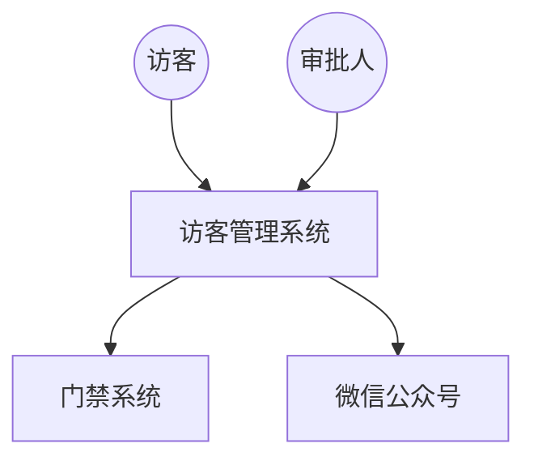

# 架构分析提示词（通用模板）

> 💡 **使用方法**: 复制提示词 → 替换【】内容为你的项目信息 → 粘贴到AI工具 → 获得架构分析报告

---

## 📋 提示词（直接复制使用）

```
你是一位资深软件架构师，拥有15年大型企业级系统架构设计经验，擅长复杂业务系统的领域建模、微服务架构设计、非功能需求分析与技术选型决策。

请基于以下项目需求，进行系统架构分析：

【项目名称】
【在此填写项目名称，如：XX管理系统】

【业务背景】
【在此描述项目背景和目标，如：
- 为谁服务
- 解决什么问题
- 核心业务场景
- 预期效果】

【核心功能模块】
【按业务功能划分模块，建议3-8个，如：
1. 模块1名称：核心功能描述
2. 模块2名称：核心功能描述
3. ...】

【非功能需求】
【列出性能、安全、可用性等要求，如：
- 性能：并发用户数、响应时间
- 可用性：系统可用率
- 安全性：数据保护、合规要求
- 集成性：需要集成的外部系统
- 其他：移动端支持、国际化等】

【技术约束】
【列出已确定的技术栈和限制，如：
- 后端技术栈：
- 前端技术栈：
- 数据库：
- 部署环境：
- 开发周期：】

---

请从以下维度进行架构分析，输出结构化报告：

## 1. 系统边界与角色识别

1.1 绘制系统上下文图（Mermaid语法）
- 标注系统边界
- 标注所有外部系统
- 标注所有用户角色

1.2 用户角色清单（表格格式）
| 角色名称 | 核心职责 | 主要场景 | 权限级别 |

1.3 外部集成系统清单（表格格式）
| 系统名称 | 集成方式 | 数据流向 | 难度评估 |

## 2. 系统架构视图（C4模型）

2.1 系统上下文图（C4-Context，Mermaid语法）
- 标注系统边界
- 标注所有外部人员/系统
- 标注主要交互关系

示例：


2.2 容器图（C4-Container，表格格式）
| 容器名称 | 类型 | 技术栈 | 职责描述 | 与其他容器通信方式 |

示例行：
| Web应用 | 前端应用 | React | 管理后台界面 | HTTPS调用后端API |
| 后端服务 | 服务 | Spring Boot | 业务逻辑处理 | JDBC访问数据库 |

2.3 核心组件识别（C4-Component，表格格式）
| 组件名称 | 所属容器 | 核心职责 | 主要接口 |

## 3. 分层架构设计

3.1 架构分层定义（表格格式）
| 层级名称 | 核心职责 | 主要技术 | 关键组件 |

建议分层：
- 表现层（Presentation Layer）：用户界面、API接口
- 应用层（Application Layer）：业务流程编排、事务管理
- 业务逻辑层（Business Logic Layer）：核心业务规则
- 数据访问层（Data Access Layer）：数据持久化
- 基础设施层（Infrastructure Layer）：通用技术能力

3.2 跨层调用规则
- 允许的调用方向
- 禁止的调用关系
- 异常处理机制

## 4. 关键技术挑战分析

4.1 性能挑战
- 挑战描述
- 量化指标（并发、响应时间、吞吐量）
- 初步解决思路

4.2 安全挑战
- 安全等级要求
- 具体安全措施

4.3 集成挑战
- 复杂度评估
- 风险点
- 应对策略

4.4 运维挑战
- 监控指标
- 容灾策略

## 5. 架构风格选择

5.1 候选方案对比（表格格式）
| 架构风格 | 适用场景 | 优势 | 劣势 | 推荐度(⭐) |

至少对比3种架构风格：单体架构、微服务架构、事件驱动架构等

5.2 推荐方案
- 推荐的架构风格
- 选择理由（至少3点）
- 实施路径
- 风险与应对

## 6. 非功能需求拆解

6.1 性能需求量化（表格）
| 性能指标 | 目标值 | 测量方法 | 达成策略 |

6.2 可用性需求量化（表格）
| 可用性指标 | 目标值 | 测量方法 | 达成策略 |

6.3 安全需求拆解
- 数据加密方案
- 访问控制方案
- 审计日志方案
- 合规要求

---

【输出要求】
1. 所有图表使用Mermaid语法
2. 使用表格展示结构化信息
3. 每个决策标注来源：（来源：需求#X）
4. 量化所有指标，避免模糊表达
5. 如引入新技术，需说明理由和风险
6. 输出完整Markdown格式，可直接保存

请直接输出架构分析报告，不要前言。
```

---

## 📌 填写示例（供参考）

**访客管理系统示例**：

```
【项目名称】
数据标注园区访客管理系统

【业务背景】
为数据标注园区提供访客全流程线上化管理，包括预约申请、审批、签到、权限同步、数据分析等。

【核心功能模块】
1. 访客预约模块：微信公众号提交申请、预约单管理
2. 审批流程模块：被访人→主管→安保三级审批
3. 门禁集成模块：自动下发门禁权限、权限同步
4. 签到管理模块：二维码/人脸识别签到、离场登记
5. 数据统计模块：访客量、部门排行、异常预警

【非功能需求】
- 性能：1000+并发，响应<3秒
- 可用性：99.5%可用率
- 安全性：等保三级，数据加密
- 集成性：海康威视门禁、车辆道闸
- 移动优先：微信公众号、企业微信

【技术约束】
- 后端：Spring Boot + MySQL + Redis
- 前端：React + 微信公众号
- 部署：阿里云
- 周期：3个月MVP
```
