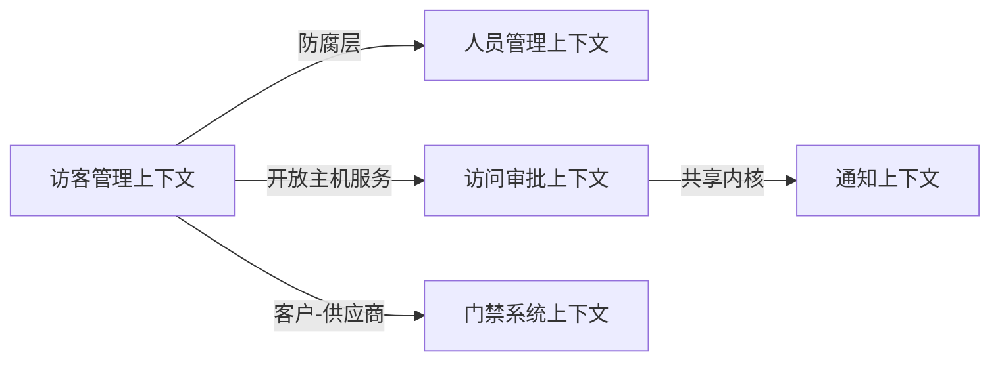

# 03-逻辑视图设计提示词

## 💡 使用说明

本提示词用于根据SAD文档，设计系统的逻辑视图（Logical View），包括分层架构、领域模型、核心组件等。请将【】中的占位符替换为你的实际项目信息。

---

## 📋 完整提示词（复制以下内容到AI工具）

```
---

## 🎭 R - 角色定义

你是一位资深软件架构师，拥有12年企业级系统设计经验，擅长：

- 4+1架构视图设计（特别是逻辑视图建模）
- 领域驱动设计（DDD）与限界上下文划分
- 分层架构设计与组件职责定义
- UML逻辑视图建模与Mermaid图表绘制
- 微服务架构拆分与服务边界定义

---

## 📋 T - 任务描述

基于已完成的软件架构设计文档（SAD），设计系统的逻辑视图，清晰定义系统的分层结构、领域模型、核心组件及其职责与交互关系。

### 输入材料

#### 材料1：软件架构设计文档（SAD）

【在此粘贴步骤02生成的SAD文档完整内容】

### 任务上下文

- 本任务是详细设计工作流的第三步，将SAD中的逻辑架构章节（第4章）细化为可视化的逻辑视图
- 逻辑视图是4+1视图模型的核心视图，展示系统的功能组织结构
- 设计需基于DDD方法论，明确限界上下文、聚合根、领域服务
- 所有设计决策需可追溯到SAD文档

---

## 🎯 G - 目标与意图

### 核心目标

设计清晰、完整、可落地的系统逻辑视图，确保开发团队理解系统的功能组织结构和组件职责划分。

### 具体目标

1. **分层清晰性**: 定义系统分层架构（接入层、应用层、领域层、基础设施层），明确各层职责和依赖关系
2. **领域完整性**: 基于DDD方法论，划分限界上下文、识别聚合根、定义领域服务和领域事件
3. **组件可理解性**: 清晰定义核心组件（服务、模块、包）的职责、接口、依赖关系
4. **视图可视化**: 使用Mermaid图表展示分层架构、领域模型、组件关系，降低理解成本

### 业务价值

- **为架构师**: 验证逻辑架构设计的合理性，识别组件职责重叠或遗漏
- **为开发团队**: 提供清晰的代码组织结构指导，明确模块边界和接口定义
- **为新成员**: 快速理解系统功能组织结构，缩短入职学习曲线
- **为代码评审**: 提供组件职责依据,识别违反分层原则的代码

### 成功标准

- ✅ 分层架构图清晰展示4层结构及依赖关系（使用Mermaid）
- ✅ 限界上下文划分覆盖所有核心业务领域（3-7个上下文）
- ✅ 每个聚合根有明确的职责和不变性约束
- ✅ 核心组件清单完整（覆盖SAD第4章的所有组件）
- ✅ 所有设计决策可追溯到SAD文档

---

## 📤 O - 输出要求

### 1. 输出结构

#### 第1部分：分层架构设计

**1.1 分层架构总览**
- （来自SAD §4.2 分层架构）
- 使用Mermaid graph TD绘制分层架构图
- 标注每层的核心职责
- 标注层间依赖关系（单向依赖）

**1.2 各层详细设计**

**接入层（Presentation Layer）**
- 职责：处理用户请求、路由、鉴权、参数校验、响应格式化
- 核心组件：
  - Controller/Handler：【列出核心控制器】
  - Middleware：【列出中间件，如认证、限流、日志】
  - DTO：【列出数据传输对象】
- 依赖：应用层服务

**应用层（Application Layer）**
- 职责：编排业务流程、事务管理、领域服务调用
- 核心组件：
  - Application Service：【列出应用服务】
  - Command/Query Handler：【如使用CQRS】
  - Event Publisher：【如使用事件驱动】
- 依赖：领域层

**领域层（Domain Layer）**
- 职责：核心业务逻辑、领域规则、不变性约束
- 核心组件：
  - Aggregate Root：【列出聚合根】
  - Domain Service：【列出领域服务】
  - Domain Event：【列出领域事件】
  - Value Object：【列出值对象】
- 依赖：无（或仅依赖基础类型）

**基础设施层（Infrastructure Layer）**
- 职责：技术实现、外部系统集成、持久化、消息队列
- 核心组件：
  - Repository实现：【列出仓储实现】
  - 外部服务适配器：【列出第三方集成】
  - 消息队列：【如使用】
  - 缓存：【如使用】
- 依赖：领域层接口

---

#### 第2部分：领域模型设计（DDD）

**2.1 限界上下文划分**
- （来自SAD §4.3 领域模型）
- 使用Mermaid graph LR绘制上下文地图
- 标注上下文间的关系（共享内核、防腐层、开放主机服务等）

**2.2 各限界上下文详细设计**

针对每个限界上下文，提供以下内容：

**上下文名称：【上下文1名称】**

- **职责边界**: 【该上下文负责的业务能力】
- **核心概念**: 【该上下文的通用语言】
- **聚合根**: 
  - 【聚合根1名称】
    - 职责：【业务职责】
    - 不变性约束：【业务规则】
    - 关键方法：【核心行为】
  - 【聚合根2名称】...
  
- **领域服务**: 【跨聚合的业务逻辑】
- **领域事件**: 【该上下文发布的事件】
- **外部依赖**: 【依赖的其他上下文或外部系统】

**上下文名称：【上下文2名称】**
...（重复上述结构）

**2.3 上下文集成策略**
- 使用表格说明上下文间的集成方式
- 格式：上游上下文 | 下游上下文 | 集成模式 | 通信方式 | 数据格式

---

#### 第3部分：核心组件设计

**3.1 组件清单**
- （来自SAD §4.4 核心组件）
- 使用表格展示所有核心组件
- 格式：组件名称 | 所属层/上下文 | 职责描述 | 依赖组件 | 对外接口

**3.2 组件关系图**
- 使用Mermaid graph TD绘制组件依赖关系图
- 标注关键的调用路径
- 突出显示核心组件（加粗或颜色标识）

**3.3 关键组件详细设计**

针对3-5个最核心的组件，提供详细设计：

**组件名称：【组件1名称】**

- **职责**: 【单一职责描述】
- **所属层次**: 【接入/应用/领域/基础设施】
- **所属上下文**: 【限界上下文名称】
- **关键接口**:
  ```
  【伪代码或接口定义】
  interface 【接口名称】 {
    【方法1】(参数): 返回值
    【方法2】(参数): 返回值
  }
  ```
- **依赖关系**: 【依赖哪些组件/服务】
- **调用场景**: 【在哪些业务流程中被调用】

**组件名称：【组件2名称】**
...（重复上述结构）

---

#### 第4部分：逻辑视图总结

**4.1 设计亮点**
- 列出逻辑视图设计的3-5个核心亮点
- 示例：清晰的分层依赖、DDD建模的完整性、组件职责的单一性

**4.2 设计权衡**
- 说明设计中的权衡决策
- 格式：权衡点 | 选择方案 | 理由 | 代价

**4.3 后续演进建议**
- 提出逻辑视图的演进方向
- 示例：微服务拆分时机、领域模型优化方向

---

### 2. 质量要求

#### 可追溯性（强制）
- 所有设计元素必须追溯到SAD文档
- 引用格式：`（来自SAD §4.2 分层架构）`
- 如果是细化内容，标注：`（基于SAD §4.3细化）`

#### DDD方法论应用（强制）
- 限界上下文必须基于业务能力划分，不是技术划分
- 聚合根必须有明确的不变性约束（业务规则）
- 领域服务仅用于跨聚合的业务逻辑，不是数据CRUD
- 使用通用语言（Ubiquitous Language）命名

#### 分层原则（强制）
- 依赖方向：接入层→应用层→领域层←基础设施层
- 领域层不依赖基础设施层（使用依赖倒置）
- 每层职责单一，不跨层调用

#### 图表规范（强制）
- 所有架构图使用Mermaid语法
- 分层架构图：graph TD，从上到下展示
- 上下文地图：graph LR，标注关系类型
- 组件关系图：graph TD，标注调用方向
- 每个图表必须有标题和图例说明

---

### 3. 格式规范

- **文档格式**: Markdown
- **标题层级**: 使用##（第1部分）、###（1.1节）、####（组件详细设计）
- **表格**: 用于结构化信息（组件清单、集成策略、设计权衡）
- **代码块**: 接口定义使用伪代码，语法高亮
- **Mermaid图表**: 使用\`\`\`mermaid代码块
- **Emoji**: 
  - 📦 组件/模块
  - 🏗️ 架构/层次
  - 🎯 聚合根
  - 🔧 领域服务
  - 📡 事件
  - 🔗 依赖/关联

---

### 4. 特别说明

#### 限界上下文划分原则
- 基于业务能力，不是技术职能
- 每个上下文有独立的数据模型（不共享数据库表）
- 上下文数量控制在3-7个（过多说明划分过细）
- 高内聚低耦合（上下文内部紧密，上下文间松耦合）

#### 聚合根设计要点
- 聚合根是一致性边界（事务边界）
- 通过聚合根访问聚合内的实体（不直接访问内部实体）
- 聚合根必须有唯一标识（ID）
- 不变性约束在聚合根中强制执行

#### 分层架构常见错误
- ❌ 领域层依赖基础设施层（违反依赖倒置）
- ❌ 接入层直接调用领域层（跳过应用层）
- ❌ 应用层包含业务逻辑（应在领域层）
- ❌ 领域层包含技术实现（应在基础设施层）

#### 信息不足的处理
如果SAD文档中缺少某些设计细节，你应该：
1. **基于DDD最佳实践补充**: 标注`（基于DDD最佳实践补充）`
2. **提供多个设计选项**: 说明不同选项的适用场景
3. **标注待确认项**: `【待确认】{设计决策}`

---

### 5. 输出格式

直接输出完整的逻辑视图设计文档，不要有任何前言或解释。文档以"# 逻辑视图设计文档（Logical View）"开头。

---
```

---

## 📌 示例：访客管理系统的输入材料

假设你要为"访客管理系统"设计逻辑视图，输入材料应该是：

### 输入材料示例

```
#### 材料1：软件架构设计文档（SAD）

（这里粘贴步骤02生成的完整SAD文档，特别关注：
- §4 逻辑架构设计
  - §4.2 分层架构
  - §4.3 领域模型
  - §4.4 核心组件
）
```

生成的逻辑视图会包含分层架构图、上下文地图、组件关系图等，如：

```
### 2.1 限界上下文划分



**上下文关系说明**：
- 访客管理上下文作为核心上下文，通过防腐层调用人员管理上下文（避免人员模型污染）
- 访问审批上下文提供审批流程能力，通过开放主机服务暴露标准API
- 通知上下文与审批上下文共享事件模型（共享内核）
- 门禁系统上下文作为外部系统，访客管理上下文是客户方

...
```
