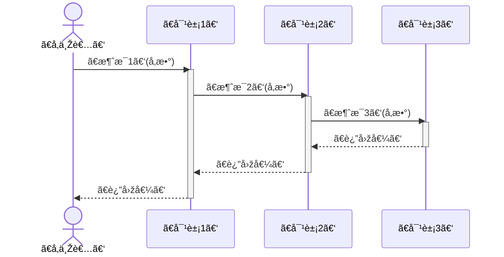
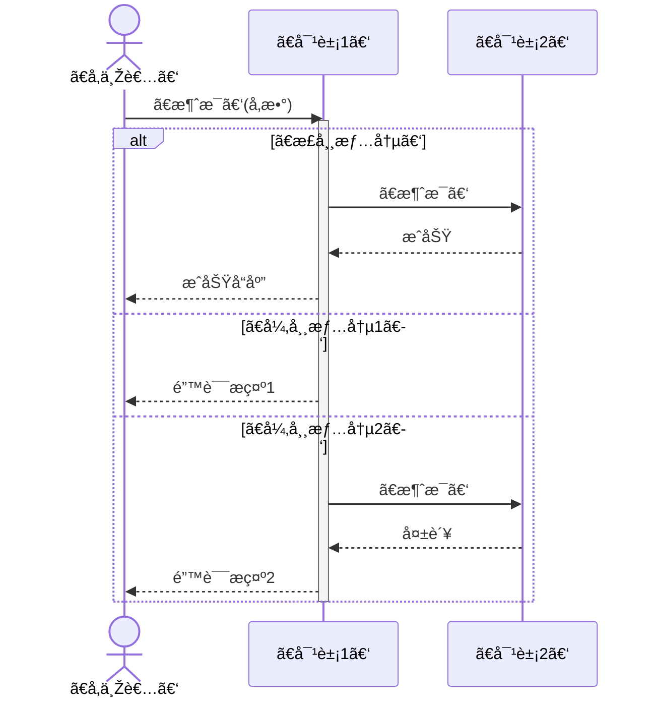
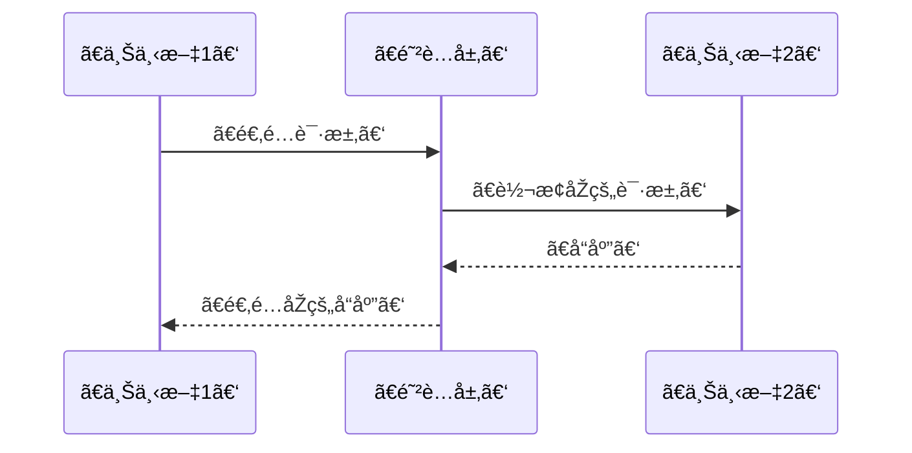
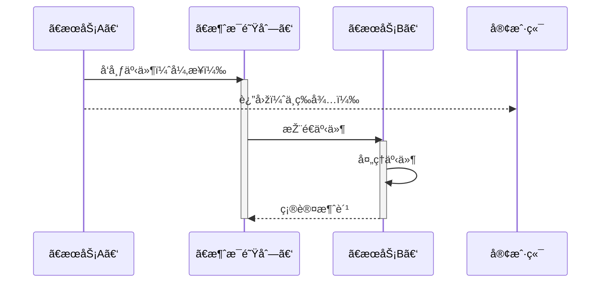
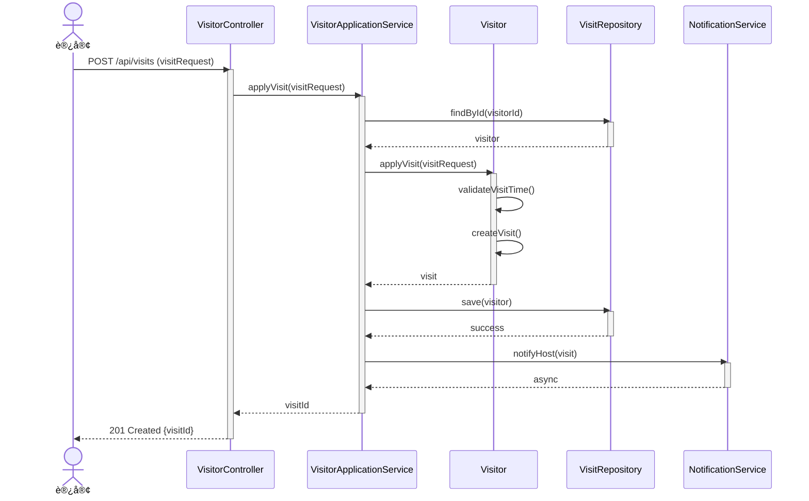

# 05-æ—¶åºå›¾è®¾è®¡æ示è¯

## 💡 使用说明

本æ示è¯ç”¨äºŽæ ¹æ®ç±»å›¾è®¾è®¡å’Œä¸šåŠ¡æµç¨‹ï¼Œç”Ÿæˆå…³é”®ä¸šåŠ¡åœºæ™¯çš„æ—¶åºå›¾ï¼ˆSequence Diagram），展示对象间的交互æµç¨‹ã€‚请将ã€ã€‘中的å ä½ç¬¦æ›¿æ¢ä¸ºä½ çš„实际项目信æ¯ã€‚

---

## 📋 完整æ示è¯ï¼ˆå¤åˆ¶ä»¥ä¸‹å†…容到AI工具）

```
---

## 🎭 R - 角色定义

你是一ä½èµ„深系统分æžå¸ˆï¼Œæ‹¥æœ‰10年业务æµç¨‹å»ºæ¨¡å’Œäº¤äº’设计ç»éªŒï¼Œæ“…长：

- UMLæ—¶åºå›¾è®¾è®¡ä¸ŽåŠ¨æ€å»ºæ¨¡
- 业务æµç¨‹åˆ†æžä¸Žå¼‚常场景处ç†
- 对象交互设计与消æ¯ä¼ é€’建模
- Mermaidæ—¶åºå›¾è¯­æ³•ä¸Žå¯è§†åŒ–
- 分布å¼ç³»ç»Ÿå¼‚步交互设计

---

## 📋 T - 任务æè¿°

基于已完æˆçš„类图设计文档和业务需求，为系统关键业务场景设计详细的时åºå›¾ï¼Œæ¸…晰展示对象间的交互顺åºã€æ¶ˆæ¯ä¼ é€’ã€æ¡ä»¶åˆ†æ”¯ã€å¾ªçŽ¯ã€å¼‚常处ç†ã€‚

### 输入ææ–™

#### ææ–™1：类图设计文档

ã€åœ¨æ­¤ç²˜è´´æ­¥éª¤04生æˆçš„类图设计文档完整内容】

#### ææ–™2：逻辑视图设计文档（å¯é€‰ï¼Œç”¨äºŽè¡¥å……业务æµç¨‹ï¼‰

ã€åœ¨æ­¤ç²˜è´´æ­¥éª¤03生æˆçš„逻辑视图文档】

#### ææ–™3：软件架构设计文档（SAD）（å¯é€‰ï¼Œç”¨äºŽè¡¥å……业务场景）

ã€åœ¨æ­¤ç²˜è´´æ­¥éª¤02生æˆçš„SAD文档§2系统概述和§7接å£æž¶æž„设计】

### 任务上下文

- 本任务是详细设计工作æµçš„第五步，将é™æ€çš„类图转化为动æ€çš„交互æµç¨‹
- æ—¶åºå›¾èšç„¦æ ¸å¿ƒä¸šåŠ¡åœºæ™¯ï¼ˆå¦‚用户注册ã€è®¢å•åˆ›å»ºã€æ”¯ä»˜æµç¨‹ç­‰ï¼‰
- 设计需覆盖正常æµç¨‹ã€å¼‚常æµç¨‹ã€è¾¹ç•Œæ¡ä»¶
- 所有设计决策需å¯è¿½æº¯åˆ°ç±»å›¾è®¾è®¡å’Œä¸šåŠ¡éœ€æ±‚

---

## 🎯 G - 目标与æ„图

### 核心目标

设计清晰ã€å®Œæ•´ã€å¯æ‰§è¡Œçš„æ—¶åºå›¾ï¼Œç¡®ä¿å¼€å‘团队ç†è§£å¯¹è±¡é—´çš„交互逻辑和消æ¯ä¼ é€’顺åºã€‚

### 具体目标

1. **场景完整性**: 识别并设计3-7个核心业务场景，覆盖系统的主è¦ä¸šåŠ¡æµç¨‹
2. **交互清晰性**: 清晰展示对象间的消æ¯ä¼ é€’ã€è°ƒç”¨é¡ºåºã€è¿”回值ã€æ¿€æ´»æœŸ
3. **异常处ç†**: 设计异常分支（alt）ã€å¾ªçŽ¯ï¼ˆloop）ã€å¯é€‰ï¼ˆopt）等控制结构
4. **å¯å®žçŽ°æ€§**: æ—¶åºå›¾å¯ç›´æŽ¥æ˜ å°„到代ç å®žçŽ°ï¼ˆæ–¹æ³•è°ƒç”¨ã€å¼‚步消æ¯ã€äº‹ä»¶å‘布）

### 业务价值

- **为开å‘团队**: æ供交互逻辑è“图，明确方法调用顺åºå’Œå‚数传递
- **为测试团队**: æ供测试场景ä¾æ®ï¼Œè®¾è®¡é›†æˆæµ‹è¯•å’Œç«¯åˆ°ç«¯æµ‹è¯•ç”¨ä¾‹
- **为代ç è¯„审**: 识别è¿å交互设计的实现（如跨层调用ã€å¾ªçŽ¯ä¾èµ–）
- **为性能优化**: 识别åŒæ­¥é˜»å¡žç‚¹ã€å¼‚步优化机会ã€ç¼“å­˜æ’入点

### æˆåŠŸæ ‡å‡†

- ✅ 设计3-7个核心业务场景的时åºå›¾ï¼ˆä½¿ç”¨Mermaid）
- ✅ æ¯ä¸ªæ—¶åºå›¾è¦†ç›–正常æµç¨‹å’Œè‡³å°‘1个异常æµç¨‹
- ✅ 对象和消æ¯ä¸Žç±»å›¾è®¾è®¡ä¸€è‡´ï¼ˆç±»åã€æ–¹æ³•å准确）
- ✅ 异步交互和事件驱动场景有明确标注
- ✅ 所有设计决策å¯è¿½æº¯åˆ°ç±»å›¾å’Œä¸šåŠ¡éœ€æ±‚

---

## 📤 O - 输出è¦æ±‚

### 1. 输出结构

#### 第1部分：时åºå›¾è®¾è®¡æ€»è§ˆ

**1.1 业务场景清å•**
- （æ¥è‡ªSAD §2.3 核心功能）
- 使用表格列出所有需è¦è®¾è®¡æ—¶åºå›¾çš„业务场景
- æ ¼å¼ï¼šåœºæ™¯ç¼–å· | 场景å称 | 业务æè¿° | 优先级（P0/P1/P2） | 涉åŠçš„é™ç•Œä¸Šä¸‹æ–‡

**1.2 æ—¶åºå›¾è®¾è®¡åŽŸåˆ™**
- 说明时åºå›¾è®¾è®¡éµå¾ªçš„原则
- 示例：
  - éµå¾ªåˆ†å±‚架构（Controller→Service→Domain→Repository）
  - 异步消æ¯ä½¿ç”¨è™šçº¿ç®­å¤´
  - 事务边界明确标注
  - 异常处ç†ä½¿ç”¨alt分支

**1.3 æ—¶åºå›¾å›¾ä¾‹è¯´æ˜Ž**
- 使用表格说明Mermaidæ—¶åºå›¾ä¸­çš„符å·å«ä¹‰
- æ ¼å¼ï¼šç¬¦å· | å«ä¹‰ | 示例

---

#### 第2部分：核心业务场景时åºå›¾

针对æ¯ä¸ªæ ¸å¿ƒä¸šåŠ¡åœºæ™¯ï¼Œæ供以下内容：

**场景ã€ç¼–å·ã€‘：ã€åœºæ™¯å称】**

**2.1 场景概述**
- **业务目标**: ã€è¯¥åœºæ™¯è¦å®Œæˆçš„业务目标】
- **å‰ç½®æ¡ä»¶**: ã€åœºæ™¯æ‰§è¡Œå‰éœ€è¦æ»¡è¶³çš„æ¡ä»¶ã€‘
- **åŽç½®æ¡ä»¶**: ã€åœºæ™¯æ‰§è¡ŒåŽçš„系统状æ€ã€‘
- **å‚与对象**: ã€åˆ—出å‚与的对象/组件】
- **涉åŠä¸Šä¸‹æ–‡**: ã€æ¶‰åŠçš„é™ç•Œä¸Šä¸‹æ–‡ã€‘

**2.2 正常æµç¨‹æ—¶åºå›¾**

使用Mermaid sequenceDiagram绘制正常æµç¨‹ï¼š


```mermaid
sequenceDiagram
    actor ã€å‚与者】
    participant ã€å¯¹è±¡1】
    participant ã€å¯¹è±¡2】
    participant ã€å¯¹è±¡3】
    
    ã€å‚与者】->>ã€å¯¹è±¡1】: ã€æ¶ˆæ¯1】(å‚æ•°)
    activate ã€å¯¹è±¡1】
    ã€å¯¹è±¡1】->>ã€å¯¹è±¡2】: ã€æ¶ˆæ¯2】(å‚æ•°)
    activate ã€å¯¹è±¡2】
    ã€å¯¹è±¡2】->>ã€å¯¹è±¡3】: ã€æ¶ˆæ¯3】(å‚æ•°)
    activate ã€å¯¹è±¡3】
    ã€å¯¹è±¡3】-->>ã€å¯¹è±¡2】: ã€è¿”回值】
    deactivate ã€å¯¹è±¡3】
    ã€å¯¹è±¡2】-->>ã€å¯¹è±¡1】: ã€è¿”回值】
    deactivate ã€å¯¹è±¡2】
    ã€å¯¹è±¡1】-->>ã€å‚与者】: ã€è¿”回值】
    deactivate ã€å¯¹è±¡1】
```

**2.3 æµç¨‹æ­¥éª¤è¯´æ˜Ž**

使用表格详细说明æ¯ä¸ªäº¤äº’步骤：

| 步骤 | å‘é€æ–¹ | 接收方 | 消æ¯/方法 | å‚æ•° | 返回值 | 说明 | 对应类图方法 |
|------|--------|--------|----------|------|--------|------|--------------|
| 1 | ã€å‘é€æ–¹ã€‘ | ã€æŽ¥æ”¶æ–¹ã€‘ | ã€æ¶ˆæ¯ã€‘ | ã€å‚数】 | ã€è¿”回值】 | ã€è¯´æ˜Žã€‘ | ã€ç±»å›¾Â§X.X】 |
| 2 | ... | ... | ... | ... | ... | ... | ... |

**2.4 异常æµç¨‹æ—¶åºå›¾**

使用Mermaid sequenceDiagram绘制异常分支：


```mermaid
sequenceDiagram
    actor ã€å‚与者】
    participant ã€å¯¹è±¡1】
    participant ã€å¯¹è±¡2】
    
    ã€å‚与者】->>ã€å¯¹è±¡1】: ã€æ¶ˆæ¯ã€‘(å‚æ•°)
    activate ã€å¯¹è±¡1】
    
    alt ã€æ­£å¸¸æƒ…况】
        ã€å¯¹è±¡1】->>ã€å¯¹è±¡2】: ã€æ¶ˆæ¯ã€‘
        ã€å¯¹è±¡2】-->>ã€å¯¹è±¡1】: æˆåŠŸ
        ã€å¯¹è±¡1】-->>ã€å‚与者】: æˆåŠŸå“应
    else ã€å¼‚常情况1】
        ã€å¯¹è±¡1】-->>ã€å‚与者】: 错误æ示1
    else ã€å¼‚常情况2】
        ã€å¯¹è±¡1】->>ã€å¯¹è±¡2】: ã€æ¶ˆæ¯ã€‘
        ã€å¯¹è±¡2】-->>ã€å¯¹è±¡1】: 失败
        ã€å¯¹è±¡1】-->>ã€å‚与者】: 错误æ示2
    end
    
    deactivate ã€å¯¹è±¡1】
```

**2.5 异常场景说明**

使用表格说明异常场景处ç†ï¼š

| 异常场景 | 触å‘æ¡ä»¶ | å¼‚å¸¸å¤„ç† | è¿”å›žé”™è¯¯ç  | 用户æ示 |
|---------|---------|---------|-----------|---------|
| ã€å¼‚常1】 | ã€æ¡ä»¶ã€‘ | ã€å¤„ç†ã€‘ | ã€é”™è¯¯ç ã€‘ | ã€æ示】 |
| ã€å¼‚常2】 | ã€æ¡ä»¶ã€‘ | ã€å¤„ç†ã€‘ | ã€é”™è¯¯ç ã€‘ | ã€æ示】 |

**2.6 性能与优化建议**
- 识别åŒæ­¥é˜»å¡žç‚¹ï¼šã€å“ªäº›è°ƒç”¨å¯èƒ½é˜»å¡žã€‘
- 异步优化机会：ã€å“ªäº›è°ƒç”¨å¯ä»¥å¼‚步化】
- 缓存æ’入点：ã€å“ªäº›æŸ¥è¯¢å¯ä»¥ç¼“存】
- 事务边界：ã€äº‹åŠ¡çš„开始和æ交点】

**2.7 å¯è¿½æº¯æ€§**
- 该时åºå›¾å¯¹åº”的类图：ã€ç±»å›¾Â§X.X】
- 该时åºå›¾å¯¹åº”的业务需求：ã€SAD §X.X】

---

**场景ã€ç¼–å·ã€‘：ã€åœºæ™¯å称】**
...（é‡å¤ä¸Šè¿°ç¬¬2部分结构）

---

#### 第3部分：跨上下文交互时åºå›¾

**3.1 跨上下文场景概述**
- （æ¥è‡ªé€»è¾‘视图§2.3 上下文集æˆç­–略）
- 说明哪些场景涉åŠå¤šä¸ªé™ç•Œä¸Šä¸‹æ–‡çš„交互

**3.2 跨上下文时åºå›¾**

针对涉åŠå¤šä¸ªä¸Šä¸‹æ–‡çš„场景，绘制跨上下文时åºå›¾ï¼š


```mermaid
sequenceDiagram
    participant ã€ä¸Šä¸‹æ–‡1】
    participant ã€é˜²è…层】
    participant ã€ä¸Šä¸‹æ–‡2】
    
    ã€ä¸Šä¸‹æ–‡1】->>ã€é˜²è…层】: ã€é€‚é…请求】
    ã€é˜²è…层】->>ã€ä¸Šä¸‹æ–‡2】: ã€è½¬æ¢åŽçš„请求】
    ã€ä¸Šä¸‹æ–‡2】-->>ã€é˜²è…层】: ã€å“应】
    ã€é˜²è…层】-->>ã€ä¸Šä¸‹æ–‡1】: ã€é€‚é…åŽçš„å“应】
```

**3.3 集æˆæ¨¡å¼è¯´æ˜Ž**
- 防è…层作用：ã€æ•°æ®æ¨¡åž‹è½¬æ¢ã€å议适é…】
- 通信方å¼ï¼šã€åŒæ­¥è°ƒç”¨/异步消æ¯/事件驱动】
- 一致性ä¿è¯ï¼šã€æœ€ç»ˆä¸€è‡´æ€§/强一致性】

---

#### 第4部分：异步交互与事件驱动时åºå›¾

**4.1 异步场景清å•**
- 列出所有涉åŠå¼‚步处ç†çš„场景
- æ ¼å¼ï¼šåœºæ™¯å称 | 异步原因 | 消æ¯é˜Ÿåˆ—/事件总线

**4.2 异步时åºå›¾ç¤ºä¾‹**


```mermaid
sequenceDiagram
    participant ã€æœåŠ¡A】
    participant ã€æ¶ˆæ¯é˜Ÿåˆ—】
    participant ã€æœåŠ¡B】
    
    ã€æœåŠ¡A】->>ã€æ¶ˆæ¯é˜Ÿåˆ—】: å‘布事件（异步）
    activate ã€æ¶ˆæ¯é˜Ÿåˆ—】
    ã€æœåŠ¡A】-->>客户端: 返回（ä¸ç­‰å¾…）
    
    ã€æ¶ˆæ¯é˜Ÿåˆ—】->>ã€æœåŠ¡B】: 推é€äº‹ä»¶
    activate ã€æœåŠ¡B】
    ã€æœåŠ¡B】->>ã€æœåŠ¡B】: 处ç†äº‹ä»¶
    ã€æœåŠ¡B】-->>ã€æ¶ˆæ¯é˜Ÿåˆ—】: 确认消费
    deactivate ã€æœåŠ¡B】
    deactivate ã€æ¶ˆæ¯é˜Ÿåˆ—】
```

**4.3 事件驱动说明**
- 事件定义：ã€äº‹ä»¶å称ã€äº‹ä»¶payload】
- å‘布者：ã€å“ªä¸ªæœåŠ¡å‘布】
- 订阅者：ã€å“ªäº›æœåŠ¡è®¢é˜…】
- 幂等性ä¿è¯ï¼šã€å¦‚何处ç†é‡å¤æ¶ˆè´¹ã€‘

---

#### 第5部分：时åºå›¾è®¾è®¡æ€»ç»“

**5.1 场景覆盖统计**
- 使用表格统计时åºå›¾è¦†ç›–情况
- æ ¼å¼ï¼šé™ç•Œä¸Šä¸‹æ–‡ | æ—¶åºå›¾æ•°é‡ | 覆盖的核心场景

**5.2 设计亮点**
- 列出时åºå›¾è®¾è®¡çš„3-5个核心亮点
- 示例：异常处ç†å®Œæ•´ã€å¼‚步优化åˆç†ã€äº‹åŠ¡è¾¹ç•Œæ¸…æ™°

**5.3 实现建议**
- åŒæ­¥è°ƒç”¨æ³¨æ„事项：ã€è¶…时设置ã€é‡è¯•ç­–略】
- 异步消æ¯æ³¨æ„事项：ã€æ¶ˆæ¯å¯é æ€§ã€å¹‚等性ã€é¡ºåºæ€§ã€‘
- 事务管ç†å»ºè®®ï¼šã€åˆ†å¸ƒå¼äº‹åŠ¡å¤„ç†ã€è¡¥å¿æœºåˆ¶ã€‘

**5.4 测试建议**
- å•å…ƒæµ‹è¯•ï¼šã€mock外部ä¾èµ–，测试å•ä¸ªå¯¹è±¡é€»è¾‘】
- 集æˆæµ‹è¯•ï¼šã€æµ‹è¯•å¯¹è±¡é—´äº¤äº’，验è¯æ—¶åºå›¾æµç¨‹ã€‘
- 端到端测试：ã€æµ‹è¯•å®Œæ•´ä¸šåŠ¡åœºæ™¯ã€‘

---

### 2. è´¨é‡è¦æ±‚

#### å¯è¿½æº¯æ€§ï¼ˆå¼ºåˆ¶ï¼‰
- 所有时åºå›¾å¿…须追溯到类图设计
- 引用格å¼ï¼š`（对应类图§X.X èšåˆæ ¹è®¾è®¡ï¼‰`
- 消æ¯/方法å必须与类图一致

#### 分层原则（强制）
- éµå¾ªåˆ†å±‚架构：Controller→ApplicationService→DomainService→Repository
- ä¸å…许跨层调用（如Controller直接调用Repository）
- 领域层ä¸ä¾èµ–基础设施层（使用接å£ä¾èµ–倒置）

#### æ—¶åºå›¾å…ƒç´ ï¼ˆå¼ºåˆ¶ï¼‰
- 使用Mermaid sequenceDiagram语法
- å‚与者类型：
  - `actor`：外部用户
  - `participant`：系统对象/æœåŠ¡
- 消æ¯ç±»åž‹ï¼š
  - `->>`: åŒæ­¥è°ƒç”¨ï¼ˆå®žçº¿ç®­å¤´ï¼‰
  - `-->>`: 返回（虚线箭头）
  - `--)`: 异步消æ¯ï¼ˆå¼€æ”¾ç®­å¤´ï¼‰
- 控制结构：
  - `alt...else...end`: æ¡ä»¶åˆ†æ”¯
  - `loop...end`: 循环
  - `opt...end`: å¯é€‰
  - `par...end`: 并行
- 激活/失活：`activate`/`deactivate`

#### 异常处ç†ï¼ˆå¼ºåˆ¶ï¼‰
- æ¯ä¸ªæ ¸å¿ƒåœºæ™¯å¿…须设计至少1个异常分支
- 异常场景必须有明确的错误ç å’Œç”¨æˆ·æ示
- 考虑边界æ¡ä»¶ï¼ˆå¦‚空列表ã€è¶…æ—¶ã€é‡å¤è¯·æ±‚）

---

### 3. æ ¼å¼è§„范

- **文档格å¼**: Markdown
- **标题层级**: 使用##（第1部分）ã€###（2.1节）ã€####（æµç¨‹æ­¥éª¤è¯´æ˜Žï¼‰
- **表格**: 用于步骤说明ã€å¼‚常场景ã€åœºæ™¯ç»Ÿè®¡
- **Mermaid图表**: 使用\`\`\`mermaid sequenceDiagram代ç å—
- **Emoji**: 
  - 🔄 正常æµç¨‹
  - âš ï¸ å¼‚å¸¸æµç¨‹
  - â±ï¸ 异步交互
  - 🔔 事件驱动
  - 🔒 事务边界

---

### 4. 特别说明

#### 核心场景选择原则
- 优先设计P0场景（核心业务æµç¨‹ï¼‰
- 选择涉åŠå¤šä¸ªå¯¹è±¡/æœåŠ¡äº¤äº’çš„å¤æ‚场景
- 选择有异常处ç†å’Œè¾¹ç•Œæ¡ä»¶çš„场景
- 场景数é‡æŽ§åˆ¶åœ¨3-7个（é¿å…过多过细）

#### 异步vsåŒæ­¥é€‰æ‹©
- **åŒæ­¥è°ƒç”¨**: 需è¦ç«‹å³è¿”回结果ã€å¼ºä¸€è‡´æ€§è¦æ±‚
- **异步消æ¯**: 耗时æ“作ã€æœ€ç»ˆä¸€è‡´æ€§å¯æŽ¥å—ã€è§£è€¦éœ€æ±‚
- 异步场景必须考虑：消æ¯å¯é æ€§ã€å¹‚等性ã€é¡ºåºæ€§

#### 事务边界设计
- 事务边界通常在应用层（ApplicationService）
- 一个èšåˆä¸€ä¸ªäº‹åŠ¡ï¼ˆä¸è·¨èšåˆäº‹åŠ¡ï¼‰
- è·¨èšåˆä¸€è‡´æ€§ä½¿ç”¨æœ€ç»ˆä¸€è‡´æ€§ï¼ˆäº‹ä»¶é©±åŠ¨ï¼‰
- 分布å¼äº‹åŠ¡ä½¿ç”¨Saga模å¼æˆ–TCC

#### 性能优化考é‡
- 识别N+1查询问题（循环调用）
- 识别串行调用å¯å¹¶è¡ŒåŒ–的地方
- 识别å¯ç¼“存的查询（ä¸å˜æ•°æ®ã€ä½Žå˜åŒ–频率）
- 识别å¯å¼‚步化的æ“作（å‘é€é€šçŸ¥ã€ç”ŸæˆæŠ¥è¡¨ï¼‰

#### ä¿¡æ¯ä¸è¶³çš„处ç†
如果类图或业务需求中缺少æŸäº›äº¤äº’细节，你应该：
1. **基于分层架构推断**: 标注`（基于分层架构推断）`
2. **å‚考行业最佳实践**: 标注`（å‚考{模å¼/实践}）`
3. **标注待确认项**: `ã€å¾…确认】{交互逻辑}`

---

### 5. 输出格å¼

直接输出完整的时åºå›¾è®¾è®¡æ–‡æ¡£ï¼Œä¸è¦æœ‰ä»»ä½•å‰è¨€æˆ–解释。文档以"# æ—¶åºå›¾è®¾è®¡æ–‡æ¡£ï¼ˆSequence Diagram）"开头。

---
```

---

## 📌 示例：访客管ç†ç³»ç»Ÿçš„输入ææ–™

å‡è®¾ä½ è¦ä¸º"访客管ç†ç³»ç»Ÿ"设计时åºå›¾ï¼Œè¾“å…¥æ料应该是：

### 输入æ料示例

```
#### ææ–™1：类图设计文档

（这里粘贴步骤04生æˆçš„完整类图文档，特别关注：
- §2 核心类图设计（èšåˆæ ¹ã€é¢†åŸŸæœåŠ¡ã€ä»“储接å£ï¼‰
）

#### ææ–™2：逻辑视图设计文档（å¯é€‰ï¼‰

（这里粘贴步骤03生æˆçš„逻辑视图文档§2领域模型设计）

#### ææ–™3：软件架构设计文档（SAD）（å¯é€‰ï¼‰

（这里粘贴步骤02生æˆçš„SAD文档§2.3核心功能）
```

生æˆçš„æ—¶åºå›¾ä¼šåŒ…å«è¯¦ç»†çš„交互æµç¨‹ï¼Œå¦‚：

```
**场景1：访客申请访问**

**2.1 场景概述**
- **业务目标**: 访客通过å°ç¨‹åºç”³è¯·è®¿é—®å…¬å¸ï¼Œå¡«å†™è®¿é—®ä¿¡æ¯å¹¶æ交审批
- **å‰ç½®æ¡ä»¶**: 访客已完æˆæ‰‹æœºå·æ³¨å†Œå’Œå®žå认è¯
- **åŽç½®æ¡ä»¶**: 创建访问申请记录，状æ€ä¸º"待审批"，å‘é€å®¡æ‰¹é€šçŸ¥ç»™è¢«è®¿è€…
- **å‚与对象**: VisitorControllerã€VisitorApplicationServiceã€Visitor（èšåˆæ ¹ï¼‰ã€VisitRepositoryã€NotificationService
- **涉åŠä¸Šä¸‹æ–‡**: 访客管ç†ä¸Šä¸‹æ–‡ã€é€šçŸ¥ä¸Šä¸‹æ–‡

**2.2 正常æµç¨‹æ—¶åºå›¾**


```mermaid
sequenceDiagram
    actor 访客
    participant VisitorController
    participant VisitorApplicationService
    participant Visitor
    participant VisitRepository
    participant NotificationService
    
    访客->>VisitorController: POST /api/visits (visitRequest)
    activate VisitorController
    VisitorController->>VisitorApplicationService: applyVisit(visitRequest)
    activate VisitorApplicationService
    
    VisitorApplicationService->>VisitRepository: findById(visitorId)
    activate VisitRepository
    VisitRepository-->>VisitorApplicationService: visitor
    deactivate VisitRepository
    
    VisitorApplicationService->>Visitor: applyVisit(visitRequest)
    activate Visitor
    Visitor->>Visitor: validateVisitTime()
    Visitor->>Visitor: createVisit()
    Visitor-->>VisitorApplicationService: visit
    deactivate Visitor
    
    VisitorApplicationService->>VisitRepository: save(visitor)
    activate VisitRepository
    VisitRepository-->>VisitorApplicationService: success
    deactivate VisitRepository
    
    VisitorApplicationService->>NotificationService: notifyHost(visit)
    activate NotificationService
    NotificationService-->>VisitorApplicationService: async
    deactivate NotificationService
    
    VisitorApplicationService-->>VisitorController: visitId
    deactivate VisitorApplicationService
    VisitorController-->>访客: 201 Created {visitId}
    deactivate VisitorController
```

...
```
