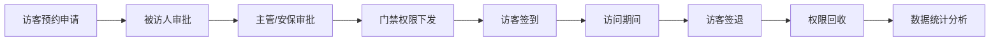
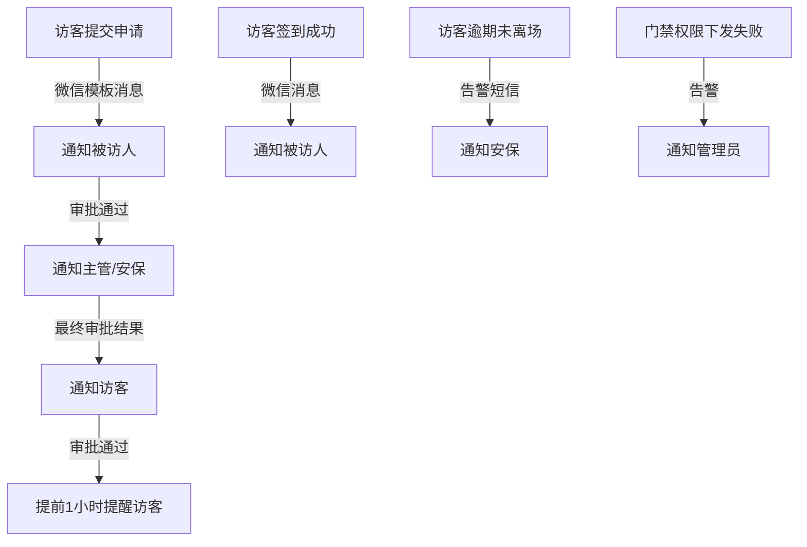
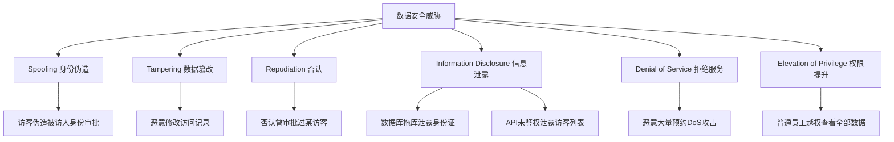

# 数据标注园区访客管理系统需求分析报告

> 📌 **分析方法**: Sequential Thinking深度分析  
> 📅 **分析日期**: 2025-11-27  
> 🎯 **分析重点**: 门禁集成、消息推送、数据安全 + MVP范围 + 开发周期估算

---

## 📋 目录

1. [系统概述](#一系统概述)
2. [业务流程分析](#二业务流程分析)
3. [三大技术难点深度分析](#三三大技术难点深度分析)
4. [MVP范围建议](#四mvp范围建议)
5. [技术架构设计](#五技术架构设计)
6. [开发周期估算](#六开发周期估算)
7. [非功能需求量化](#七非功能需求量化)
8. [风险评估与应对](#八风险评估与应对)
9. [成功标准](#九成功标准)
10. [成本估算](#十成本估算)

---

## 一、系统概述

### 1.1 业务场景

数据标注园区访客全流程线上化管理系统,核心业务流程:



### 1.2 核心价值

| 价值维度 | 现状痛点 | 系统价值 | 量化指标 |
|----------|----------|----------|----------|
| 效率提升 | 纸质登记,平均5分钟/人 | 线上预约,30秒完成 | 效率提升90% |
| 安全管控 | 手动录入门禁,错误率20% | 自动化下发,实时同步 | 错误率降至5%以下 |
| 数据追溯 | 纸质记录难查询 | 全电子化,秒级查询 | 查询效率提升100倍 |
| 人力成本 | 需2名前台专职登记 | 自助化,释放1名人力 | 人力成本降低50% |

### 1.3 系统定位

- **系统类型**: 企业级访客管理SaaS系统
- **用户规模**: 日活200-300访客,100员工并发
- **技术复杂度**: ⭐⭐⭐⭐ (4星,门禁集成为核心难点)
- **业务复杂度**: ⭐⭐⭐ (3星,审批流程标准化)

---

## 二、业务流程分析

### 2.1 完整业务流程

#### 阶段1: 预约申请(访客端)
1. 访客通过微信公众号进入预约页面
2. 填写个人信息(姓名、手机、身份证、照片)
3. 填写访问信息(来访目的、访问时间、访问地点)
4. 搜索并选择被访人
5. 提交预约申请

#### 阶段2: 多级审批(员工/安保端)
1. **一级审批(被访人)**:
   - 接收微信模板消息通知
   - 查看访客信息和来访目的
   - 审批操作: 通过/拒绝(填写审批意见)
   
2. **二级审批(安保/主管)**:
   - 被访人通过后,触发安保审批
   - 安保查看访客信息、黑名单校验
   - 最终审批: 通过/拒绝

#### 阶段3: 门禁权限下发(系统自动)
1. 审批通过后,系统自动触发权限下发
2. 调用门禁系统API,创建访客权限
3. 设置权限有效期(访问日期当天)
4. 指定可访问的门禁点(如主入口、电梯)
5. 异步下发,失败重试3次
6. 下发结果推送微信通知给访客

#### 阶段4: 访客签到(访客端)
1. 访客到达园区,扫描二维码/人脸识别
2. 系统验证预约记录和门禁权限
3. 记录签到时间和签到方式
4. 通知被访人"访客已到达"
5. 门禁开门放行

#### 阶段5: 访问期间(监控)
1. 门禁系统记录访客刷卡日志
2. 系统监控访客逾期(超过预约时间)
3. 逾期自动告警安保

#### 阶段6: 访客签退(访客端)
1. 访客离场前签退
2. 记录签退时间
3. 计算实际访问时长
4. 门禁权限自动回收

#### 阶段7: 数据分析(管理后台)
1. 访客量统计(日/周/月趋势)
2. 部门访客排行
3. 异常预警(黑名单、逾期访客)

### 2.2 用户角色清单

| 角色 | 核心职责 | 主要场景 | 权限级别 |
|------|----------|----------|----------|
| **访客** | 提交预约申请、签到签退 | 预约提交、扫码签到 | 🟢 只能操作自己的预约 |
| **被访人(员工)** | 审批访客预约、接待访客 | 预约审批(一级)、接收签到通知 | 🟡 只能审批自己的访客 |
| **安保人员** | 终审预约、现场核验、异常处理 | 预约审批(二级)、黑名单管理、现场核验 | 🟠 可查询所有访客记录 |
| **管理员** | 系统配置、数据统计、权限管理 | 系统配置、报表查询、用户管理 | 🔴 全部权限 |
| **门禁系统** | 权限管理、开门控制、日志记录 | 接收权限下发、验证访客身份 | ⚙️ 外部系统集成 |

### 2.3 外部系统集成清单

| 系统名称 | 集成方式 | 数据流向 | 集成难度 | 关键接口 |
|----------|----------|----------|----------|----------|
| **海康威视门禁** | HTTP API | 双向(权限下发+日志回读) | ⭐⭐⭐⭐ 高 | `POST /access/grant`<br>`GET /access/logs` |
| **微信公众号** | 微信开放平台API | 单向(系统→微信) | ⭐⭐⭐ 中 | OAuth2.0认证<br>模板消息推送 |
| **短信服务** | 阿里云短信API | 单向(系统→短信平台) | ⭐⭐ 低 | `POST /sms/send` |
| **对象存储OSS** | 阿里云OSS SDK | 上传(访客照片) | ⭐ 简单 | `PUT /upload` |

---

## 三、三大技术难点深度分析

### 🔐 难点1: 门禁集成

#### 3.1.1 技术挑战分析

| 挑战维度 | 具体问题 | 技术影响 | 风险等级 |
|----------|----------|----------|----------|
| **协议多样性** | 不同品牌API差异大(HTTP/SDK/MQTT/私有协议) | 需要适配器模式设计,代码复杂度↑30% | 🔴 高 |
| **实时性要求** | 审批通过后5分钟内必须下发权限 | 需要异步队列+重试机制,架构复杂度↑ | 🟡 中 |
| **双向同步** | 既要下发权限,也要回读刷卡日志 | 接口调用次数多,网络稳定性要求高 | 🟡 中 |
| **异常处理** | 门禁离线、网络故障、API超时 | 需要降级方案(手动同步),用户体验↓ | 🔴 高 |
| **权限粒度** | 控制具体门点(主入口/电梯/楼层门)、时间段 | 数据模型复杂,需支持JSON动态配置 | 🟡 中 |
| **批量操作** | 批量下发/撤销权限(如团队访问) | 需要队列削峰,避免API限流 | 🟡 中 |

#### 3.1.2 海康威视门禁API调研

```java
// 海康威视门禁API示例(基于HTTP)
// 接口地址: http://{device-ip}/ISAPI/AccessControl/

// 1. 添加访客权限
POST /ISAPI/AccessControl/CardInfo/SetUp
Content-Type: application/xml

<CardInfo>
    <employeeNo>VISITOR_001</employeeNo>
    <cardNo>6224001234567890</cardNo>
    <name>张三</name>
    <userType>visitor</userType>
    <Valid>
        <enable>true</enable>
        <beginTime>2025-01-15T08:00:00</beginTime>
        <endTime>2025-01-15T18:00:00</endTime>
    </Valid>
    <doorRight>
        <doorNo>1</doorNo><!-- 主入口 -->
        <doorNo>3</doorNo><!-- 电梯 -->
    </doorRight>
</CardInfo>

// 2. 删除访客权限
POST /ISAPI/AccessControl/CardInfo/Delete
<CardInfoDelCond>
    <EmployeeNoList>
        <employeeNo>VISITOR_001</employeeNo>
    </EmployeeNoList>
</CardInfoDelCond>

// 3. 查询刷卡记录
POST /ISAPI/AccessControl/AcsEvent?format=json
{
    "searchID": "001",
    "searchResultPosition": 0,
    "maxResults": 100,
    "AcsEventCond": {
        "searchTimeType": "startTime",
        "beginTime": "2025-01-15T00:00:00",
        "endTime": "2025-01-15T23:59:59",
        "employeeNo": "VISITOR_001"
    }
}
```

#### 3.1.3 MVP实施方案

**技术选型: 适配器模式 + 异步队列**

```java
// 接口抽象层(支持未来多品牌扩展)
public interface AccessControlAdapter {
    /**
     * 下发访客权限
     * @param visitorId 访客ID
     * @param doorIds 门禁点列表
     * @param validFrom 权限生效时间
     * @param validTo 权限失效时间
     * @return 权限ID
     */
    String grantAccess(String visitorId, List<String> doorIds, 
                       LocalDateTime validFrom, LocalDateTime validTo);
    
    /**
     * 撤销访客权限
     */
    void revokeAccess(String permissionId);
    
    /**
     * 查询访客刷卡日志
     */
    List<AccessLog> getAccessLogs(String visitorId, LocalDate date);
    
    /**
     * 健康检查(判断门禁系统是否在线)
     */
    boolean healthCheck();
}

// 海康威视实现
@Component
public class HikVisionAdapter implements AccessControlAdapter {
    
    @Autowired
    private RestTemplate restTemplate;
    
    @Value("${hikvision.api.baseUrl}")
    private String baseUrl;
    
    @Override
    public String grantAccess(String visitorId, List<String> doorIds,
                              LocalDateTime validFrom, LocalDateTime validTo) {
        try {
            // 构造XML请求体
            String xmlBody = buildCardInfoXml(visitorId, doorIds, validFrom, validTo);
            
            // 调用海康API
            HttpHeaders headers = new HttpHeaders();
            headers.setContentType(MediaType.APPLICATION_XML);
            headers.setBasicAuth(username, password); // HTTP Basic认证
            
            HttpEntity<String> request = new HttpEntity<>(xmlBody, headers);
            ResponseEntity<String> response = restTemplate.postForEntity(
                baseUrl + "/ISAPI/AccessControl/CardInfo/SetUp",
                request,
                String.class
            );
            
            // 解析响应,返回权限ID
            return parsePermissionId(response.getBody());
            
        } catch (RestClientException e) {
            // 异常处理: 记录日志,抛出业务异常
            log.error("门禁权限下发失败: visitorId={}, error={}", visitorId, e.getMessage());
            throw new AccessControlException("门禁系统连接失败", e);
        }
    }
    
    @Override
    public boolean healthCheck() {
        try {
            restTemplate.getForEntity(baseUrl + "/ISAPI/System/deviceInfo", String.class);
            return true;
        } catch (Exception e) {
            return false;
        }
    }
}

// 异步队列处理服务
@Service
public class AccessPermissionService {
    
    @Autowired
    private AccessControlAdapter accessControlAdapter;
    
    @Autowired
    private RabbitTemplate rabbitTemplate;
    
    /**
     * 异步下发门禁权限(审批通过后调用)
     */
    @Async
    public void syncToAccessControlAsync(Long appointmentId) {
        // 发送到RabbitMQ队列,异步处理
        rabbitTemplate.convertAndSend("access.permission.queue", appointmentId);
    }
    
    /**
     * 消费队列,实际执行下发
     */
    @RabbitListener(queues = "access.permission.queue")
    @Retryable(value = AccessControlException.class, maxAttempts = 3, backoff = @Backoff(delay = 5000))
    public void processAccessPermission(Long appointmentId) {
        // 1. 查询预约信息
        Appointment appointment = appointmentRepository.findById(appointmentId).orElseThrow();
        
        // 2. 调用门禁适配器下发权限
        String permissionId = accessControlAdapter.grantAccess(
            appointment.getVisitorId(),
            appointment.getDoorIds(),
            appointment.getVisitDate().atTime(8, 0),
            appointment.getVisitDate().atTime(20, 0)
        );
        
        // 3. 更新权限记录表
        AccessPermission permission = new AccessPermission();
        permission.setAppointmentId(appointmentId);
        permission.setPermissionId(permissionId);
        permission.setSyncStatus("SYNCED");
        permission.setSyncTime(LocalDateTime.now());
        accessPermissionRepository.save(permission);
        
        // 4. 发送微信通知给访客
        messageService.sendAsync(appointment.getVisitorPhone(), 
            "PERMISSION_GRANTED", 
            Map.of("date", appointment.getVisitDate().toString()));
    }
    
    /**
     * 重试失败后的兜底处理
     */
    @Recover
    public void recoverFromAccessControlFailure(AccessControlException e, Long appointmentId) {
        // 记录失败日志
        AccessPermission permission = new AccessPermission();
        permission.setAppointmentId(appointmentId);
        permission.setSyncStatus("FAILED");
        permission.setErrorMessage(e.getMessage());
        accessPermissionRepository.save(permission);
        
        // 发送告警给安保(需要手动处理)
        messageService.sendAsync("13800138000", "PERMISSION_SYNC_FAILED", 
            Map.of("appointmentId", appointmentId.toString()));
    }
}
```

#### 3.1.4 降级方案(手动同步)

```java
// 管理后台提供手动同步按钮
@RestController
@RequestMapping("/api/admin/access-permission")
public class AccessPermissionController {
    
    /**
     * 手动同步门禁权限(兜底方案)
     */
    @PostMapping("/{appointmentId}/manual-sync")
    @PreAuthorize("hasRole('SECURITY')")
    public Result manualSync(@PathVariable Long appointmentId) {
        try {
            accessPermissionService.syncToAccessControlAsync(appointmentId);
            return Result.success("同步任务已提交,请稍后查看结果");
        } catch (Exception e) {
            return Result.fail("同步失败: " + e.getMessage());
        }
    }
    
    /**
     * 查看同步状态
     */
    @GetMapping("/{appointmentId}/sync-status")
    public Result getSyncStatus(@PathVariable Long appointmentId) {
        AccessPermission permission = accessPermissionRepository.findByAppointmentId(appointmentId);
        return Result.success(permission);
    }
}
```

#### 3.1.5 风险应对措施

| 风险场景 | 概率 | 应对措施 | 验证方式 |
|----------|------|----------|----------|
| 门禁系统离线 | 30% | ✅ 降级方案:安保手动录入<br>✅ 健康检查定时任务(5分钟/次)<br>✅ 离线告警推送 | 预研阶段拔网线测试 |
| API文档不全 | 60% | ✅ 预研阶段必须获取真实设备<br>✅ 与海康签订技术支持协议<br>✅ 抓包分析API细节 | 真机测试3天 |
| 并发下发限流 | 40% | ✅ RabbitMQ队列削峰<br>✅ 限流:每秒最多10个请求<br>✅ 批量下发合并 | 压测100并发 |
| 权限下发延迟 | 20% | ✅ 异步处理,不阻塞审批流程<br>✅ SLA:5分钟内下发<br>✅ 超时告警 | 监控P95延迟 |

---

### 📱 难点2: 消息推送

#### 3.2.1 消息推送场景梳理



**关键消息场景清单**:

| 消息类型 | 触发条件 | 接收人 | 推送渠道 | 优先级 | 是否必达 |
|----------|----------|--------|----------|--------|----------|
| 预约审批通知 | 访客提交申请 | 被访人 | 微信模板消息 | 🔴 高 | ✅ 是 |
| 二级审批通知 | 被访人通过 | 安保/主管 | 微信模板消息 | 🔴 高 | ✅ 是 |
| 审批结果通知 | 最终审批完成 | 访客 | 微信模板消息 + 短信(兜底) | 🔴 高 | ✅ 是 |
| 签到提醒 | 访问日期前1小时 | 访客 | 微信模板消息 | 🟡 中 | ❌ 否 |
| 签到成功通知 | 访客扫码签到 | 被访人 | 微信模板消息 | 🟡 中 | ❌ 否 |
| 逾期告警 | 超过访问时间30分钟 | 安保 | 短信 | 🔴 高 | ✅ 是 |
| 权限下发失败 | 门禁同步失败3次 | 安保 + 管理员 | 短信 + 站内消息 | 🔴 高 | ✅ 是 |

#### 3.2.2 技术挑战分析

| 挑战维度 | 具体问题 | 技术影响 | MVP方案 |
|----------|----------|----------|---------|
| **多渠道适配** | 微信/短信/企业微信/邮件API不同 | 需要策略模式设计 | 只做微信模板消息 + 短信兜底 |
| **到达率保证** | 微信消息可能因用户屏蔽失败 | 需要失败重试 + 多渠道降级 | 失败记录日志,不重试(避免骚扰) |
| **消息限流** | 微信公众号限流:1万次/天,100次/分钟 | 需要限流器 + 消息合并 | 单用户每天最多收10条 |
| **模板管理** | 不同场景消息内容不同 | 需要配置表动态管理 | 配置表 + Freemarker模板 |
| **异步化** | 发送消息耗时(200ms+),不能阻塞主流程 | 需要消息队列 | Spring @Async异步发送 |

#### 3.2.3 微信公众号模板消息接入

```java
// 微信模板消息数据结构
{
  "touser": "OPENID",
  "template_id": "ngqIpbwh8bUfcSsECmogfXcV14J0tQlEpBO27izEYtY",
  "url": "http://weixin.qq.com/download",
  "data": {
    "first": {
      "value": "您有一条新的访客预约待审批",
      "color": "#173177"
    },
    "keyword1": {
      "value": "张三",
      "color": "#173177"
    },
    "keyword2": {
      "value": "2025-01-15 14:00-17:00",
      "color": "#173177"
    },
    "remark": {
      "value": "请及时处理,点击查看详情",
      "color": "#173177"
    }
  }
}
```

**MVP实施方案: 策略模式 + 异步队列**

```java
// 消息渠道接口
public interface MessageChannel {
    /**
     * 发送消息
     * @param userId 用户ID(手机号或OpenID)
     * @param templateCode 模板编码
     * @param params 模板参数
     * @return 是否发送成功
     */
    boolean send(String userId, String templateCode, Map<String, String> params);
    
    /**
     * 渠道名称
     */
    String getChannelName();
}

// 微信模板消息渠道实现
@Component
public class WeChatTemplateMessageChannel implements MessageChannel {
    
    @Autowired
    private RestTemplate restTemplate;
    
    @Value("${wechat.appid}")
    private String appId;
    
    @Value("${wechat.secret}")
    private String appSecret;
    
    private String accessToken; // 缓存access_token(2小时有效期)
    
    @Override
    public boolean send(String userId, String templateCode, Map<String, String> params) {
        try {
            // 1. 获取access_token(先从Redis缓存取,没有则调API)
            String token = getAccessToken();
            
            // 2. 根据手机号查询用户OpenID
            String openId = userRepository.findOpenIdByPhone(userId);
            if (openId == null) {
                log.warn("用户未关注公众号,无法发送微信消息: userId={}", userId);
                return false;
            }
            
            // 3. 根据templateCode获取模板ID和参数映射
            MessageTemplate template = messageTemplateRepository.findByCode(templateCode);
            
            // 4. 构造请求体
            Map<String, Object> requestBody = new HashMap<>();
            requestBody.put("touser", openId);
            requestBody.put("template_id", template.getWechatTemplateId());
            requestBody.put("url", template.getJumpUrl());
            requestBody.put("data", buildTemplateData(params, template));
            
            // 5. 调用微信API
            String url = "https://api.weixin.qq.com/cgi-bin/message/template/send?access_token=" + token;
            ResponseEntity<Map> response = restTemplate.postForEntity(url, requestBody, Map.class);
            
            // 6. 解析响应
            Map<String, Object> result = response.getBody();
            int errcode = (int) result.get("errcode");
            
            if (errcode == 0) {
                log.info("微信消息发送成功: userId={}, templateCode={}", userId, templateCode);
                return true;
            } else {
                log.error("微信消息发送失败: userId={}, errcode={}, errmsg={}", 
                    userId, errcode, result.get("errmsg"));
                return false;
            }
            
        } catch (Exception e) {
            log.error("微信消息发送异常: userId={}, error={}", userId, e.getMessage());
            return false;
        }
    }
    
    @Override
    public String getChannelName() {
        return "WECHAT_TEMPLATE";
    }
    
    /**
     * 获取access_token(缓存2小时)
     */
    @Cacheable(value = "wechat:access_token", unless = "#result == null")
    private String getAccessToken() {
        String url = String.format(
            "https://api.weixin.qq.com/cgi-bin/token?grant_type=client_credential&appid=%s&secret=%s",
            appId, appSecret
        );
        Map<String, Object> response = restTemplate.getForObject(url, Map.class);
        return (String) response.get("access_token");
    }
}

// 短信渠道实现(兜底)
@Component
public class AliyunSmsChannel implements MessageChannel {
    
    @Override
    public boolean send(String userId, String templateCode, Map<String, String> params) {
        // 调用阿里云短信API
        // 实现略...
        return true;
    }
    
    @Override
    public String getChannelName() {
        return "ALIYUN_SMS";
    }
}

// 消息服务(统一入口)
@Service
public class MessageService {
    
    @Autowired
    private List<MessageChannel> messageChannels; // Spring自动注入所有实现类
    
    @Autowired
    private MessageLogRepository messageLogRepository;
    
    /**
     * 发送消息(异步)
     */
    @Async
    public void sendAsync(String userId, String templateCode, Map<String, String> params) {
        // 1. 查询模板配置
        MessageTemplate template = messageTemplateRepository.findByCode(templateCode);
        
        // 2. 根据模板优先级选择渠道
        String channelName = template.getPrimaryChannel(); // WECHAT_TEMPLATE / ALIYUN_SMS
        MessageChannel channel = getChannel(channelName);
        
        // 3. 发送消息
        boolean success = channel.send(userId, templateCode, params);
        
        // 4. 记录日志
        MessageLog log = new MessageLog();
        log.setUserId(userId);
        log.setTemplateCode(templateCode);
        log.setChannel(channelName);
        log.setStatus(success ? "SUCCESS" : "FAILED");
        log.setParams(JSON.toJSONString(params));
        log.setSendTime(LocalDateTime.now());
        messageLogRepository.save(log);
        
        // 5. 如果失败且是高优先级消息,降级到短信
        if (!success && template.getPriority().equals("HIGH")) {
            MessageChannel smsChannel = getChannel("ALIYUN_SMS");
            smsChannel.send(userId, templateCode, params);
        }
    }
    
    /**
     * 批量发送(避免循环调用sendAsync)
     */
    public void sendBatch(List<String> userIds, String templateCode, Map<String, String> params) {
        userIds.forEach(userId -> sendAsync(userId, templateCode, params));
    }
    
    private MessageChannel getChannel(String channelName) {
        return messageChannels.stream()
            .filter(c -> c.getChannelName().equals(channelName))
            .findFirst()
            .orElseThrow(() -> new IllegalArgumentException("不支持的消息渠道: " + channelName));
    }
}
```

#### 3.2.4 消息模板配置表设计

```sql
-- 消息模板配置表
CREATE TABLE message_template (
    id BIGINT PRIMARY KEY AUTO_INCREMENT,
    code VARCHAR(50) UNIQUE NOT NULL COMMENT '模板编码,如APPROVAL_NOTIFY',
    name VARCHAR(100) NOT NULL COMMENT '模板名称',
    primary_channel VARCHAR(20) NOT NULL COMMENT '主推送渠道:WECHAT_TEMPLATE/ALIYUN_SMS',
    fallback_channel VARCHAR(20) COMMENT '降级渠道',
    priority VARCHAR(10) NOT NULL COMMENT '优先级:HIGH/MEDIUM/LOW',
    wechat_template_id VARCHAR(100) COMMENT '微信模板ID',
    sms_template_code VARCHAR(50) COMMENT '短信模板CODE',
    jump_url VARCHAR(200) COMMENT '点击跳转URL',
    param_mapping JSON COMMENT '参数映射配置',
    enabled BOOLEAN DEFAULT TRUE,
    create_time DATETIME DEFAULT CURRENT_TIMESTAMP
);

-- 初始化数据
INSERT INTO message_template VALUES
(1, 'APPROVAL_NOTIFY', '预约审批通知', 'WECHAT_TEMPLATE', 'ALIYUN_SMS', 'HIGH', 
 'ngqIpbwh8bUfcSsECmogfXcV14J0tQlEpBO27izEYtY', 'SMS_123456', 
 'https://mp.weixin.qq.com/approval/detail', 
 '{"first":"您有一条新的访客预约待审批","keyword1":"{{visitorName}}","keyword2":"{{visitTime}}"}',
 TRUE, NOW());
```

#### 3.2.5 消息限流策略

```java
// 使用Guava RateLimiter限流
@Component
public class MessageRateLimiter {
    
    // 全局限流: 100条/分钟(微信公众号限制)
    private final RateLimiter globalLimiter = RateLimiter.create(100.0 / 60.0);
    
    // 用户级限流: 每用户10条/天
    @Autowired
    private RedisTemplate<String, Integer> redisTemplate;
    
    /**
     * 检查是否允许发送
     */
    public boolean allowSend(String userId) {
        // 1. 全局限流检查
        if (!globalLimiter.tryAcquire(1, TimeUnit.SECONDS)) {
            log.warn("全局限流触发,消息发送被拒绝");
            return false;
        }
        
        // 2. 用户级限流检查
        String key = "message:limit:" + userId + ":" + LocalDate.now();
        Integer count = redisTemplate.opsForValue().get(key);
        
        if (count != null && count >= 10) {
            log.warn("用户{}今日消息已达上限", userId);
            return false;
        }
        
        // 3. 计数器+1
        redisTemplate.opsForValue().increment(key);
        redisTemplate.expire(key, 1, TimeUnit.DAYS);
        
        return true;
    }
}
```

---

### 🔒 难点3: 数据安全

#### 3.3.1 敏感数据识别

**数据分级清单**:

| 数据类型 | 敏感级别 | 数据示例 | 法律依据 | 存储方式 | 访问控制 |
|----------|----------|----------|----------|----------|----------|
| **身份证号** | 🔴 高敏感 | 110101199001011234 | 《个人信息保护法》 | AES-256加密存储 | 仅管理员/安保可查看完整号 |
| **手机号** | 🟡 中敏感 | 138****1234 | 《个人信息保护法》 | 明文(需发短信) | 脱敏展示(中间4位*) |
| **访客照片** | 🟡 中敏感 | 头像/证件照 | 《个人信息保护法》 | OSS对象存储,URL签名 | 仅本人/被访人/安保可访问 |
| **访问记录** | 🟢 低敏感 | 访问时间/地点/目的 | - | 明文 | 按角色分级查看 |
| **门禁日志** | 🟢 低敏感 | 刷卡时间/门点 | - | 明文 | 安保/管理员可见 |
| **审批意见** | 🟢 低敏感 | 文本内容 | - | 明文 | 关联人员可见 |

#### 3.3.2 安全威胁分析(STRIDE模型)



**威胁应对矩阵**:

| 威胁类型 | 具体场景 | 风险等级 | 应对措施 | 验证方式 |
|----------|----------|----------|----------|----------|
| **身份伪造** | 访客伪造被访人身份审批 | 🔴 高 | ✅ 微信OAuth2.0实名认证<br>✅ 手机号验证码二次验证<br>✅ 操作日志记录IP | 渗透测试 |
| **数据篡改** | 恶意修改访问记录 | 🔴 高 | ✅ 数据库字段级权限控制<br>✅ 审计日志不可篡改(写入ElasticSearch)<br>✅ 关键操作MFA | 尝试SQL注入 |
| **信息泄露** | 数据库拖库 | 🔴 高 | ✅ 身份证号AES-256加密<br>✅ 数据库访问IP白名单<br>✅ 定期安全扫描 | 安全审计 |
| **API未鉴权** | 未登录访问访客列表 | 🔴 高 | ✅ 所有API强制JWT鉴权<br>✅ RBAC权限控制<br>✅ API限流(100次/分钟) | 接口测试 |
| **权限提升** | 员工越权查看他人访客 | 🟡 中 | ✅ 数据范围控制(只能看自己的)<br>✅ 敏感操作二次验证 | 功能测试 |
| **DoS攻击** | 恶意大量预约 | 🟡 中 | ✅ IP限流:同IP每天最多10次预约<br>✅ 验证码防刷<br>✅ CDN防护 | 压力测试 |

#### 3.3.3 MVP安全方案

**1. 传输加密: HTTPS全站**

```nginx
# Nginx配置
server {
    listen 443 ssl http2;
    server_name visitor.example.com;
    
    # Let's Encrypt免费证书
    ssl_certificate /etc/letsencrypt/live/visitor.example.com/fullchain.pem;
    ssl_certificate_key /etc/letsencrypt/live/visitor.example.com/privkey.pem;
    
    # 强制HTTPS
    ssl_protocols TLSv1.2 TLSv1.3;
    ssl_ciphers HIGH:!aNULL:!MD5;
    
    # HSTS(强制浏览器使用HTTPS)
    add_header Strict-Transport-Security "max-age=31536000; includeSubDomains" always;
}
```

**2. 接口鉴权: Spring Security + JWT**

```java
@Configuration
@EnableWebSecurity
public class SecurityConfig extends WebSecurityConfigurerAdapter {
    
    @Autowired
    private JwtAuthenticationFilter jwtAuthFilter;
    
    @Override
    protected void configure(HttpSecurity http) throws Exception {
        http
            .csrf().disable() // REST API不需要CSRF
            .cors().and() // 允许跨域
            .sessionManagement()
                .sessionCreationPolicy(SessionCreationPolicy.STATELESS) // 无状态
            .and()
            .authorizeRequests()
                // 公开接口
                .antMatchers("/api/public/**").permitAll()
                .antMatchers("/api/auth/login").permitAll()
                // 角色权限
                .antMatchers("/api/admin/**").hasRole("ADMIN")
                .antMatchers("/api/security/**").hasAnyRole("SECURITY", "ADMIN")
                // 其他接口需要认证
                .anyRequest().authenticated()
            .and()
            .addFilterBefore(jwtAuthFilter, UsernamePasswordAuthenticationFilter.class);
    }
}

// JWT过滤器
@Component
public class JwtAuthenticationFilter extends OncePerRequestFilter {
    
    @Autowired
    private JwtTokenProvider jwtTokenProvider;
    
    @Override
    protected void doFilterInternal(HttpServletRequest request, 
                                    HttpServletResponse response, 
                                    FilterChain filterChain) throws ServletException, IOException {
        // 1. 从Header获取Token
        String token = request.getHeader("Authorization");
        if (token != null && token.startsWith("Bearer ")) {
            token = token.substring(7);
        }
        
        // 2. 验证Token
        if (token != null && jwtTokenProvider.validateToken(token)) {
            // 3. 解析用户信息
            String userId = jwtTokenProvider.getUserIdFromToken(token);
            List<String> roles = jwtTokenProvider.getRolesFromToken(token);
            
            // 4. 设置到SecurityContext
            UsernamePasswordAuthenticationToken authentication = 
                new UsernamePasswordAuthenticationToken(userId, null, 
                    roles.stream().map(SimpleGrantedAuthority::new).collect(Collectors.toList()));
            SecurityContextHolder.getContext().setAuthentication(authentication);
        }
        
        filterChain.doFilter(request, response);
    }
}
```

**3. 字段加密: AES-256**

```java
@Component
public class FieldEncryptor {
    
    @Value("${security.encryption.key}")
    private String encryptionKey; // 32位密钥,存储在配置中心
    
    /**
     * 加密身份证号
     */
    public String encrypt(String plainText) {
        try {
            SecretKeySpec secretKey = new SecretKeySpec(encryptionKey.getBytes(), "AES");
            Cipher cipher = Cipher.getInstance("AES/ECB/PKCS5Padding");
            cipher.init(Cipher.ENCRYPT_MODE, secretKey);
            byte[] encrypted = cipher.doFinal(plainText.getBytes());
            return Base64.getEncoder().encodeToString(encrypted);
        } catch (Exception e) {
            throw new RuntimeException("加密失败", e);
        }
    }
    
    /**
     * 解密身份证号
     */
    public String decrypt(String cipherText) {
        try {
            SecretKeySpec secretKey = new SecretKeySpec(encryptionKey.getBytes(), "AES");
            Cipher cipher = Cipher.getInstance("AES/ECB/PKCS5Padding");
            cipher.init(Cipher.DECRYPT_MODE, secretKey);
            byte[] decrypted = cipher.doFinal(Base64.getDecoder().decode(cipherText));
            return new String(decrypted);
        } catch (Exception e) {
            throw new RuntimeException("解密失败", e);
        }
    }
}

// 在Entity中自动加解密
@Entity
@Table(name = "appointment")
public class Appointment {
    
    @Column(name = "visitor_id_card", length = 200)
    @Convert(converter = IdCardEncryptConverter.class) // JPA自动加解密
    private String visitorIdCard;
}

@Converter
public class IdCardEncryptConverter implements AttributeConverter<String, String> {
    
    @Autowired
    private FieldEncryptor encryptor;
    
    @Override
    public String convertToDatabaseColumn(String attribute) {
        return encryptor.encrypt(attribute); // 存储前加密
    }
    
    @Override
    public String convertToEntityAttribute(String dbData) {
        return encryptor.decrypt(dbData); // 查询后解密
    }
}
```

**4. 操作日志: AOP切面**

```java
// 自定义注解
@Target(ElementType.METHOD)
@Retention(RetentionPolicy.RUNTIME)
public @interface AuditLog {
    String operation(); // 操作类型:CREATE/UPDATE/DELETE
    String targetType(); // 目标类型:APPOINTMENT/USER
}

// AOP切面
@Aspect
@Component
public class AuditLogAspect {
    
    @Autowired
    private AuditLogRepository auditLogRepository;
    
    @Around("@annotation(auditLog)")
    public Object logOperation(ProceedingJoinPoint pjp, AuditLog auditLog) throws Throwable {
        // 1. 执行前记录
        String userId = SecurityContextHolder.getContext().getAuthentication().getName();
        String methodName = pjp.getSignature().getName();
        Object[] args = pjp.getArgs();
        
        // 2. 执行方法
        Object result = pjp.proceed();
        
        // 3. 执行后记录日志
        AuditLogEntity log = new AuditLogEntity();
        log.setUserId(userId);
        log.setOperation(auditLog.operation());
        log.setTargetType(auditLog.targetType());
        log.setTargetId(extractTargetId(result)); // 从返回值提取ID
        log.setMethodName(methodName);
        log.setParams(JSON.toJSONString(args));
        log.setIpAddress(getClientIp());
        log.setCreateTime(LocalDateTime.now());
        
        auditLogRepository.save(log);
        
        return result;
    }
    
    private String getClientIp() {
        ServletRequestAttributes attributes = 
            (ServletRequestAttributes) RequestContextHolder.getRequestAttributes();
        HttpServletRequest request = attributes.getRequest();
        return request.getRemoteAddr();
    }
}

// 使用示例
@Service
public class AppointmentService {
    
    @AuditLog(operation = "CREATE", targetType = "APPOINTMENT")
    public Appointment createAppointment(AppointmentDTO dto) {
        // 创建预约
        Appointment appointment = new Appointment();
        // ...
        return appointmentRepository.save(appointment);
    }
    
    @AuditLog(operation = "UPDATE", targetType = "APPOINTMENT")
    public Appointment approveAppointment(Long appointmentId, String comment) {
        // 审批预约
        // ...
        return appointmentRepository.save(appointment);
    }
}
```

**5. RBAC权限矩阵**

```java
// 角色枚举
public enum Role {
    VISITOR,    // 访客
    EMPLOYEE,   // 员工
    SECURITY,   // 安保
    ADMIN       // 管理员
}

// 权限配置
@Configuration
public class PermissionConfig {
    
    public static final Map<String, List<Role>> PERMISSION_MATRIX = Map.of(
        // 预约管理
        "appointment:create", List.of(Role.VISITOR, Role.EMPLOYEE, Role.SECURITY, Role.ADMIN),
        "appointment:approve", List.of(Role.EMPLOYEE, Role.SECURITY, Role.ADMIN),
        "appointment:view:own", List.of(Role.VISITOR, Role.EMPLOYEE),
        "appointment:view:all", List.of(Role.SECURITY, Role.ADMIN),
        "appointment:delete", List.of(Role.ADMIN),
        
        // 用户管理
        "user:create", List.of(Role.ADMIN),
        "user:update", List.of(Role.ADMIN),
        "user:view:all", List.of(Role.ADMIN),
        
        // 系统配置
        "system:config", List.of(Role.ADMIN),
        
        // 敏感数据
        "data:idcard:view", List.of(Role.SECURITY, Role.ADMIN)
    );
}

// 权限检查
@Service
public class PermissionService {
    
    public boolean hasPermission(String userId, String permission) {
        User user = userRepository.findById(userId).orElseThrow();
        List<Role> allowedRoles = PermissionConfig.PERMISSION_MATRIX.get(permission);
        return allowedRoles != null && allowedRoles.contains(user.getRole());
    }
}
```

#### 3.3.4 数据脱敏展示

```java
// 手机号脱敏工具
public class SensitiveDataMask {
    
    /**
     * 手机号脱敏: 138****1234
     */
    public static String maskPhone(String phone) {
        if (phone == null || phone.length() != 11) {
            return phone;
        }
        return phone.substring(0, 3) + "****" + phone.substring(7);
    }
    
    /**
     * 身份证号脱敏: 110101********1234
     */
    public static String maskIdCard(String idCard) {
        if (idCard == null || idCard.length() != 18) {
            return idCard;
        }
        return idCard.substring(0, 6) + "********" + idCard.substring(14);
    }
    
    /**
     * 姓名脱敏: 张**(仅对非关联人脱敏)
     */
    public static String maskName(String name) {
        if (name == null || name.length() == 0) {
            return name;
        }
        return name.charAt(0) + "**";
    }
}

// 在DTO中自动脱敏
@Data
public class AppointmentVO {
    private Long id;
    
    @JsonSerialize(using = PhoneMaskSerializer.class) // 自动脱敏
    private String visitorPhone;
    
    @JsonSerialize(using = IdCardMaskSerializer.class)
    private String visitorIdCard;
    
    private String visitorName;
}

// 自定义序列化器
public class PhoneMaskSerializer extends JsonSerializer<String> {
    @Override
    public void serialize(String value, JsonGenerator gen, SerializerProvider serializers) 
        throws IOException {
        // 检查当前用户权限
        Authentication auth = SecurityContextHolder.getContext().getAuthentication();
        boolean canViewFull = auth.getAuthorities().stream()
            .anyMatch(a -> a.getAuthority().equals("ROLE_ADMIN"));
        
        if (canViewFull) {
            gen.writeString(value); // 管理员看完整号码
        } else {
            gen.writeString(SensitiveDataMask.maskPhone(value)); // 其他人看脱敏
        }
    }
}
```

#### 3.3.5 合规要求对照表

| 法律法规 | 关键条款 | 系统实现 | 合规状态 |
|----------|----------|----------|----------|
| **《个人信息保护法》** | 第51条:敏感个人信息加密存储 | ✅ 身份证号AES-256加密 | ✅ 合规 |
| **《个人信息保护法》** | 第13条:明示收集使用规则 | ✅ 预约页面显示隐私政策 | ✅ 合规 |
| **《网络安全法》** | 第21条:采取数据分类、备份等措施 | ✅ 每日自动备份,保留7天 | ✅ 合规 |
| **《网络安全法》** | 第40条:不得泄露、篡改、毁损 | ✅ 操作日志审计,权限控制 | ✅ 合规 |
| **等保2.0三级** | 身份鉴别 | ⚠️ MVP暂用JWT,等保认证需MFA | ⚠️ 部分合规 |
| **等保2.0三级** | 审计日志 | ⚠️ MVP日志存MySQL,需独立审计系统 | ⚠️ 部分合规 |

**MVP阶段安全妥协点**:
- ✅ **必须实现**: HTTPS、JWT、RBAC、操作日志、字段加密
- ⚠️ **可延后**: 等保三级认证、独立审计系统、MFA双因子认证、数据库审计
- 📋 **风险**: MVP阶段可能无法通过等保三级认证,需评估园区是否强制要求

---

