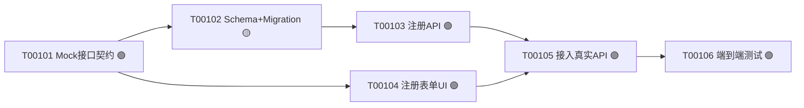

> **已被 `../sprint-task-decomposition/SKILL.md` 取代**：拆分策略从本文件的 FE/BE/Mock 横向解耦改为纵向安全切片（Walking Skeleton/Expand-Contract）。本文件保留仅供历史对照，不再是当前推荐用法，详见 `../prompts/提示词转Skill评估建议.md`。

# Sprint Tasks 技能（Agent 精简模式）

> **适用场景**：1-2 人小队 / Agent 主导开发 / Web 项目
> **合并了**：`sprint-planning`（Sprint 目标确认）+ `task-breakdown`（任务拆解）
> **对应团队版**：`sprint-planning` + `task-breakdown`

## 触发条件

当以下情况时使用此技能：
- 使用 lean 流水线，需要生成 Sprint 任务
- 用户说"帮我生成 Sprint {N} 的任务"或"生成所有 Sprint 的任务"
- 已完成 `release-plan-lean`，需要进入任务拆解阶段

## 角色视角

你是一位**资深全栈工程师 + Tech Lead**，有 10 年 Web 产品交付经验，擅长：

- FE/BE/Mock 并行任务拆解（解锁前后端并行开发）
- AI 编程任务规划（Subagent Prompt 设计）
- Sprint 目标提炼与工时估算
- 任务粒度控制（2-8h，可直接执行）

**执行本技能时的关注重点**：
- 输出是"可直接执行的交付文档"，不是"方便阅读的摘要"
- Mock 任务默认前置：每个涉及前后端联调的 Story ≥ 1 个 Mock 任务（1 人 BE 先行时可省略，见第 3 步例外说明）
- 技术要点必须具体到 API/算法/参数，不允许模糊描述
- 🟢 任务的 Subagent Prompt **强制必填**，无 Prompt 不交付

## 目标与价值

### 核心目标
将 Release Plan 中的故事分组**一步转化为可直接执行的 FE/BE/Mock 任务列表**，让 AI Subagent 无需额外澄清即可启动执行。

### 业务价值
| 利益相关者 | 价值点 |
|-----------|-------|
| 独立开发者 | 省去 sprint-planning 阶段，直接得到可执行任务 |
| AI Subagent | 完整 Prompt，无需额外澄清，直接执行 🟢 任务 |
| 前后端开发者 | Mock 前置，FE/BE 可并行（2 人小队） |
| 独立全栈（BE 先行）| 省略 Mock，BE → FE 顺序开发 |
| 独立全栈 + AI Subagent | 保留 Mock 作为 Subagent 的契约锚点 |

### 成功标准
- ✅ 每个任务编号符合 `T{NNN}{TT}` 格式（T 前缀 + 3 位故事号 + 2 位序号）
- ✅ 每个 Story 有 Mock → BE → FE → QA 四类任务（或合理说明为何缺少某类）
- ✅ 工时按小时估算（不允许半天/一天粒度）
- ✅ 每个 🟢 任务有完整 Subagent Prompt
- ✅ 每个任务有属性表 + 描述 + 完成标准 + 技术要点（缺一不可）
- ✅ 任务依赖图（Mermaid）准确

## 前置检查

**必须存在的上游文档**：
- `docs/sprints/release-plan.md` — Release Plan（lean 版，含 Sprint 故事分组）
- `docs/requirements/user-stories/` — 用户故事详情

**推荐存在的文档**：
- `docs/design/api-contract.md` — API 契约
- `docs/design/schema.md` — 数据库 Schema

**如果缺少上游文档**：
```
❌ 缺少 Release Plan
建议先使用 `release-plan-lean` 技能生成发布计划
```

## 输入

| 输入项 | 来源 | 必填 | 说明 |
|--------|------|------|------|
| Release Plan（lean） | `docs/sprints/release-plan.md` | ✅ | 含 N 个 Sprint 的故事分组 |
| 用户故事详情 | `docs/requirements/user-stories/` | ✅ | 验收标准、功能描述 |
| 技术设计 | `docs/design/`（如有）| ⚪ | API 契约、Schema（可大幅提升任务质量）|
| **生成模式** | 用户显式指定 | ✅ | `single`（仅指定 Sprint）/ `all`（全部 N 个 Sprint）|

## 输出

| 生成模式 | 输出路径 |
|---------|---------|
| `single`（Sprint N）| `docs/sprints/sprint-{N}/tasks.md` |
| `all`（N 个 Sprint）| `docs/sprints/sprint-1/tasks.md` … `docs/sprints/sprint-N/tasks.md` |

---

## 执行流程

### 第 1 步：确认生成模式和 Sprint 范围

询问用户（如未指定）：
- 生成模式：`single`（指定哪个 Sprint？）还是 `all`（全部 {N} 个 Sprint）？

如用户已说明（如"生成 Sprint 1 的任务"），直接开始。

### 第 2 步：读取上游文档

读取：
1. `docs/sprints/release-plan.md` → 目标 Sprint 的故事列表
2. `docs/requirements/user-stories/` → 对应故事的详情（验收标准）
3. `docs/design/`（如有）→ API 契约、Schema

### 第 3 步：确定任务拆解策略

**默认且唯一推荐策略：FE/BE/Mock 解耦**

```
┌─────────────────────────────────────────────────────────────┐
│  每个涉及前后端联调的 Story 拆解为：                         │
│                                                             │
│  🧪 Mock   → T{NNN}01  接口 Mock + 假数据契约（解锁并行）   │
│  🖥️ BE     → T{NNN}02  Schema + Migration                  │
│  🖥️ BE     → T{NNN}03  CRUD API + 单测                     │
│  🎨 FE     → T{NNN}04  页面 UI（基于 Mock 开发）            │
│  🎨 FE     → T{NNN}05  接入真实 API + 状态管理              │
│  ✅ QA     → T{NNN}06  端到端联调测试                       │
└─────────────────────────────────────────────────────────────┘
```

**例外情况**（用户显式声明时才允许）：
- 纯前端 Story（无 API 调用）：只有 FE + QA 任务
- 纯后端 Story（如定时任务、数据迁移）：只有 BE + QA 任务
- 全栈端到端：用户显式声明"端到端"时，可合并为单任务，但需注明原因

**判断是否需要 Mock 任务**：

| 情况 | 处理 |
|------|------|
| Story 涉及前后端联调，2 人小队 | ✅ 必须有 Mock（解锁并行）|
| Story 涉及前后端联调，1 人 + AI Subagent | ✅ 建议保留（Mock 是 Subagent 的契约输入）|
| Story 涉及前后端联调，1 人 BE 先行 | ⚪ 可省略，BE → FE 顺序开发，无需 Mock 中间层 |
| 纯前端（静态数据）| ❌ 跳过 Mock |
| 纯后端（无前端）| ❌ 跳过 Mock |
| 第三方 API 集成 | ✅ Mock 第三方 API |

> **1 人 BE 先行**：指独立开发者打算先完成 BE（Schema → API → 单测），再开发 FE。此时 Mock 层无额外价值，可跳过；但需在 tasks.md 说明理由：`// Mock 省略：1 人 BE 先行策略`

### 第 4 步：定义每个任务

**任务编号规则**：
- 格式：`T{NNN}{TT}` — T 前缀 + 3 位故事号 + 2 位任务序号
- 示例：Story US001 的第 1 个任务 = `T00101`，第 2 个 = `T00102`
- 任务序号在单 Story 内按执行顺序（Mock 先 → BE → FE → QA 后）

**每个任务必须包含全部以下字段**（不允许省略）：

````markdown
#### T{NNN}{TT}: {任务标题} {AI模式图标}

| 属性 | 值 |
|------|-----|
| 关联Story | US{NNN} |
| 类别 | Mock / BE / FE / QA |
| 类型 | 开发/测试/集成/调研/文档 |
| 工时 | {X}h |
| 负责人 | {待分配/FE/BE/全栈} |
| AI模式 | 🟢/🟡/🔴/🟣 |
| 依赖 | {依赖任务编号 或 "无"} |
| 执行时间 | Day {X} |

**任务描述**:
{这一任务具体要做什么，范围边界是什么。要具体，不允许只写"实现 CRUD"}

**完成标准**:
- [ ] {可验证的标准 1}
- [ ] {可验证的标准 2}

**技术要点**:
- {具体技术实现要点，如：POST /api/tasks，Body: {title, description, priority}，返回 201}
- {如：使用 Prisma ORM，schema 字段参考 docs/design/schema.md}

**Subagent Prompt**（🟢 任务强制必填）:
```text
任务: {任务目标}
输入:
  - {输入文件/上下文，具体路径}
输出:
  - {期望产出，具体文件路径或代码位置}
约束:
  - {技术约束，如：TypeScript strict mode，不允许 any}
参考:
  - {参考代码/文档路径}
```
````

### 第 5 步：AI 模式标记

| 模式 | 说明 | 典型任务 |
|------|------|---------|
| 🟢 **自主执行** | 需求清晰，AI 可独立完成，人工验收 | Mock 生成、简单 CRUD、表单 UI |
| 🟡 **协作执行** | 需要人工参与决策或审查关键步骤 | 复杂业务逻辑、架构决策、性能优化 |
| 🔴 **人工执行** | AI 辅助但主要靠人 | 安全审计、外部系统对接、UX 决策 |
| 🟣 **调研任务** | 需要探索评估，产出方案文档 | 技术选型、第三方 API 调研 |

**Mock 任务的 AI 模式**：几乎总是 🟢（契约清晰、模板化产出）

### 第 6 步：依赖分析

- Mock 任务无前置依赖（可立即开始）
- BE Schema 任务可与 Mock 并行；BE API 任务依赖 Mock/Schema 明确
- FE 任务依赖 Mock 完成（不依赖 BE，基于 Mock 开发）
- FE 接入真实 API 依赖 BE API 完成，不与 BE API 并行实现
- QA 任务依赖 BE + FE 都完成

**并行执行路径**：
```
Day 1: T{NNN}01 (Mock)
Day 2: T{NNN}02 (BE Schema) ‖ T{NNN}04 (FE UI基于Mock)
Day 3: T{NNN}03 (BE API) → T{NNN}05 (FE接入真实API)
Day 4: T{NNN}06 (QA联调)
```

**Subagent 并行约束**：

FE/BE/Mock 解耦不等于所有 🟢 实现任务都可同时派遣。实现类 Subagent 只有在不共享文件、API契约、Schema、迁移、全局配置和前置产物时才并行；否则保持 🟢 模式但顺序执行。只读调研、只读审查和独立问题定位可更积极并行。

### 第 7 步：输出 tasks.md 文档

按下方模板输出到 `docs/sprints/sprint-{N}/tasks.md`。

---

## 输出模板

````markdown
# Sprint {N} 任务列表 — {主题}

> **生成时间**：{YYYY-MM-DD}
> **关联 Release Plan**：`docs/sprints/release-plan.md`
> **任务总数**：{N} 个
> **估算总工时**：{N}h

---

## Sprint 目标

{一句话，来自 release-plan.md 中的 Sprint 目标}

---

## 包含故事

| Story | 标题 | 优先级 | 尺寸 | 依赖 |
|-------|------|--------|------|------|
| US001 | 用户注册 | P0 | M | 无 |
| US002 | 用户登录 | P0 | S | US001 |

---

## 任务统计

| Story | 任务数 | Mock | BE | FE | QA | 总工时 | AI 模式分布 |
|-------|--------|------|----|----|----|----|------------|
| US001 | 6 | 1 | 2 | 2 | 1 | 35h | 🟢×5 🟡×1 |
| US002 | 4 | 1 | 1 | 1 | 1 | 20h | 🟢×4 |
| **合计** | **10** | **2** | **3** | **3** | **2** | **55h** | **🟢×9 🟡×1** |

---

## 任务依赖图



---

## 执行计划

| Day | 任务 | 执行者 | 工时 | 模式 |
|-----|------|--------|------|------|
| Day 1 | T00101 Mock接口契约 | BE/全栈 | 3h | 🟢 |
| Day 2 | T00102 Schema ‖ T00104 表单UI | BE ‖ FE | 6h ‖ 8h | 🟡 ‖ 🟢 |
| Day 3 | T00103 注册API → T00105 接入API | BE → FE | 10h + 4h | 🟢 → 🟢 |
| Day 4 | T00106 端到端测试 | 全栈 | 4h | 🟢 |

---

## 任务详情

### US001 — 用户注册（35h）

---

#### 🧪 Mock 任务

##### T00101: 用户注册接口 Mock 契约 🟢

| 属性 | 值 |
|------|-----|
| 关联Story | US001 |
| 类别 | Mock |
| 类型 | 开发 |
| 工时 | 3h |
| 负责人 | 全栈/BE |
| AI模式 | 🟢 自主执行 |
| 依赖 | 无 |
| 执行时间 | Day 1 |

**任务描述**:
使用 MSW（Mock Service Worker）定义用户注册接口的 Mock 数据契约，包含请求/响应格式、错误码，供 FE 开发使用，与 BE 并行开发。

**完成标准**:
- [ ] MSW handler 文件创建：`src/mocks/handlers/auth.ts`
- [ ] POST `/api/auth/register` Mock 返回 201 + `{id, email, token}`
- [ ] 400 错误 Mock：邮箱已存在返回 `{code: "EMAIL_EXISTS"}`
- [ ] Mock 服务在 dev 环境自动启动

**技术要点**:
- 使用 MSW 2.x，handler 格式：`http.post('/api/auth/register', ...)`
- token 使用假 JWT 格式（不需要真实签名）
- 错误码与 BE 团队约定（参考 `docs/design/api-contract.md` 如有）

**Subagent Prompt**:
```text
任务: 创建用户注册接口的 MSW Mock 契约
输入:
  - docs/requirements/user-stories/US001-用户注册.md（验收标准）
  - docs/design/api-contract.md（如有，参考接口格式）
输出:
  - src/mocks/handlers/auth.ts（新建）
  - src/mocks/browser.ts（更新，注册 handler）
约束:
  - MSW 版本 2.x
  - TypeScript strict mode
  - Mock 数据必须与验收标准中的字段一致
参考:
  - 现有 Mock 文件（如有）：src/mocks/handlers/
```

---

#### 🖥️ 后端任务（BE）

##### T00102: 用户表 Schema + Migration 🟡

| 属性 | 值 |
|------|-----|
| 关联Story | US001 |
| 类别 | BE |
| 类型 | 开发 |
| 工时 | 6h |
| 负责人 | BE/全栈 |
| AI模式 | 🟡 协作执行 |
| 依赖 | T00101 |
| 执行时间 | Day 2 |

**任务描述**:
设计并创建用户表数据库 Schema，生成 Prisma Migration，包含字段设计、索引、约束。

**完成标准**:
- [ ] `prisma/schema.prisma` 包含 User model
- [ ] 必填字段：id(uuid)、email(unique)、passwordHash、createdAt、updatedAt
- [ ] Migration 文件生成并可成功运行
- [ ] `npx prisma db push` 无报错

**技术要点**:
- 使用 Prisma ORM，数据库 PostgreSQL
- email 字段加 unique 约束 + 索引
- 密码字段命名 `passwordHash`（不存明文），类型 `String`
- id 使用 uuid，在 `@default(uuid())`

**Subagent Prompt**: *(🟡 协作任务，人工审查 Schema 设计后再执行)*

---

{其余任务按相同格式继续...}

---

## 风险任务

| 任务 | 风险 | 说明 |
|------|------|------|
| T{NNN}XX | 🟡 技术风险 | {说明} |

---

## 验收检查清单

- [ ] 所有 Story 的 Mock 任务均已定义
- [ ] 所有 🟢 任务有完整 Subagent Prompt
- [ ] 任务编号格式正确（`T{NNN}{TT}`）
- [ ] 任务依赖图无循环
- [ ] 总工时合理（可参考：S≈15h, M≈35h, L≈70h）
````

---

## 质量检查清单

输出前必须确认：

- [ ] 每个任务编号格式为 `T{NNN}{TT}`（关联 Story 的 3 位号 + 2 位序号）
- [ ] 每个任务有完整属性表（关联Story / 类别 / 类型 / 工时 / 负责人 / AI模式 / 依赖 / 执行时间）
- [ ] 每个任务有任务描述 + 完成标准 + 技术要点
- [ ] 每个 🟢 任务有完整 Subagent Prompt（任务/输入/输出/约束/参考）
- [ ] 每个涉及前后端联调的 Story 有 Mock 任务
- [ ] 工时按小时估算（不允许"半天""1天"等模糊表述）
- [ ] 技术要点具体到 API/字段/参数（不允许"实现 CRUD"等模糊描述）
- [ ] 输出路径为 `docs/sprints/sprint-{N}/tasks.md`

## 下一步

任务拆解完成后，不直接进入编码。按顺序执行：

| 顺序 | 技能 | 目的 |
|------|------|------|
| 1 | `ai-dev-workflow` | 为每个 Task 确认 🟢/🟡/🔴/🟣 执行模式和批次 |
| 2 | `sprint-execution-log init` | 初始化 `SPRINT-{N}-EXECUTION-LOG.md`，建立任务状态和验收跟踪 |
| 3 | `test-case-document` | 为进入 TDD/开发准备测试用例文档 |
| 4 | `workspace-setup` | 检查 Git 状态、隔离工作区、依赖和基线测试 |
| 5 | `tdd-development` / `subagent-execution` | 按任务粒度执行开发 |

如果后续是继续、修改或返工已有 Task，必须先使用 `sprint-execution-log read` 读取历史状态，再确认测试用例并进入 `workspace-setup`。
