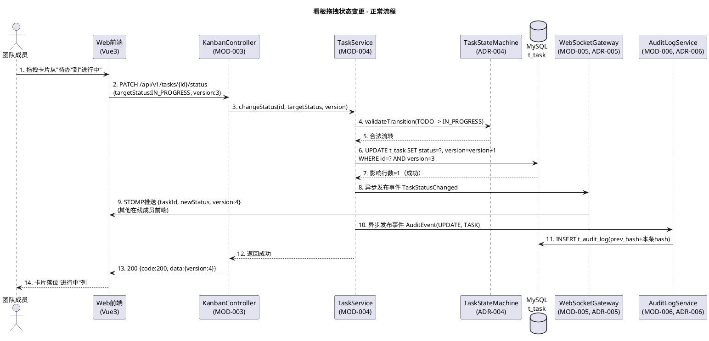
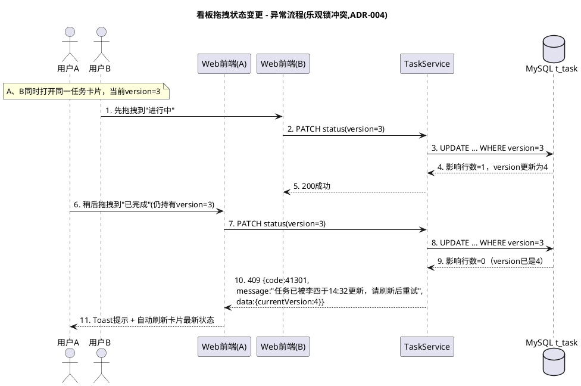
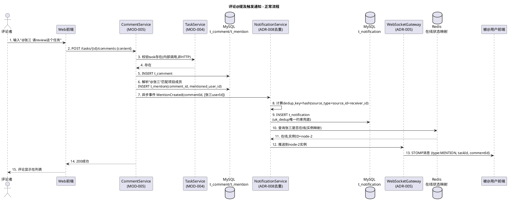
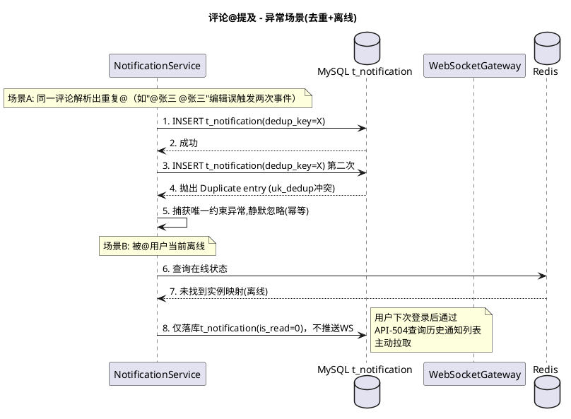

# TeamTodo 时序图设计文档（HLD-04）

> 使用提示词：`../提示词/4-软件设计/概要设计/HLD-04-时序图设计提示词.md`
> 输入材料：材料B（B4-07第2章状态机/第3章事件触发链/第6章并发冲突）+ HLD-01（步骤5）+ HLD-02（步骤6）
>
> **抽样说明**（追溯`00-执行计划.md`三、范围说明，本文档标记为P2）：本轮全链路自测仅抽取**2条代表性跨模块流程**验证时序图机制是否可用：① 看板拖拽状态变更（体现乐观锁冲突处理，跨MOD-003/004/005/006）；② 评论@提及触发实时通知（体现异步事件链与去重，跨MOD-005）。其余Story流程格式同例，不逐条展开。

---

## 流程一：看板拖拽状态变更（US009/US015）

### 第1章：时序图概览

- **业务流程名称**：用户在看板上拖拽任务卡片，触发状态变更
- **参与模块**：MOD-003（看板视图，前端触发）、MOD-004（任务生命周期，状态机+乐观锁）、MOD-005（协作通知，WebSocket广播）、MOD-006（审计）
- **关键步骤**：前端拖拽 → 调用API-405 → 状态机校验 → 乐观锁UPDATE → 广播其他在线用户 → 异步审计留痕
- **关联接口**：API-405（`06-HLD-02-接口设计.md`）
- **关联表**：T-008 t_task（`07-HLD-03-数据库设计.md`）

### 第2章：正常流程时序图

**步骤说明**：步骤8/10为异步发布（Spring Event），不阻塞步骤12的响应返回，追溯SAD 2.5场景2"看板并发更新"的性能设计。

### 第3章：异常流程时序图（乐观锁冲突）

**异常处理说明**：追溯B4-07第6章并发冲突"任务状态并发变更"场景。前端不做自动重试（避免覆盖用户B的合法操作），而是提示用户A基于最新状态重新决策，符合SAD 3.3易用性"操作结果可预期"质量属性。

### 第4章：性能优化说明

| 优化点 | 优化前 | 优化后 | 优化方案 |
|--------|--------|--------|---------|
| 审计写入阻塞主流程 | 同步写审计日志，响应时间叠加 | 异步Spring Event | AuditLogService监听事件异步落库，主流程响应不等待（追溯ADR-006） |
| WebSocket广播阻塞响应 | 同步推送后才返回HTTP响应 | 异步推送 | 状态更新成功后立即返回响应，广播另起异步任务，避免推送慢拖累接口P95 |
| 乐观锁冲突后前端体验 | 冲突后无提示，静默失败 | 明确409+当前最新值 | 响应体附带`currentVersion`，前端可直接用于局部刷新，无需二次GET |

---

## 流程二：评论@提及触发实时通知（US017/US018/US019-Rev）

### 第1章：时序图概览

- **业务流程名称**：用户在任务下发表评论并@提及其他成员，触发去重通知与实时推送
- **参与模块**：MOD-005（协作通知，全流程）、MOD-004（任务生命周期，仅存在性校验）
- **关键步骤**：发表评论 → 解析@提及 → 生成通知（去重）→ 判断接收者在线状态 → WebSocket推送/离线仅落库
- **关联接口**：API-501（`06-HLD-02-接口设计.md`）
- **关联表**：T-010 t_comment、T-011 t_mention、T-012 t_notification（`07-HLD-03-数据库设计.md`）

### 第2章：正常流程时序图

### 第3章：异常流程时序图（重复@提及去重 + 用户离线）

**异常处理说明**：去重依赖"应用层判重（NotificationService内校验）+ 数据库唯一约束兜底"双重保障（追溯ADR-008、`07-HLD-03-数据库设计.md` T-012唯一索引`uk_dedup`），避免高并发场景下应用层判重出现竞态导致重复通知；离线场景不触发推送失败重试，改为被动拉取模式，避免为离线用户维护推送队列的额外复杂度。

### 第4章：性能优化说明

| 优化点 | 优化前 | 优化后 | 优化方案 |
|--------|--------|--------|---------|
| @提及解析阻塞评论提交 | 同步解析+同步通知，响应慢 | 异步事件驱动 | CommentService仅同步写入评论本身，@提及解析与通知生成异步进行 |
| 重复通知 | 应用层单一判重，高并发下可能竞态失败 | 应用层判重 + 数据库唯一约束双保险 | dedup_key唯一索引兜底，INSERT冲突时静默捕获 |
| 离线用户推送浪费 | 无论在线与否都尝试WS推送 | 先查Redis在线状态映射再决定是否推送 | 减少无效WebSocket调用与网关负载 |
