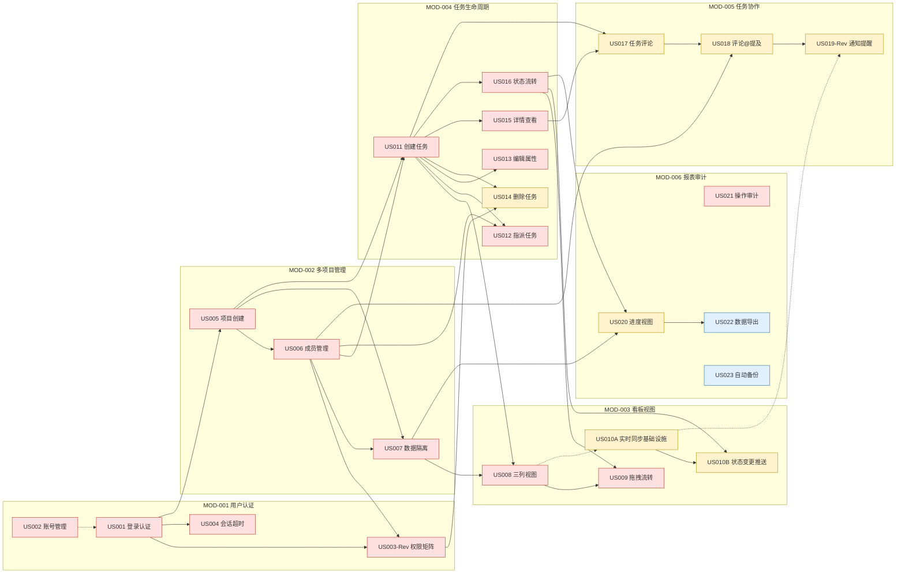

# TeamTodo Product Backlog（Lean精简版）

> 使用提示词：`../提示词/5-敏捷开发/Scrum/1-Product Backlog梳理提示词-Lean版.md`
> 输入材料：材料A `03-用户故事-完整版v2.0.md`（24个Story，含验收标准Checklist）
>
> **说明**：本文档的优先级（P0/P1/P2）与依赖关系为本步骤基于材料A真实故事内容独立重新评估产出，**不沿用**步骤5（`05-HLD-01-模块划分.md`）第7章"模块与Story映射矩阵"中的旧优先级值——原因见 `14-全链路验证总结.md` 中记录的 Story 编号语义漂移问题：该矩阵此前部分行（US010A/US010B/US012~US016）的标题与材料A原文不符，其优先级判断亦建立在错误的故事内容之上，本步骤重新对齐材料A原文后独立评分，确保Backlog的优先级判断真正基于真实验收标准而非编号巧合。T-Shirt尺寸（S/M）直接采用材料A"用户故事总览"表中已有的"粒度"列（该列由需求层产出，本步骤不重复评估）。

---

## 一、优先级排序方法说明

**排序方法**：P0/P1/P2 直觉打分法（非量化WSJF），结合T-Shirt尺寸辅助排期。

- **P0（必须）**：MVP不可发布的阻断项——核心认证/多项目隔离/看板基础CRUD/任务生命周期基础操作/审计合规底线。若缺失，产品不具备"可交付给真实团队试用"的最低可用性，或存在安全/合规硬性缺口。
- **P1（应该）**：显著提升产品价值或安全性，但产品在没有它的情况下仍可运行最小闭环（如手动刷新代替实时推送、无评论也能管理任务）。建议紧随P0之后尽快交付。
- **P2（可以）**：增强型/长尾能力，可推迟到后续迭代，不影响核心团队协作闭环的建立。

**T-Shirt尺寸**：S（1个理想日以内可完成的单一后端/前端小改动）、M（涉及多个接口/表或前后端联调、1~3个理想日）。材料A中24个故事的粒度分布为 S(7) / M(17) / L(0)，与本Backlog采用值一致。

**评分维度说明**（人工直觉评分依据）：业务价值（是否为团队协作闭环的必要环节）、技术风险（是否涉及未验证的技术方案，如WebSocket横向扩展）、合规/安全底线（是否为数据隔离、权限控制、审计留痕等不可妥协项）、依赖阻塞面（有多少后续故事直接依赖它）。

---

## 二、故事一览表（24个，权威依据：材料A"用户故事总览"表）

| 故事ID | 故事标题 | 用户角色 | 所属模块 | 优先级 | 尺寸 | 强依赖 | 弱依赖 | 风险标记 |
|--------|---------|---------|---------|-------|------|--------|--------|---------|
| US001 | 用户登录认证 | 所有用户 | MOD-001 | P0 | S | - | US002（需先有账号） | - |
| US002 | 用户账号管理 | 系统管理员 | MOD-001 | P0 | M | - | - | - |
| US003-Rev | 角色权限控制（权限矩阵） | 所有用户 | MOD-001 | P0 | M | US001, US006 | - | R1 |
| US004 | 会话超时管理 | 所有用户 | MOD-001 | P0 | S | US001 | - | - |
| US005 | 项目创建与列表 | 系统管理员/团队负责人 | MOD-002 | P0 | M | US001 | - | - |
| US006 | 项目成员管理 | 团队负责人 | MOD-002 | P0 | M | US005 | - | - |
| US007 | 项目数据隔离 | 团队成员 | MOD-002 | P0 | M | US005, US006 | - | R2 |
| US008 | 看板三列视图 | 团队成员 | MOD-003 | P0 | M | US007, US011 | - | - |
| US009 | 看板拖拽流转 | 团队成员 | MOD-003 | P0 | M | US008, US016 | - | R4 |
| US010A | 看板实时同步基础设施 | 团队成员 | MOD-003 | P1 | M | - | US008 | R3, R5 |
| US010B | 看板状态变更推送 | 团队成员 | MOD-003 | P1 | M | US010A, US016 | - | R3 |
| US011 | 创建任务 | 团队成员 | MOD-004 | P0 | S | US005, US006 | - | - |
| US012 | 指派任务 | 团队负责人 | MOD-004 | P0 | S | US011, US006 | - | - |
| US013 | 编辑任务属性 | 团队成员 | MOD-004 | P0 | S | US011 | - | - |
| US014 | 删除任务（权限） | 团队成员/管理员 | MOD-004 | P1 | M | US011, US003-Rev | - | - |
| US015 | 任务详情查看 | 团队成员 | MOD-004 | P0 | S | US011 | - | - |
| US016 | 任务状态流转 | 团队成员 | MOD-004 | P0 | M | US011 | - | R4 |
| US017 | 任务内评论 | 团队成员 | MOD-005 | P1 | M | US011, US015 | - | - |
| US018 | 评论@提及 | 团队成员 | MOD-005 | P1 | M | US017, US006 | - | - |
| US019-Rev | 通知提醒（MVP 站内信） | 团队成员 | MOD-005 | P1 | M | US018 | US010A（实时推送通道） | R6 |
| US020 | 项目进度视图 | 项目经理 | MOD-006 | P1 | M | US016, US007 | - | - |
| US021 | 操作日志审计 | 系统管理员 | MOD-006 | P0 | M | - | 全部模块（异步订阅事件） | - |
| US022 | 数据导出 | 系统管理员 | MOD-006 | P2 | M | US020 | - | R7 |
| US023 | 每日自动备份 | 系统管理员/DevOps | MOD-006 | P2 | S | - | - | R8 |

**统计**：P0=14个，P1=8个，P2=2个；S=7个，M=17个；强依赖边共23条，无循环依赖（见第三节验证说明）。

---

## 三、依赖关系图（Mermaid，强依赖实线／弱依赖虚线）

**依赖类型说明**：
- 实线（`-->`）= 强依赖：上游故事的核心数据结构或流程是下游故事运行的必要前提，必须先完成上游才能开始下游的联调验证（不阻碍下游"开发"，但阻碍下游"可测试可演示"）。
- 虚线（`-.->`）= 弱依赖：功能上有关联，但下游可以先用占位/简化实现（如US001早期可先用测试账号跳过US002后台管理界面；US010A实时同步基础设施可与US008并行开发，只是端到端演示需要US008已存在；US019通知提醒可先用轮询兜底，US010A基础设施完成后再切换到WebSocket实时通道）。
- US021（操作审计）标记为对"全部模块"的弱依赖：因其通过异步事件订阅落地（追溯ADR-006），审计功能本身可独立开发与测试（Mock事件），不阻塞、也不被任何业务故事阻塞，只是需要有业务事件产生才能观察到实际审计效果。

**循环依赖检查**：对上述23条边做拓扑排序，未发现环——图中不存在"A依赖B、B又直接或间接依赖A"的情况。唯一需要关注的双向关联点是 US009（拖拽流转）与 US016（状态流转）：两者都读写"任务状态"这一共享数据，但方向是单向的（US009的拖拽操作最终调用US016定义的状态机规则，US016不反向依赖US009的前端交互），故不构成循环，已在第二节表格中体现为US009强依赖US016。

---

## 四、风险清单

| 风险编号 | 关联故事 | 风险类型 | 具体说明 |
|---------|---------|---------|---------|
| R1 | US003-Rev | tech | 权限矩阵通过Redis缓存（TTL 5分钟，追溯ADR-002）加速鉴权，意味着管理员刚变更某成员角色后的5分钟内，该成员在受影响接口上可能仍读到旧权限——需要在验收标准中明确这一"最终一致性窗口"是否可被产品接受，或是否需要增加"变更后主动失效缓存"的兜底机制。 |
| R2 | US007 | tech | 多项目数据隔离依赖MyBatis-Plus的`TenantLineHandler`统一拦截（追溯ADR-003），一旦出现绕过ORM的直接JDBC操作、批量导入脚本或未来新增的原生SQL查询遗漏租户条件，将直接导致跨项目数据泄露，属于高危且不易被常规功能测试发现的风险类型，需要专项的隔离性测试用例（如"用户A能否通过接口枚举/越权访问项目B的任务ID"）。 |
| R3 | US010A, US010B | tech | WebSocket连接在弱网/断线重连、多实例部署下的会话粘滞与消息丢失处理方案（追溯ADR-005）目前只有架构决策、尚无真实并发压测数据，实际多用户同时在线的连接稳定性与消息送达率存在未验证的技术风险。 |
| R4 | US009, US016 | tech | 乐观锁（`version`字段，追溯ADR-004）在真实多人协作场景下的冲突频率未知，如果同一任务被频繁并发拖拽，用户会频繁看到"409冲突，请刷新重试"的提示，可能影响体验，建议上线后观察冲突率数据再决定是否需要更细粒度的锁机制或前端合并策略。 |
| R5 | US010A | unknown | 缺少明确的非功能性指标（例如"单项目最大并发在线人数""目标推送延迟P95"），WebSocket基础设施的水平扩展方案（单实例 vs 多实例+消息总线）需要产品/架构与团队规模预期对齐后才能定型，当前只能按小规模团队场景（数十人/项目）设计。 |
| R6 | US019-Rev | tech | 通知去重依赖"应用层`dedup_key`判重 + 数据库唯一约束兜底"双保险（追溯ADR-008），双重机制在高并发写入下的实际协同表现（是否真的能杜绝重复通知、是否会因唯一约束冲突产生额外的异常处理开销）尚未经过压测验证。 |
| R7 | US022 | unknown | 数据导出的具体格式（CSV/Excel/PDF）、导出字段范围、是否需要异步任务+邮件下载链接（大项目场景下同步导出可能超时）等细节，产品尚未最终拍板，ADR决策清单中亦未覆盖此项，实施前需要补充产品澄清。 |
| R8 | US023 | external | 每日自动备份依赖DevOps团队搭建的对象存储与定时任务调度基础设施（追溯ADR-010，Spring Schedule/XXL-Job尚未最终决策），备份策略的落地进度不完全由研发团队自身把控，需要提前与DevOps对齐排期，避免成为发布前的意外阻塞项。 |

---

## 五、建议实现顺序（基于第三节依赖图拓扑排序）

1. **认证地基**：US002（账号管理）→ US001（登录认证）→ US004（会话超时）
2. **权限与项目容器**：US005（项目创建）→ US006（成员管理）→ US003-Rev（权限矩阵，依赖成员角色数据）→ US007（数据隔离）
3. **任务基础CRUD**：US011（创建任务）→ US013（编辑属性）→ US015（详情查看）→ US012（指派任务）→ US016（状态流转）
4. **看板可视化**：US008（三列视图）→ US009（拖拽流转）→ US014（删除任务，权限依赖US003-Rev已就绪）
5. **实时协同基础设施**：US010A（实时同步基础设施）→ US010B（状态变更推送）
6. **任务协作与通知**：US017（任务评论）→ US018（评论@提及）→ US019-Rev（通知提醒，可先接入US010A的WebSocket通道，或先用轮询兜底再切换）
7. **报表与合规收尾**：US021（操作审计，可与任意阶段并行开发，只需已有事件产生即可验证）→ US020（进度视图）→ US022（数据导出）→ US023（自动备份，建议提前与DevOps并行推进，避免卡在发布前）

> 该顺序与 `00-执行计划.md` 三、范围说明中"Sprint1=M1用户认证与访问控制（US001~US004）"的既定选型一致——认证地基（第1步）正是Sprint1的完整范围，为步骤10发布计划的Sprint切分提供了自然的第一个迭代边界。
