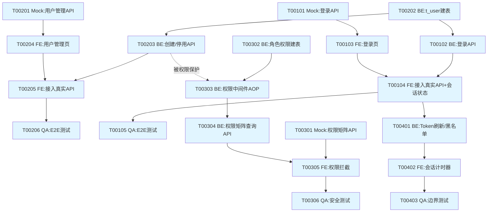

# Sprint 1 任务清单（Lean精简版）

> 使用提示词：`../提示词/5-敏捷开发/Scrum/7-Sprint任务拆解提示词-Lean版.md`
> 材料1：`10-发布计划.md` Sprint1部分
> 材料2：`03-用户故事-完整版v2.0.md` US001~US004完整验收标准
> 材料3：`11-HLD-Sprint摘要提取-Sprint1.md`
>
> **⚠️ 技术栈强指令**：本项目实际技术栈为 **Java Spring Boot + MyBatis-Plus + MySQL 8 + Redis + WebSocket + Vue3 + Vite**。以下所有任务的技术要点、Subagent Prompt、代码示例、依赖库名称均按此技术栈生成，提示词自带的Prisma/Express/React/MSW/Playwright等示例技术栈仅供格式参考，不采用。

> **模式**：Agent精简模式（Lean）
> **Sprint**：Sprint 1 — 认证地基
> **目标**：完成账号体系与权限中间件，团队成员可登录系统、按角色权限矩阵操作、超时自动登出
> **生成时间**：2026-08-29
> **故事数**：4 个
> **任务数**：20 个
> **预估工时**：约78h
> **模式说明**：本任务清单采用FE/BE/Mock并行策略，所有🟢任务含完整Subagent Prompt

---

## 📊 Sprint概览

### 故事清单

| ID | 标题 | 优先级 | 尺寸 | 任务数 | 预估工时 |
|----|------|--------|------|--------|---------|
| US002 | 用户账号管理 | P0 | M | 6个 | 21h |
| US001 | 用户登录认证 | P0 | S | 5个 | 15h |
| US003-Rev | 角色权限控制（权限矩阵） | P0 | M | 6个 | 27h |
| US004 | 会话超时管理 | P0 | S | 3个 | 15h |
| **合计** | — | — | — | **20个** | **78h** |

> **排序说明**：US002在US001之前拆解，因为t_user建表任务（T00202）是US001登录任务的前置依赖——遵循"表结构谁先用谁先建，后续故事复用不重复建表"原则，与实际执行时间线一致（见第5部分）。

### 任务类型分布

| 类型 | 数量 | 占比 | 预估工时 |
|------|------|------|---------|
| 🧪 Mock | 3个 | 15% | 6h |
| 🖥️ BE | 8个 | 40% | 44h |
| 🎨 FE | 6个 | 30% | 21h |
| ✅ QA | 3个 | 15% | 7h |
| **合计** | **20个** | **100%** | **78h** |

### AI模式分布

| 模式 | 图标 | 数量 | 说明 |
|------|------|------|------|
| 自主执行 | 🟢 | 13个 | AI可独立完成，人工验收 |
| 协作执行 | 🟡 | 5个 | 需要人工参与决策或审查（含权限中间件逻辑、会话临界判断） |
| 人工执行 | 🔴 | 2个 | AI辅助但主要靠人（权限矩阵全量安全测试） |
| 调研任务 | 🟣 | 0个 | 本Sprint无 |

---

## 🛠️ 任务拆解策略

### 采用策略：FE/BE/Mock并行

```
┌─────────────────────────────────────────────────────────────┐
│  每个涉及前后端联调的 Story 拆解为：                         │
│                                                             │
│  🧪 Mock   → T{NNN}01  接口Mock + 假数据契约（解锁并行）   │
│  🖥️ BE     → T{NNN}02  Schema/中间件/API实现 + 单测         │
│  🎨 FE     → T{NNN}0x  页面UI（基于Mock开发）+ 接入真实API  │
│  ✅ QA     → T{NNN}0x  端到端联调测试                       │
└─────────────────────────────────────────────────────────────┘
```

### 任务编号规则

- 格式：`T{NNN}{TT}` — T前缀 + 3位故事号 + 2位任务序号（US003-Rev取故事号003）
- 任务序号在单Story内按执行顺序（Mock先 → BE → FE → QA后）

### 关于Mock省略

US004（会话超时管理）为纯前端计时+后端Token刷新/黑名单逻辑，无独立"表单提交"类交互，且Token刷新/登出接口(API-104/105)复用US001登录后已建立的Token机制，**省略独立Mock任务**，BE/FE并行度较低，采用顺序开发（说明：`// Mock省略：会话管理逻辑简单，前端计时器可先用本地假状态开发，无需接口Mock`）。

---

## 📋 任务详细清单

---

### 📦 US002: 用户账号管理（P0，M尺寸，21h）

**Story概述**：系统管理员创建/停用/启用用户账号

**验收标准**（摘自材料A）：
- [ ] AC1 创建用户：管理员填写姓名/账号/部门并提交 → 创建成功入列表，分配初始密码且加密存储，新用户可用账号+初始密码登录
- [ ] AC2 停用用户：管理员点击停用 → 状态变停用，无法登录，已有会话失效
- [ ] AC3 重复账号：提交已存在账号 → 提示"账号已存在"，不创建重复用户
- [ ] 边界-空账号：账号为空 → 提示"请输入账号"
- [ ] 边界-非管理员：普通用户访问管理页 → 无权限（提示或隐藏入口）
- [ ] 边界-停用后启用：重新启用 → 恢复可登录

---

#### T00201: 接口Mock - 用户账号管理API 🟢

| 属性 | 值 |
|------|-----|
| 关联Story | US002 |
| 关联接口/表 | API-101（Mock，摘自材料3索引级信息，无完整详设） |
| 类别 | Mock |
| 类型 | 开发 |
| 工时 | 2h |
| 负责人 | 待分配 |
| AI模式 | 🟢 自主执行 |
| 依赖 | 无 |
| 执行时间 | Day 1 |

**任务描述**：创建用户创建/停用/启用API的Mock，支持前端管理页独立开发。

**完成标准**：
- [ ] Mock接口：POST /api/v1/users（创建）、PATCH /api/v1/users/{id}/status（停用/启用）
- [ ] 成功场景：返回用户列表项（含id/姓名/账号/部门/状态）
- [ ] 失败场景：账号已存在返回400，账号为空返回400
- [ ] Mock数据与材料3中t_user表字段结构一致（id/username/email/nickname/status）

**技术要点**：
- Vue3项目Mock方案：使用`vite-plugin-mock`或本地`json-server`
- 成功响应示例：`{"code":200,"data":{"id":1002,"username":"lisi","nickname":"李四","status":1}}`
- 失败响应示例（账号已存在）：`{"code":40901,"message":"账号已存在"}`

**Subagent Prompt**：
```text
任务: 创建用户账号管理API的Mock接口（创建/停用/启用）
输入:
  - `11-HLD-Sprint摘要提取-Sprint1.md` 第3.1节 T-001索引与第3.2节t_user字段清单
  - 用户故事验收标准（US002）
输出:
  - Mock接口配置（路径：mock/user.mock.js，基于vite-plugin-mock）
约束:
  - 遵循t_user表字段（id/username/password_hash/email/nickname/status/failed_login_count）
  - 成功和失败（账号已存在、账号为空）三种场景都要Mock
  - 密码字段Mock中不返回明文/密文
参考:
  - vite-plugin-mock文档：https://github.com/vbenjs/vite-plugin-mock
  - 材料3第3.2节t_user建表SQL
```

---

#### T00202: Schema设计 - t_user建表 🟢

| 属性 | 值 |
|------|-----|
| 关联Story | US002 |
| 关联接口/表 | T-001（摘自材料3，有完整详设） |
| 类别 | BE |
| 类型 | 开发 |
| 工时 | 2h |
| 负责人 | BE |
| AI模式 | 🟢 自主执行 |
| 依赖 | 无 |
| 执行时间 | Day 1 |

**任务描述**：按材料3第3.2节完整摘录的t_user表结构，编写MySQL建表SQL与MyBatis-Plus实体类/Mapper。

**完成标准**：
- [ ] 建表SQL与材料3第3.2节一致（id/username/password_hash/email/nickname/status/failed_login_count/created_at/updated_at）
- [ ] MyBatis-Plus实体类`User.java`（含`@TableName("t_user")`注解）
- [ ] Mapper接口`UserMapper.java`继承`BaseMapper<User>`
- [ ] username/email唯一索引已建立

**技术要点**：
- 直接复用材料3第3.2节给出的建表SQL（来源HLD-03 Ch3 T-001完整详设，禁止改写字段定义）
- MyBatis-Plus注解：`@TableId(type = IdType.AUTO)`
- password_hash字段：BCrypt密文存储，追溯ADR-007

**Subagent Prompt**：
```text
任务: 创建t_user表并生成MyBatis-Plus实体/Mapper
输入:
  - `11-HLD-Sprint摘要提取-Sprint1.md` 第3.2节T-001完整建表SQL（直接复用，不改写字段）
输出:
  - 数据库迁移脚本（路径：src/main/resources/db/migration/V1__create_t_user.sql）
  - 实体类（路径：src/main/java/com/teamtodo/entity/User.java）
  - Mapper接口（路径：src/main/java/com/teamtodo/mapper/UserMapper.java）
约束:
  - MySQL 8 + MyBatis-Plus
  - 字段/索引必须与材料3第3.2节完全一致，不得新增或删减字段
  - password_hash字段仅存BCrypt密文
参考:
  - MyBatis-Plus官方文档：https://baomidou.com/
  - 材料3第3.2节T-001建表SQL原文
```

---

#### T00203: API实现 - 用户创建/停用/启用 + 单测 🟢

| 属性 | 值 |
|------|-----|
| 关联Story | US002 |
| 关联接口/表 | API-101（无完整详设，需按索引信息+验收标准推断） |
| 类别 | BE |
| 类型 | 开发 |
| 工时 | 6h |
| 负责人 | BE |
| AI模式 | 🟢 自主执行 |
| 依赖 | T00202 |
| 执行时间 | Day 1-2 |

**任务描述**：实现用户创建（POST /api/v1/users）、停用/启用（PATCH /api/v1/users/{id}/status）API，含账号唯一性校验、初始密码BCrypt加密、单元测试。

**完成标准**：
- [ ] POST /api/v1/users：姓名/账号/部门必填校验，账号唯一性校验（重复返回40901"账号已存在"）
- [ ] 初始密码：系统生成随机8位密码，BCrypt加密（`BCryptPasswordEncoder`，strength=10，追溯ADR-007）后存储
- [ ] PATCH /api/v1/users/{id}/status：停用后该用户已有JWT会话失效（追溯AC2，需配合Redis Token黑名单）
- [ ] 🔒约束覆盖：password_hash字段已加密存储（对应材料3第4章🔒密码加密约束）
- [ ] 单元测试覆盖：成功创建、账号重复、账号为空、停用后登录被拒绝（至少4个用例）

**技术要点**：
- Spring Boot + MyBatis-Plus，使用`@Valid`+`@NotBlank`做参数校验
- `BCryptPasswordEncoder.encode(initialPassword)`
- 停用用户会话失效：停用API内调用Redis，将该用户当前有效Token写入黑名单（`token:blacklist:{tokenId}`，TTL=Token剩余有效期）
- ⚠️ **接口契约为推断设计**：材料3标注API-101在HLD-02第3章仅有索引级信息（路径/方法/优先级），无完整请求/响应契约，本任务的请求体字段（姓名/账号/部门）参照验收标准AC1推断，需在Sprint评审时与产品确认字段命名

**Subagent Prompt**：
```text
任务: 实现用户创建/停用/启用API及单元测试
输入:
  - t_user实体/Mapper（src/main/java/com/teamtodo/entity/User.java）
  - 用户故事验收标准（US002 AC1-AC3+边界用例）
  - `11-HLD-Sprint摘要提取-Sprint1.md`第2.1节API-101索引行
输出:
  - Controller（路径：src/main/java/com/teamtodo/controller/UserController.java）
  - Service实现（路径：src/main/java/com/teamtodo/service/impl/UserServiceImpl.java）
  - 单元测试（路径：src/test/java/com/teamtodo/service/UserServiceTest.java）
约束:
  - Spring Boot + MyBatis-Plus
  - 密码使用BCryptPasswordEncoder加密，strength=10（追溯ADR-007）
  - 停用用户需将其现有Token写入Redis黑名单
  - 单元测试使用JUnit5 + Mockito，覆盖率≥80%
  - 接口契约字段属推断设计，需在代码注释标注⚠️待确认
参考:
  - Spring Security BCryptPasswordEncoder文档
  - `06-HLD-02-接口设计.md`第4章API-102详设的错误码/响应格式作为风格参考
```

---

#### T00204: 页面UI - 用户管理页（基于Mock） 🟢

| 属性 | 值 |
|------|-----|
| 关联Story | US002 |
| 关联接口/表 | API-101（Mock契约） |
| 类别 | FE |
| 类型 | 开发 |
| 工时 | 5h |
| 负责人 | FE |
| AI模式 | 🟢 自主执行 |
| 依赖 | T00201（Mock） |
| 执行时间 | Day 1-2（与BE并行） |

**任务描述**：开发用户管理页面（列表/创建弹窗/停用启用按钮），调用Mock API。

**完成标准**：
- [ ] 用户列表：展示姓名/账号/部门/状态，支持分页
- [ ] 创建用户弹窗：姓名/账号/部门输入框+提交，前端校验账号非空
- [ ] 停用/启用按钮：点击后状态实时刷新，二次确认弹窗
- [ ] 非管理员角色访问该页面：跳转无权限提示页（前置的路由级校验，实际权限判定见US003-Rev）

**技术要点**：
- Vue3 `<script setup>` + Element Plus（表格/弹窗/表单组件）
- 状态管理：Pinia存储用户列表
- API调用：Axios封装的`request.js`
- 路由守卫：`router.beforeEach`中读取当前用户角色（暂用本地假状态，US003-Rev完成后接入真实权限）

**Subagent Prompt**：
```text
任务: 开发用户管理页面UI（基于Mock API）
输入:
  - Mock接口配置（mock/user.mock.js）
  - 用户故事验收标准（US002）
输出:
  - 用户管理页组件（路径：src/views/UserManagement.vue）
  - Pinia store（路径：src/stores/user.js）
约束:
  - Vue3 + Element Plus + Pinia
  - 表单校验使用Element Plus内置rules
  - 响应式布局，桌面端为主
参考:
  - Element Plus文档：https://element-plus.org/
  - 项目现有页面风格（如有）
```

---

#### T00205: 接入真实API + 权限占位 🟡

| 属性 | 值 |
|------|-----|
| 关联Story | US002 |
| 关联接口/表 | API-101 |
| 类别 | FE |
| 类型 | 集成 |
| 工时 | 3h |
| 负责人 | FE |
| AI模式 | 🟡 协作执行 |
| 依赖 | T00203（BE）、T00204（FE UI） |
| 执行时间 | Day 2 |

**任务描述**：切换到真实后端API，联调创建/停用/启用完整流程；路由守卫的"非管理员无法访问"判断先接入US003-Rev产出的权限判断接口（若US003-Rev任务未完成，暂用本地mock角色兜底并标注TODO）。

**完成标准**：
- [ ] API Base URL从`.env`读取（开发/生产环境切换）
- [ ] 创建/停用/启用与后端联调成功
- [ ] 错误提示（账号已存在等）正确展示
- [ ] 与US003-Rev的权限判断对接点已标注TODO注释（若尚未就绪）

**技术要点**：
- Vite环境变量：`VITE_API_BASE_URL`
- 协作执行原因：需要与后端确认真实错误码格式（因API-101接口契约为推断设计，需人工评审对齐）

---

#### T00206: 端到端联调测试 ✅ 🟢

| 属性 | 值 |
|------|-----|
| 关联Story | US002 |
| 关联接口/表 | API-101, T-001 |
| 类别 | QA |
| 类型 | 测试 |
| 工时 | 3h |
| 负责人 | QA |
| AI模式 | 🟢 自主执行 |
| 依赖 | T00205 |
| 执行时间 | Day 2 |

**任务描述**：编写端到端测试，覆盖AC1-AC3及边界用例。

**完成标准**：
- [ ] E2E用例：创建用户成功（AC1）
- [ ] E2E用例：重复账号被拒绝（AC3）
- [ ] E2E用例：停用用户后该用户无法登录（AC2，需联动US001登录接口验证）
- [ ] E2E用例：空账号提示（边界）
- [ ] 🔒约束覆盖：数据库中password_hash字段非明文（断言检查）

**Subagent Prompt**：
```text
任务: 编写用户账号管理的端到端测试
输入:
  - 用户管理页面URL
  - 用户故事验收标准（US002）
输出:
  - E2E测试脚本（路径：e2e/user-management.spec.js，Playwright）
约束:
  - 使用Playwright
  - 覆盖AC1/AC2/AC3+2个边界用例
  - 停用后登录被拒绝的用例需调用登录页验证（跨Story联调）
参考:
  - Playwright文档：https://playwright.dev/
```

---

### 📦 US001: 用户登录认证（P0，S尺寸，15h）

**Story概述**：所有用户通过账号密码登录，建立JWT会话

**验收标准**（摘自材料A）：
- [ ] AC1 正常登录：有效账号+正确密码 → 登录成功，建立JWT会话，跳转项目/看板页，P95<2s
- [ ] AC2 密码错误：账号存在但密码错误 → 提示"账号或密码错误"，连续失败5次锁定账号
- [ ] AC3 账号不存在：不暴露账号是否存在，统一提示"账号或密码错误"
- [ ] 边界-空输入/大小写敏感
- [ ] 性能-登录接口P95<500ms

---

#### T00101: 接口Mock - 登录API 🟢

| 属性 | 值 |
|------|-----|
| 关联Story | US001 |
| 关联接口/表 | API-102（Mock，摘自材料3，有完整契约可直接复用） |
| 类别 | Mock |
| 类型 | 开发 |
| 工时 | 1h |
| 负责人 | 待分配 |
| AI模式 | 🟢 自主执行 |
| 依赖 | 无 |
| 执行时间 | Day 1 |

**完成标准**：
- [ ] Mock接口：POST /api/v1/auth/login
- [ ] 成功/密码错误/账号锁定三种响应，字段与材料3第2.2节API-102响应示例完全一致

**Subagent Prompt**：
```text
任务: 创建登录API的Mock接口
输入:
  - `11-HLD-Sprint摘要提取-Sprint1.md`第2.2节API-102完整请求/响应示例（直接复用，不改写字段）
输出:
  - Mock接口配置（路径：mock/auth.mock.js）
约束:
  - 响应字段（userId/username/accessToken/accessTokenExpiresIn/refreshToken/refreshTokenExpiresIn）与材料3完全一致
  - 覆盖成功(200)、密码错误(41001)、账号锁定(41003)三种场景
参考:
  - vite-plugin-mock文档
```

---

#### T00102: API实现 - 登录逻辑 + 单测 🟢

| 属性 | 值 |
|------|-----|
| 关联Story | US001 |
| 关联接口/表 | API-102, T-001（均有完整详设，可直接复用） |
| 类别 | BE |
| 类型 | 开发 |
| 工时 | 6h |
| 负责人 | BE |
| AI模式 | 🟢 自主执行 |
| 依赖 | T00202（t_user表已建） |
| 执行时间 | Day 2 |

**任务描述**：按材料3第2.2节API-102完整详设实现登录接口，含BCrypt密码校验、Redis失败计数锁定、JWT签发。

**完成标准**：
- [ ] POST /api/v1/auth/login，请求/响应字段与材料3第2.2节一致
- [ ] BCrypt密码比对（复用ADR-007加密方案）
- [ ] 🔒约束覆盖：Redis记录连续失败次数，达5次锁定账号15分钟（对应材料3第4章🔒登录防护约束）
- [ ] 🔒约束覆盖：账号不存在与密码错误返回同一错误码41001，不暴露账号存在性
- [ ] JWT签发：Access Token 30分钟 + Refresh Token 7天（追溯ADR-001）
- [ ] 单元测试覆盖：登录成功、密码错误、账号不存在、账号锁定（至少4个用例）
- [ ] 性能测试：P95<500ms（JMeter压测报告，追溯AC性能要求）

**技术要点**：
- Spring Security `BCryptPasswordEncoder.matches()`
- Redis: `login:fail:{username}` 计数器，TTL 15分钟；达5次时设置`user:locked:{username}`标记
- JWT: `io.jsonwebtoken:jjwt`，Payload含userId/username/角色声明

**Subagent Prompt**：
```text
任务: 实现用户登录API及单元测试
输入:
  - t_user实体/Mapper（T00202产出）
  - `11-HLD-Sprint摘要提取-Sprint1.md`第2.2节API-102完整详设（请求参数/响应示例/错误码/业务逻辑，直接复用不改写）
输出:
  - Controller（路径：src/main/java/com/teamtodo/controller/AuthController.java）
  - Service实现（路径：src/main/java/com/teamtodo/service/impl/AuthServiceImpl.java）
  - 单元测试（路径：src/test/java/com/teamtodo/service/AuthServiceTest.java）
约束:
  - Spring Boot + Spring Security BCryptPasswordEncoder + Redis + jjwt
  - 错误码/响应格式必须与材料3第2.2节完全一致
  - 连续失败5次锁定15分钟，使用Redis实现（非数据库轮询）
  - 单元测试覆盖率≥80%
参考:
  - jjwt文档：https://github.com/jwtk/jjwt
  - `02-ADR文档合集.md`中ADR-001（会话/Token方案）、ADR-007（密码加密方案）
```

---

#### T00103: 页面UI - 登录页（基于Mock） 🟢

| 属性 | 值 |
|------|-----|
| 关联Story | US001 |
| 关联接口/表 | API-102（Mock契约） |
| 类别 | FE |
| 类型 | 开发 |
| 工时 | 4h |
| 负责人 | FE |
| AI模式 | 🟢 自主执行 |
| 依赖 | T00101（Mock） |
| 执行时间 | Day 1-2（与BE并行） |

**完成标准**：
- [ ] 登录页：账号/密码输入框、登录按钮
- [ ] 前端校验：空输入提示
- [ ] 密码输入框区分大小写（无需额外处理，原生input特性）
- [ ] 登录成功后Token存入前端Store，跳转看板页

**Subagent Prompt**：
```text
任务: 开发登录页面UI（基于Mock API）
输入:
  - Mock接口配置（mock/auth.mock.js）
  - 用户故事验收标准（US001）
输出:
  - 登录页组件（路径：src/views/Login.vue）
约束:
  - Vue3 + Element Plus表单组件
  - 空输入前端校验（"请输入账号"/"请输入密码"）
  - 错误提示统一展示为"账号或密码错误"（不区分具体原因，与后端保持一致）
参考:
  - Element Plus Form组件文档
```

---

#### T00104: 接入真实API + 会话状态管理 🟡

| 属性 | 值 |
|------|-----|
| 关联Story | US001 |
| 关联接口/表 | API-102 |
| 类别 | FE |
| 类型 | 集成 |
| 工时 | 3h |
| 负责人 | FE |
| AI模式 | 🟡 协作执行 |
| 依赖 | T00102（BE）、T00103（FE UI） |
| 执行时间 | Day 2-3 |

**任务描述**：切换真实登录API，Pinia存储登录态与Token，配置Axios请求拦截器自动携带Token。

**完成标准**：
- [ ] Token存储（`localStorage` + Pinia state双写，Pinia负责响应式状态，localStorage负责刷新页面后恢复）
- [ ] Axios请求拦截器自动附加`Authorization: Bearer {token}`
- [ ] Axios响应拦截器：401时清除本地状态并跳转登录页
- [ ] 账号锁定错误码41003的专属提示文案

**技术要点**：协作执行原因——需要与US004会话超时任务的Pinia state结构提前对齐字段命名，避免后续冲突。

---

#### T00105: 端到端联调测试 ✅ 🟢

| 属性 | 值 |
|------|-----|
| 关联Story | US001 |
| 关联接口/表 | API-102, T-001 |
| 类别 | QA |
| 类型 | 测试 |
| 工时 | 1h |
| 负责人 | QA |
| AI模式 | 🟢 自主执行 |
| 依赖 | T00104 |
| 执行时间 | Day 3 |

**完成标准**：
- [ ] E2E用例：AC1正常登录（含跳转验证）
- [ ] E2E用例：AC2密码错误+连续5次锁定
- [ ] E2E用例：AC3账号不存在（提示文案与密码错误一致）
- [ ] 性能：登录接口响应时间实测<500ms（对应材料3第4章⏱类约束，此Sprint中体现为JMeter报告而非接口本身标记）

**Subagent Prompt**：
```text
任务: 编写登录功能的端到端测试
输入:
  - 登录页面URL
  - 用户故事验收标准（US001 AC1-AC3+边界+性能）
输出:
  - E2E测试脚本（路径：e2e/login.spec.js，Playwright）
  - JMeter性能测试脚本（路径：perf/login.jmx）
约束:
  - 使用Playwright + JMeter
  - 覆盖AC1/AC2/AC3+账号锁定场景
  - 性能测试报告需体现P95指标
参考:
  - Playwright文档、JMeter官方文档
```

---

### 📦 US003-Rev: 角色权限控制（权限矩阵）（P0，M尺寸，27h）

**Story概述**：按已锁定的权限矩阵（管理员/项目负责人/项目成员）限制任务操作

**验收标准**（摘自材料A，节选核心项）：
- [ ] AC1 权限矩阵生效：四类角色执行创建/编辑/删除/归档 → 结果与权限矩阵逐格一致
- [ ] AC4 删除任务：创建者本人/管理员允许，其余拒绝并记入审计日志
- [ ] AC6 越权API调用：直接调用删除/归档接口 → 服务端二次校验拒绝
- [ ] AC7 越权访问数据：未加入项目用户访问该项目任务 → 拒绝，不泄露数据

> **⚠️ 重要说明**：权限矩阵中"项目负责人/项目成员"两类角色的判定，依赖项目成员关系（t_project_member表），该表属于MOD-002/Sprint2范围（US006产出），与`10-发布计划.md`第三节及`11-HLD-Sprint摘要提取-Sprint1.md`第5章记录的跨Sprint依赖完全一致。本Sprint的任务拆解按此依赖设计Mock方案（见T00303）。

---

#### T00301: 接口Mock - 权限矩阵查询API 🟢

| 属性 | 值 |
|------|-----|
| 关联Story | US003-Rev |
| 关联接口/表 | API-103（Mock，无完整详设，按索引+业务规则表推断） |
| 类别 | Mock |
| 类型 | 开发 |
| 工时 | 1h |
| 负责人 | 待分配 |
| AI模式 | 🟢 自主执行 |
| 依赖 | 无 |
| 执行时间 | Day 1 |

**完成标准**：
- [ ] Mock接口：GET /api/v1/auth/permissions，返回当前用户全局角色+权限点数组
- [ ] Mock覆盖四种角色（管理员/项目负责人/项目成员创建者/项目成员非创建者）的不同返回值

**Subagent Prompt**：
```text
任务: 创建权限矩阵查询API的Mock接口
输入:
  - `11-HLD-Sprint摘要提取-Sprint1.md`第2.1节API-103索引行
  - `03-用户故事-完整版v2.0.md` US003-Rev业务规则-权限矩阵表
输出:
  - Mock接口配置（路径：mock/permission.mock.js）
约束:
  - 覆盖4种角色场景的权限点数组差异
  - ⚠️ 响应字段为推断设计（API-103无完整详设），需在代码注释标注
参考:
  - 材料A中US003-Rev权限矩阵表（创建/编辑/删除/归档/管理成员/查看6个操作×4种角色）
```

---

#### T00302: Schema设计 - t_role/t_permission/t_role_permission建表 🟢

| 属性 | 值 |
|------|-----|
| 关联Story | US003-Rev |
| 关联接口/表 | T-002, T-003, T-004（材料3标注：仅有索引级信息，无完整字段清单，需推断） |
| 类别 | BE |
| 类型 | 开发 |
| 工时 | 4h |
| 负责人 | BE |
| AI模式 | 🟢 自主执行 |
| 依赖 | 无 |
| 执行时间 | Day 1 |

**任务描述**：材料3明确标注T-002/T-003/T-004在HLD-03第3章无完整详设，本任务需基于表名/职责描述（t_role角色定义、t_permission权限点定义、t_role_permission角色权限关联）与材料A的权限矩阵业务规则表**推断**字段设计。

**完成标准**：
- [ ] t_role表：预置3个全局角色（系统管理员/项目负责人/项目成员），字段含id/role_code/role_name
- [ ] t_permission表：预置6个权限点（对应材料A权限矩阵的创建/编辑/删除/归档/管理成员/查看任务），字段含id/permission_code/permission_name
- [ ] t_role_permission表：角色-权限关联，字段含id/role_id/permission_id
- [ ] 种子数据SQL：按材料A权限矩阵表逐格插入角色-权限关联记录
- [ ] ⚠️ 建表SQL标注"本设计为推断结果，需在Sprint评审时与HLD-03作者确认字段命名是否一致"

**技术要点**：
- 角色code建议：`ROLE_ADMIN`/`ROLE_PROJECT_OWNER`/`ROLE_PROJECT_MEMBER`
- 权限点code建议：`TASK_CREATE`/`TASK_EDIT`/`TASK_DELETE`/`TASK_ARCHIVE`/`MEMBER_MANAGE`/`TASK_VIEW`
- "项目成员（创建者/非创建者）"的编辑/删除差异属于**行级权限**（需判断任务的creator_id/assignee_id字段），不属于t_role_permission的**角色级权限**范畴，需在T00303中间件中单独处理，本任务的三张表只覆盖角色级权限部分

**Subagent Prompt**：
```text
任务: 设计t_role/t_permission/t_role_permission三表结构并生成建表SQL+种子数据
输入:
  - `11-HLD-Sprint摘要提取-Sprint1.md`第3.1节T-002/T-003/T-004索引行（仅表名+职责，无字段详设）
  - `03-用户故事-完整版v2.0.md` US003-Rev业务规则-权限矩阵表（6操作×4角色）
输出:
  - 建表SQL（路径：src/main/resources/db/migration/V2__create_role_permission.sql）
  - 种子数据SQL（路径：src/main/resources/db/migration/V3__seed_role_permission.sql）
  - MyBatis-Plus实体类（Role.java/Permission.java/RolePermission.java）
约束:
  - MySQL 8 + MyBatis-Plus
  - 字段设计为推断结果，需在代码注释与建表SQL文件头标注"⚠️ HLD-03未提供完整详设，本设计为基于业务规则推断，需人工评审确认"
  - 种子数据必须与材料A权限矩阵表的角色级部分（不含行级判断）逐格对应
参考:
  - 材料A US003-Rev业务规则表
  - `07-HLD-03-数据库设计.md`第3章T-001完整详设作为设计风格参考（字段命名/索引规范）
```

---

#### T00303: 权限校验中间件（PermissionEvaluator） 🟡

| 属性 | 值 |
|------|-----|
| 关联Story | US003-Rev |
| 关联接口/表 | T-002/T-003/T-004 + 跨Sprint依赖T-007（Mock替代，见说明） |
| 类别 | BE |
| 类型 | 开发 |
| 工时 | 8h |
| 负责人 | BE + 人工评审 |
| AI模式 | 🟡 协作执行 |
| 依赖 | T00302 |
| 执行时间 | Day 2-3 |

**任务描述**：实现Spring AOP权限校验切面，拦截任务创建/编辑/删除/归档/成员管理操作，按角色级权限（t_role_permission）+ 行级权限（创建者/被指派者判断）双层校验。

**完成标准**：
- [ ] `@RequirePermission`自定义注解 + AOP切面，作用于Controller方法
- [ ] 角色级校验：从JWT解析角色，查询t_role_permission（Redis缓存，TTL 5分钟，对应材料3🔒权限缓存约束）
- [ ] 行级校验：编辑/删除操作需比对任务creator_id/assignee_id与当前用户id（追溯AC3/AC4）
- [ ] 越权时返回403并记录审计日志（追溯AC4"记入审计日志"，审计表为MOD-006范围，本任务仅预留日志埋点接口，不实现完整审计存储）
- [ ] 🔒约束覆盖：权限查询结果Redis缓存5分钟，权限变更后需说明最长5分钟生效延迟（对应`09-Product-Backlog.md`风险R1）
- [ ] **项目级角色Mock方案**：由于t_project_member（T-007）属于Sprint2范围，本任务对"项目负责人/项目成员"两个角色的判定暂时使用**内存Mock数据**（`Map<userId, Set<projectId>>`硬编码测试数据），并在代码中用`// TODO(Sprint2): 替换为真实t_project_member查询`标注，待Sprint2 US006交付后按`10-发布计划.md`记录的方式二次联调

**技术要点**：
- Spring AOP `@Around`通知 + 自定义`@RequirePermission(code="TASK_DELETE")`注解
- Redis Key: `permission:{userId}:{projectId}`，TTL 300秒
- 协作执行原因：角色级/行级双层校验逻辑+项目级Mock方案的边界划分需要人工确认，避免Sprint2真实对接时接口变动过大

**Subagent Prompt**：
```text
任务: 实现权限校验AOP中间件（角色级+行级双层校验，项目级角色暂用Mock）
输入:
  - t_role/t_permission/t_role_permission实体（T00302产出）
  - `03-用户故事-完整版v2.0.md` US003-Rev完整业务规则表+AC1-AC7
  - `11-HLD-Sprint摘要提取-Sprint1.md`第5章跨Sprint依赖提示（T-007 Mock方案说明）
输出:
  - 自定义注解（路径：src/main/java/com/teamtodo/annotation/RequirePermission.java）
  - AOP切面（路径：src/main/java/com/teamtodo/aspect/PermissionAspect.java）
  - 项目级角色Mock数据类（路径：src/main/java/com/teamtodo/mock/ProjectRoleMockData.java，含TODO(Sprint2)标注）
约束:
  - Spring AOP + Redis缓存（TTL 300秒）
  - 越权返回HTTP 403 + 统一错误码
  - 项目级角色判定必须封装为独立接口（如`ProjectRoleProvider`），Sprint2替换实现类时不改动调用方代码
  - 代码中明确标注⚠️推断/TODO部分
参考:
  - Spring AOP官方文档
  - `10-发布计划.md`第三节US003-Rev/US006依赖处理说明
```

---

#### T00304: API实现 - 权限矩阵查询 🟢

| 属性 | 值 |
|------|-----|
| 关联Story | US003-Rev |
| 关联接口/表 | API-103 |
| 类别 | BE |
| 类型 | 开发 |
| 工时 | 4h |
| 负责人 | BE |
| AI模式 | 🟢 自主执行 |
| 依赖 | T00303 |
| 执行时间 | Day 3 |

**完成标准**：
- [ ] GET /api/v1/auth/permissions返回当前用户角色+权限点数组
- [ ] 复用T00303的Redis缓存权限数据，不重复查库
- [ ] 单元测试覆盖4种角色场景

**Subagent Prompt**：
```text
任务: 实现权限矩阵查询API
输入:
  - PermissionAspect权限缓存逻辑（T00303产出）
  - Mock接口响应格式（T00301产出，作为契约参考）
输出:
  - Controller方法（路径：src/main/java/com/teamtodo/controller/AuthController.java，新增/permissions端点）
  - 单元测试
约束:
  - 复用T00303已缓存的权限数据（避免重复查询）
  - 响应格式与T00301 Mock保持一致
参考:
  - T00301 Mock响应示例
```

---

#### T00305: 前端权限拦截（按钮置灰/操作拦截） 🟡

| 属性 | 值 |
|------|-----|
| 关联Story | US003-Rev |
| 关联接口/表 | API-103 |
| 类别 | FE |
| 类型 | 开发 |
| 工时 | 5h |
| 负责人 | FE + 人工评审 |
| AI模式 | 🟡 协作执行 |
| 依赖 | T00304 |
| 执行时间 | Day 3-4 |

**任务描述**：前端根据权限矩阵查询结果，控制按钮置灰、路由拦截、操作前二次校验提示。

**完成标准**：
- [ ] 全局权限Store（Pinia），登录后拉取权限矩阵并缓存
- [ ] 指令式权限控制：`v-permission="'TASK_DELETE'"`自定义指令控制按钮显示/置灰
- [ ] 无权限操作：按钮置灰+hover提示"无权限"（追溯AC 界面-权限不足）
- [ ] 与T00204用户管理页的路由守卫对接（补齐之前的TODO）

**技术要点**：协作执行原因——需要与后端确认权限点code命名（T00302为推断设计），避免前后端权限点字符串不一致导致误判。

---

#### T00306: 权限矩阵全量安全测试 🔴

| 属性 | 值 |
|------|-----|
| 关联Story | US003-Rev |
| 关联接口/表 | API-103, T-002/T-003/T-004 |
| 类别 | QA |
| 类型 | 测试 |
| 工时 | 5h |
| 负责人 | QA（人工主导） |
| AI模式 | 🔴 人工执行 |
| 依赖 | T00305 |
| 执行时间 | Day 4 |

**任务描述**：权限矩阵涉及安全边界，逐格验证AC1-AC7，AI可辅助生成测试用例草案，但最终执行与结果判定需人工确认，防止AI遗漏越权场景。

**完成标准**：
- [ ] 权限矩阵24格（6操作×4角色）逐格验证，结果与材料A业务规则表完全一致（AC1）
- [ ] 越权API直接调用测试：使用Postman/curl绕过前端直接调用删除/归档接口，验证服务端二次校验生效（AC6）
- [ ] 跨项目越权测试：用户A访问未加入项目B的任务，返回404/无权限且不泄露数据（AC7）
- [ ] 审计日志埋点验证：AC4越权删除尝试是否被记录（若审计存储未实现，验证日志埋点是否被触发）
- [ ] 项目级角色Mock方案的测试局限性说明：本轮测试基于T00303的Mock项目角色数据，Sprint2 T-007真实对接后需**重新执行**AC5相关测试用例（归档/管理成员，因该场景强依赖项目级角色）

**AI辅助说明**（🔴任务的Prompt是辅助提示，非完整执行指令）：
```text
辅助任务: 基于权限矩阵表生成24格测试用例草案（Excel/Markdown表格形式），供QA人工执行时勾选
输入: 材料A US003-Rev权限矩阵表
输出: 测试用例草案（不代替人工执行与结果判定）
注意: 越权/安全类断言必须由人工复核实际HTTP响应与数据库状态，不可仅凭AI生成的测试代码通过即判定完成
```

---

### 📦 US004: 会话超时管理（P0，S尺寸，15h）

**Story概述**：30分钟无操作自动登出

**验收标准**（摘自材料A）：
- [ ] AC1 超时登出：30分钟无操作 → 会话过期，跳转登录页并提示
- [ ] AC2 活跃保持：30分钟内持续操作 → 会话保持有效
- [ ] 边界-临界时刻：第30分钟操作如何处理，需明确
- [ ] 边界-超时重登：重新登录后历史会话清理

> **说明**：本Story省略独立Mock任务（见文档开头策略说明），复用US001已建立的Token/JWT基础设施。

---

#### T00401: API实现 - Token刷新/黑名单校验 🟢

| 属性 | 值 |
|------|-----|
| 关联Story | US004 |
| 关联接口/表 | API-104, API-105（均无完整详设，按索引+验收标准推断） |
| 类别 | BE |
| 类型 | 开发 |
| 工时 | 6h |
| 负责人 | BE |
| AI模式 | 🟢 自主执行 |
| 依赖 | T00102（登录JWT基础设施） |
| 执行时间 | Day 3 |

**完成标准**：
- [ ] POST /api/v1/auth/refresh：校验Refresh Token有效性+黑名单，签发新Access Token
- [ ] POST /api/v1/auth/logout：将当前Access Token加入Redis黑名单
- [ ] 🔒约束覆盖：黑名单校验（对应材料3第4章🔒Token黑名单约束），黑名单TTL与Token剩余有效期一致
- [ ] 边界-临界时刻处理策略：采用"滑动过期"——每次有效请求（非静态资源）都刷新最后活跃时间戳（Redis `session:active:{userId}`，TTL 30分钟），第30分钟发生请求视为"活跃"从而续期，与AC2"30分钟内持续操作保持有效"一致
- [ ] 单元测试覆盖：刷新成功、黑名单Token刷新被拒绝、登出后Token失效

**技术要点**：
- 会话活跃判断不依赖Access Token的固定过期时间，而是通过Redis TTL滑动窗口机制实现"30分钟无操作登出"
- ⚠️ 接口契约为推断设计，需在代码注释标注

**Subagent Prompt**：
```text
任务: 实现Token刷新与登出（黑名单机制）API，含会话滑动过期逻辑
输入:
  - 登录JWT签发逻辑（T00102产出，AuthServiceImpl.java）
  - `11-HLD-Sprint摘要提取-Sprint1.md`第2.1节API-104/API-105索引行
  - 用户故事验收标准（US004，含边界-临界时刻要求）
输出:
  - Controller方法（AuthController.java新增/refresh、/logout端点）
  - 滑动过期拦截器（路径：src/main/java/com/teamtodo/interceptor/SessionActiveInterceptor.java）
  - 单元测试
约束:
  - Spring Boot + Redis
  - 黑名单Key TTL与Token剩余有效期一致
  - 滑动过期机制需在全局拦截器中对所有需认证接口生效
  - 接口契约标注⚠️推断
参考:
  - Redis TTL机制文档
  - `02-ADR文档合集.md` ADR-001会话方案
```

---

#### T00402: 前端会话计时器 + 过期拦截 🟢

| 属性 | 值 |
|------|-----|
| 关联Story | US004 |
| 关联接口/表 | API-104 |
| 类别 | FE |
| 类型 | 开发 |
| 工时 | 4h |
| 负责人 | FE |
| AI模式 | 🟢 自主执行 |
| 依赖 | T00104（US001会话状态管理已就绪） |
| 执行时间 | Day 3-4 |

**完成标准**：
- [ ] 全局无操作计时器（监听click/keydown/scroll事件重置计时）
- [ ] 接近超时（如剩余2分钟）弹窗提示"即将超时"
- [ ] Axios响应拦截器：收到会话过期错误码 → 清除本地状态，跳转登录页并提示"会话已过期，请重新登录"（AC1）
- [ ] 重新登录后清理历史会话相关本地状态（AC 边界-超时重登）

**Subagent Prompt**：
```text
任务: 实现前端全局会话无操作计时器与过期拦截跳转
输入:
  - Axios请求/响应拦截器（T00104产出）
  - 用户故事验收标准（US004）
输出:
  - 会话计时器composable（路径：src/composables/useSessionTimer.js）
  - 更新后的Axios拦截器（src/utils/request.js）
约束:
  - Vue3 Composition API
  - 计时器基于全局事件监听（click/keydown/scroll），30分钟无操作触发
  - 过期提示文案："会话已过期，请重新登录"
参考:
  - Vue3 Composables模式文档
```

---

#### T00403: 会话超时边界测试 🟡

| 属性 | 值 |
|------|-----|
| 关联Story | US004 |
| 关联接口/表 | API-104, API-105 |
| 类别 | QA |
| 类型 | 测试 |
| 工时 | 5h |
| 负责人 | QA + 人工评审 |
| AI模式 | 🟡 协作执行 |
| 依赖 | T00402 |
| 执行时间 | Day 4 |

**任务描述**：验证AC1/AC2及"第30分钟临界时刻"边界场景，该边界处理策略（滑动过期）需人工确认是否符合产品预期。

**完成标准**：
- [ ] E2E用例：30分钟无操作后自动登出（可通过Mock系统时间或缩短测试用超时阈值验证，如测试环境配置为30秒）
- [ ] E2E用例：29分钟时有操作，会话continue保持
- [ ] E2E用例：登出后重新登录，历史Token确认已失效（黑名单命中）
- [ ] **需人工确认项**：第30分钟当次操作算"超时"还是"续期"，T00401采用的"滑动过期"实现是否与产品预期一致，需在Sprint评审时确认（若不一致需调整边界判断逻辑）

**协作执行原因**：边界时刻的业务语义在材料A验收标准中标注"需明确"（原文本身即为待澄清项），AI无法自主判定产品意图，需人工在评审时拍板。

---

## 🔗 任务依赖图



**依赖说明**：
- t_user建表（T00202）是US001登录（T00102）与US002本身（T00203）的共同前置，体现"共享表只建一次"原则
- 权限中间件（T00303）虚线依赖T00203：US002创建用户的"仅管理员可访问"权限校验实际需要等T00303完成后才能真正生效（Sprint1内先允许无权限占位通过，见T00205说明）
- Token刷新/黑名单（T00401）依赖US001的会话状态管理（T00104）已就绪，才能复用同一套Token机制

---

## 📅 执行时间线（建议）

| Day | 上午 | 下午 |
|-----|------|------|
| Day 1 | T00201 Mock用户管理 / T00202 t_user建表 / T00101 Mock登录 / T00301 Mock权限矩阵 | T00203 创建/停用API（开始）/ T00204 用户管理页UI（开始） |
| Day 2 | T00203（完成）/ T00102 登录API / T00302 角色权限建表 | T00204（完成）/ T00103 登录页UI / T00205 US002接入真实API |
| Day 3 | T00303 权限中间件AOP / T00104 US001接入真实API+会话状态 | T00304 权限矩阵查询API / T00401 Token刷新/黑名单 |
| Day 4 | T00305 前端权限拦截 / T00402 前端会话计时器 | T00206/T00105 E2E测试 / T00306 权限安全测试（人工）/ T00403 会话边界测试 |

**关键路径**：T00202 → T00203/T00102 → T00303 → T00304 → T00305 → T00306（权限矩阵安全测试是Sprint1收口的最长依赖链，建议优先保障T00303的人工评审时间）

---

## ⚠️ 风险与应对

| 任务 | 风险类型 | 风险描述 | 缓解措施 |
|------|---------|---------|---------|
| T00203/T00301/T00401 | unknown | API-101/API-103/API-104/API-105均无HLD-02完整详设，接口契约为本任务推断 | 每个推断接口在代码注释与Subagent Prompt中已标注⚠️，建议Sprint评审时补齐HLD-02详设并同步更新代码 |
| T00302 | unknown | T-002/T-003/T-004无HLD-03完整详设，字段设计为推断 | 同上，标注⚠️，建议后续补齐HLD-03详设 |
| T00303 | tech | 项目级角色（项目负责人/成员）依赖Sprint2的T-007，本Sprint用内存Mock替代 | 已封装为独立`ProjectRoleProvider`接口，Sprint2替换实现类不改动调用方；对应`10-发布计划.md`已记录的调整 |
| T00306 | tech | 权限矩阵24格全量验证工作量大，AI自主测试可能遗漏越权边界 | 定级为🔴人工执行，AI仅生成用例草案辅助 |
| T00403 | unknown | "第30分钟临界时刻"业务语义材料A中原文标注"需明确"，属于需求侧待澄清项 | 定级为🟡协作执行，Sprint评审时与产品确认，当前先按"滑动过期"实现 |

**高风险任务处理建议**：
- T00303（权限中间件）：Sprint1最核心也是风险最集中的任务，建议提前安排人工评审时段，不要压缩到Day3当天
- T00306（安全测试）：建议QA提前介入权限矩阵表评审（Day1即可开始熟悉AC1-AC7），不要等到Day4才开始理解需求

---

## 📌 下一步行动

**本Sprint执行阶段**：
1. 开始执行🟢任务（AI Subagent可自主完成，共13个）
2. 🟡任务需要与负责人确认关键决策点（共5个，重点关注T00303/T00305/T00403）
3. 🔴任务需要人工主导，AI辅助提供测试用例草案（T00306）
4. 每日Stand-up跟踪任务进度，更新状态（🔲待开始 → 🔄进行中 → ✅已完成）
5. **本Sprint特有的收尾动作**：T00302/T00303/T00401中标注的"⚠️推断设计"部分，建议在Sprint1评审会上集中过一遍，决定是否需要回补HLD-02/HLD-03的完整详设

**下一Sprint规划**：
- ✅ 等Sprint1完成并评审后，再使用本提示词生成Sprint2的任务清单
- ✅ Sprint2生成任务时需重点处理T00303中标注的`TODO(Sprint2)`项——将项目级角色Mock替换为真实T-007查询，并重新执行AC5相关的权限矩阵测试用例
