# RTGO 需求拆解 · B4-07：模块故事关系图谱（TeamTodo 完整版）

> **依据提示词**：B4-07-模块故事关系图谱生成提示词
> **输入**：《03-用户故事-完整版v2.0.md》（24 个 Story）＋《02-Feature拆解.md》（F001~F006）
> **生成日期**：2026-08-15 ｜ **版本**：v1.0 ｜ **状态**：待评审
> **覆盖模块**：M1~M6（对应 F001~F006）｜ **覆盖故事**：US001~US023（共 24 个）

---

## 文档说明与使用场景（HLD 前置强制输入）

### 本文档是什么

本文档将 24 个"原子化用户故事"按 **6 个业务模块（F001~F006）** 分别组织成**模块级故事关系图谱**，显式化单个用户故事无法表达的跨故事关系：共享聚合、状态机、事件链、数据依赖、横切关注点、并发冲突。

> ⚠️ **重要**：B4-07 提示词建议每模块 5~15 个 US。M2（3 个）、M5（3 个）处于下限，**覆盖度相对不足**，已在各模块元信息中标注，建议后续补充 Story 或在 HLD 阶段结合系统级文档（Epic/Feature）补全。

### 谁在什么阶段使用

| 使用方 | 使用阶段 | 消费哪一章 | 用途 |
|--------|---------|-----------|------|
| 架构师 / HLD-01 模块划分 | HLD 概要设计 | 各模块第1章（共享领域对象）、第5章（横切关注点） | 确定模块边界、识别横切模块（审计/权限/通知） |
| 后端开发 / HLD-02 接口设计 | HLD 概要设计 | 各模块第3章（事件触发链）、第4章（数据依赖矩阵） | 设计接口与事件接口、确定接口编排顺序 |
| 数据库设计 / HLD-03 | HLD 概要设计 | 各模块第1章（领域对象）、第2章（状态机）、第6章（并发策略） | 设计 ER 模型、状态字段、锁字段/唯一约束 |
| 时序图设计 / HLD-04 | HLD 概要设计 | 各模块第2章（状态机）、第3章（事件链） | 绘制状态流转时序与事件交互时序 |
| 测试工程师 | 测试设计 | 全部章节 | 设计跨 Story 集成测试、并发测试场景 |
| 产品经理 | 需求评审 | 各模块隐性发现清单 | 暴露 Story 编写阶段遗漏的隐性需求 |

### 图例与标记约定

- 🆕 **隐性发现**：Story 中未显式定义，由本图谱基于业务常识推断补充
- ⚠️ **风险/待澄清**：Story 中留有歧义或待决策项
- 📌 **强约束**：必须遵循的规则（来自 Story 业务规则/验收标准）
- 数据依赖矩阵图例：**W** = Write（该 Story 写此数据），**R** = Read（该 Story 读此数据），**-** = 无依赖；**行 = 该 Story 依赖列 Story 的数据**。

---

# 模块 M1：用户认证与访问控制（F001）

> **覆盖故事**：US001（登录认证）、US002（账号管理）、US003-Rev（角色权限控制）、US004（会话超时）
> **模块业务定位**：为全系统提供登录认证、账号治理、角色权限校验与会话安全，是所有其他模块的前置基础。

---

## M1 · 第1章：共享领域对象图

### 领域对象清单

| 领域对象 | 类型（聚合根/实体/值对象） | 业务定义 | 关联 Story | 操作类型（C/R/U/D） |
| -------- | -------------------------- | -------- | ---------- | ------------------- |
| 用户 User | 聚合根 | 系统登录主体，含账号、密码（BCrypt）、状态、部门 | US001, US002, US003-Rev | R / C+U / R |
| 角色 Role | 实体 | 系统管理员 / 项目负责人 / 项目成员（澄清会方案 B 锁定） | US002, US003-Rev | R / R |
| 权限 Permission | 值对象 | 角色可执行的操作集合（创建/编辑/删除/归档/管理成员/查看） | US003-Rev | R |
| 会话 Session（JWT） | 实体 | 登录成功后建立的认证令牌，30 分钟无操作失效 | US001, US004 | C / U |
| 登录失败记录 LoginAttempt | 实体 | 记录连续登录失败次数，达 5 次锁定账号 | US001 | C |

### 领域对象关系图

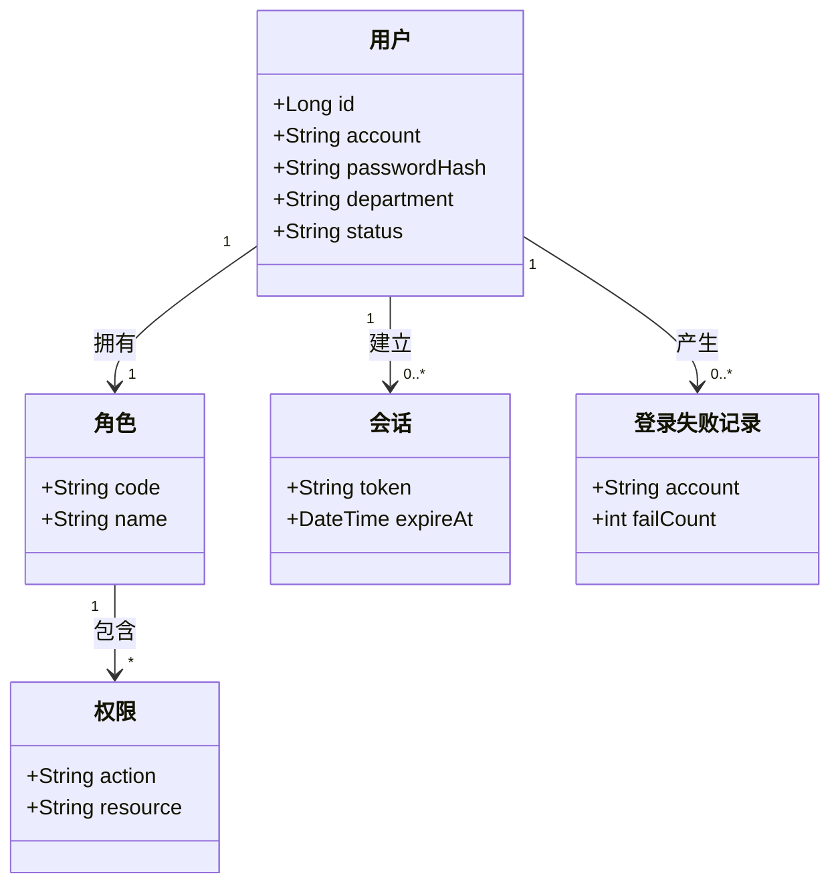

---

## M1 · 第2章：状态机视图

### 用户账号状态机

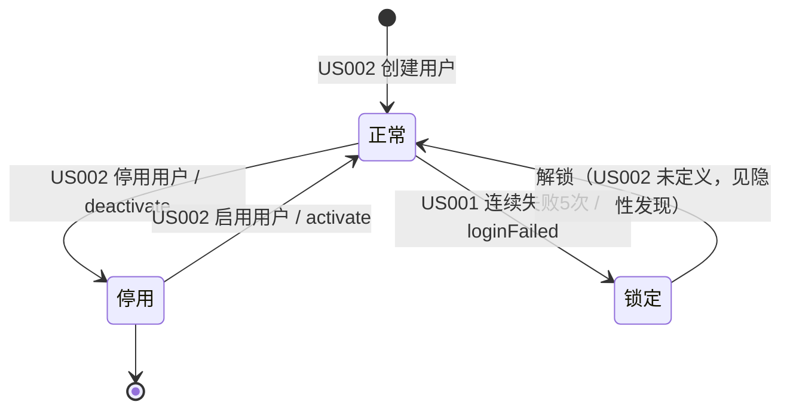

> 🆕 **隐性发现清单（1 个）**：
>
> - **锁定状态**：US001 AC2 规定"连续失败 5 次锁定账号"，但 **US002 未定义锁定的解锁途径**（是管理员手动解锁？还是定时自动解锁？）。此状态是"正常/停用"之外的第三个显式状态，需产品明确解锁机制。

### 会话状态机

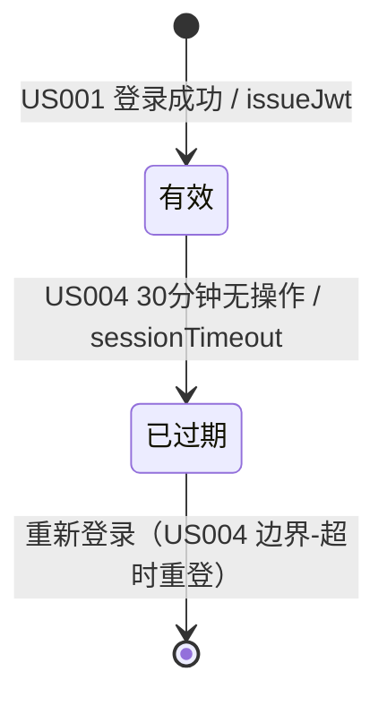

> ⚠️ **待澄清**：US004 边界-临界时刻（第 30 分钟操作）"超时或续期"未明确，建议按"滑动过期"处理（任意操作重置 30 分钟计时）。

---

## M1 · 第3章：事件触发链

| 源 Story | 领域事件 | 订阅方 Story | 触发动作 | 是否必须 |
| -------- | -------- | ------------ | -------- | -------- |
| US001 | AccountLocked（账号锁定） | US002（账号管理） | 置账号为锁定态 | 必须 |
| US002 | UserDeactivated（用户停用） | US001（会话） | 使已有会话失效（US002 AC2） | 必须 |
| US003-Rev | AccessDenied（越权拦截） | US021（审计日志，横切） | 记录越权操作到审计 | 必须 |

### 事件链路图

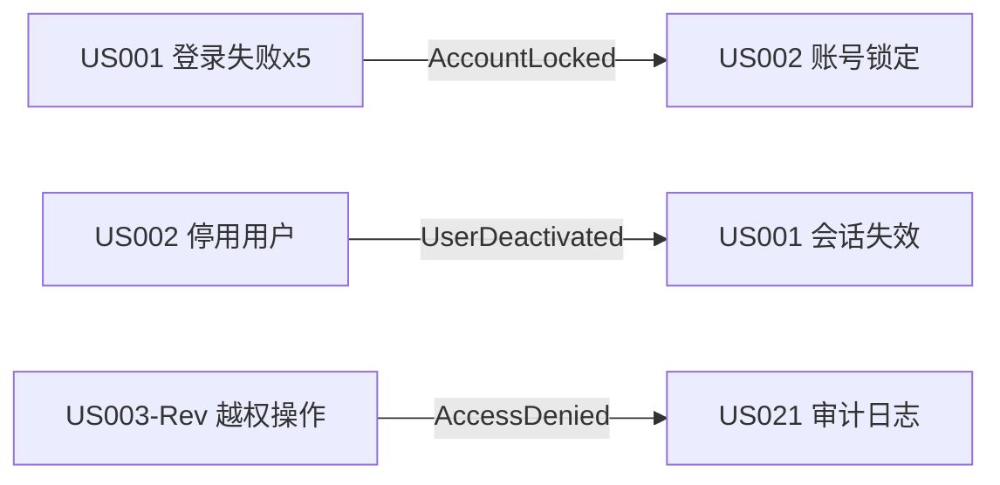

---

## M1 · 第4章：数据依赖矩阵

|           | US001 | US002 | US003-Rev | US004 |
| --------- | ----- | ----- | --------- | ----- |
| **US001** | W     | R     | -         | -     |
| **US002** | -     | W     | R         | -     |
| **US003-Rev** | R  | R     | W         | -     |
| **US004** | R     | -     | -         | W     |

**关键依赖说明**：

- **强依赖（必须先有上游数据）**：US001 登录 → US002 创建的用户；US003-Rev 权限校验 → US002 分配的角色
- **弱依赖（可空但有则更优）**：US001 登录失败锁定 → US002 的账号状态（锁定态依赖账号存在）

---

## M1 · 第5章：横切关注点矩阵

| 横切关注点 | 涉及 Story | 业务规则统一描述 | 实现建议 |
| ---------- | ---------- | --------------- | -------- |
| 操作审计 | US001, US002 | 登录失败、账号创建/停用均记入审计日志 | AOP 拦截 + 审计表 |
| 密码加密 | US001, US002 | 密码必须 BCrypt 加密存储（US001 性能项/安全） | Spring Security BCrypt |
| 会话安全 | US001, US004 | 会话 30 分钟无操作失效；登录失败 5 次锁定 | JWT + Redis 会话管理 |

---

## M1 · 第6章：并发冲突与一致性策略

| 冲突场景 | 冲突 Story | 冲突资源 | 冲突类型 | 推荐策略 |
| -------- | ---------- | -------- | -------- | -------- |
| 同一账号多端并发登录失败计数 | US001 vs US001 | LoginAttempt.failCount | 计数竞态 | 原子计数（Redis INCR）+ 达到 5 次锁定 |
| 停用账号与登录请求并发 | US002 vs US001 | User.status | 状态竞态 | 登录时校验状态 + 账号状态字段唯一约束 |
| 角色变更与权限校验并发 | US002 vs US003-Rev | User.roleId | 读取到旧角色 | 业务层接受最终一致（角色变更低频） |

**一致性策略选型说明**：M1 冲突集中在"计数与状态竞态"，量级低、可接受最终一致；登录失败计数使用 **Redis 原子 INCR**（乐观思路，无锁），账号状态采用 **数据库行锁 + 状态校验** 即可，无需分布式锁/Saga。

---

# 模块 M2：多项目管理与数据隔离（F002）

> **覆盖故事**：US005（项目创建与列表）、US006（项目成员管理）、US007（项目数据隔离）
> **模块业务定位**：支持多项目并行且项目间数据互不可见，为任务提供项目维度的归属与隔离边界。
> ⚠️ **覆盖度提示**：本模块仅 3 个 Story，处于 B4-07 建议下限（5-15），图谱覆盖度不足，部分关系基于 Feature 级描述推断。

---

## M2 · 第1章：共享领域对象图

### 领域对象清单

| 领域对象 | 类型（聚合根/实体/值对象） | 业务定义 | 关联 Story | 操作类型（C/R/U/D） |
| -------- | -------------------------- | -------- | ---------- | ------------------- |
| 项目 Project | 聚合根 | 独立的任务空间，含名称、描述、负责人 | US005, US006, US007 | C / R / U |
| 项目成员 ProjectMember | 实体 | 项目与用户的关联，含成员角色（负责人/成员） | US006, US007 | C / R / U / D |
| 成员角色 MemberRole | 值对象 | 项目内角色：负责人 / 成员 | US006 | U |

### 领域对象关系图

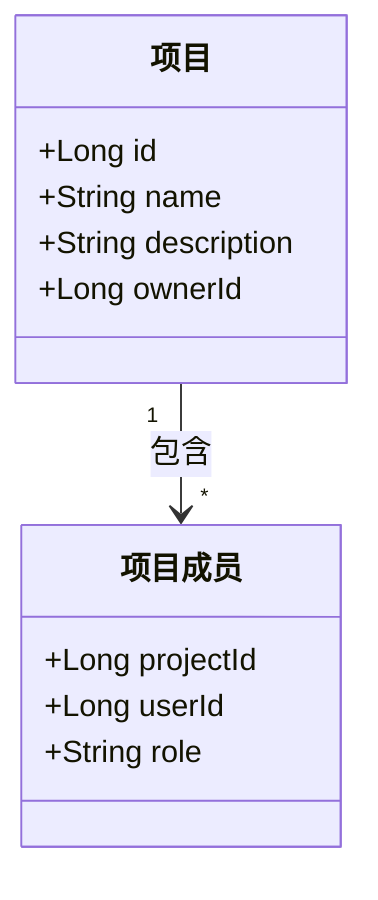

---

## M2 · 第2章：状态机视图

### 项目状态机

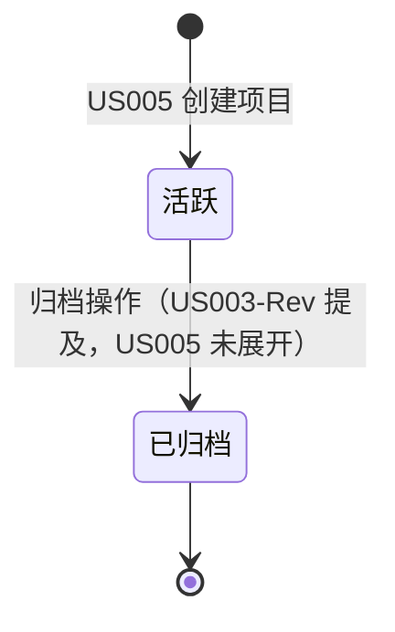

> 🆕 **隐性发现清单（1 个）**：
>
> - **项目归档状态**：US003-Rev 权限矩阵中出现"归档任务/项目"，但 **US005（项目创建与列表）未定义项目状态机**。归档后项目是否仍可见/只读？需补齐。

### 项目成员状态机

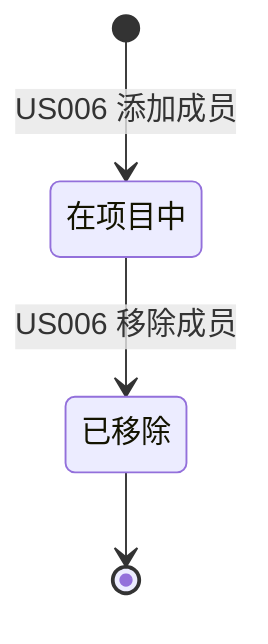

> ⚠️ **待澄清**：US006 边界-移除负责人本人"阻止或需先转移负责人"二选一未定，需产品决策。

---

## M2 · 第3章：事件触发链

| 源 Story | 领域事件 | 订阅方 Story | 触发动作 | 是否必须 |
| -------- | -------- | ------------ | -------- | -------- |
| US005 | ProjectCreated（项目创建） | US006（成员管理） | 创建者自动成为项目负责人（US005 AC1） | 必须 |
| US006 | MemberAdded（成员加入） | US007（数据隔离） | 新成员可见项目数据（US006 AC1） | 必须 |
| US006 | MemberRemoved（成员移除） | US007（数据隔离） | 被移除者不再可见项目数据（US006 AC2） | 必须 |

### 事件链路图

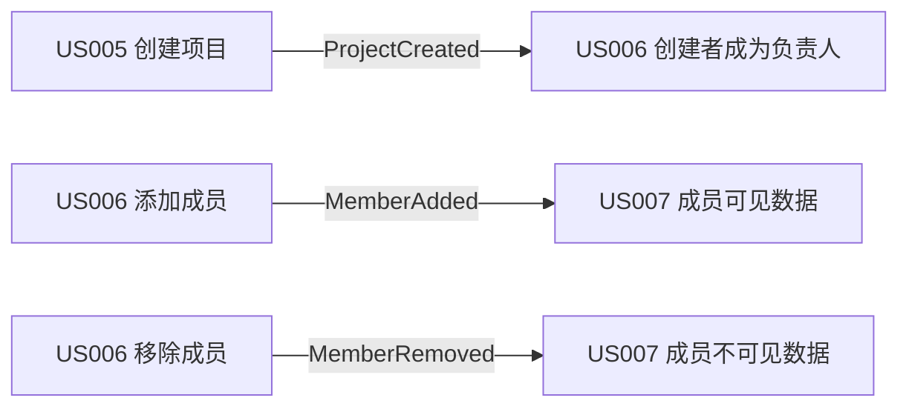

---

## M2 · 第4章：数据依赖矩阵

|           | US005 | US006 | US007 |
| --------- | ----- | ----- | ----- |
| **US005** | W     | -     | -     |
| **US006** | R     | W     | -     |
| **US007** | R     | R     | W     |

**关键依赖说明**：

- **强依赖**：US006 添加成员 → US005 项目必须存在；US007 隔离过滤 → US006 成员关系必须存在
- **无弱依赖项**：本模块依赖链短且均为强依赖

---

## M2 · 第5章：横切关注点矩阵

| 横切关注点 | 涉及 Story | 业务规则统一描述 | 实现建议 |
| ---------- | ---------- | --------------- | -------- |
| 权限控制 | US005, US006 | 仅管理员/项目负责人可创建项目、管理成员（US005 边界-非授权创建、US006 边界-非负责人操作） | Spring Security + 自定义注解 |
| 数据隔离 | US007 | 所有项目数据查询必须按成员关系过滤 | 查询层统一注入 project 权限过滤 |

---

## M2 · 第6章：并发冲突与一致性策略

| 冲突场景 | 冲突 Story | 冲突资源 | 冲突类型 | 推荐策略 |
| -------- | ---------- | -------- | -------- | -------- |
| 同一用户重复添加为成员 | US006 vs US006 | ProjectMember（projectId,userId） | 唯一约束冲突 | 数据库联合唯一约束（projectId + userId） |
| 移除负责人本人与转移并发 | US006 vs US006 | ProjectMember.role | 状态机非法转移 | 事务内校验 + 行锁 |
| 成员移除与数据访问并发 | US006 vs US007 | 项目数据 | 读取被移除成员数据 | 查询时实时校验成员关系（非缓存） |

**一致性策略选型说明**：M2 使用 **数据库唯一约束** 防重复成员，成员移除采用**事务 + 行锁**保证与数据访问的一致性；数据隔离不缓存成员关系，保证移除即失效。

---

# 模块 M3：看板任务视图（F003）

> **覆盖故事**：US008（看板三列视图）、US009（看板拖拽流转）、US010A（实时同步基础设施）、US010B（状态变更推送）
> **模块业务定位**：以三列看板直观呈现任务状态，支持拖拽流转并实时同步，是替代 Excel 的核心交互模块。

---

## M3 · 第1章：共享领域对象图

### 领域对象清单

| 领域对象 | 类型（聚合根/实体/值对象） | 业务定义 | 关联 Story | 操作类型（C/R/U/D） |
| -------- | -------------------------- | -------- | ---------- | ------------------- |
| 看板 Board | 聚合根 | 项目维度的三列（待办/进行中/已完成）任务视图 | US008, US009 | R / U |
| 任务卡片 TaskCard | 实体（引用 M4 任务聚合根） | 看板上展示的任务卡片（标题/指派人/优先级/截止日期/状态） | US008, US009 | R / U |
| 列 Column | 值对象 | 待办 / 进行中 / 已完成 | US008, US009 | R / U |
| WebSocket 连接 Connection | 实体 | 客户端与服务器的实时通道（含认证、心跳、重连状态） | US010A, US010B | C / R / U / D |

### 领域对象关系图

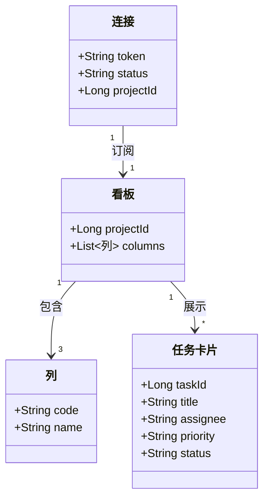

> 📌 **强约束**：任务卡片是 M4 `Task` 聚合根的**视图投影**，看板不持有任务权威数据，仅读任务状态并展示/变更。

---

## M3 · 第2章：状态机视图

### 任务状态机（看板视角，权威状态机见 M4）

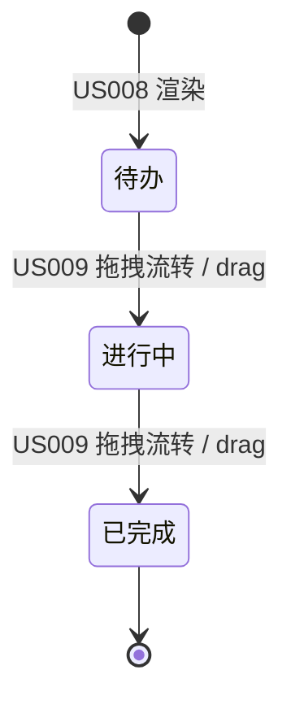

### 连接状态机（US010A）

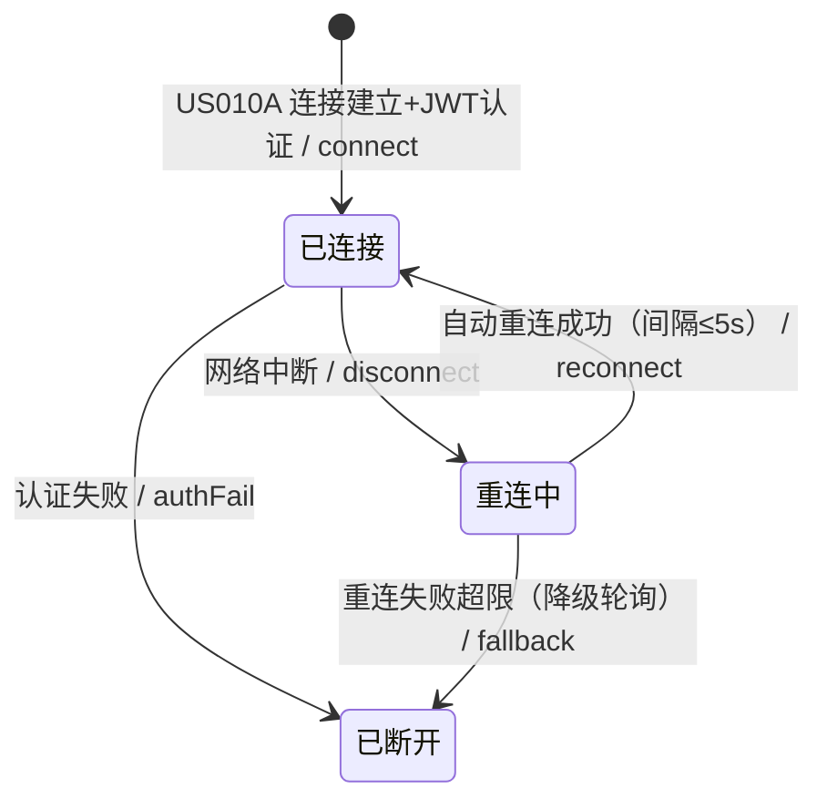

> 🆕 **隐性发现清单（1 个）**：
>
> - **降级切换的退出条件**：US010A AC6 提到"可切换 5s 轮询模式"，但 **未定义何时从轮询切回 WebSocket**（是恢复连接自动切回？还是手动？）。建议：恢复连接后自动切回实时。

---

## M3 · 第3章：事件触发链

| 源 Story | 领域事件 | 订阅方 Story | 触发动作 | 是否必须 |
| -------- | -------- | ------------ | -------- | -------- |
| US009 | TaskStatusChanged（任务状态变更） | US010B（状态推送） | 广播状态变更到项目在线用户（≤1s） | 必须 |
| US009 | TaskStatusChanged | US016（M4 任务状态流转） | 看板状态与任务详情状态保持一致 | 必须 |
| US010B | PushDelivered（推送完成） | US010A（连接管理） | 复用连接通道 / 降级轮询兜底 | 必须 |

### 事件链路图

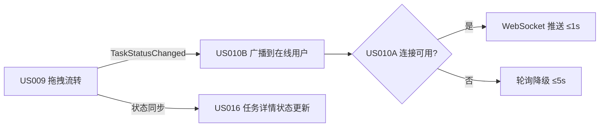

---

## M3 · 第4章：数据依赖矩阵

|           | US008 | US009 | US010A | US010B |
| --------- | ----- | ----- | ------ | ------ |
| **US008** | W     | -     | -      | -      |
| **US009** | R     | W     | -      | -      |
| **US010A** | -     | -     | W      | -      |
| **US010B** | R     | R     | R      | W      |

**关键依赖说明**：

- **强依赖**：US010B 推送 → US009 状态变更事件（事件源）；US010B 广播 → US010A 连接通道（通道源）
- **弱依赖**：US008 渲染看板 → US009 拖拽（先有展示才可拖拽，功能上依赖）
- 📌 **注意**：US008 与 US009 读的是 M4 的 `Task` 数据（跨模块），本矩阵仅展示模块内依赖。

---

## M3 · 第5章：横切关注点矩阵

| 横切关注点 | 涉及 Story | 业务规则统一描述 | 实现建议 |
| ---------- | ---------- | --------------- | -------- |
| 权限校验 | US009 | 仅可拖拽有权限的任务（US009 AC2 无权限回滚） | 拖拽提交时服务端校验权限 |
| 数据隔离 | US008, US010B | 仅展示/推送当前项目任务（US010B AC4 广播仅项目内在线成员） | WebSocket 按 projectId 分通道 |
| 实时通道 | US010A, US010B | 心跳保活、断线重连、降级轮询 | WebSocket + 心跳 + 5s 轮询兜底 |
| 性能保障 | US008 | 30 人并发查看接口 P95 ≤ 300ms | 读缓存 / 接口聚合 |

---

## M3 · 第6章：并发冲突与一致性策略

| 冲突场景 | 冲突 Story | 冲突资源 | 冲突类型 | 推荐策略 |
| -------- | ---------- | -------- | -------- | -------- |
| 多人同时拖拽同一任务 | US009 vs US009 | Task.status | 状态机非法转移 / 覆盖写 | 乐观锁（version）+ 状态机校验（US010B 边界-多人并发最终一致） |
| 拖拽与编辑任务属性并发 | US009 vs US013（M4） | Task | 读改写丢失 | 乐观锁（version 字段），冲突提示重试 |
| 重连期间推送丢失 | US010A vs US010B | 事件 | 事件丢失 | 事件落库 + 重连后全量/增量补偿拉取（US010B AC5） |

**一致性策略选型说明**：M3 核心采用 **乐观锁（version）** 保证拖拽/编辑的读写一致性；推送使用 **事件落库 + 补偿拉取** 保证最终一致；WebSocket 实时 + 5s 轮询降级，满足"≤1s/≤5s"的量化目标。

---

# 模块 M4：任务生命周期管理（F004）

> **覆盖故事**：US011（创建任务）、US012（指派任务）、US013（编辑任务属性）、US014（删除任务）、US015（任务详情查看）、US016（任务状态流转）
> **模块业务定位**：任务从创建、指派、属性维护到删除/状态流转的完整生命周期闭环，是系统核心领域（聚合根 Task 的权威归属方）。

---

## M4 · 第1章：共享领域对象图

### 领域对象清单

| 领域对象 | 类型（聚合根/实体/值对象） | 业务定义 | 关联 Story | 操作类型（C/R/U/D） |
| -------- | -------------------------- | -------- | ---------- | ------------------- |
| 任务 Task | 聚合根 | 团队工作的最小单元：标题、描述、优先级、截止日期、状态、指派人、创建者 | US011~US016 | C / R / U / D |
| 任务指派人 Assignee | 值对象 | 任务当前责任人（项目成员） | US012, US013 | U |
| 任务属性 TaskAttribute | 值对象 | 标题、描述、优先级、截止日期 | US011, US013 | C / U |
| 任务状态 TaskStatus | 值对象 | 待办 / 进行中 / 已完成 | US011, US016 | U |
| 评论（引用 M5 实体） | 实体 | 任务下关联的评论（删除时级联处理） | US014, US015 | R / D |

### 领域对象关系图

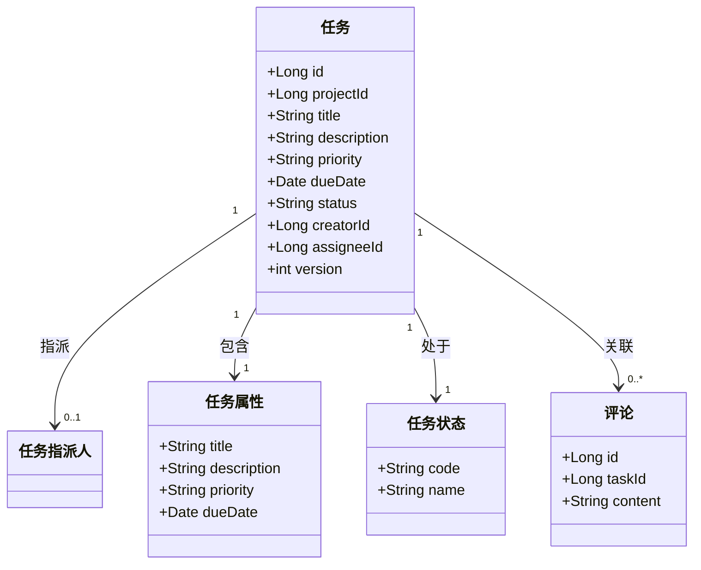

> 📌 **强约束**：`Task` 是**全系统任务数据的权威聚合根**，M3 看板（展示/拖拽）、M5 评论（关联）、M6 报表（统计）均读取本模块的 Task 数据。

---

## M4 · 第2章：状态机视图

### 任务状态机（全系统权威状态机）

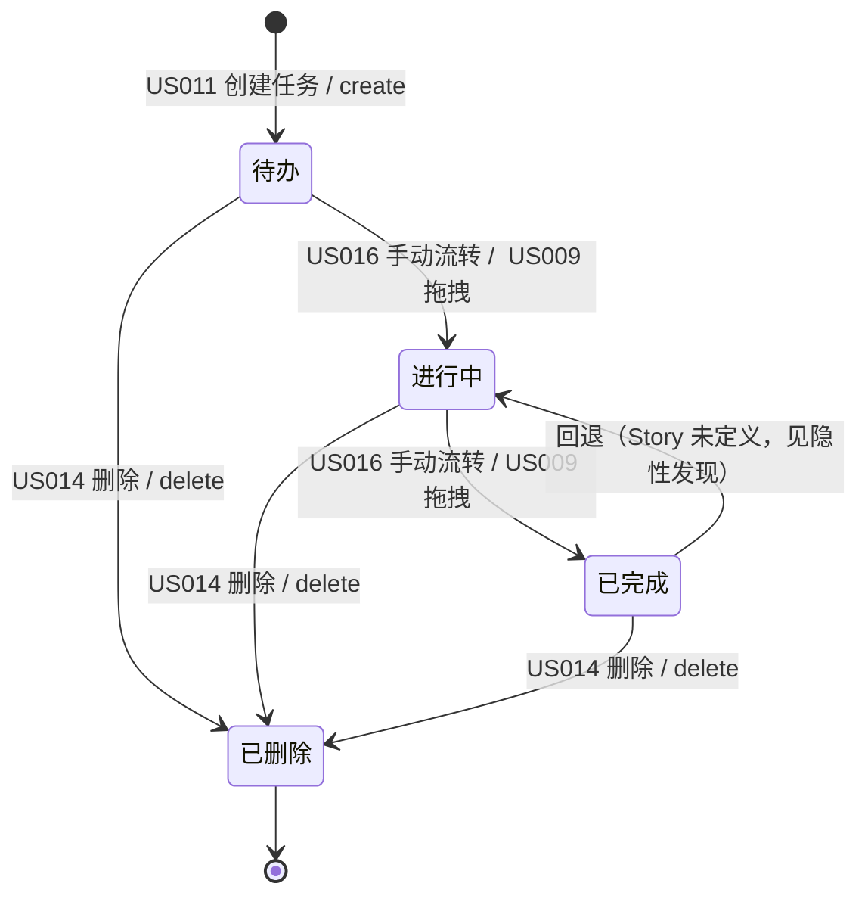

> 🆕 **隐性发现清单（2 个）**：
>
> - **已完成回退流转**：US016 AC3 仅定义"待办→进行中→已完成 等合法序列"，**未定义"已完成"能否回退到"进行中/待办"**。若业务允许返工，需补充回退规则；否则应禁止回退。
> - **删除任务的权威性**：US014 定义删除操作，但 **未明确删除是硬删除还是软删除**（US014 边界-删除含评论任务"级联处理（删除评论或保留关联，需明确）"）。建议软删除（保留历史 + 审计可追溯），与 US021 审计"删除留痕"一致。

### 数据依赖关系（跨模块状态联动）

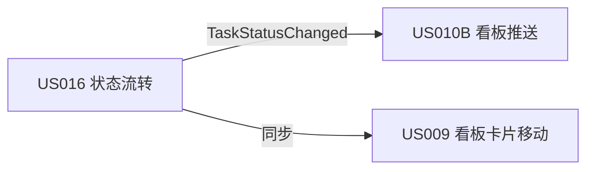

---

## M4 · 第3章：事件触发链

| 源 Story | 领域事件 | 订阅方 Story | 触发动作 | 是否必须 |
| -------- | -------- | ------------ | -------- | -------- |
| US012 | TaskAssigned（任务指派） | US019-Rev（通知，跨模块 M5） | 被指派者收到站内信通知 | 必须 |
| US016 | TaskStatusChanged（状态变更） | US010B（看板推送，跨模块 M3） | 广播状态变更到在线用户 | 必须 |
| US014 | TaskDeleted（任务删除） | US021（审计日志，横切） | 记录删除留痕 | 必须 |
| US013 | TaskUpdated（任务更新） | US021（审计日志，横切） | 记录内容变更 | 必须 |
| US011 | TaskCreated（任务创建） | US021（审计日志，横切） | 记录创建操作 | 必须 |

### 事件链路图

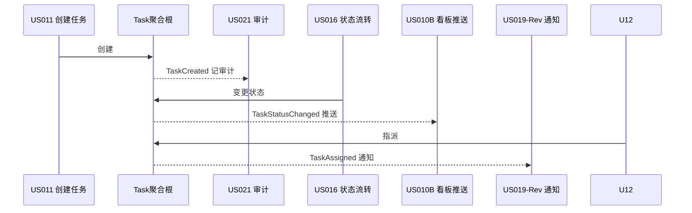

---

## M4 · 第4章：数据依赖矩阵

|           | US011 | US012 | US013 | US014 | US015 | US016 |
| --------- | ----- | ----- | ----- | ----- | ----- | ----- |
| **US011** | W     | -     | -     | -     | -     | -     |
| **US012** | R     | W     | -     | -     | -     | -     |
| **US013** | R     | R     | W     | -     | -     | -     |
| **US014** | R     | -     | -     | W     | -     | -     |
| **US015** | R     | R     | R     | -     | W     | R     |
| **US016** | R     | -     | -     | -     | -     | W     |

**关键依赖说明**：

- **强依赖（必须先有上游数据）**：US012/013/014/015/016 → US011（任务必须先创建）；US013 编辑指派人 → US012 指派（有指派才可改）
- **弱依赖（可空但有则更优）**：US015 详情查看 → US016 状态（任务可无状态流转直接查看）
- 📌 **注意**：US015 详情读取 M5 的评论数据（跨模块），本矩阵仅展示模块内任务数据依赖。

---

## M4 · 第5章：横切关注点矩阵

| 横切关注点 | 涉及 Story | 业务规则统一描述 | 实现建议 |
| ---------- | ---------- | --------------- | -------- |
| 操作审计 | US011, US012, US013, US014, US016 | 任务增删改均记审计（操作人/时间/变更） | AOP 拦截 + 审计表 |
| 权限控制 | US012, US013, US014 | 仅负责人可指派；编辑限创建者/被指派者/管理员；删除限创建者/管理员（US003-Rev 权限矩阵） | Spring Security + 自定义注解 + 服务端二次校验 |
| 实时推送 | US016 | 状态变更需推送到看板 | 领域事件 + WebSocket |
| 通知 | US012 | 指派任务触发站内信 | 领域事件 + 异步消息（对接 M5） |

---

## M4 · 第6章：并发冲突与一致性策略

| 冲突场景 | 冲突 Story | 冲突资源 | 冲突类型 | 推荐策略 |
| -------- | ---------- | -------- | -------- | -------- |
| 两人同时编辑同一任务 | US013 vs US013 | Task | 读改写丢失 | 乐观锁（version 字段） |
| 编辑与删除并发 | US013 vs US014 | Task | 删除已编辑数据 | 乐观锁校验 + 状态机校验（已删除不可编辑） |
| 指派与删除并发 | US012 vs US014 | Task.assigneeId | 指派到已删除任务 | 事务内校验任务状态 + 唯一约束 |
| 状态流转与拖拽并发 | US016 vs US009（M3） | Task.status | 状态机非法转移 | 状态机校验 + 乐观锁（version） |

**一致性策略选型说明**：M4 是并发冲突**最密集**的模块。统一采用 **乐观锁（version 字段）** + **状态机合法性校验**，拒绝非法状态转移（如"已删除→进行中"）；删除建议**软删除**并级联处理评论（待澄清）；不引入分布式锁（内网 30 人规模，乐观锁足够）。

---

# 模块 M5：任务内协作与通知（F005）

> **覆盖故事**：US017（任务内评论）、US018（评论@提及）、US019-Rev（通知提醒 MVP 站内信）
> **模块业务定位**：沉淀任务讨论上下文（评论 + @提及），并通过站内信通知让成员不遗漏重要任务。
> ⚠️ **覆盖度提示**：本模块仅 3 个 Story，处于 B4-07 建议下限（5-15），图谱覆盖度不足。

---

## M5 · 第1章：共享领域对象图

### 领域对象清单

| 领域对象 | 类型（聚合根/实体/值对象） | 业务定义 | 关联 Story | 操作类型（C/R/U/D） |
| -------- | -------------------------- | -------- | ---------- | ------------------- |
| 评论 Comment | 实体 | 任务下的讨论内容，含作者、时间、@提及 | US017, US018 | C / R |
| 提及 Mention | 值对象 | 评论中被 @ 的项目成员 | US018 | C / R |
| 通知 Notification | 聚合根 | 站内信：指派/到期/@提及 三类通知，含未读状态 | US019-Rev | C / R / U |
| 通知渠道 Channel | 值对象 | 站内信（MVP）/ 浏览器（可选）/ 预留企业微信、邮件 | US019-Rev | U |

### 领域对象关系图

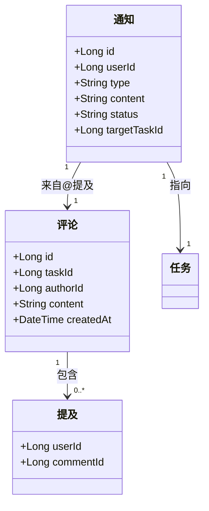

---

## M5 · 第2章：状态机视图

### 通知状态机

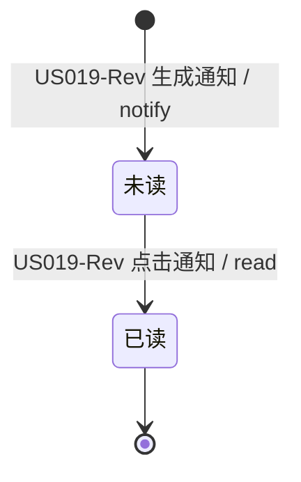

> 🆕 **隐性发现清单（1 个）**：
>
> - **通知的"已读"是否支持"标为未读"或"清除"**：US019-Rev AC7 仅定义未读角标，**未定义通知列表的清除/全部已读操作**。建议 MVP 提供"全部已读"。

### 评论状态机

评论无状态机（创建即展示，不可修改/删除未定义）。

> ⚠️ **待澄清**：US017 未定义评论**编辑/删除**能力，仅"发布 + 列表展示"。若需删除需补充 Story。

---

## M5 · 第3章：事件触发链

| 源 Story | 领域事件 | 订阅方 Story | 触发动作 | 是否必须 |
| -------- | -------- | ------------ | -------- | -------- |
| US018 | CommentMentioned（评论@提及） | US019-Rev（通知） | 被@成员收到通知（US019 AC3） | 必须 |
| US012（M4 指派） | TaskAssigned | US019-Rev（通知） | 被指派者收到站内信（US019 AC1） | 必须 |
| 定时任务 | DueDateReminder（到期提醒） | US019-Rev（通知） | 任务到期前 1 天提醒（US019 AC2） | 必须 |

### 事件链路图

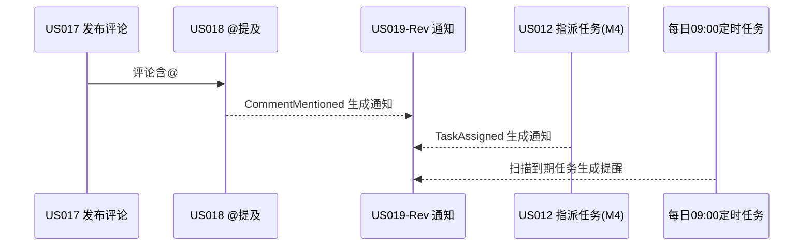

> 🆕 **隐性事件订阅方（1 个）**：US019-Rev 的到期提醒**依赖定时任务每日扫描全部任务**（M4 数据），此"定时扫描"是 Story 中未显式的隐性订阅方。

---

## M5 · 第4章：数据依赖矩阵

|           | US017 | US018 | US019-Rev |
| --------- | ----- | ----- | --------- |
| **US017** | W     | -     | -         |
| **US018** | R     | W     | -         |
| **US019-Rev** | -  | R     | W         |

**关键依赖说明**：

- **强依赖**：US018 @提及 → US017 评论存在；US019-Rev 通知 → US018 提及关系
- **跨模块依赖**：US019-Rev → M4 任务数据（到期提醒读取任务截止日期）、→ M4 US012 指派事件（指派通知）
- 📌 **注意**：US017 评论本身依赖 M4 任务存在（评论挂在任务下），属跨模块依赖。

---

## M5 · 第5章：横切关注点矩阵

| 横切关注点 | 涉及 Story | 业务规则统一描述 | 实现建议 |
| ---------- | ---------- | --------------- | -------- |
| 通知渠道抽象 | US019-Rev | MVP 站内信为主，浏览器通知可选，预留企业微信/邮件（P1 延后） | 渠道接口抽象 + 策略模式 |
| 定时任务 | US019-Rev | 到期提醒每日 09:00 扫描；同任务每天仅提醒一次 | Spring Schedule / XXL-Job |
| 通知去重 | US019-Rev | 同一任务同一事件不重复触发；已完成任务不提醒 | 事件幂等 + 唯一键 |
| 权限校验 | US017 | 仅项目成员可评论（US017 边界-非项目成员拒绝） | 服务端校验项目成员关系 |

---

## M5 · 第6章：并发冲突与一致性策略

| 冲突场景 | 冲突 Story | 冲突资源 | 冲突类型 | 推荐策略 |
| -------- | ---------- | -------- | -------- | -------- |
| 同一事件重复生成通知 | US019-Rev vs US019-Rev | Notification | 重复通知（US019 AC4 去重） | 唯一约束（userId + type + targetId + 事件id）+ 幂等 |
| 评论发布与 @ 通知并发 | US017 vs US018 | Comment/Mention | 通知遗漏 | 同事务生成评论 + 提及 + 通知事件 |
| 定时任务重复扫描 | US019-Rev vs US019-Rev | 提醒记录 | 重复提醒 | 按任务+日期唯一键（每天一次） |

**一致性策略选型说明**：M5 采用 **事件幂等 + 唯一约束** 防重复通知；评论与 @ 提及在同一事务内保证不遗漏；定时提醒以"任务+日期"为唯一键保证每天一次。

---

# 模块 M6：进度报表与操作审计（F006）

> **覆盖故事**：US020（项目进度视图）、US021（操作日志审计）、US022（数据导出）、US023（每日自动备份）
> **模块业务定位**：为项目经理提供全局进度视图，为管理员提供审计追溯、数据导出与备份恢复能力，承担全系统的横切落点（审计、定时任务）。

---

## M6 · 第1章：共享领域对象图

### 领域对象清单

| 领域对象 | 类型（聚合根/实体/值对象） | 业务定义 | 关联 Story | 操作类型（C/R/U/D） |
| -------- | -------------------------- | -------- | ---------- | ------------------- |
| 进度指标 ProgressMetric | 值对象 | 项目任务完成率、各状态数量 | US020 | R |
| 审计日志 AuditLog | 聚合根 | 任务增删改操作记录（操作人/时间/动作/变更） | US021 | C / R |
| 导出文件 ExportFile | 实体 | 项目任务数据的 Excel/CSV 导出结果 | US022 | C / R |
| 备份 Backup | 实体 | 每日定时备份文件及其状态 | US023 | C / R |

### 领域对象关系图

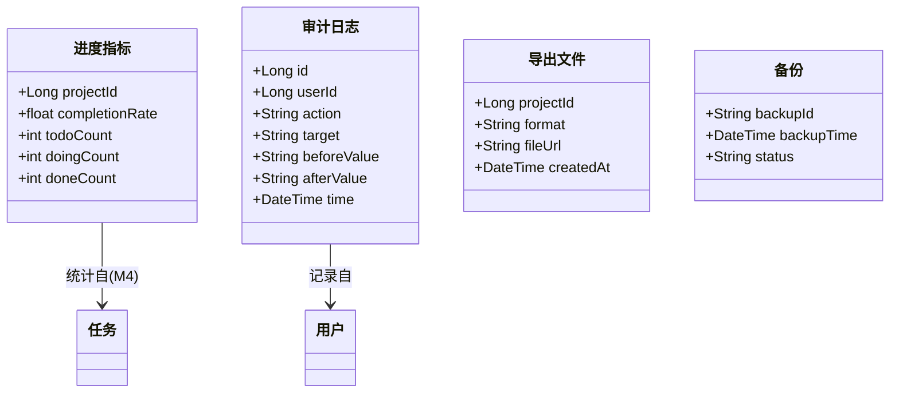

---

## M6 · 第2章：状态机视图

### 备份状态机

```mermaid
stateDiagram-v2
    [*] --> 待执行: US023 每日定时触发
    待执行 --> 备份中: 执行备份 / backup
    备份中 --> 成功: 备份完成 / success
    备份中 --> 失败: 磁盘满/异常 / fail（告警通知运维）
    成功 --> [*]
```

> 🆕 **隐性发现清单（1 个）**：
>
> - **备份失败的重试与告警**：US023 边界-备份失败仅说"告警通知运维"，**未定义是否自动重试**。建议：失败后告警 + 保留上一次成功备份 + 支持手动重试。

### 审计日志状态机

审计日志只读不可篡改（US021 AC2），无状态机。

> 📌 **强约束**：审计日志"只读不可篡改"是安全约束，需数据库层面保证（如仅 INSERT + 权限隔离 + 防删除）。

---

## M6 · 第3章：事件触发链

| 源 Story | 领域事件 | 订阅方 Story | 触发动作 | 是否必须 |
| -------- | -------- | ------------ | -------- | -------- |
| 各模块写操作（M1~M5） | AuditEvent（审计事件） | US021（审计日志） | 记录操作人/时间/变更 | 必须 |
| US020 | ProgressRequested（进度查询） | M4 任务数据 | 统计完成率与状态分布 | 必须 |
| US022 | ExportRequested（导出请求） | M4 任务数据 | 生成项目任务 Excel/CSV | 必须 |
| US023 | BackupFailed（备份失败） | 运维告警 | 告警通知运维（US023 边界） | 必须 |

### 事件链路图

```mermaid
flowchart LR
    A[M1~M5 各模块写操作] -->|AuditEvent| B[US021 审计日志]
    C[US020 进度视图] -->|读| D[M4 任务数据]
    E[US022 数据导出] -->|读| D
    F[US023 每日备份] -->|快照| G[全部数据]
    F -->|失败| H[告警运维]
```

> 🆕 **隐性事件订阅方（1 个）**：US021 审计是**全系统所有写操作的隐性订阅方**（US003-Rev AC4 越权记审计、US014 AC1 删除记审计等散落在各 Story，本图谱统一显式化）。

---

## M6 · 第4章：数据依赖矩阵

|           | US020 | US021 | US022 | US023 |
| --------- | ----- | ----- | ----- | ----- |
| **US020** | W     | -     | -     | -     |
| **US021** | -     | W     | -     | -     |
| **US022** | -     | -     | W     | -     |
| **US023** | -     | -     | -     | W     |

**关键依赖说明**：

- 本模块 4 个 Story 之间**无直接数据依赖**（相互独立），各自依赖**外部模块数据**：
  - US020 → M4 任务数据（统计进度）
  - US021 ← M1~M5 审计事件（收集）
  - US022 → M4 任务数据（导出）
  - US023 → 全部数据（备份）
- 📌 **注意**：本矩阵仅展示模块内依赖；跨模块依赖见"跨模块依赖汇总"章节。

---

## M6 · 第5章：横切关注点矩阵

| 横切关注点 | 涉及 Story | 业务规则统一描述 | 实现建议 |
| ---------- | ---------- | --------------- | -------- |
| 审计（全系统横切落点） | US021 | 所有写操作必须记录操作人/时间/变更，只读不可篡改 | AOP 拦截 + 审计表 + 只读权限 |
| 定时任务 | US023 | 每日定时备份；RPO ≤ 24h；失败告警 | Spring Schedule / XXL-Job + 备份脚本 |
| 大数据量处理 | US022 | 任务量大时分页/后台生成，不阻塞 | 异步导出 + 消息队列 |
| 数据恢复 | US023 | 备份可恢复验证（演练）；文件损坏支持历史备份 | 备份版本管理 + 恢复演练流程 |

---

## M6 · 第6章：并发冲突与一致性策略

| 冲突场景 | 冲突 Story | 冲突资源 | 冲突类型 | 推荐策略 |
| -------- | ---------- | -------- | -------- | -------- |
| 导出与任务写并发 | US022 vs M4 写操作 | 任务数据 | 导出数据不完整/不一致 | 导出基于一致性快照（读已提交 / 导出时刻快照） |
| 备份与业务写并发 | US023 vs M1~M5 写操作 | 全部数据 | 备份数据不一致 | 数据库级一致性备份（快照/二进制日志），RPO≤24h |
| 进度统计与任务写并发 | US020 vs M4 写操作 | 任务数据 | 统计轻微偏差 | 业务层接受最终一致（统计非强一致场景） |

**一致性策略选型说明**：M6 中**备份**要求强一致（使用数据库快照/二进制日志备份），**导出**使用一致性快照即可；**进度统计**接受最终一致（非关键路径）。整体无分布式事务需求。

---

# 第7章：跨模块依赖汇总（全系统）

> 本章将 6 个模块图谱串联为全系统依赖视图，供 HLD-01（模块划分）与 HLD-02（接口编排）直接使用。

## 7.1 模块依赖图（DAG）

```mermaid
flowchart TD
    M1[用户认证与访问控制] --> M2[多项目管理与数据隔离]
    M1 --> M3[看板任务视图]
    M1 --> M4[任务生命周期管理]
    M1 --> M5[任务内协作与通知]
    M1 --> M6[进度报表与操作审计]
    M2 --> M3
    M2 --> M4
    M4 --> M3
    M4 --> M5
    M4 --> M6
    M5 --> M6
```

## 7.2 跨模块依赖明细

| 依赖方向 | 依赖内容 | 事件/数据 | 依赖来源（Story） | 被依赖方（Story） |
| -------- | -------- | --------- | ----------------- | ----------------- |
| M1 → 全模块 | 登录态 / 权限校验 | JWT 会话、角色权限 | US001, US003-Rev | 所有模块 |
| M2 → M3 | 项目看板数据隔离 | 项目成员关系 | US007 | US008, US010B |
| M2 → M4 | 任务归属项目 | project_id 隔离 | US007 | US011~US016 |
| M4 → M3 | 任务状态变更推送 | TaskStatusChanged | US016 | US010B |
| M4 → M5 | 指派任务通知 | TaskAssigned | US012 | US019-Rev |
| M4 → M6 | 任务写操作审计 | AuditEvent | US011~US016 | US021 |
| M4 → M5 | 任务数据（到期提醒） | Task.dueDate | 定时扫描 | US019-Rev |
| M5 → M6 | 协作操作审计 | AuditEvent | US017, US018 | US021 |
| M6 → M4 | 进度统计 / 导出数据 | 任务数据读取 | US020, US022 | US011~US016 |
| M1 → M6 | 认证/账号操作审计 | AuditEvent | US001, US002 | US021 |

## 7.3 全局横切关注点汇总

| 全局横切关注点 | 落点模块 | 覆盖 Story | 实现载体 |
| -------------- | -------- | ---------- | -------- |
| 操作审计 | M6（US021） | US001~US023 所有写操作 | AOP 拦截 + 审计表 |
| 权限控制 | M1（US003-Rev） | US001~US023 所有受限操作 | 权限矩阵 + 服务端二次校验 |
| 通知 | M5（US019-Rev） | US012, US018, 到期提醒 | 领域事件 + 站内信 |
| 定时任务 | M5, M6 | US019-Rev（到期提醒）、US023（每日备份） | Spring Schedule / XXL-Job |
| 实时推送 | M3（US010A/B） | US009, US016 | WebSocket + 轮询降级 |
| 数据隔离 | M2（US007） | 全模块项目数据查询 | 查询层权限过滤 |

## 7.4 隐性发现总清单

| # | 隐性发现 | 涉及模块 | 涉及 Story | 建议动作 |
| - | -------- | -------- | ---------- | -------- |
| 1 | 账号"锁定"状态的解锁途径未定义 | M1 | US001, US002 | 产品明确解锁机制 |
| 2 | 项目"归档"状态未在 US005 定义状态机 | M2 | US003-Rev, US005 | 补充项目生命周期 |
| 3 | 看板降级（轮询）何时切回 WebSocket 未定义 | M3 | US010A | 明确自动切回条件 |
| 4 | 任务"已完成→回退"流转未定义 | M4 | US016 | 明确返工规则 |
| 5 | 任务删除"硬删除/软删除"未定，评论级联策略待定 | M4 | US014 | 产品决策（建议软删除） |
| 6 | 通知"全部已读/清除"未定义 | M5 | US019-Rev | MVP 补充全部已读 |
| 7 | 评论编辑/删除能力未定义 | M5 | US017 | 补充 Story 或明确不支持 |
| 8 | 到期提醒依赖的"每日定时扫描"为隐性订阅方 | M5 | US019-Rev | HLD 显式设计定时任务 |
| 9 | 备份失败是否自动重试未定义 | M6 | US023 | 明确重试策略 |
| 10 | 审计是全部写操作的隐性订阅方 | M6 | US021 | HLD 统一设计审计切面 |

## 7.5 遗留待澄清项（承接用户故事 v2.0）

| 事项 | 建议决策 | 影响模块/Story |
| -------- | -------- | -------------- |
| 编辑权限细则：非创建者的"任务指派人"是否可编辑 | 建议：指派人可编辑（矩阵 ⚠️ 项） | M4 / US003-Rev, US013 |
| 通知提醒的具体时间点与去重粒度 | 建议：每日 09:00 扫描、按任务+事件去重 | M5 / US019-Rev |
| 浏览器通知是否纳入 MVP | 建议：增强项，不阻塞主流程 | M5 / US019-Rev |
| 删除含评论任务的级联策略 | 建议：软删除任务，评论保留关联（可追溯） | M4 / US014 |
| 项目归档状态与只读规则 | 建议：归档后只读，可恢复 | M2 / US005 |
| 账号锁定解锁机制 | 建议：管理员手动解锁 + 可配置锁定时长 | M1 / US001, US002 |

---

## 📎 与 HLD 的对接索引

| HLD 文档 | 消费本图谱章节 | 直接用途 |
| -------- | -------------- | -------- |
| HLD-01 模块划分 | 各模块第1章、第5章、第7章 | 模块边界、横切模块识别、模块依赖 DAG |
| HLD-02 接口设计 | 各模块第3章、第4章 | 接口清单、事件接口、接口编排顺序 |
| HLD-03 数据库设计 | 各模块第1章、第2章、第6章 | ER 模型、状态字段、锁字段/唯一约束 |
| HLD-04 时序图 | 各模块第2章、第3章 | 状态流转时序、事件交互时序 |

---

*文档版本: v1.0 ｜ 创建日期: 2026-08-15 ｜ 依据: B4-07 提示词 ｜ 输入: 03-用户故事-完整版v2.0.md ｜ 状态: 待评审*
