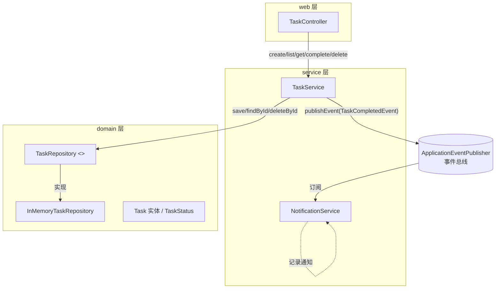
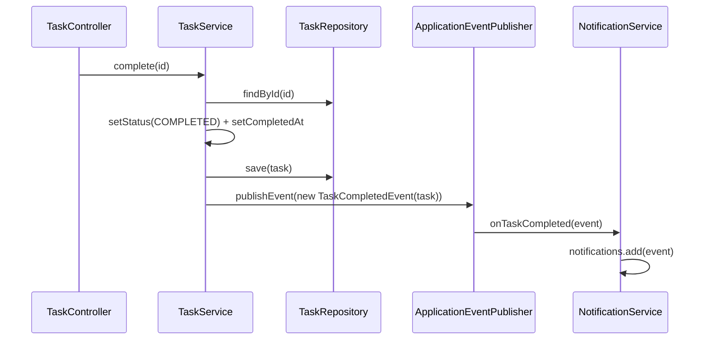

# 02 · 设计输入：设计文档与架构图

> **定位**：集成测试用例的"在哪儿测"来源——先看清系统分几层、模块之间有哪些**接缝**（事件、调用、数据、外部依赖）。

---

## 一、分层架构设计

| 层 | 组件 | 职责 |
|----|------|------|
| **web 层** | `TaskController` | REST 入口，路由 + 统一异常映射（403/404） |
| **service 层** | `TaskService` | 业务编排：创建/分配/完成/删除/查询，发领域事件 |
| | `NotificationService` | 订阅 `task.completed` 事件，记录通知 |
| | `BusinessException` | 业务异常（forbidden 403 / notFound 404） |
| **domain 层** | `Task` 实体 / `TaskStatus` 枚举 | 状态流转、`isCompleted()` 规则载体 |
| | `TaskRepository`（接口） | 仓储契约：save/findById/findAll/deleteById |
| | `InMemoryTaskRepository` | 内存实现（开箱即用，无数据库） |
| **event** | `TaskCompletedEvent` | 领域事件载体（record） |

## 二、架构图（模块依赖 + 事件流）

## 三、事件链路时序图（集成测试重点场景）

> 这张时序图就是集成测试的"主链路剧本"：**每个箭头都是一次模块间协作，都是集成点候选**。

## 四、从设计看：集成点（接缝）线索

| 接缝类型 | 位置 | 说明 |
|----------|------|------|
| 方法调用 | `Controller → Service` | 5 个 REST 入口全部走 Service |
| 方法调用 | `Service → Repository` | 仓储读写（save/findById/deleteById/findAll） |
| **事件** | `Service.complete → 事件总线 → NotificationService` | ★ 异步接缝，重点 |
| **业务规则跨方法** | `delete → canDelete` | ★ 跨操作组合，易漏 |
| 异常映射 | `Service 抛异常 → Controller @ExceptionHandler` | 403/404 契约 |
| 外部依赖 | 无（内存仓储） | 若有真实 DB 才需 Testcontainers |

> **设计文档的职责**：帮你把"接缝"都摆到桌面上，避免"只凭感觉挑几条测"。
