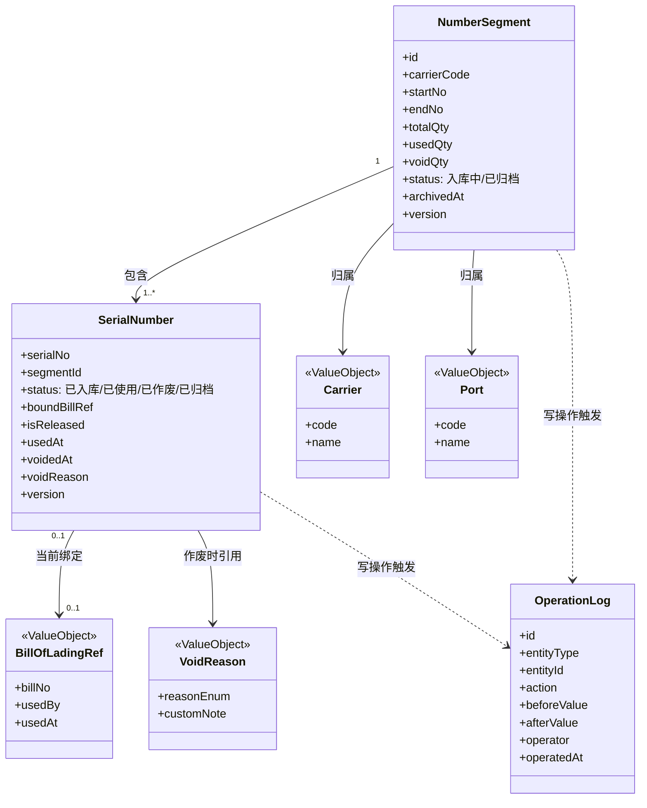
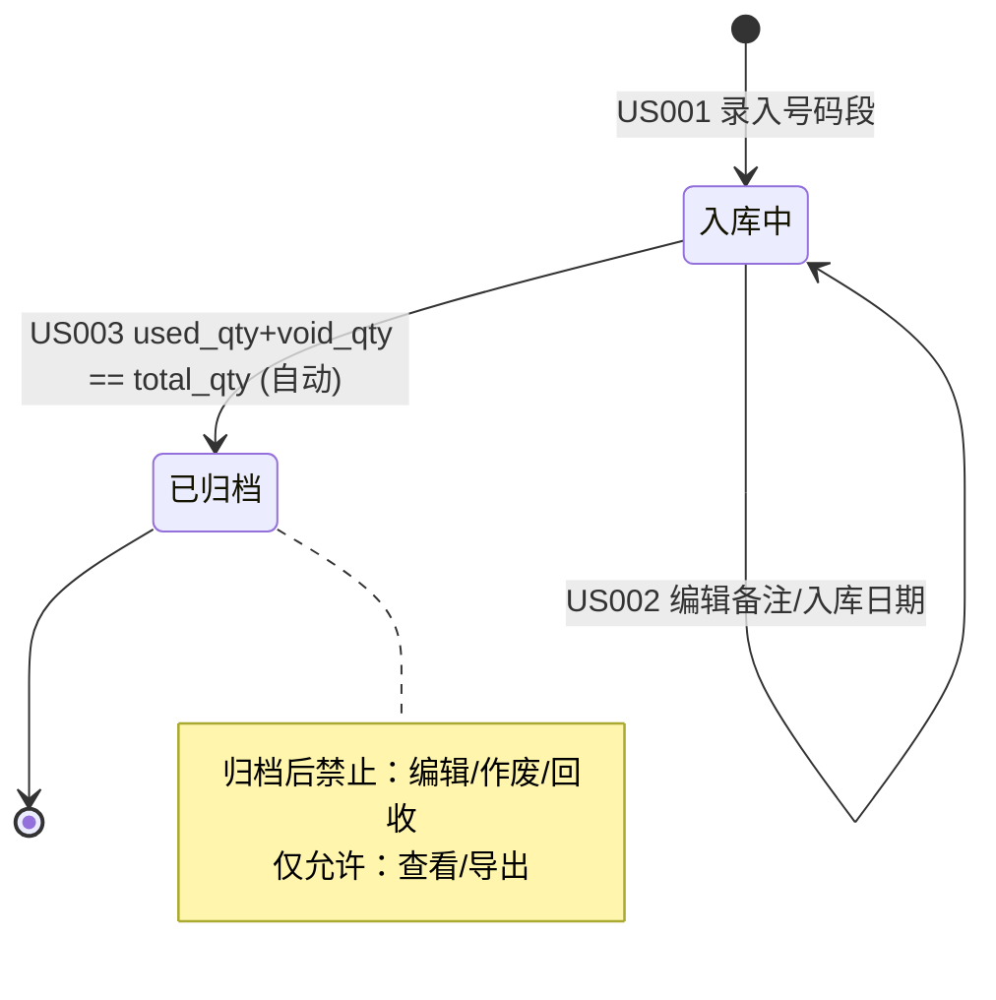
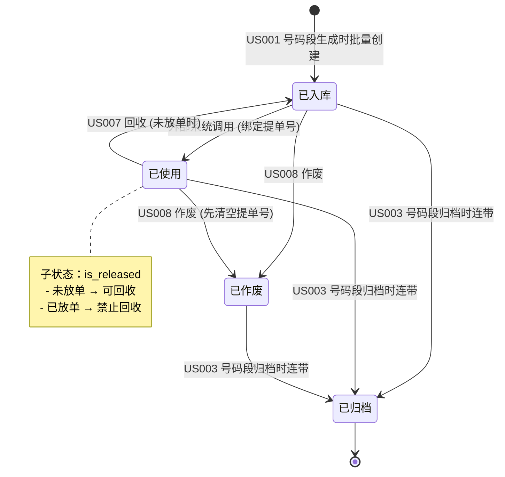
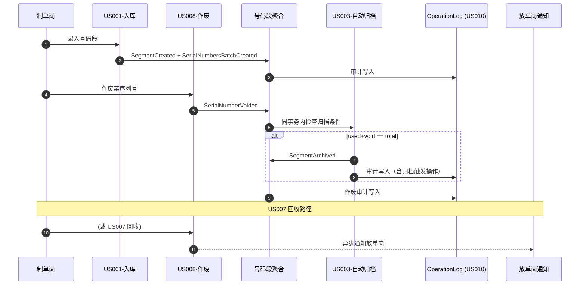

# 模块故事关系图谱 · 空白提单管理

## 元信息

| 字段             | 值                                                                                            |
| ---------------- | --------------------------------------------------------------------------------------------- |
| **模块名称**     | 空白提单管理                                                                                  |
| **业务定位**     | 中外运海运空白提单的数字化台账：覆盖入库 → 使用 → 回收/作废 → 归档全生命周期，并提供审计追溯 |
| **版本**         | v1.0                                                                                          |
| **生成日期**     | 2026-05-20                                                                                    |
| **覆盖 Story**   | US001, US002, US003, US004, US005, US006, US007, US008, US009, US010                          |
| **覆盖度评估**   | 10 个 Story / 单一模块 / 联合分析覆盖度 **充分** ✅                                           |
| **下游产物对接** | HLD-01 模块划分 / HLD-02 接口设计 / HLD-03 数据库设计 / HLD-04 时序图                         |

---

## 第1章：共享领域对象图

### 1.1 领域对象清单

| 领域对象            | 类型     | 业务定义                                                                              | 关联 Story                                       | 操作类型      |
| ------------------- | -------- | ------------------------------------------------------------------------------------- | ------------------------------------------------ | ------------- |
| **NumberSegment**   | 聚合根   | 空白提单号码段，由"船司 + 起始号 + 结束号"唯一标识，是入库/归档的最小业务单元         | US001, US002, US003, US004, US008, US009         | C/R/U         |
| **SerialNumber**    | 实体     | 号码段内的单张提单序列号（船司代码-8位数字），具有独立生命周期（已入库/已使用/已作废/已归档）    | US003, US005, US006, US007, US008, US009         | R/U           |
| **Carrier**         | 值对象   | 船司（3~4 位船司代码 + 船司名称），来源系统船司主数据                                  | US001, US004, US005, US008                       | R             |
| **BillOfLadingRef** | 值对象   | 关联提单号（业务系统外部 ID），表示该序列号当前绑定的提单                              | US005, US006, US007                              | R/U           |
| **VoidReason**      | 值对象   | 作废原因枚举（打印错误/纸张污损/丢失/船司回收/信息错误/其他+自定义说明）                | US008, US009                                     | C/R           |
| **OperationLog**    | 聚合根   | 操作日志（横切），记录所有写操作的"人/时/前值/后值"，是审计的唯一数据源                | US001~US009（写入），US010（读取）              | C（写）/ R（读） |
| **Port**            | 值对象   | 港口（决定数据权限边界，制单岗只能操作本港口）                                          | US001~US010（数据权限维度）                      | R             |

### 1.2 领域对象关系图

### 1.3 关键说明

- 📌 **NumberSegment 是入库/归档的聚合根**，SerialNumber 在号码段内部受 segmentId 约束，不能脱离号码段独立存在。
- 📌 **OperationLog 是跨故事的横切聚合**，US010 是其唯一读取方，其余 9 个 Story 都是其写入方。
- 🆕 **隐性发现**：`isReleased`（是否已放单）字段在 US005/US007 中以"是否可回收"的语义出现，但 Story 未显式定义其生命周期，本图谱将其归入 SerialNumber 实体属性，并在第 2 章状态机中显式化。

---

## 第2章：状态机视图

### 2.1 NumberSegment 状态机

**触发表**

| 源状态 | 目标状态 | 触发 Story | 触发事件 / 操作                           |
| ------ | -------- | ---------- | ----------------------------------------- |
| (初始) | 入库中   | US001      | 保存号码段                                |
| 入库中 | 入库中   | US002      | 编辑备注 / 入库日期                       |
| 入库中 | 已归档   | US003      | 自动：used_qty + void_qty == total_qty    |

### 2.2 SerialNumber 状态机

**触发表**

| 源状态     | 目标状态   | 触发 Story | 触发事件 / 操作                                  |
| ---------- | ---------- | ---------- | ------------------------------------------------ |
| (初始)     | 已入库     | US001      | 号码段保存时按起止号批量生成                     |
| 已入库     | 已使用     | (外部)     | 外部业务系统绑定提单号（**本模块外**，参见 §2.3）|
| 已使用     | 已入库     | US007      | 回收（要求 is_released=false）                   |
| 已入库     | 已作废     | US008      | 直接作废                                         |
| 已使用     | 已作废     | US008      | 作废前清空 BillOfLadingRef（隐式回收语义）       |
| 已入库     | 已归档     | US003      | 所属号码段触发归档                               |
| 已使用     | 已归档     | US003      | 所属号码段触发归档                               |
| 已作废     | 已归档     | US003      | 所属号码段触发归档                               |

### 2.3 🆕 隐性状态发现清单

> 在本次梳理中识别到 **3 个 Story 中未显式定义**的关键点：

1. **🆕 `已使用` 状态的入口未定义**：所有 Story 中"已使用"状态在 US005/US006/US007 都被引用（"已使用未放单"），但**没有任何 US 明确定义"从已入库 → 已使用"是由谁触发**。
   - 推断：由**外部业务系统**（如运单录入系统）通过接口写入提单号触发。
   - 建议：HLD-02 需补一个对外契约接口 `POST /serial-numbers/{serialNo}/bind`。

2. **🆕 `is_released`（是否已放单）的状态切换未定义**：US005/US007 大量依赖该字段判断"可否回收"，但没有 US 描述"放单"操作。
   - 推断：由外部"放单/单证打印"系统通过接口触发 `is_released = true`。
   - 建议：HLD-02 需补 `POST /serial-numbers/{serialNo}/release`。

3. **🆕 `已使用 → 已作废` 路径中的"隐式回收"语义**：US008 提到"已使用序列号作废时需先清空关联提单号"，等价于"内部先回收再作废"，但流程未显式化。
   - 建议：HLD-04 时序图必须画出此路径，并在数据库设计中保证两步在同一事务中完成。

---

## 第3章：事件触发链

### 3.1 事件链清单

| 源 Story | 领域事件                  | 订阅方 Story / 系统      | 触发动作                                   | 是否必须 |
| -------- | ------------------------- | ------------------------ | ------------------------------------------ | -------- |
| US001    | `SegmentCreated`          | OperationLog (US010)     | 写审计日志                                 | 必须     |
| US001    | `SerialNumbersBatchCreated` | (内部聚合)             | 批量生成 SerialNumber                      | 必须     |
| US002    | `SegmentEdited`           | OperationLog (US010)     | 写审计日志（含前后值）                     | 必须     |
| US007    | `SerialNumberRecycled`    | OperationLog (US010)     | 写审计日志                                 | 必须     |
| US007    | `SerialNumberRecycled`    | 放单岗通知系统           | 站内消息 / 邮件同步给放单岗                | 必须     |
| US008    | `SerialNumberVoided`      | OperationLog (US010)     | 写审计日志（含作废原因）                   | 必须     |
| US008    | `SerialNumberVoided`      | **US003 自动归档检查**   | 触发归档条件判断                           | 必须     |
| (外部)   | `SerialNumberUsed`        | **US003 自动归档检查**   | 触发归档条件判断                           | 必须     |
| US003    | `SegmentArchived`         | OperationLog (US010)     | 写审计日志（含归档触发操作）               | 必须     |
| US003    | `SegmentArchived`         | US004/US005/US006 列表UI | 隐藏编辑/作废/回收按钮，仅保留查看         | 必须     |
| US008    | `SerialNumberVoided`      | US009 导出作废清单       | 作废数据进入可导出范围                     | 必须     |

### 3.2 事件链路时序图

### 3.3 🆕 隐性事件链发现

1. **🆕 US008 → US003 的隐式触发**：US008 故事中并未显式说"作废后需调用归档检查"，但 US003 的验收标准声明"使用/作废操作完成后触发"。该触发关系**必须在 HLD-04 时序图中显式化**，并在同一数据库事务中完成（参见 US003 开发提示 #1）。

2. **🆕 US003 归档后对 UI 的连锁影响**：归档事件需驱动 US004/US005/US006 中的"操作按钮可见性"逻辑。后端可通过状态字段驱动，但前端需要在 HLD-01 模块划分时明确"归档状态查询接口"是否独立提供。

---

## 第4章：数据依赖矩阵

### 4.1 写-读依赖矩阵

> **图例**：W = Write（写入该 Story 产生的数据），R = Read（读取该 Story 产生的数据），"—" = 无依赖。**行 = 该 Story 依赖列 Story 的数据。**

|           | US001 | US002 | US003 | US004 | US005 | US006 | US007 | US008 | US009 | US010 |
| --------- | ----- | ----- | ----- | ----- | ----- | ----- | ----- | ----- | ----- | ----- |
| **US001** | W     | —     | —     | —     | —     | —     | —     | —     | —     | —     |
| **US002** | R     | W     | —     | —     | —     | —     | —     | —     | —     | —     |
| **US003** | R     | —     | W     | —     | —     | —     | R     | R     | —     | —     |
| **US004** | R     | R     | R     | (查询)| —     | —     | R     | R     | —     | —     |
| **US005** | R     | —     | R     | —     | (查询)| —     | R     | R     | —     | —     |
| **US006** | R     | —     | R     | —     | R     | (查询)| R     | R     | —     | R     |
| **US007** | R     | —     | R     | —     | R     | R     | W     | —     | —     | —     |
| **US008** | R     | —     | R     | —     | R     | R     | —     | W     | —     | —     |
| **US009** | R     | —     | R     | R     | —     | —     | —     | R     | (导出)| —     |
| **US010** | R     | R     | R     | —     | —     | —     | R     | R     | R     | (审计)|

### 4.2 关键依赖说明

#### 强依赖（必须先有上游数据）

| 依赖关系          | 说明                                                            |
| ----------------- | --------------------------------------------------------------- |
| US002 → US001     | 编辑号码段前必须存在号码段                                      |
| US003 → US001     | 自动归档前必须存在号码段及其序列号                              |
| US005/US006 → 外部 | 查询"已使用"序列号前，必须有外部系统写入 BillOfLadingRef       |
| US007 → US005/US006 | 回收前必须能查询到并查看序列号详情                              |
| US008 → US001     | 作废前必须存在序列号                                            |
| US009 → US008     | 导出作废清单前必须有作废数据                                    |
| US010 → 全部       | 审计日志依赖于所有写操作 Story                                  |

#### 弱依赖（可选/弹性）

| 依赖关系          | 说明                                                            |
| ----------------- | --------------------------------------------------------------- |
| US004 → 全部       | 列表查询能展示更多字段，但不阻塞业务                            |
| US003 → US007/US008 | US007 回收会减少 used_qty，US008 作废会增加 void_qty，但归档判定逻辑相同 |

### 4.3 🆕 隐性数据依赖发现

- **🆕 US007/US008 与 US003 的反向依赖**：US007 回收会使 used_qty -1，而 US003 归档条件依赖 used_qty + void_qty == total_qty。回收操作**必须在同事务内同步更新号码段计数字段**，否则归档逻辑会失效。
- **🆕 US004/US005 对"操作日志"的隐式依赖**：US006 详情页要展示完整生命周期，必须读取 OperationLog，但 US005/US006 的 Story 未声明该依赖。

---

## 第5章：横切关注点矩阵

| 横切关注点         | 涉及 Story                          | 业务规则统一描述                                                                                       | 实现建议                                                                          |
| ------------------ | ----------------------------------- | ------------------------------------------------------------------------------------------------------ | --------------------------------------------------------------------------------- |
| **操作审计**       | US001~US009 (写) / US010 (读)       | 所有写操作必须记录：操作人 / 时间 / 操作类型 / 修改前值 / 修改后值；与业务操作在同一事务               | AOP 切面 + `OperationLog` 表；按 entityType + entityId 索引；HLD-01 列为独立"审计模块" |
| **数据权限（港口）** | US001~US010                         | 制单岗"仅可管理本港口数据"；主管/审核岗"仅可查看本港口日志"；不可跨港口操作                              | Spring Security + 自定义 DataPermission 注解；SQL 自动追加 `WHERE port_code=?`     |
| **角色权限**       | US001~US010                         | 制单岗：增删改查；主管/审核岗：仅读 US010；归档行：全部角色禁用编辑/回收/作废                          | RBAC + 前端按钮可见性 + 后端校验双保险                                            |
| **防重复提交**     | US001, US002, US007, US008          | 保存类按钮点击后禁用 3 秒；后端通过幂等 token 兜底                                                     | 前端按钮 disabled 3s；后端 Redis idempotency key                                  |
| **二次确认**       | US007 (回收), US008 (作废)          | 不可逆 / 准不可逆操作必须二次确认弹窗；US008 警示色 #F53F3F                                            | 通用 ConfirmModal 组件                                                            |
| **批量操作上限**   | US007 (≤50 条)                      | 单次批量回收 ≤ 50 条；超出前端禁止 + 后端 400                                                          | 前端禁用 + 后端参数校验                                                           |
| **列表分页**       | US004, US005, US010                 | 默认 20 条/页；列表查询响应 ≤ 2 秒                                                                     | MyBatis-Plus / JPA Pageable；建索引                                              |
| **Toast 反馈**     | US001~US009                         | 成功/失败均通过页面顶部 Toast 反馈，3 秒自动消失                                                       | 全局 Toast 组件                                                                   |
| **乐观锁**         | US002, US003, US007, US008          | 同一号码段/序列号被并发修改时通过 version 字段拦截                                                     | JPA `@Version` / MyBatis-Plus `@Version`                                          |
| **内部通知**       | US007 (→放单岗)                     | 回收成功后异步通知放单岗（站内消息+邮件）                                                              | 领域事件 + MQ 异步消费                                                            |
| **导出文件命名**   | US009                               | `作废清单_{船司}_{YYYYMMDD_HHmmss}.xlsx`                                                               | 工具类统一命名                                                                    |
| **浏览器兼容性**   | US001~US010                         | Chrome 90+ / Edge 90+ / Firefox 88+                                                                    | 前端构建目标统一                                                                  |

### 🆕 隐性横切发现

- **🆕 "归档行操作按钮收敛"是一条 UI 横切规则**：US003/US004/US005/US006/US007/US008 都需要判断"已归档→禁用编辑/作废/回收按钮"。建议在 HLD-01 中提取为前端"操作权限决策器"组件，避免每个页面各自写一遍。
- **🆕 "船司代码 + 8 位数字" 序列号格式**是一条值对象级横切：US001 定义、US005 查询用到、US009 导出用到。建议在 HLD-03 中作为不可变值对象建模，提供统一格式化与解析方法。

---

## 第6章：并发冲突与一致性策略

### 6.1 冲突场景清单

| 冲突场景                                                                           | 冲突 Story          | 冲突资源                            | 冲突类型              | 推荐策略                                                                                              |
| ---------------------------------------------------------------------------------- | ------------------- | ----------------------------------- | --------------------- | ----------------------------------------------------------------------------------------------------- |
| 两个制单岗同时录入有交叉的号码段                                                   | US001 vs US001      | `NumberSegment` 表（同 carrier）    | 唯一约束冲突 / 幻读   | DB **唯一索引**（carrier_code + start_no + end_no 区间）+ 应用层校验；**插入采用 INSERT...SELECT 加锁** |
| 同一序列号被两人同时回收                                                           | US007 vs US007      | `SerialNumber.status`               | 丢失更新              | **乐观锁** `@Version` + 状态前置校验（status=已使用 AND is_released=false）                            |
| 同一序列号被回收（US007）同时被作废（US008）                                       | US007 vs US008      | `SerialNumber.status`               | 状态机非法转移        | 乐观锁 + 状态机校验（仅允许合法转移）                                                                  |
| 作废操作触发自动归档时，另一作废操作同时进入                                       | US008 vs US008      | `NumberSegment.usedQty/voidQty/status` | 重复归档 / 计数错乱 | **同事务内更新计数 + SELECT...FOR UPDATE** 锁号码段行；归档操作幂等（status=已归档 时跳过）             |
| 外部"放单"接口与 US007 回收同时发生                                                | (外部) vs US007     | `SerialNumber.is_released/status`  | 业务规则冲突          | 乐观锁 + 业务校验"放单后不可回收"；先到先得，失败方收到 409 Conflict                                  |
| US002 编辑号码段备注时，US003 自动归档触发                                         | US002 vs US003      | `NumberSegment` 行                  | 不可重复读            | 乐观锁；归档优先级高于编辑（编辑失败提示"已归档，无法编辑"）                                          |
| US009 导出作废清单时，US008 仍在新增作废记录                                       | US009 vs US008      | 作废序列号集合                      | 不可重复读            | 业务层接受**最终一致**：导出时点快照即可，无需阻塞作废                                                |
| US004/US005 列表分页查询时，US003 触发归档                                         | US004 vs US003      | `NumberSegment.status`              | 脏读                  | 读未提交场景可接受；用户感知为"刷新后状态变化"                                                        |
| US001 批量生成大量 SerialNumber 时（最多 99999 条），系统其他写操作                | US001 vs 全模块     | `serial_number` 表                  | 长事务 / 锁争用       | **分批提交**（每批 1000 条）；号段创建用"号码段已创建"事件异步生成序列号                              |

### 6.2 一致性策略选型说明

| 策略             | 适用场景                                            | 本模块应用                                                                                            |
| ---------------- | --------------------------------------------------- | ----------------------------------------------------------------------------------------------------- |
| **乐观锁（version）** | 冲突概率低、读多写少                              | **主力策略**：SerialNumber 和 NumberSegment 均加 `@Version` 字段，覆盖 US002/US007/US008 大部分场景  |
| **悲观锁（FOR UPDATE）** | 关键事务、强一致                                  | US003 归档判定：`SELECT segment FOR UPDATE` 后再判定 used+void==total，避免重复归档                  |
| **DB 唯一约束**  | 防止数据层重复                                      | NumberSegment 的 carrier+起止号区间唯一性；OperationLog 主键唯一                                      |
| **业务幂等**     | 重试场景、消息消费                                  | US003 归档操作幂等（status 已归档时直接返回）；US007 回收 token 防重提交                              |
| **最终一致**     | 跨子系统、可容忍延迟                                | US007 通知放单岗（MQ 异步）；US001 批量生成序列号（分批异步）                                         |
| **Saga / TCC**   | 跨多个聚合的分布式事务                              | 暂不引入（本模块在单一限界上下文内可用 DB 事务解决）                                                  |

### 6.3 🆕 隐性并发冲突发现

1. **🆕 US003 归档判定的并发缺陷**：US003 开发提示 #2 提到使用乐观锁，但**乐观锁在"计数累加"场景下并不能完全防止重复归档**——两个事务都读到 used=99, void=0, total=100，然后各自加 1，可能都判断"99+1+0==100"成立而尝试归档。**必须用 FOR UPDATE 悲观锁锁住号码段行**，或将归档判定改为"基于最终状态的幂等更新"（UPDATE...WHERE status='入库中'）。

2. **🆕 US001 大批量生成 SerialNumber 的长事务问题**：单次最大 99999 条记录，若同事务内 INSERT，会造成长事务和锁争用。建议改为"号码段先落库 → 异步分批生成序列号 → 完成后回写状态"。这一点 Story 未涉及，但 HLD-03/HLD-04 必须解决。

3. **🆕 外部"绑定提单"与 US007"回收"的接口竞态**：本模块的 US007 校验"is_released=false"，但若放单接口和回收接口几乎同时到达，需要在数据库层强约束（CHECK 约束 + 唯一索引），仅靠应用层校验不足。

---

## 📌 与 HLD 阶段的对接索引

| 本图谱章节            | HLD 阶段产物            | 对接关键产物                                                            |
| --------------------- | ----------------------- | ----------------------------------------------------------------------- |
| 第1章 共享领域对象图  | HLD-01 模块划分         | NumberSegment / SerialNumber 划入"号码段模块"；OperationLog 独立"审计模块"   |
| 第1章 + 第5章         | HLD-01 模块划分         | 横切关注点 → 审计模块 / 权限模块 / 通知模块                              |
| 第2章 状态机视图      | HLD-03 数据库设计       | `status` 字段枚举、`is_released` 字段、状态转移 CHECK 约束               |
| 第2章 + 第3章         | HLD-04 时序图           | 必须画出"US008→US003 隐式触发"、"已使用→已作废 隐式回收"两条时序          |
| 第3章 事件触发链      | HLD-02 接口设计         | 内部领域事件（SegmentArchived/SerialNumberVoided）+ 对外接口（bind/release） |
| 第4章 数据依赖矩阵    | HLD-01 + HLD-02         | 模块依赖箭头方向；接口编排顺序                                            |
| 第5章 横切关注点矩阵  | HLD-01 横切模块         | 审计 / 权限 / 通知 / 防重复提交 / 数据权限拦截器                          |
| 第6章 并发冲突        | HLD-03 + HLD-02         | `version` 字段、唯一索引、FOR UPDATE 使用位点、幂等 token、CHECK 约束     |

---

## 🆕 隐性发现汇总表

| # | 发现类型         | 内容                                                                                                | 涉及 Story          | 必处理章节        |
| - | ---------------- | --------------------------------------------------------------------------------------------------- | ------------------- | ----------------- |
| 1 | 隐性状态         | "已使用"状态的入口未由本模块任何 Story 触发，需外部"绑定提单"接口                                    | US005, US006, US007 | HLD-02            |
| 2 | 隐性状态         | `is_released`（是否已放单）状态切换没有 Story 描述，需补"放单"接口                                   | US005, US007        | HLD-02            |
| 3 | 隐性流程         | US008 "已使用→已作废"路径中包含"隐式回收"语义，需显式化                                              | US008               | HLD-04            |
| 4 | 隐性事件链       | US008 作废 → US003 归档判定 的连锁触发未在 Story 中显式描述                                          | US003, US008        | HLD-04            |
| 5 | 隐性事件链       | US003 归档 → US004/005/006 UI 操作按钮可见性 的连锁                                                  | US003, US004~US006  | HLD-01            |
| 6 | 隐性数据依赖     | US007 回收必须同事务更新号码段 used_qty 字段，否则 US003 归档逻辑失效                                | US003, US007        | HLD-03            |
| 7 | 隐性数据依赖     | US006 详情页对 OperationLog 的依赖未在 Story 中声明                                                  | US006, US010        | HLD-02            |
| 8 | 隐性横切         | "归档行操作按钮收敛"是跨 6 个 Story 的 UI 横切规则                                                   | US003~US008         | HLD-01            |
| 9 | 隐性横切         | "船司代码 + 8 位数字"序列号格式应建模为值对象                                                        | US001, US005, US009 | HLD-03            |
| 10| 隐性并发冲突     | US003 归档判定需用 FOR UPDATE 悲观锁，乐观锁无法防止"双方都看到 99+1=100"                            | US003               | HLD-03 + HLD-04   |
| 11| 隐性并发冲突     | US001 99999 条 SerialNumber 批量生成需异步分批，不能同步同事务                                       | US001               | HLD-03 + HLD-04   |
| 12| 隐性并发冲突     | 外部"绑定提单"与 US007 回收 的接口竞态需 DB 层约束兜底                                               | US007 + 外部接口    | HLD-03            |

---

> ✅ **本图谱已覆盖 B4-07 提示词要求的 6 个章节 + 12 项隐性发现 + 完整 HLD 对接索引**，可直接作为 HLD-01/02/03/04 概要设计的强制输入。
