# 数据大屏 AI 代码生成指南 - 通用版

> **📌 文档说明**: 本文档提供数据可视化大屏的AI辅助代码生成通用方法论和工作流程，适用于各类企业级大屏项目。

---

## 📚 概述

### 适用场景

- 企业运营监控大屏
- 数据中心资源监控
- 智慧城市/园区可视化
- 工业IoT实时监控
- 金融交易大屏
- 物流调度中心

### 核心挑战

复杂大屏界面包含**10-30+个独立可视化组件**，直接让AI一次性生成会导致：

- ❌ 代码质量下降（上下文过长）
- ❌ 样式不一致（缺乏统一设计系统）
- ❌ 组件耦合（难以维护和复用）
- ❌ 数据绑定混乱（Mock数据与真实API混杂）

### 解决方案：分层渐进式生成

```
┌─────────────────────────────────────────────────────────────┐
│  第1层：布局骨架（Grid/Flex布局 + 主题变量）                  │
├─────────────────────────────────────────────────────────────┤
│  第2层：组件分类（按图表类型分批生成）                        │
│  ├── 仪表盘类（Gauge）                                      │
│  ├── 折线图类（Line）                                       │
│  ├── 柱状图类（Bar）                                        │
│  ├── 饼图/环形图类（Pie/Ring）                              │
│  ├── 地图类（Map）                                          │
│  ├── 关系图类（Graph）                                      │
│  └── 数据卡片类（Card）                                     │
├─────────────────────────────────────────────────────────────┤
│  第3层：组件组装（布局 + 组件 + 响应式）                      │
├─────────────────────────────────────────────────────────────┤
│  第4层：数据对接（Mock → API → WebSocket实时推送）           │
└─────────────────────────────────────────────────────────────┘
```

---

## 🔄 完整工作流程

### Phase 1: 需求分析与拆解

```mermaid
graph LR
    A[设计稿/截图] --> B[识别布局结构]
    B --> C[提取组件清单]
    C --> D[确定技术栈]
    D --> E[制定生成计划]
```



#### 步骤1.1: 布局结构识别

从设计稿/截图中识别：

| 识别项 | 说明 | 示例 |
|-------|------|------|
| 整体布局 | 几列？每列宽度比例？ | 4列布局，20%:30%:25%:25% |
| 区块划分 | 每个区块的功能定位 | 左侧=运营概览，中间=资源统计 |
| 响应式需求 | 目标分辨率 | 1920×1080（主）+ 4K适配 |

#### 步骤1.2: 组件清单提取

使用以下模板记录组件：

| 区块位置 | 组件名称 | 组件类型 | 数据特征 | 交互需求 |
|---------|---------|---------|---------|---------|
| {位置} | {名称} | {类型} | {静态/定时/实时} | {交互描述} |

**组件类型分类**：
- **图表类**: Gauge(仪表盘)、Line(折线图)、Bar(柱状图)、Pie(饼图/环形图)、Map(地图)、Graph(关系图)
- **数据类**: BasicCard(基础卡片)、IconCard(图标卡片)、ProgressCard(进度卡片)、StatusCard(状态卡片)
- **列表类**: AlertList(告警列表)、DataTable(数据表格)、ScrollList(滚动列表)

#### 步骤1.3: 技术栈确定

| 场景 | 推荐技术栈 | 理由 |
|-----|-----------|-----|
| 快速原型 | Vue 3 + ECharts + DataV | 开箱即用，组件丰富 |
| 企业标准 | React + AntV G2/G2Plot | 阿里生态，文档完善 |
| 高度定制 | Vue/React + D3.js | 完全自定义，学习曲线陡 |
| 3D效果 | Three.js + ECharts GL | 酷炫效果，性能要求高 |

---

### Phase 2: 分层代码生成

#### 步骤2.1: 生成设计系统（优先）

**为什么先生成设计系统？**
- 确保所有组件使用统一的颜色、字体、间距
- CSS变量定义后，后续组件直接引用
- 避免硬编码导致的样式不一致

**使用提示词**: [P02-设计系统生成提示词](prompts/P02-设计系统生成提示词.md)

#### 步骤2.2: 生成布局骨架

**使用提示词**: [P01-布局骨架生成提示词](prompts/P01-布局骨架生成提示词.md)

#### 步骤2.3: 逐类生成组件

按组件类型分批生成，每批1-3个同类组件：

| 批次 | 组件类型 | 使用提示词 |
|-----|---------|-----------|
| 1 | 数据卡片类 | [P09-数据卡片组件生成提示词](prompts/P09-数据卡片组件生成提示词.md) |
| 2 | 仪表盘类 | [P03-仪表盘组件生成提示词](prompts/P03-仪表盘组件生成提示词.md) |
| 3 | 折线图类 | [P04-折线图组件生成提示词](prompts/P04-折线图组件生成提示词.md) |
| 4 | 柱状图类 | [P05-柱状图组件生成提示词](prompts/P05-柱状图组件生成提示词.md) |
| 5 | 环形图类 | [P06-环形图组件生成提示词](prompts/P06-环形图组件生成提示词.md) |
| 6 | 地图类 | [P07-地图组件生成提示词](prompts/P07-地图组件生成提示词.md) |
| 7 | 关系图类 | [P08-关系图组件生成提示词](prompts/P08-关系图组件生成提示词.md) |
| 8 | 告警列表类 | [P10-告警列表组件生成提示词](prompts/P10-告警列表组件生成提示词.md) |

#### 步骤2.4: 组件组装与调试

**使用提示词**: [P11-组件组装提示词](prompts/P11-组件组装提示词.md)

---

### Phase 3: 数据对接

```mermaid
graph LR
    A[Mock数据验证] --> B[API接口对接]
    B --> C[WebSocket实时推送]
    C --> D[异常处理与降级]
```



**使用提示词**: [P12-数据对接提示词](prompts/P12-数据对接提示词.md)

---

### Phase 4: 优化与交付

#### 4.1 性能优化

| 优化项 | 方法 |
|-------|------|
| 首屏加载 | 组件懒加载、骨架屏 |
| 图表渲染 | 按需引入ECharts模块、Canvas渲染 |
| 数据更新 | 防抖节流、增量更新 |
| 内存管理 | 图表实例销毁、事件解绑 |

#### 4.2 响应式适配

```scss
// 多分辨率适配
$breakpoints: (
  'fhd': 1920px,   // 1080p
  '2k': 2560px,    // 2K
  '4k': 3840px     // 4K
);

@mixin respond-to($breakpoint) {
  @media (min-width: map-get($breakpoints, $breakpoint)) {
    @content;
  }
}
```

#### 4.3 主题切换

- 深色模式（默认）
- 浅色模式（可选）
- 通过CSS变量切换

#### 4.4 打包部署

- CDN加速静态资源
- Gzip压缩
- 代码分割
- 预渲染/SSG（可选）

---

## 📋 标准化提示词模板库

### 提示词清单

| 编号 | 提示词名称 | 用途 | 文件链接 |
|-----|-----------|-----|---------|
| P01 | 布局骨架生成 | CSS Grid多列布局骨架 | [P01-布局骨架生成提示词.md](prompts/P01-布局骨架生成提示词.md) |
| P02 | 设计系统生成 | Design Token + SCSS变量 | [P02-设计系统生成提示词.md](prompts/P02-设计系统生成提示词.md) |
| P03 | 仪表盘组件生成 | ECharts Gauge图表 | [P03-仪表盘组件生成提示词.md](prompts/P03-仪表盘组件生成提示词.md) |
| P04 | 折线图组件生成 | 时间序列趋势图表 | [P04-折线图组件生成提示词.md](prompts/P04-折线图组件生成提示词.md) |
| P05 | 柱状图组件生成 | 分类数据对比图表 | [P05-柱状图组件生成提示词.md](prompts/P05-柱状图组件生成提示词.md) |
| P06 | 环形图组件生成 | 占比数据展示 | [P06-环形图组件生成提示词.md](prompts/P06-环形图组件生成提示词.md) |
| P07 | 地图组件生成 | 地理数据可视化 | [P07-地图组件生成提示词.md](prompts/P07-地图组件生成提示词.md) |
| P08 | 关系图组件生成 | 系统拓扑展示 | [P08-关系图组件生成提示词.md](prompts/P08-关系图组件生成提示词.md) |
| P09 | 数据卡片组件生成 | KPI数字展示 | [P09-数据卡片组件生成提示词.md](prompts/P09-数据卡片组件生成提示词.md) |
| P10 | 告警列表组件生成 | 实时滚动告警 | [P10-告警列表组件生成提示词.md](prompts/P10-告警列表组件生成提示词.md) |
| P11 | 组件组装 | 集成与状态管理 | [P11-组件组装提示词.md](prompts/P11-组件组装提示词.md) |
| P12 | 数据对接 | API + WebSocket | [P12-数据对接提示词.md](prompts/P12-数据对接提示词.md) |

### 推荐生成顺序

```
生成顺序：
P02(设计系统) → P01(布局骨架) → P09(数据卡片) → P03(仪表盘) → 
P04(折线图) → P05(柱状图) → P06(环形图) → P07(地图) → 
P08(关系图) → P10(告警列表) → P11(组件组装) → P12(数据对接)
```

---

## 📊 组件拆解模板

### 布局结构分析模板

```
┌──────────────────────────────────────────────────────────────────────────┐
│                           Header: {大屏标题}                              │
├────────────┬─────────────────┬─────────────────┬─────────────────────────┤
│ 左侧({x}%) │  中左({y}%)     │  中右({z}%)     │  右侧({w}%)             │
├────────────┼─────────────────┼─────────────────┼─────────────────────────┤
│ {组件1}    │ {组件5}         │ {组件9}         │ {组件13}                │
│ [{类型}]   │ [{类型}]        │ [{类型}]        │ [{类型}]                │
├────────────┼─────────────────┼─────────────────┼─────────────────────────┤
│ {组件2}    │ {组件6}         │ {组件10}        │ {组件14}                │
│ [{类型}]   │ [{类型}]        │ [{类型}]        │ [{类型}]                │
├────────────┼─────────────────┼─────────────────┼─────────────────────────┤
│ {组件3}    │ {组件7}         │ {组件11}        │ {组件15}                │
│ [{类型}]   │ [{类型}]        │ [{类型}]        │ [{类型}]                │
├────────────┤                 ├─────────────────┼─────────────────────────┤
│ {组件4}    │                 │ {组件12}        │ {组件16}                │
│ [{类型}]   │                 │ [{类型}]        │ [{类型}]                │
└────────────┴─────────────────┴─────────────────┴─────────────────────────┘
```

### 组件清单模板

| 编号 | 组件名称 | 类型 | 数据更新频率 | 对应提示词 |
|-----|---------|------|-------------|-----------|
| C01 | {组件名} | {GaugeChart/LineChart/...} | {静态/5秒/实时} | P0x |
| C02 | ... | ... | ... | ... |

---

## ✅ 最佳实践总结

### 1. 提示词工程原则

| 原则 | 说明 |
|-----|------|
| **单一职责** | 每个提示词只生成一类组件 |
| **上下文充足** | 提供设计规范、色值、尺寸 |
| **技术栈明确** | 指定框架、库、版本 |
| **示例驱动** | 提供期望的代码结构示例 |
| **迭代验证** | 生成后立即运行验证，发现问题迭代优化 |

### 2. 常见问题与解决方案

| 问题 | 解决方案 |
|-----|---------|
| 样式不一致 | 先生成设计系统，后续组件引用CSS变量 |
| 图表不自适应 | 使用ResizeObserver + debounce |
| 数据更新闪烁 | 使用过渡动画 + 数据diff |
| 首屏加载慢 | 组件懒加载 + 骨架屏 |
| WebSocket断连 | 心跳检测 + 自动重连 |

### 3. 代码质量检查清单

- [ ] 所有颜色使用CSS变量
- [ ] 组件支持Props配置
- [ ] 图表resize正确处理
- [ ] 组件卸载时销毁图表实例
- [ ] TypeScript类型完整
- [ ] 无Console错误
- [ ] 性能测试通过（Lighthouse > 80）

---

## 📚 参考资源

### 技术文档
- [ECharts官方文档](https://echarts.apache.org/zh/option.html)
- [Vue 3 Composition API](https://vuejs.org/api/composition-api-setup.html)
- [DataV官方示例](http://datav.jiaminghi.com/)
- [AntV G2Plot](https://g2plot.antv.antgroup.com/)

### 设计资源
- [阿里DataV可视化设计指南](https://antv.antgroup.com/specification/language/design-value)
- [大屏设计规范参考](https://www.yuque.com/mo-college/bigscreen)

---

## 🔄 版本历史

| 版本 | 日期 | 更新内容 | 作者 |
|-----|------|---------|------|
| v1.0 | 2026-01-28 | 初始通用版本，从案例版抽取 | AI |

---

**📌 使用说明**:

1. 本文档是**通用方法论**，不包含具体项目参数
2. 根据实际项目，填充提示词中的"输入材料"模板
3. 生成代码后立即运行验证，发现问题及时迭代
4. 可参考 [案例版](../../prompts/前端可视化/) 了解具体填充示例
